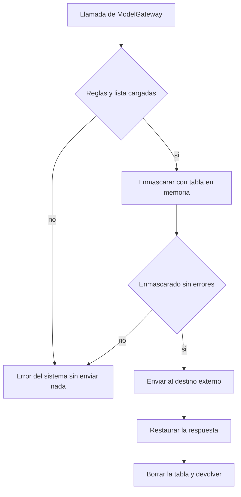
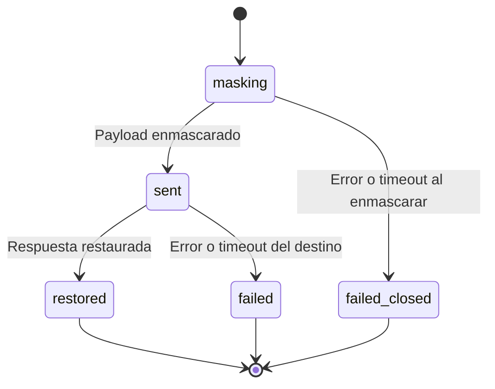
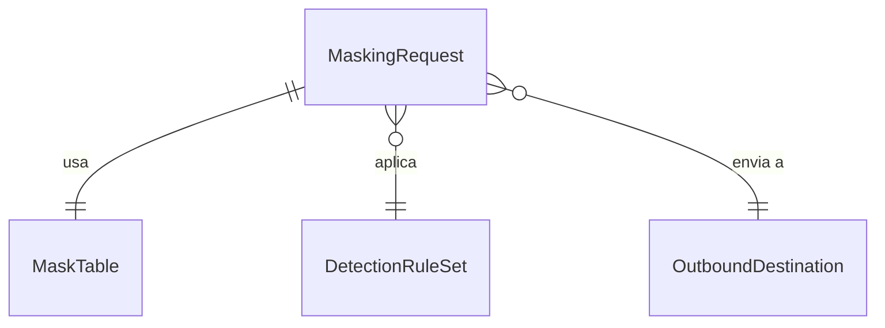

# Especificación funcional — U10 anonymizer

**Insumos.** Unidad U10 de `inception/units-generation/unit-of-work.md` (unit-of-work) y su mapa de
historias `unit-of-work-story-map.md` (unit-of-work-story-map); FR11.3, FR12.3, NFR1 y NFR10 de
`inception/requirements-analysis/requirements.md` (requirements); ModelGateway y ADR-005 de
`inception/domain-design/components.md` (components); C13 y C14 de
`inception/contract-design/contract-summary.md` (contract-summary); respuestas P1–P2 de
`functional-design-questions.md`. Las entidades están en `entities.md` y las reglas en `rules.md`; este
documento es la fuente de verdad de los flujos.

## 1. Qué hace la unidad

U10 es un adaptador de ModelGateway (misma forma que C13) que se interpone entre los servicios y un
modelo externo: enmascara nombres, lugares y números de expediente, llama al destino externo, restaura
la respuesta dentro del clúster y falla cerrado. Es COULD: solo se construye si se decide usar un modelo
externo, y ninguna unidad MUST depende de él.

| Componente | Proceso | Dentro / fuera del clúster | Datos que cruzan la frontera |
|---|---|---|---|
| Adaptador anonimizador de ModelGateway | `anonymizer-proxy` | Dentro, único pod con salida | Solo el *payload* enmascarado, hacia el destino configurado |
| ModelGateway (cliente del proxy) | `libs/` en `semantic-agent` y `session-api` | Dentro | Texto sin enmascarar hacia el proxy, dentro del clúster |
| Destino externo | Fuera del clúster | Fuera | Recibe solo marcadores; devuelve texto con marcadores |

## 2. Flujos

### F1 — Llamada al juez externo (judge)

1. SemanticEvaluation llama `ModelGateway.judge`; el adaptador configurado es el proxy (BR3.2).
2. El proxy carga las reglas y la lista de nombres propios de la versión de escenario (BR1.2); si falla →
   no envía nada (BR2.1).
3. Recorre el *prompt* (instrucciones y bloque de datos) y reemplaza cada coincidencia por su marcador,
   construyendo la tabla en memoria (BR1.1).
4. Envía el *payload* enmascarado al destino por HTTPS con *timeout*.
5. Restaura los marcadores de la respuesta con la tabla (BR1.3) y la devuelve a ModelGateway; la
   validación contra C6 y el escaneo siguen en SemanticEvaluation.
6. Borra la tabla. Registra solo `request_id`, operación, número de reemplazos por categoría y resultado
   (BR2.3).

<!-- Texto alternativo: el proxy recibe la llamada; si no puede cargar reglas o lista, o si el enmascarado falla, devuelve error sin enviar nada; si no, envía el payload enmascarado al destino externo, restaura la respuesta, borra la tabla y la devuelve. -->

### F2 — Embeddings externos (embed)

1. Igual que F1 pasos 1–4 con los textos a vectorizar (BR1.4).
2. Los vectores vuelven sin restaurar; la tabla se borra.

Como los pasajes del escenario también se vectorizan enmascarados, un nombre propio del escenario y su
mención en el testimonio reciben marcadores de su categoría en ambos lados, lo que conserva la
comparación por similitud dentro de la misma llamada.

### F3 — Arranque

1. El proxy valida reglas, destino HTTPS y referencia a la credencial; si algo falta, no arranca
   (BR2.2).
2. Los servicios clientes validan que su destino sea interno o el proxy (BR3.2).

## 3. Máquina de estados de una llamada

<!-- Texto alternativo: una llamada empieza enmascarando; si falla, termina cerrada sin enviar nada; si no, se envía; si el destino falla, termina en error; si responde, se restaura y termina. En todos los finales la tabla se borra. -->

## 4. Vista derivada: entidades y relaciones

<!-- Texto alternativo: cada llamada usa su propia tabla de equivalencias, aplica el conjunto de reglas de detección y envía al único destino externo. -->

## 5. Vista derivada: reglas

| Grupo | Reglas | Flujo |
|---|---|---|
| Enmascaramiento | BR1.1–BR1.4 | F1, F2 |
| Falla cerrada | BR2.1–BR2.3 | F1, F2, F3 |
| Red | BR3.1–BR3.4 | F3 |

## 6. Escenarios de negocio y casos límite

| # | Escenario | Resultado esperado | Regla |
|---|---|---|---|
| E1 | Payload con «doña Ana Pérez», «vereda La Esperanza» y «110016000-2019-00123» sembrados | El saliente no contiene ninguno; lleva `[PERSONA_1]`, `[LUGAR_1]`, `[EXPEDIENTE_1]` | BR1.1 |
| E2 | «Ana Pérez» aparece dos veces | Mismo marcador las dos veces | BR1.1 |
| E3 | «San José» (ambiguo) | Enmascarado con una sola categoría | BR1.2 |
| E4 | Falla la carga de la lista del escenario | No se envía nada; error del sistema | BR2.1 |
| E5 | Respuesta con `[PERSONA_1]` | Restaurada a «Ana Pérez» dentro del clúster | BR1.3 |
| E6 | Canary sembrado en el testimonio | No aparece en ningún log | BR2.3 |
| E7 | Manifiesto que da salida al `semantic-agent` | Política en rojo | BR3.1 |
| E8 | URL del juez externa sin pasar por el proxy | El servicio no arranca | BR3.2 |

## 7. Integración con otras unidades

| Unidad | Relación |
|---|---|
| U4 text-flow | ModelGateway y su validación de destinos; el proxy es otro adaptador de C13 |
| U2 platform | `NetworkPolicy` que solo da salida al proxy, Secret de la credencial, sondas |
| U8 assistant-extras | La pregunta sugerida también pasa por el proxy si el juez es externo |

## 8. Errores y bordes

- Un nombre propio que no coincide con ninguna regla ni está en el escenario puede escapar: es el límite
  conocido de las expresiones regulares (FR11.3). Por eso el proxy es COULD y la opción por defecto del
  MVP es el juez interno.
- Toda E/S lleva *timeout*; ningún reintento automático hacia el destino externo.

## 9. Precisiones a artefactos ya aprobados

| Artefacto | Qué precisa | Origen |
|---|---|---|
| `contract-design/contract-summary.md` (C13) | El adaptador anonimizador recibe `scenario_version_id` para cargar la lista de nombres propios | P2 = A |
