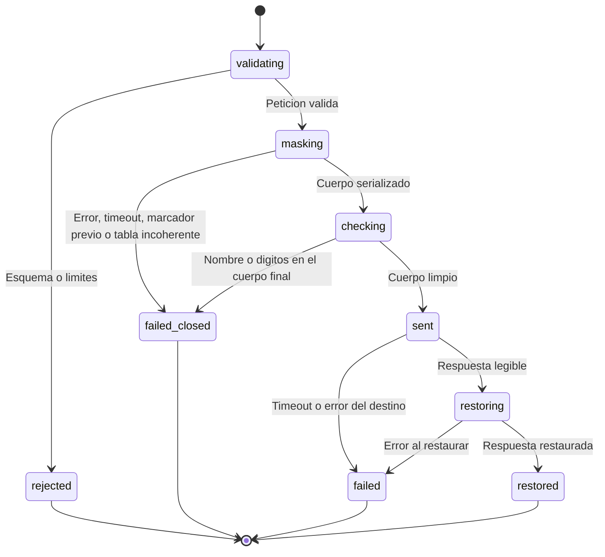

# Diseño de fiabilidad — U10 anonymizer

**Insumos.** `nfr-requirements/performance-requirements.md` (performance-requirements),
`nfr-requirements/security-requirements.md` (security-requirements),
`nfr-requirements/scalability-requirements.md` (scalability-requirements),
`nfr-requirements/reliability-requirements.md` (reliability-requirements),
`nfr-requirements/observability-requirements.md` (observability-requirements) y
`nfr-requirements/tech-stack-decisions.md` (tech-stack-decisions) de esta unidad; la máquina de
estados y §8 de `functional-design/functional-spec.md` (functional-spec); C13, C14 y C16 de
`inception/contract-design/contract-summary.md` (contract-summary); respuestas P1 = A y P2 = A de
`nfr-design-questions.md`; diseño de fiabilidad de U4 (reintento acotado del juez, reclamo a los
240 s); hallazgos R-03 y R-04 de `nfr-requirements/reviews/review-01.md`.

U10 no tiene objetivo de disponibilidad (COULD, apagado por defecto). Su objetivo de fiabilidad es uno
solo: **ante cualquier duda, no sale nada**.

## 1. Máquina de estados con falla cerrada (NFR10.1)



<!-- Texto alternativo: una llamada se valida; si el esquema o los límites fallan, termina rechazada. Luego se enmascara; un error, un timeout, un marcador previo en la entrada o una tabla incoherente la cierran sin enviar. El cuerpo serializado pasa la comprobación final; si contiene un nombre de la lista o dígitos, se cierra sin enviar. Si está limpio se envía; un timeout o error del destino termina en fallo, y si la respuesta es legible se restaura. En todos los finales la tabla se borra. -->

- `MaskedCall.run` envuelve `validating`, `masking` y `checking` en un solo `try`; **toda** excepción
  dentro de ese bloque, prevista o no, termina en `failed_closed` (`500`
  `anonymizer.masking_failed`) o en el `code` de límites de NFR10.8. La única instrucción que envía
  (`upstream.send`) está después de `checking` y fuera de ese bloque.
- Ramas nuevas por P2 = A, con su prueba de nivel 0 y 0 peticiones al *fake*: `content` JSON por encima
  de la profundidad o de las hojas permitidas; reserialización que no reproduce la forma; comprobación
  final con coincidencia (enmascarador defectuoso inyectado).
- Rama nueva por P1 = A: `proper_nouns_sha256` que no coincide con la lista recibida (`422`).
- **Verificación.** `pytest --cov-branch --cov-config=.coveragerc-guards` con **100 % de ramas** en
  `domain/` y `application/` del proxy (NFR13.2).

## 2. *Timeouts* y plazo total por llamada (NFR10.4, NFR3.4, hallazgo R-04)

El *timeout* de lectura de `httpx` es por lectura: un destino que gotea bytes lo esquiva. Por eso cada
tramo tiene un **plazo total** con `anyio.fail_after`, además de los *timeouts* de `httpx`.

| Tramo | Plazo total `judge` | Plazo total `embed` | Al vencer |
|---|---|---|---|
| Validar, enmascarar y comprobar | 2 s (`VERIDICUS_ANONYMIZER_MASKING_TIMEOUT_SECONDS`) | 2 s | `failed_closed`, nada enviado |
| Envío al destino (conexión 5 s incluida, escritura, lectura) | 170 s | 25 s | `504` `anonymizer.upstream_timeout` |
| Restaurar | 2 s | 0 s (no hay restauración) | `502` `anonymizer.upstream_error` |
| **Total en el proxy** | **≤ 174 s** frente a 180 s del cliente de U4 | **≤ 27 s** frente a 30 s | — |

```python
async def send(self, body: bytes, op: Operation) -> UpstreamReply:
    with anyio.fail_after(self.total_upstream_s[op]):          # 170 s o 25 s, todo incluido
        resp = await self.client.post(self.path[op], content=body,
                                      timeout=httpx.Timeout(self.read_s[op], connect=5))
        return await read_capped(resp, max_bytes=2 * 1024 * 1024)
```

El enmascarado corre en un hilo (`anyio.to_thread.run_sync`) bajo su `fail_after`; si vence, la
llamada termina cerrada aunque el hilo siga, y su resultado se descarta (el hilo no tiene acceso al
cliente `httpx`). **Un solo intento** hacia el destino: `HTTPTransport(retries=0)` y ningún bucle.

**Verificación (nivel 0).** *Fakes* lento, que gotea 1 byte por segundo, que devuelve 500, 429 y
302, y que corta la conexión: el *fake* registra **exactamente 1** petición y el proxy responde en
≤ plazo + 0,5 s.

## 3. Contrato de fallos con el cliente (U4)

El proxy distingue lo que **ya salió** de lo que **no salió** con su `code`:

| Respuesta del proxy | ¿Salió algo? | Tratamiento en `AnonymizerGateway` y U4 |
|---|---|---|
| `503` `anonymizer.busy` | No | Recuperable: entra en el reintento acotado de U4 (2 s y 6 s) y luego el reclamo de 240 s |
| Conexión rechazada hacia el proxy | No | Recuperable, igual que arriba |
| `500` `anonymizer.masking_failed`, `413`, `422` | No | Final: `turn.error.system` (un error de reglas no se arregla reintentando) |
| `502` `anonymizer.upstream_error` | Sí, o pudo salir | **Final**: `turn.error.system`, sin reintento en el proceso ni por la cola |
| `504` `anonymizer.upstream_timeout` | Sí | **Final**: `turn.error.timeout`, sin reintento |

El reintento acotado de U4 (P1 = A de U4: conexión rechazada, `502`, `503`, `504`) **no** se aplica
tal cual con este adaptador: `AnonymizerGateway` traduce `502` y `504` del proxy a errores finales
antes de que el reintento los vea. Prueba de nivel 0 en `libs/model_gateway`: con un proxy *fake* que
responde `502`, el destino del proxy registra 1 petición y el turno queda en `error` sin reclamo.

## 4. Restauración segura para JSON (NFR6.1, P2 = A, hallazgo R-03)

- Si `choices[0].message.content` es JSON válido, se restaura **cadena hoja por cadena hoja** y se
  vuelve a serializar con `ensure_ascii=False`; un nombre con comillas, barra invertida o salto de línea
  queda escapado y C6 sigue siendo JSON válido.
- Si no es JSON, se restaura como texto: U4 lo rechazará igual como `turn.error.invalid_output`.
- Solo se restauran marcadores de la tabla de esa llamada; los desconocidos se dejan y se cuentan en
  `unknown_markers`. Con P1 = A, un marcador estable de la lista que el destino cite aunque no estuviera
  en esta llamada también se restaura, porque `NumberingPlan` conoce toda la lista.
- **Verificación (nivel 0, Hypothesis).** (a) Enmascarar y restaurar un texto sin marcadores previos
  devuelve el mismo texto; (b) sobre un objeto JSON con nombres sintéticos que incluyen `"`, `\`, saltos
  de línea y caracteres no ASCII, enmascarar, simular la respuesta con los marcadores y restaurar da un
  JSON que se parsea y cuyas cadenas son iguales a las originales; (c) 0 marcadores conocidos quedan.

## 5. Arranque y salud (NFR10.7, C16)

| Sonda | Responde 200 si… | Nunca… |
|---|---|---|
| `/healthz` | El proceso vive | Consulta nada |
| `/readyz` | Reglas con SHA-256 y `schema_version` válidos y compiladas; URL del destino válida (NFR10.5); credencial presente; modelo declarado; *timeouts* y límites dentro de sus topes | Abre conexiones salientes (prueba de nivel 1 con `pytest-socket` que solo admite `localhost`) |

Configuración inválida: el proceso termina con código distinto de 0 y un log `ERROR` que nombra el
ajuste, nunca su valor (`pydantic-settings` con mensajes propios).

## 6. Calidad de la IA y repetibilidad al habilitar (NFR4.1, NFR4.2)

- El PR de habilitación adjunta el reporte de nivel 2 con `--model-gateway anonymizer` y cumple todos
  los umbrales de NFR4; si cambia también los *embeddings*, reindexa todas las versiones de escenario
  (los vectores guardados son de otro modelo y otra numeración) y recalibra el umbral con el barrido de
  U4.
- Repetibilidad: `temperature = 0` y `seed` reenviados tal cual; con P1 = A el mismo testimonio produce
  el mismo cuerpo enmascarado en cada corrida, así que dos corridas de nivel 2 deben dar las mismas
  calificaciones, `passage_ids` y alertas. Si difieren, el proxy no se habilita.

## 7. Fallas y recuperación

| Falla | Qué se pierde | Recuperación |
|---|---|---|
| Error en el enmascarado o en la comprobación final | Nada sale; turno en `error` (`turn.error.system`) | Reintento manual del analista; si se repite, hallazgo de las reglas |
| *Timeout* o error del destino | Turno en `error` | Reintento manual; nunca automático hacia fuera |
| Proxy saturado | Nada | Reintento acotado de U4 y reclamo por la cola |
| Caída del proxy | La llamada en curso y su tabla | Conexión rechazada: recuperable (nada salió con esa conexión) |
| Proveedor que incumple el ADR | — | PR con `anonymizer.enabled: false`; verificación manual de NFR1.7 |

## 8. Precisiones a artefactos ya aprobados

| Artefacto | Qué precisa | Origen |
|---|---|---|
| `text-flow/nfr-design/reliability-design.md` (§2, U4) | Con `AnonymizerGateway`, `502` y `504` del proxy son finales y quedan fuera del reintento acotado; solo `503` `anonymizer.busy` y la conexión rechazada entran en él | §3; NFR10.4 |
| `anonymizer/nfr-requirements/reliability-requirements.md` (NFR10.4) | Plazo total por tramo con `anyio.fail_after` (2 s, 170 s o 25 s, 2 s) además de los *timeouts* de `httpx` | R-04 |
| `anonymizer/nfr-requirements/reliability-requirements.md` (NFR6.1) | Restauración por cadenas hoja de la respuesta JSON y prueba de propiedad sobre JSON con caracteres especiales | R-03, P2 = A |
| `anonymizer/functional-design/functional-spec.md` (máquina de estados) | Se suman los estados `validating`, `checking` y `restoring`, y el final `rejected`, ya previsto en NFR15.2 | P2 = A |
