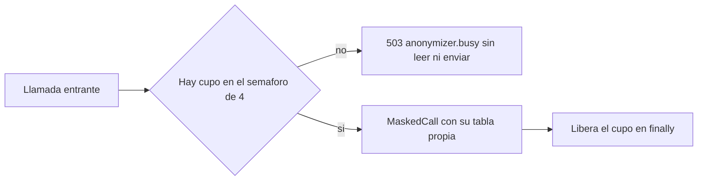

# Diseño de escalado — U10 anonymizer

**Insumos.** `nfr-requirements/performance-requirements.md` (performance-requirements),
`nfr-requirements/security-requirements.md` (security-requirements),
`nfr-requirements/scalability-requirements.md` (scalability-requirements),
`nfr-requirements/reliability-requirements.md` (reliability-requirements),
`nfr-requirements/observability-requirements.md` (observability-requirements) y
`nfr-requirements/tech-stack-decisions.md` (tech-stack-decisions, D5) de esta unidad; flujos F1 y F2 de
`functional-design/functional-spec.md` (functional-spec); C13 y C14 de
`inception/contract-design/contract-summary.md` (contract-summary); respuestas P1 = A y P2 = A de
`nfr-design-questions.md`; NFR8.7 de U4 (un turno a la vez en el juez).

## 1. Modelo de carga

| Dimensión | Valor de diseño |
|---|---|
| Réplicas por defecto | 0 (no se despliega) |
| Réplicas habilitado | 1 en el MVP; el diseño admite más sin cambios |
| `judge` simultáneas | 1 (el evaluador procesa un turno a la vez) |
| `embed` simultáneas | ≤ 2 (indexador y consultas de afirmaciones) |
| Tope de llamadas en curso | 4 (`VERIDICUS_ANONYMIZER_MAX_CONCURRENCY`, 1–8) |

El cuello de botella es el juez y la cola de U4, no el proxy; por eso no hay autoescalado.

## 2. Control de admisión (NFR8.2)

<!-- Texto alternativo: cada llamada entrante intenta tomar uno de los 4 cupos del semáforo; si no hay, responde al instante 503 anonymizer.busy sin enmascarar ni enviar nada; si hay, procesa la llamada con su propia tabla y libera el cupo al terminar en cualquier caso. -->

- El cupo se toma con `semaphore.acquire_nowait()` **antes** de leer el cuerpo: el exceso no gasta
  memoria ni CPU y nada se enmascara ni se envía. El cupo se libera en `finally`, también cuando
  `fail_after` cancela la llamada.
- El cliente trata `503` `anonymizer.busy` como recuperable (`reliability-design.md` §3).
- **Verificación (nivel 1).** Con un destino *fake* bloqueado, 4 llamadas en curso; la 5.ª recibe
  `503` en < 50 ms y el *fake* registra exactamente 4 peticiones.

## 3. Sin estado entre llamadas (NFR8.3, P1 = A)

- Cada `MaskTable` y cada `NumberingPlan` viven solo dentro de su llamada; el proceso no tiene base de
  datos, Redis ni volumen persistente, y no hay caché de listas (`performance-design.md` §1).
- La numeración estable de P1 = A **no** introduce estado: se deriva de la lista que trae cada llamada.
  Dos réplicas producen los mismos marcadores para la misma lista, así que escalar horizontalmente no
  cambia el resultado ni requiere afinidad.
- **Verificación (nivel 0).** (a) Dos llamadas con la misma lista y menciones en orden distinto dan el
  mismo marcador para cada valor de la lista; (b) dos instancias de `MaskedCall` en paralelo no comparten
  objetos (la tabla de una no ve entradas de la otra); (c) los valores detectados solo por reglas se
  numeran desde `N + 1` en cada llamada.

## 4. Carga de punta a punta al habilitar (NFR8.4)

El PR de habilitación adjunta
`uv run --directory evaluation python -m load.run_batches --sessions 50 --concurrency 3 --report out/nfr8-anonymizer.json`
con el proxy en el camino: ≥ 98 % de sesiones sin turnos en error, 0 `OOMKilled` del proxy y
`veridicus_anonymizer_requests_total{result="busy"}` = 0.

## 5. Señal para escalar

Si `busy` crece de forma sostenida (`observability-design.md` §3), se sube
`VERIDICUS_ANONYMIZER_MAX_CONCURRENCY` por PR con una nueva medición del pico de RSS (NFR8.1); el tope
de 8 protege la memoria. Ninguna alerta ni automatismo cambia la configuración (AUTONOMIA-01).
