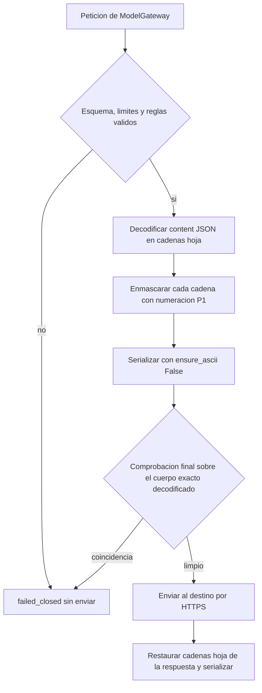

# Diseño de seguridad — U10 anonymizer

**Insumos.** `nfr-requirements/performance-requirements.md` (performance-requirements),
`nfr-requirements/security-requirements.md` (security-requirements, amenazas T1–T15),
`nfr-requirements/scalability-requirements.md` (scalability-requirements),
`nfr-requirements/reliability-requirements.md` (reliability-requirements),
`nfr-requirements/observability-requirements.md` (observability-requirements) y
`nfr-requirements/tech-stack-decisions.md` (tech-stack-decisions, D1–D9) de esta unidad; flujos F1–F3
y escenarios E1–E8 de `functional-design/functional-spec.md` (functional-spec); C13–C16 de
`inception/contract-design/contract-summary.md` (contract-summary); respuestas P1 = A y P2 = A de
`nfr-design-questions.md`; diseños de NFR de U1 (catálogo de límites), U2 (red y Kyverno), U3
(formateador de logs) y U4 (ModelGateway y reintento del juez); hallazgos R-01 a R-06 de
`nfr-requirements/reviews/review-01.md`.

Todo U10 es guardia de AUTONOMIA-04. El proxy se entrega **apagado** (`anonymizer.enabled: false`,
D1): este diseño describe lo que se construye y se prueba en cada PR, y lo que rige el día que un PR con
ADR lo habilite.

## 1. Frontera (AUTONOMIA-04)

| Componente | Dónde corre | Qué datos cruzan su frontera | Destinos permitidos |
|---|---|---|---|
| `anonymizer-proxy` (API `ProxyApi` y caso de uso `MaskedCall`) | Dentro del clúster, namespace `veridicus`; 0 réplicas por defecto | Entra (dentro del clúster): *prompt* o textos en claro, lista de nombres propios y `X-Request-Id`. Sale: **solo** el cuerpo enmascarado que pasó la comprobación final (§2) | El único host y CIDR del ADR, puerto 443/TCP |
| `MaskTable` y `NumberingPlan` | Memoria del proceso del proxy, durante una llamada | Nada: no se registran, no se guardan, no salen | Ninguno |
| ModelGateway con el adaptador `AnonymizerGateway` | `libs/model_gateway`, en `semantic-agent` y `session-api` | Texto en claro y lista de nombres hacia el proxy por HTTP interno | `veridicus-anonymizer-proxy.<namespace>.svc.cluster.local:8080` |
| Destino externo | Fuera del clúster, región del ADR | Recibe marcadores y la estructura del testimonio; devuelve texto con marcadores o vectores | — |
| Audio (C5), Whisper y TTS | Dentro | Nunca pasan por el proxy (rutas `/v1/audio/*` en `404`, NFR1.8; URL del proxy prohibida en `VERIDICUS_WHISPER_URL` y en la del TTS, NFR1.6) | — |

Con el proxy apagado la tabla de fronteras de U2 y U4 no cambia: ningún componente llama fuera.

## 2. Cadena de enmascarado sobre valores decodificados (P2 = A)

El proxy nunca busca sobre texto serializado: un escape JSON (`Peña`) o un salto de línea escapado
(`Ana\nPérez`) dejaría pasar un nombre. FastAPI ya decodifica el cuerpo una vez; el proxy además
interpreta como JSON cada `messages[].content` que lo sea (el bloque de datos de U4) y enmascara cada
cadena hoja ya decodificada. Lo que no es JSON se enmascara como texto.



<!-- Texto alternativo: la petición se valida; si algo falla termina cerrada sin enviar. Si pasa, el proxy decodifica el contenido JSON en sus cadenas, enmascara cada una con la numeración estable, vuelve a serializar sin escapes ASCII y hace una comprobación final sobre el cuerpo exacto que se va a enviar, decodificado. Si encuentra un nombre de la lista o una secuencia de 6 o más dígitos, termina cerrada; si está limpio, envía por HTTPS y restaura la respuesta sobre sus cadenas. -->

| Paso | Módulo (`services/anonymizer-proxy/src/anonymizer_proxy/`) | Control | Requisito |
|---|---|---|---|
| Decodificación | `domain/payload_walker.py` | Recorre `messages[].content` (o `input[]`); si un `content` es JSON válido, lo visita hoja por hoja; profundidad ≤ 32 y ≤ 10 000 hojas, si no `failed_closed` | NFR1.3, NFR10.1 |
| Enmascarado | `domain/masking.py` | `google-re2` sobre la copia normalizada (minúsculas, sin tildes, espacios Unicode y saltos de línea colapsados a un espacio) con mapa de posiciones al original | NFR1.3, NFR1.4, D2 |
| Serialización | `domain/payload_walker.py` | `json.dumps(…, ensure_ascii=False, separators=(",", ":"))`; el resultado vuelve a parsearse y debe tener la misma forma | NFR1.3 |
| Comprobación final | `domain/outbound_check.py` | Sobre el cuerpo exacto que se envía, **decodificado** (JSON externo y `content` interno): 0 nombres de la lista (normalizados) y 0 secuencias de 6 o más dígitos con o sin separadores; si no, `failed_closed` con `code` `anonymizer.masking_failed` | NFR1.3, NFR10.1 |
| Restauración | `domain/restoration.py` | Ver `reliability-design.md` §4 | NFR6.1 |

```python
def outbound_check(body: bytes, nouns: NormalizedNouns, digits: re2.Pattern) -> None:
    for text in iter_decoded_strings(json.loads(body)):   # incluye content JSON interno
        norm = normalize(text)
        if nouns.search(norm) or digits.search(norm):
            raise FailClosed("outbound_check")          # nada se envía
```

La comprobación final es una segunda barrera independiente del enmascarado: usa el mismo normalizador
pero no la tabla, y su prueba de nivel 0 inyecta un enmascarador defectuoso (que deja pasar un nombre) y
exige 0 peticiones al destino *fake*.

**Verificación.** NFR1.3 y NFR1.4 (nivel 0, 0 apariciones de valores sembrados) se amplían con
pruebas de propiedad de Hypothesis: nombres sintéticos de U1 insertados con `\uXXXX`, `\n`, `\t`,
espacio no separable y comillas, dentro de un bloque de datos JSON; métrica: 0 apariciones en los bytes
capturados por el *fake*, comparando sin mayúsculas ni tildes después de decodificar.

## 3. Numeración estable de marcadores (P1 = A)

`NumberingPlan` se calcula en cada llamada a partir de la lista `proper_nouns` que envía el cliente,
**sin guardar estado** entre llamadas:

- Un valor que está en la lista recibe el número de su posición (base 1) dentro de su categoría en esa
  lista: «Ana Pérez», 12.ª persona de la lista de la versión de escenario, es `[PERSONA_12]` en todos
  los lotes de pasajes, en cada afirmación y en el juez.
- Un valor que solo detectan las reglas se numera por llamada a partir de `N + 1`, con `N` el número
  de entradas de su categoría en la lista; así nunca choca con un número estable.
- El orden de la lista lo fija el cliente: ModelGateway la envía ordenada por el identificador de la
  entrada en la versión de escenario (orden de extracción del indexador de U4), de forma que dos
  llamadas de la misma versión ven la misma lista. La lista lleva `scenario_version_id` y su SHA-256
  (`proper_nouns_sha256`); el proxy rechaza con `422` una lista cuyo SHA-256 no coincide.

**Riesgo aceptado.** El destino puede enlazar menciones del mismo seudónimo entre llamadas de una
misma versión de escenario. Es parte de la «estructura del testimonio» que el ADR ya acepta (NFR1.2);
el ADR lo declara de forma explícita. Las versiones de escenario distintas no comparten numeración
estable porque sus listas difieren.

**Verificación.** Nivel 0: dos llamadas con la misma lista y menciones en orden distinto dan el mismo
marcador por valor de lista; un valor detectado solo por reglas nunca recibe un número ≤ `N`. Nivel 1:
`tests/integration/test_masked_similarity.py` calcula, con un *embedder* *fake* determinista sobre los
casos del Golden Dataset, la similitud entre afirmación y pasaje con y sin enmascarar; umbral: el mismo
pasaje sobre el umbral de U4 en el 100 % de los casos donde lo estaba sin enmascarar, y 0 pasajes nuevos
sobre el umbral. El nivel 2 del PR de habilitación (NFR4.1) repite la medición con el modelo real.

## 4. Reglas de detección y riesgo residual (NFR1.10, NFR10.11)

- `DetectionRuleSet` llega como `ConfigMap` montado `readOnly` en `/etc/veridicus/anonymizer/rules.yaml`;
  al arrancar se comprueba su SHA-256 contra `VERIDICUS_ANONYMIZER_RULES_SHA256` y `schema_version`
  semver; si no, el proceso no arranca.
- Las expresiones se compilan con `google-re2` al arrancar; una regla con *lookbehind* o referencia
  hacia atrás no compila y el PR que la trae falla en nivel 0.
- La prueba `-m residual` corre con la lista vacía: 0 escapes bloqueantes (tratamientos, prefijos de
  lugar, 2 o más palabras con mayúscula, 6 o más dígitos) y la tasa informativa en
  `out/anonymizer-residual.json`, que el ADR cita.

## 5. Políticas de red y de manifiestos (NFR1.1, NFR1.5, NFR1.9, NFR10.10)

Las políticas viven en `deploy/policies/` y sus controles negativos en `deploy/policies/tests/`; se
ejecutan con `kyverno apply` y `kyverno test` sin red (U2: Kyverno no se instala en el clúster).

| Política | Qué rechaza | Controles negativos |
|---|---|---|
| `veridicus-anonymizer-disabled-by-default` | Con los *values* de `main`, cualquier recurso con `app.kubernetes.io/name: veridicus-anonymizer-proxy` o regla de salida con `ipBlock` fuera del clúster | Render con el proxy habilitado sin `anonymizer.providerAdr` |
| `veridicus-egress-only-anonymizer` | Ver la lista de abajo | Uno por cada caso de la lista |
| `veridicus-anonymizer-ingress` | Entrada al proxy desde algo distinto de `semantic-agent` y `session-api` (8080) y Prometheus (puerto de métricas) | Entrada desde `audio-worker`; regla sin `podSelector` |
| `veridicus-anonymizer-hardening` | Proxy con PVC, `hostPath`, `hostNetwork`, raíz escribible, usuario root, `automountServiceAccountToken` distinto de `false`, credencial de base o Redis, o `emptyDir` sin `medium: Memory` o de más de 16 MiB | Uno por cada caso |

`veridicus-egress-only-anonymizer` cubre los huecos del hallazgo R-02. Rechaza:

1. Una regla de salida con `ipBlock` fuera de los rangos del clúster en una `NetworkPolicy` cuyo
   `podSelector` no elija solo el proxy.
2. En el proxy: CIDR `0.0.0.0/0` o `::/0`, prefijo menor que /24 (IPv4) o /48 (IPv6), puerto distinto
   de 443/TCP o falta de la anotación `veridicus.io/provider-adr`.
3. **Una regla de salida vacía o sin `to`** (`egress: [{}]` o `to` ausente), que permite todo, en
   cualquier `NetworkPolicy` del chart.
4. **Un `namespaceSelector`** en una regla de salida hacia un namespace distinto de `veridicus` y
   `kube-system` (DNS).
5. **`hostNetwork: true`** en cualquier pod del chart (salta las `NetworkPolicy`).
6. **Un pod sin cobertura de denegación por defecto**: se apoya en `require-default-deny` de U2
   (`veridicus-default-deny` con `podSelector: {}` en `Ingress` y `Egress`), y esta política añade el
   control negativo de un render sin ella.

**Verificación.** `helm template … && kyverno apply deploy/policies/ --resource out/render.yaml` con 0
violaciones sobre `values-cpu.yaml` y `values-gpu.yaml`, y `kyverno test deploy/policies/tests/` con
cada control negativo fallando como se espera (nivel 0).

## 6. Superficie del proxy (NFR1.8, hallazgo R-05)

- **Rutas.** Solo `POST /v1/chat/completions` y `POST /v1/embeddings`; cualquier otra ruta, incluidas
  `/v1/audio/*`, responde `404` sin llamar al destino. `/healthz`, `/readyz` y `/metrics` van en el
  puerto interno de salud y métricas, no en el 8080.
- **Campos salientes.** Lista permitida de NFR1.8; `veridicus_masking` y todo campo extra se quitan;
  `model` es siempre `VERIDICUS_ANONYMIZER_MODEL`.
- **Cabeceras salientes (R-05).** El cliente `httpx` del destino se construye sin cabeceras heredadas
  y solo envía `Authorization: Bearer <credencial propia>`, `Content-Type: application/json`,
  `Accept: application/json` y `User-Agent: veridicus-anonymizer` (sin versión). Nunca se reenvían
  `X-Request-Id`, `Authorization` del cliente, `Cookie`, `X-Forwarded-*` ni otra cabecera de entrada.
  Prueba de nivel 0: una petición con 10 cabeceras de entrada llega al *fake* con exactamente esas 4.
- **Destino (NFR10.5).** `https://` sin usuario, host igual al del ADR, `ssl.SSLContext` con
  `minimum_version = TLSv1_2`, verificación de certificado y nombre, `follow_redirects=False`,
  `HTTPTransport(retries=0)`.
- **Credencial (NFR10.6).** `VERIDICUS_ANONYMIZER_API_KEY` desde `secretKeyRef` del Secret
  `veridicus-anonymizer-credential`; se guarda en un `SecretStr` de Pydantic, solo se lee al construir
  la cabecera y nunca aparece en logs, métricas, errores ni `/readyz`. `gitleaks` y una regla Kyverno
  rechazan un valor literal en el manifiesto.

## 7. Límites y errores (NFR10.8, NFR10.9)

- Los límites de U10 se leen del catálogo único de U1 (`contracts/limits.v1.yaml`) con el accesor
  `veridicus_contracts.limits`: `anonymizer.max_body_bytes` (524 288), `anonymizer.max_proper_nouns`
  (2 000), `anonymizer.max_proper_noun_chars` (200), `anonymizer.max_embed_inputs` (32),
  `anonymizer.max_upstream_response_bytes` (2 097 152) y los de profundidad y hojas de §2. Los ajustes
  `VERIDICUS_ANONYMIZER_MAX_*` solo pueden bajarlos.
- El cuerpo de entrada se lee por bloques y se corta al pasar el límite (`413`); la respuesta del
  destino se lee por bloques hasta 2 MiB (más → `502`). En todos los casos, 0 peticiones al destino o
  0 bytes devueltos al cliente.
- Errores como Problem Details desde la jerarquía de `libs/`, con los seis `code` de NFR10.9 y `detail`
  del catálogo; nunca texto de la petición, de la respuesta del destino ni de la excepción.

## 8. Memoria y registros (NFR10.2, NFR10.3)

- `MaskTable` y `NumberingPlan` se crean dentro de `MaskedCall.run` y se vacían en `finally`
  (incluida la cancelación por `fail_after`); no se guardan en atributos del proceso, en el *logger*
  ni en contextos de métricas. Prueba de nivel 0 por cada final de la máquina de estados.
- Logs con el formateador de lista blanca de `libs/` (U3) extendido con los campos de NFR15.2; ver
  `observability-design.md` §1.

## 9. Validación de destinos en ModelGateway (NFR1.6, hallazgo R-06)

La validación general de destinos (toda URL de modelo debe ser interna) es de U4 (C13) y conserva su
puerta de cobertura en U4. U10 añade un módulo propio, `libs/model_gateway/anonymizer_route.py`, con
una sola función `check_anonymizer_route(setting, url)`: la URL del proxy solo se admite en
`VERIDICUS_JUDGE_URL` y `VERIDICUS_EMBEDDINGS_URL`; en `VERIDICUS_WHISPER_URL` o en la del TTS impide
arrancar. La puerta de 100 % de ramas de U10 (NFR13.2) se limita a ese módulo y al adaptador
`AnonymizerGateway`; U4 lo llama desde su validación general.

## 10. Habilitación, auditoría y adversarios (NFR1.2, NFR1.7, NFR11.1, NFR5.1, NFR5.2, NFR12.1)

- **ADR del proveedor.** `scripts/check-provider-adr.sh` comprueba las secciones de NFR1.2 y, por P1 =
  A, una sección «Seudónimos estables» que declara el enlace entre llamadas de §3. Código 0 con el
  proxy apagado.
- **Cabeceras de auditoría.** Cada respuesta del proxy lleva `X-Veridicus-Masking-Rules` y
  `X-Veridicus-Model`; `AnonymizerGateway` pone en `model_digest` de C3 el SHA-256 de este último.
- **Verificación manual en el clúster (NFR1.7, R-05).** Solo lectura y con herramientas presentes en
  las imágenes: en pods de Python,
  `kubectl exec <pod> -- python -c "import socket; socket.create_connection(('example.com', 443), 5)"`
  debe terminar con código distinto de 0; en las imágenes con `bash` (PostgreSQL de CloudNativePG),
  `kubectl exec <pod> -- bash -c 'exec 3<>/dev/tcp/example.com/443'`; donde no hay ninguna de las dos,
  la evidencia es el `kubectl get networkpolicy -o yaml` que muestra la denegación por defecto. Ningún
  paso usa `apply`, `patch`, `delete`, `debug` ni `helm`.
- **Escenarios A y B (NFR5.1, NFR5.2).** En el PR de habilitación, el reporte de nivel 2 con el juez
  externo incluye la variante «escribe los nombres reales detrás de cada marcador» (0 valores
  sembrados antes de restaurar) y falla si la familia del juez coincide con la del generador.
- **Datos sintéticos (NFR12.1).** Todos los *fixtures* de `services/anonymizer-proxy/tests/` usan el
  catálogo de U1 y pasan su comprobación con 0 hallazgos.

## 11. Amenazas y controles

| Amenaza | Controles de este diseño |
|---|---|
| T1 Nombre no detectado | §2 (comprobación final contra la lista), §4, apagado por defecto |
| T2 Error a mitad del enmascarado | §2 y `reliability-design.md` §1 |
| T3 Otro pod con salida | §5 (incluidos los casos de R-02) |
| T4 Servicio que salta el proxy | §9 |
| T5 Rutas o campos no previstos | §6 |
| T6 Texto en logs o errores | §7, §8 y `observability-design.md` |
| T7 Tabla persistente | §8; pod sin volúmenes (§5) |
| T8 Redirección o certificado falso | §6 |
| T9 Fuga de la credencial | §6 |
| T10 Proveedor que entrena o retiene | §10 (ADR) |
| T11 Proxy como túnel | §5 (`veridicus-anonymizer-ingress`) y §6 (modelo y campos fijos) |
| T12 Agotamiento de CPU o memoria | §7, `performance-design.md` §2 y `reliability-design.md` §2 |
| T13 Inyección para revelar nombres | §10 (Escenario A) |
| T14 Cambio silencioso de reglas o proveedor | §4 y §10 |
| T15 Salida por DNS | Transferida a Infrastructure Design (`logical-components.md` §4) |

## 12. Precisiones a artefactos ya aprobados

No edité ningún artefacto aprobado; decides en la aprobación si se actualizan. Todas aplican solo al
código de U10 o al día en que se habilite el proxy.

| Artefacto | Qué precisa | Origen |
|---|---|---|
| `anonymizer/nfr-requirements/scalability-requirements.md` (NFR8.3) | La numeración ya no es independiente por llamada para los valores de la lista: cada uno lleva su posición en la lista; solo los detectados por reglas se numeran por llamada desde `N + 1`. Sigue sin estado entre llamadas | P1 = A |
| `anonymizer/functional-design/rules.md` (BR1.1) | «El mismo valor recibe el mismo marcador» vale entre llamadas de la misma versión de escenario para los valores de la lista | P1 = A |
| `contract-design/contract-summary.md` (C13) | La extensión `veridicus_masking` lleva `scenario_version_id`, `proper_nouns` ordenada por identificador de entrada y `proper_nouns_sha256` | P1 = A |
| `anonymizer/nfr-requirements/security-requirements.md` (NFR1.2) | El ADR suma la sección «Seudónimos estables» | P1 = A |
| `anonymizer/functional-design/functional-spec.md` (F1 pasos 3–4) | El enmascarado recorre las cadenas decodificadas del contenido JSON y una comprobación final sobre el cuerpo exacto precede al envío | P2 = A |
| `anonymizer/nfr-requirements/security-requirements.md` (NFR1.5) | La política suma los casos de regla sin `to`, `namespaceSelector` externo, `hostNetwork` y render sin denegación por defecto, con sus controles negativos; la entrada pasa a una política propia `veridicus-anonymizer-ingress` | R-02 |
| `anonymizer/nfr-requirements/security-requirements.md` (NFR1.8 y NFR1.7) | Lista permitida de 4 cabeceras salientes; la verificación manual usa `python` o `bash` de la imagen en vez de `curl` | R-05 |
| `anonymizer/nfr-requirements/tech-stack-decisions.md` (NFR13.2) | La puerta de 100 % de ramas sobre `libs/model_gateway` se limita a `anonymizer_route.py` y al adaptador `AnonymizerGateway` | R-06 |
| `contracts` (`contracts/limits.v1.yaml`, U1) | Nuevas entradas `anonymizer.*` de §7, con U10 como dueña, por un PR de U1 | §7 |
| `text-flow/nfr-design/security-design.md` (§5, U4) | Si se habilita el proxy, `veridicus_judge_ro` necesita `SELECT` sobre la lista de nombres propios de la versión de escenario | Precisión ya anotada en NFR Requirements |
