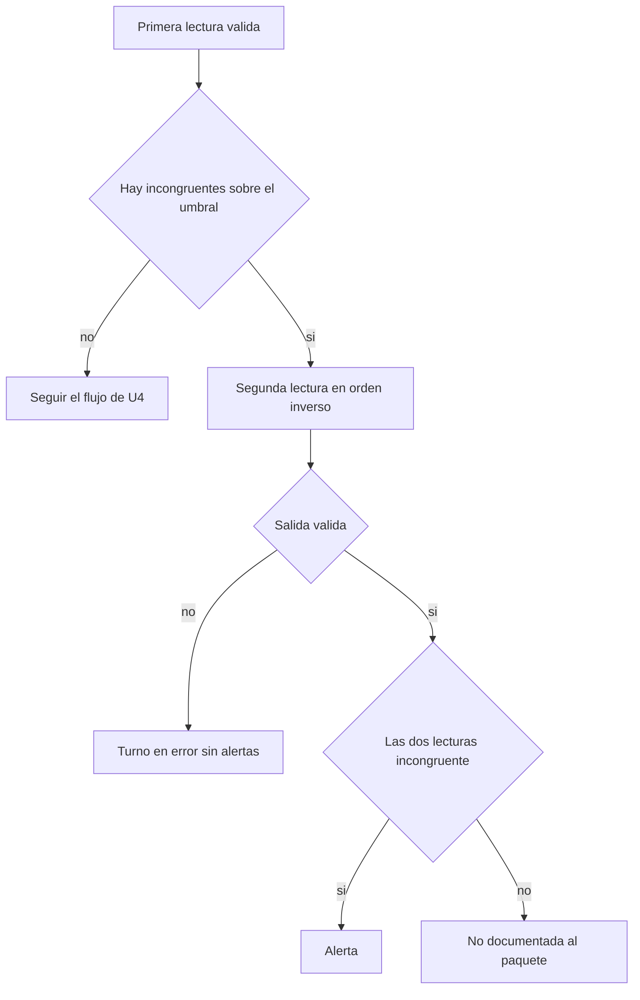
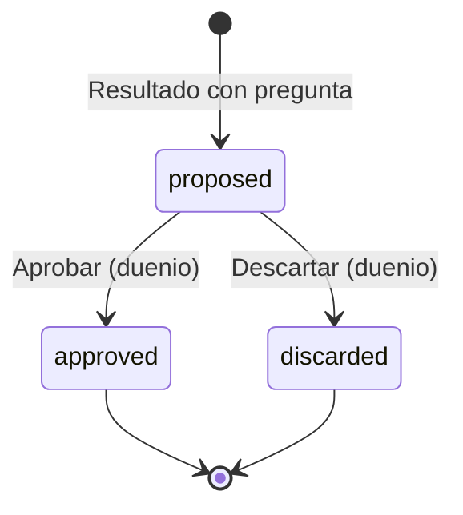
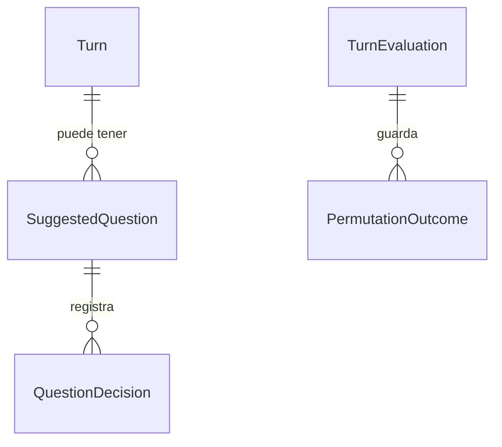

# Especificación funcional — U8 assistant-extras

**Insumos.** Unidad U8 de `inception/units-generation/unit-of-work.md` (unit-of-work) y su mapa de
historias `unit-of-work-story-map.md` (unit-of-work-story-map); FR10.3, FR10.5, FR11.1, FR5.2 y NFR4 de
`inception/requirements-analysis/requirements.md` (requirements); SemanticEvaluation e InterviewSession
de `inception/domain-design/components.md` (components); C1, C2, C3 y C8 de
`inception/contract-design/contract-summary.md` (contract-summary); respuestas P1–P3 de
`functional-design-questions.md`. Las entidades están en `entities.md` y las reglas en `rules.md`; este
documento es la fuente de verdad de los flujos.

## 1. Qué hace la unidad

U8 añade al flujo de evaluación de U4 tres extras opcionales (SHOULD/COULD), apagados por defecto y
activados por configuración del despliegue: confirmar cada alerta leyendo en los dos órdenes, sugerir la
siguiente pregunta al analista y señalar un indicio afectivo en el paquete. Ningún MUST depende de ellos.

| Componente | Proceso | Dentro / fuera del clúster | Datos que cruzan la frontera |
|---|---|---|---|
| SemanticEvaluation (permutación, pregunta, indicio) | `semantic-agent` | Dentro, bajo la `NetworkPolicy` de salida denegada | Afirmaciones y pasajes al juez interno; nada sale |
| InterviewSession (preguntas) | `session-api` | Dentro | Ninguno sale |
| ConsoleApi (`/questions/*/decision`) | `session-api` | Dentro | La pregunta hacia el navegador, dentro del clúster |
| AnalystConsole (SuggestedQuestion) | `frontend` | Dentro | Solo habla con ConsoleApi |

## 2. Flujos

### F1 — Evaluar con permutación (US10.5)

Se inserta en el paso de validación del flujo de evaluación de U4:

1. Tras la primera lectura válida, se toman las afirmaciones calificadas «incongruente» que pasaron la
   guardia (BR1.1, BR1.4).
2. Si hay alguna, se hace una segunda lectura del juez con los pasajes en orden ascendente y la
   afirmación antes de los pasajes, mismo prompt del sistema y misma semilla, en un solo llamado para
   todas ellas.
3. Se valida la segunda salida igual que la primera; si falla → el turno entero en error (BR1.5).
4. Por afirmación: dos «incongruente» → alerta (BR1.2); cualquier otra combinación → «no documentada»,
   al paquete con el motivo de BR1.3.
5. El resultado marca `permutation_applied` y guarda las dos calificaciones (BR1.6).

<!-- Texto alternativo: tras una primera lectura válida, si hay afirmaciones incongruentes sobre el umbral se hace una segunda lectura en orden inverso; si esa salida es inválida el turno queda en error sin alertas; si es válida, una afirmación con las dos lecturas incongruente produce alerta y cualquier otra combinación queda no documentada y va al paquete. -->

### F2 — Sugerir una pregunta (US10.3)

1. Con `suggest_question` activo, al armar el resultado: si alguna afirmación es «no documentada» → no
   hay pregunta (BR2.1).
2. Si no, una llamada al juez con un prompt propio cuyo bloque de datos solo lleva el turno y sus
   pasajes recuperados (BR2.2).
3. Se valida el texto (1–300 caracteres) y se escanea con C8; si falla, se omite la pregunta sin afectar
   el turno (BR2.3).
4. C3 trae `suggested_question`; InterviewSession la guarda `proposed`.
5. La consola muestra «Pregunta sugerida · requiere tu aprobación» con «Aprobar» y «Descartar»; el dueño
   decide (`POST /questions/{id}/decision`, BR2.4) y queda en el historial (BR2.6).
6. Solo una pregunta aprobada se puede escuchar (U9) o citar como formulada en el reporte (BR2.5).

### F3 — Indicio afectivo (US11.1, COULD)

1. Con `affective` activo, al armar un paquete se busca la lista de palabras emocionales en el texto
   del turno con las reglas de C8 (BR3.1).
2. Con al menos una coincidencia, el paquete lleva el texto fijo; sin coincidencias o apagado, no.
3. Nunca se llama al LLM para esto.

## 3. Máquina de estados de una pregunta sugerida

<!-- Texto alternativo: una pregunta nace propuesta; el dueño la aprueba o la descarta; ambos estados son finales. -->

## 4. Vista derivada: entidades y relaciones

Derivada de `entities.md`.

<!-- Texto alternativo: un turno puede tener preguntas sugeridas (una por intento); cada pregunta registra su decisión; cada evaluación guarda el resultado de la permutación por afirmación releída. -->

## 5. Vista derivada: reglas

| Grupo | Reglas | Flujo |
|---|---|---|
| Permutación | BR1.1–BR1.6 | F1 |
| Pregunta | BR2.1–BR2.6 | F2 |
| Indicio afectivo | BR3.1–BR3.3 | F3 |
| Vocabulario y accesibilidad | BR4.1–BR4.4 | F2, F3 |

## 6. Escenarios de negocio y casos límite

| # | Escenario | Resultado esperado | Regla |
|---|---|---|---|
| E1 | Juez *fake* que dice «incongruente» solo en el primer orden | Sin alerta; la afirmación al paquete como no documentada | BR1.2, BR1.3 |
| E2 | Las dos lecturas «incongruente» | Una alerta | BR1.2 |
| E3 | Afirmación bajo el umbral con permutación activa | Sin segunda lectura y sin alerta | BR1.4 |
| E4 | Segunda lectura con un campo extra | Turno en error, 0 alertas | BR1.5 |
| E5 | Turno con una afirmación no documentada y pregunta activa | Sin pregunta | BR2.1 |
| E6 | Pregunta con «¿por qué miente?» | Se omite la pregunta; el turno sigue evaluado | BR2.3 |
| E7 | Otro analista aprueba la pregunta | 403 | BR2.4 |
| E8 | Audio de una pregunta descartada | 409 | BR2.5 |
| E9 | Indicio activo y «lloraba de miedo» en el turno | El paquete lleva el texto fijo | BR3.1 |
| E10 | Indicio apagado | Sin texto | BR3.1 |

## 7. Integración con otras unidades

| Unidad | Relación |
|---|---|
| U4 text-flow | U8 se inserta en su flujo de evaluación y en el armado del paquete; reutiliza el escáner y la validación de C6 |
| U9 voice | Sintetiza el audio solo de una pregunta aprobada |
| U7 forensic-report | Lista las preguntas aprobadas; el indicio afectivo pasa el escaneo del reporte |
| U1 contracts | Guarda la lista versionada de palabras emocionales |

## 8. Errores y bordes

- La segunda lectura duplica las inferencias de las afirmaciones candidatas en CPU; su efecto en la
  latencia y en NFR8 lo mide NFR Requirements (unit-of-work U8).
- Un fallo al generar la pregunta nunca convierte el turno en error: la pregunta es opcional.
- Los logs llevan `turn_id`, `attempt` y el resultado de la permutación (`sustained`), nunca texto.

## 9. Precisiones a artefactos ya aprobados

| Artefacto | Qué precisa | Origen |
|---|---|---|
| `contract-design/contract-summary.md` (C3) | Cada afirmación releída lleva `forward_grade`, `reversed_grade` y `sustained` (cambio menor) | P1 = A, P2 = A |
| `contract-design/contract-summary.md` (contratos de U1) | Añade la lista versionada de palabras emocionales `integrity/affective-keywords.v1.yaml` | P3 = A |
| Functional Design de U4 (paquete) | El motivo de la CoT interrumpida admite «el juez no sostuvo la incongruencia al invertir el orden» | P2 = A |
