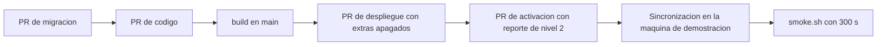

# Pipeline de CI/CD — U8 assistant-extras

**Insumos.** Comandos de verificación, ajustes y decisiones D1–D10 de
`nfr-requirements/tech-stack-decisions.md`; dobles de prueba, cobertura y textos de
`nfr-design/logical-components.md` (logical-components §5); plazo, reclamo y humo con extras de
`nfr-design/performance-design.md` (performance-design §3 y §5); pruebas de
`nfr-design/reliability-design.md` (reliability-design), `nfr-design/scalability-design.md`
(scalability-design) y `nfr-design/security-design.md` (security-design §3–§7); reglas informativas de
`nfr-design/observability-design.md` (observability-design §4); flujos F1–F3 de
`functional-design/functional-spec.md` (functional-spec); procesos de
`inception/domain-design/components.md` (components); C1–C3, C6 y C8 de
`inception/contract-design/contract-summary.md` (contract-summary); respuesta **P1 = A** de
`infrastructure-design-questions.md` (`values-extras.yaml` solo en la máquina de demostración, tras el PR
con reporte de nivel 2 que cumple los umbrales de cada extra); flujo común de U2 y *workflows* de U3 y U4
(sus `cicd-pipeline.md`); `infrastructure-specification.md` de esta carpeta; `## Testing Posture` de
`team.md`.

U8 no crea *workflows* nuevos: amplía los de U2, U3 y U4. Todos siguen con
`permissions: contents: read`, acciones fijadas por SHA y sin `kubeconfig`; solo el *job* `build` tiene
`packages: write`, y solo en `main` (AUTONOMIA-01).

## 1. *Workflows* que cambian

| *Workflow* | Se dispara con | Lo que añade U8 | Bloquea |
|---|---|---|---|
| `semantic-agent.yml` (U4) | `services/semantic-agent/**`, `libs/**`, `contracts/**`, `deploy/veridicus/charts/semantic-agent/files/**` | Nivel 0: regla de permutación (propiedad Hypothesis: alertas con permutación ⊆ sin ella), política de la pregunta, plazo con reloj falso (81 s llama, 80 s omite), fallos por llamada con el juez *fake*, SHA-256 del *prompt* de la pregunta igual al de los *values*, ≤ 600 *tokens* de instrucciones, lista afectiva sin términos de C8, mensaje `user` con solo `turn` y `passages`, sin campos de URL. Guardias: `permutation.py` y `question_policy.py`. Nivel 1: logs con centinela, rastro de un turno con los tres extras | Sí |
| `session-api.yml` (U3) | `services/session-api/**`, `libs/**`, `contracts/**` | Nivel 0: validación de banderas y de la regla de plazo y reclamo (480 s rechazado, 510 s aceptado con los tres extras), ninguna ruta de C1 escribe `options`. Guardias: `question_decision.py`. Nivel 1: dos decisiones simultáneas (un `200`, un `409`), corte antes del `COMMIT`, disparador y permisos por columna, restricción única `(turn_id, attempt)`, `perf` de decisión y sondeo | Sí |
| `frontend.yml` (U4) | `frontend/**` | Vitest de la tarjeta (textos del catálogo, sin reintento automático, `409` invalida la consulta); `e2e/suggested-question.spec.ts` en la suite Playwright | Sí |
| `ai-eval-gate.yml` (U4, ampliado) | Las rutas de U4 más `deploy/veridicus/charts/semantic-agent/files/suggest-question.v1.md`, `.../affective-keywords.v1.yaml`, `domain/permutation.py`, `domain/question_policy.py`, `application/permutation_step.py`, `application/question_step.py`, `contracts/schemas/suggested-question-output.v1.json` y `deploy/veridicus/values-extras.yaml` | `scripts/check-eval-report.py` exige el reporte de nivel 2 con extras y comprueba los umbrales de §2 | Sí (nivel 2) |
| `deploy-level0.yml` (U2, ampliado) | `deploy/**`, `scripts/**`, `.github/**` | Render también de `values-gpu.yaml` + `values-extras.yaml`; las mismas políticas Kyverno sobre ese render; `scripts/check-extras-values.py`; `promtool test rules` de las reglas de U8 | Sí |

La lista afectiva entra en `ai-eval-gate.yml` aunque es determinista y no es IA: cambia la salida que
ve el analista y la repetibilidad de NFR4.5, así que se mide igual que un *prompt*.

### 1.1 `scripts/check-extras-values.py` (nivel 0, *offline*)

| Comprobación | Falla si |
|---|---|
| Regla de plazo y reclamo sobre el render | Hay una bandera en `"true"` y el plazo base < 600 o el reclamo ≤ 482,2 s o ≥ plazo base |
| Banderas en los *values* base | `values-cpu.yaml` o `values-gpu.yaml` tienen una bandera en `"true"` |
| `Application` de desarrollo | `deploy/argocd/veridicus-dev.yaml` incluye `values-extras.yaml` |
| SHA-256 del *prompt* | `VERIDICUS_QUESTION_PROMPT_SHA256` no coincide con el archivo del chart |

## 2. Puertas con comando y umbral (AUTONOMIA-02)

| Puerta | Comando | Umbral | Nivel |
|---|---|---|---|
| Unitarias, contratos y guardias | `uv run --directory services/semantic-agent pytest -m "not integration and not perf"` (y en `services/session-api`) | Verde | 0 |
| Ramas de los módulos guardia | `uv run --directory services/semantic-agent pytest --cov-branch --cov-config=.coveragerc-guards` (y en `services/session-api`) | 100 % en `permutation.py`, `question_policy.py`, `question_decision.py` (NFR13.2) | 0 |
| Cobertura de líneas | `pytest --cov` de cada servicio y `npm --prefix frontend run test -- --coverage` | ≥ 80 % con U8 incluido (NFR13.1) | 0 |
| Tipos, *lint* y fronteras | `mypy --strict`, `ruff check`, `lint-imports` | 0 errores | 0 |
| Render y políticas | `helm template deploy/veridicus -f values-gpu.yaml -f values-extras.yaml \| kubeconform -strict` y `kyverno apply deploy/policies/` | 0 errores | 0 |
| Valores de extras | `python scripts/check-extras-values.py` | Código 0 | 0 |
| Reglas informativas | `promtool test rules deploy/veridicus/rules/tests/extras.yaml` | Verde | 0 |
| Integración | `uv run --directory services/session-api pytest -m integration -k "question or extras"` y `uv run --directory services/semantic-agent pytest -m integration -k extras` | Verde | 1 |
| Rendimiento en proceso | `uv run --directory services/session-api pytest -m perf -k question` y `uv run --directory services/semantic-agent pytest -m perf -k affective` | p95 ≤ 300 ms (NFR3.8), ≤ 200 ms (NFR3.9), ≤ 10 ms (NFR3.11) | 1 |
| Evaluación con extras | `uv run --directory evaluation python -m golden.run --profile cpu --extras all --report out/level2-extras.json` (dos corridas) | p95 ≤ 150 s; umbrales de NFR4 de team.md; tasa en línea > 65 % para `permutation`; 0 preguntas en el Hecho No Documentado; 0 `turn.error.timeout`; picos dentro de los topes de U4; corridas idénticas | 2 |
| E2E de la tarjeta | `npx --prefix frontend playwright test e2e/suggested-question.spec.ts` | Verde; tarjeta ≤ 3 s (NFR3.10) | 3 |
| Humo | `scripts/smoke.sh <url-base> --values <values de la Application>` | Código 0; 120 s por caso sin extras, 300 s con `values-extras.yaml` | 3 |

Ninguna prueba de niveles 0 y 1 descarga un modelo ni pide GPU, y ninguna se reintenta (NFR2.1).

## 3. Despliegue y migraciones

| Paso | Qué pasa |
|---|---|
| 1 | PR de migración: `suggested_question`, `question_decision`, columnas de permutación, disparador y `GRANT` por columna; corre solo en `migrations-job` con `veridicus_owner`, *expand–contract* |
| 2 | PR de código con sus *workflows* en verde y, al tocar rutas de IA, el reporte de nivel 2 |
| 3 | En `main`, `build` publica `semantic-agent`, `session-api` y `frontend` por SHA |
| 4 | PR de despliegue: digests nuevos en `values-cpu.yaml` y `values-gpu.yaml`, los dos `ConfigMap` y `VERIDICUS_QUESTION_PROMPT_SHA256`; extras en `"false"` |
| 5 | **PR de activación** (P1 = A): crea o cambia `values-extras.yaml` y lo añade a `deploy/argocd/veridicus-demo.yaml`, con el reporte de nivel 2; solo los extras que pasaron sus umbrales |
| 6 | El humano aplica (antes del módulo 8) o Argo CD sincroniza; `RollingUpdate` de U4 |
| 7 | `scripts/smoke.sh` con los *values* de esa máquina |

<!-- Texto alternativo: primero el PR de migración, luego el PR de código, el build en main, el PR de despliegue con los extras apagados, el PR de activación con el reporte de nivel 2, la sincronización en la máquina de demostración y la prueba de humo con 300 s. -->

## 4. Reversión

| Qué falló | Cómo se revierte |
|---|---|
| Humo o E2E tras activar extras | `git revert` del PR de activación y nueva sincronización: la máquina de demostración vuelve a extras apagados |
| Humo tras un PR de despliegue | `git revert` del PR de despliegue (U2) |
| Un extra empeora sus métricas en la demostración | PR que pone su bandera en `"false"` en `values-extras.yaml`; las sesiones ya creadas conservan sus opciones |
| *Prompt* o lista nueva con peores métricas | `git revert` de su PR |
| La migración | Solo avanza; corrección con una migración nueva |
| `semantic-agent` no arranca por un *prompt* o lista inválidos | `/readyz` en `503`; `git revert` del PR que los cambió |

## 5. Entornos

| Entorno | Valores | Extras |
|---|---|---|
| CI | Render de `values-cpu.yaml`, `values-gpu.yaml` y `values-gpu.yaml` + `values-extras.yaml` | Solo render |
| Máquina de desarrollo (Minikube 20 GiB, 10 CPU) | `values-cpu.yaml` (`Application` `veridicus-dev`) | Siempre apagados; ahí corren la carga de NFR8 y el humo de 120 s |
| Máquina de demostración (Minikube 28 GiB) | `values-gpu.yaml` + `values-extras.yaml` (`Application` `veridicus-demo`) | Los aprobados en su reporte |
| Evaluación de nivel 2 | `port-forward` al juez desde `scripts/eval-level2.sh` con `--extras` | Los activa el arnés; no cambia el clúster |

## 6. Secretos

U8 no añade Secrets: usa las contraseñas de `veridicus_app` y `veridicus_judge_ro`, la de Redis y la
`--api-key` del juez que ya crea `scripts/create-secrets.sh` de U2. `values-extras.yaml` solo lleva
banderas y cifras, y `gitleaks` lo revisa como al resto del repositorio. Los reportes de nivel 2 que se
adjuntan al PR solo llevan métricas e identificadores, nunca texto de turnos ni preguntas.
