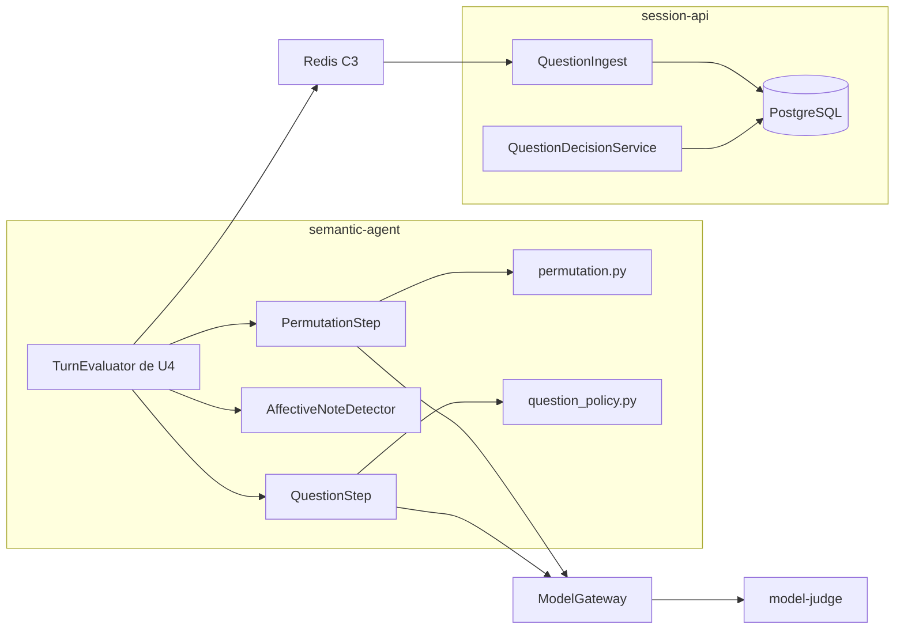

# Componentes lógicos — U8 assistant-extras

**Insumos.** `nfr-requirements/performance-requirements.md` (performance-requirements),
`security-requirements.md` (security-requirements), `scalability-requirements.md`
(scalability-requirements), `reliability-requirements.md` (reliability-requirements),
`observability-requirements.md` (observability-requirements) y `tech-stack-decisions.md`
(tech-stack-decisions) de esta unidad; `functional-design/functional-spec.md` (functional-spec);
C1–C3, C6, C8 y C13–C16 de `inception/contract-design/contract-summary.md` (contract-summary);
respuestas P1 = A y P2 = A de `nfr-design-questions.md`; los demás documentos de diseño de esta carpeta.

## 1. Inventario

| Componente lógico | Proceso | Dentro o fuera del clúster | Responsabilidad | Patrones de NFR |
|---|---|---|---|---|
| `ExtrasSettings` | API y trabajador de `session-api` | Dentro | Banderas y regla de plazo y reclamo | Validación al arrancar; sin URL |
| Copia de `options` en la sesión | API de `session-api` | Dentro | Fijar las opciones al crear la sesión y enviarlas en C2 | Sin ruta que las escriba |
| `PermutationStep` | `semantic-agent/application/` | Dentro | Armar y validar la segunda lectura | Reintento acotado por llamada (P1 = A); `cache_prompt` |
| `permutation.py` | `semantic-agent/domain/` | Dentro | Regla de BR1.1–BR1.6 | Código puro, 100 % de ramas |
| `QuestionStep` | `semantic-agent/application/` | Dentro | Plazo, tamaño y llamada de la pregunta | Comprobación de plazo (P2 = A); sin reintento |
| `question_policy.py` | `semantic-agent/domain/` | Dentro | BR2.1–BR2.3, BR4.1, BR4.2 | Código puro, 100 % de ramas |
| `AffectiveNoteDetector` | `semantic-agent/application/` | Dentro | Buscar la lista en el turno | Regex compilada al arrancar; sin LLM |
| `QuestionIngest` | Trabajador de `session-api` | Dentro | Revalidar y guardar la pregunta con el resultado C3 | Misma transacción de U4; `change_seq` |
| `QuestionDecisionService` y `question_decision.py` | API de `session-api` | Dentro | Decisión del dueño | `authorize` de U3; actualización condicional; 100 % de ramas |
| `is_question_approved` | `session-api/application/` | Dentro | Puerto de solo lectura para U7 y U9 | — |
| Tarjeta de la pregunta en M4 | `frontend`, en el navegador | Fuera (equipo del analista) | Mostrar y decidir | Textos del catálogo; sin reintento automático |
| `ConfigMap` del *prompt* y de la lista | Montados en `semantic-agent` | Dentro | Configuración inmutable | `readOnly`; SHA-256 |

Los componentes de U4 (`TurnEvaluator`, `PromptBuilder`, `ModelGateway`, `IntegrityPolicy.scan`,
`DeadlineSweeper`, `SessionPoll`) se reutilizan sin cambios de responsabilidad.

<!-- Texto alternativo: dentro de semantic-agent, el TurnEvaluator de U4 llama a PermutationStep, que usa la regla pura de permutación, al detector afectivo y a QuestionStep, que usa la política pura de la pregunta; las dos llamadas al juez pasan por ModelGateway hacia model-judge. El resultado viaja por Redis en C3 hasta QuestionIngest de session-api, que lo guarda en PostgreSQL, igual que QuestionDecisionService. -->

## 2. Dominios de falla y radio de impacto

| Falla | Qué deja de funcionar | Qué sigue | Radio |
|---|---|---|---|
| `model-judge` en la segunda lectura | Ese turno espera reintento o reclamo | Todo lo demás | Turnos en curso con permutación |
| `model-judge` en la pregunta | La pregunta de ese turno | Alertas y paquete del turno | Una pregunta |
| Lista afectiva o *prompt* inválidos | `semantic-agent` no arranca | Consola y revisión de alertas ya emitidas | Toda la evaluación (se valida siempre, §4 de reliability-design) |
| PostgreSQL | Decisiones y todo U4 | — | Todo el sistema |
| Extras apagados | Nada de U8 | Todo U4 | Ninguno |

## 3. Recursos compartidos

| Recurso | Compartido con | Aislamiento |
|---|---|---|
| Ranura única de `model-judge` | U4 | Llamadas en serie por turno; un turno a la vez |
| Base PostgreSQL | Todas las unidades | Tablas `suggested_question` y `question_decision` con permisos por columna y de solo inserción |
| Redis | U4 | Sin colas nuevas: viaja en C2 y C3 |
| Proceso API de `session-api` | U3–U7 | Capas e import-linter; la decisión es una transacción corta |

## 4. Entrega a Infrastructure Design

- Dos `ConfigMap` nuevos montados `readOnly` en `semantic-agent` (*prompt* de la pregunta y lista
  afectiva) y `VERIDICUS_QUESTION_PROMPT_SHA256` en los *values*.
- Banderas `false` en `values-cpu.yaml` y `values-gpu.yaml`; un juego de *values* de extras con plazo
  base 600 s y reclamo 510 s (`performance-design.md` §3).
- Sin `Deployment`, puertos ni reglas de `NetworkPolicy` nuevos.
- Migración de las dos tablas y del disparador como `Job` en su propio PR.

## 5. Calidad, pruebas y textos (NFR2.1, NFR2.2, NFR13.1, NFR13.2, NFR14.1, NFR14.2)

- **Dobles de prueba.** El `FakeJudge` de U4 se amplía: distingue la segunda lectura por el orden
  recibido (que registra para las pruebas de BR1.1) y la pregunta por su `system`; responde por tabla y
  puede devolver `503`, *timeout* o salidas inválidas. PostgreSQL y Redis reales en nivel 1. Ninguna
  prueba de niveles 0 y 1 descarga modelos ni pide GPU; NFR3.1, NFR4.3 y NFR4.4 se miden con
  `values-cpu.yaml` más las banderas de la corrida con extras.
- **Cobertura.** ≥ 80 % de líneas en `semantic-agent`, `session-api` y `frontend` con U8 incluido;
  100 % de ramas en `permutation.py`, `question_policy.py` y `question_decision.py`, añadidos a
  `.coveragerc-guards` (`--cov-branch`, `fail_under = 100`).
- **Textos.** «Pregunta sugerida · requiere tu aprobación», «Aprobar», «Descartar», los mensajes de
  `question.already_decided` y `question.not_approved` y el texto fijo del indicio salen del catálogo de
  U1; la prueba de literales de U4 cubre los componentes de U8; identificadores del glosario
  (`suggested_question`, `affective_note`, `permutation_outcome`).
- **Idioma de la pregunta.** El *prompt* exige español; el reporte de nivel 2 marca toda pregunta con
  menos de un 20 % de palabras vacías del español o sin «¿…?» (meta: 0 marcadas).
