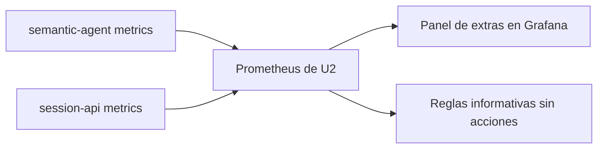

# Diseño de observabilidad — U8 assistant-extras

**Insumos.** `nfr-requirements/performance-requirements.md` (performance-requirements),
`security-requirements.md` (security-requirements), `scalability-requirements.md`
(scalability-requirements), `reliability-requirements.md` (reliability-requirements),
`observability-requirements.md` (observability-requirements) y `tech-stack-decisions.md`
(tech-stack-decisions) de esta unidad; §8 de `functional-design/functional-spec.md` (functional-spec);
C3, C15 y C16 de `inception/contract-design/contract-summary.md` (contract-summary); respuestas P1 = A y
P2 = A de `nfr-design-questions.md`; formateador de logs de U3 y diseño de observabilidad de U4.

## 1. Logs (NFR15.2–NFR15.4)

- El formateador JSON con lista blanca de `libs/` (U3), ampliado con `claim_index`, `sustained`,
  `question_id`, `status`, `reason`, `outcome` y `matched` (precisión en `security-design.md` §9).
  Nunca el texto de la pregunta, de las afirmaciones, de los pasajes, de la CoT de la segunda lectura ni
  la palabra afectiva encontrada.
- **Correlación.** `turn_id` + `attempt` + `message_id` (U4) en `semantic-agent`; `question_id` +
  `turn_id` en `session-api`. Sin trazas distribuidas.

| Evento | Servicio | Nivel | Campos además de los de U4 |
|---|---|---|---|
| `turn.permutation` | `semantic-agent` | `INFO` | Una línea por afirmación releída con `claim_index` y `sustained`; una línea de resumen con `count` (candidatas) |
| `judge.retry` (P1 = A, segunda lectura) | `semantic-agent` | `WARNING` | El evento de U4 con su número de intento y `reason = second_read` |
| `turn.question` publicada | `semantic-agent` | `INFO` | `outcome = published` |
| `turn.question` omitida por `undocumented` | `semantic-agent` | `INFO` | `outcome = omitted`, `reason` |
| `turn.question` omitida por `invalid_schema`, `forbidden_vocabulary`, `timeout`, `unavailable` o `too_long` | `semantic-agent` | `WARNING` | `outcome = omitted`, `reason` |
| `turn.affective` | `semantic-agent` | `INFO` | `matched` (booleano) |
| `question.decided` | API de `session-api` | `INFO` | `question_id`, `turn_id`, `status`, `user_id` |

La omisión por falta de plazo (P2 = A) usa `reason = timeout`, igual que el vencimiento de los 60 s:
para el analista el efecto es el mismo y el enum de NFR15.4 no cambia. Prueba de nivel 1 que sigue un
turno con los tres extras por sus logs y otra que comprueba el nivel de cada motivo.

## 2. Métricas (NFR15.1)

Todas en `/metrics` del puerto interno, con `prometheus-client`; las etiquetas solo llevan enums.

| Métrica | Dónde se mide en el código |
|---|---|
| `veridicus_extras_enabled{extra}` | `session-api` la fija al arrancar desde la configuración validada |
| `veridicus_extra_judge_duration_seconds{call, result}` | Alrededor de cada llamada de U8 al juez; en la segunda lectura, una observación por intento (reintentos con `result = unavailable`) |
| `veridicus_permutation_claims_total{sustained}` | Tras la regla de permutación, una por afirmación releída |
| `veridicus_suggested_questions_total{outcome, reason}` | En la política de la pregunta, una por turno con `suggest_question` activo |
| `veridicus_affective_notes_total` | Cuando el paquete lleva el indicio |
| `veridicus_question_decisions_total{status}` | Tras el `COMMIT` de la decisión |

`veridicus_turn_latency_seconds` (U4) no distingue extras; el p95 con extras se calcula en el reporte
de nivel 2 agrupando por las opciones de cada sesión. Una prueba de nivel 0 recorre `/metrics` y falla
ante una etiqueta fuera de su enum.

## 3. SLI y objetivos

| SLI | Cálculo | Objetivo |
|---|---|---|
| Latencia con extras | p95 de `evaluated_at − submitted_at`, corrida de nivel 2 con extras | ≤ 150 s |
| Tasa en línea de la permutación | `sustained="true"` / total de `veridicus_permutation_claims_total` | > 65 % para activar |
| Preguntas en el Hecho No Documentado | Preguntas publicadas en ese caso del Golden Dataset | 0 |
| Omisiones por vocabulario | `veridicus_suggested_questions_total{reason="forbidden_vocabulary"}` | Se reporta y cada caso se revisa |

## 4. Panel y reglas informativas

<!-- Texto alternativo: semantic-agent y session-api exponen sus métricas, Prometheus de U2 las recoge y alimenta el panel de extras en Grafana y las reglas informativas, que no ejecutan ninguna acción. -->

- **Panel (SHOULD, U2).** Junto al de U4: extras activos; duración de la segunda lectura y de la
  pregunta por resultado; tasa de sostenidas; preguntas publicadas y omitidas por motivo; decisiones
  por estado.
- **Reglas informativas** (no despiertan a nadie ni cambian nada, FR9.1):
  `max(veridicus_extras_enabled) == 1 and veridicus_turn_queue_depth > 20` durante 10 minutos;
  `increase(veridicus_suggested_questions_total{reason=~"invalid_schema|forbidden_vocabulary"}[15m]) > 3`.
  Se validan con `promtool test rules` en nivel 0.
