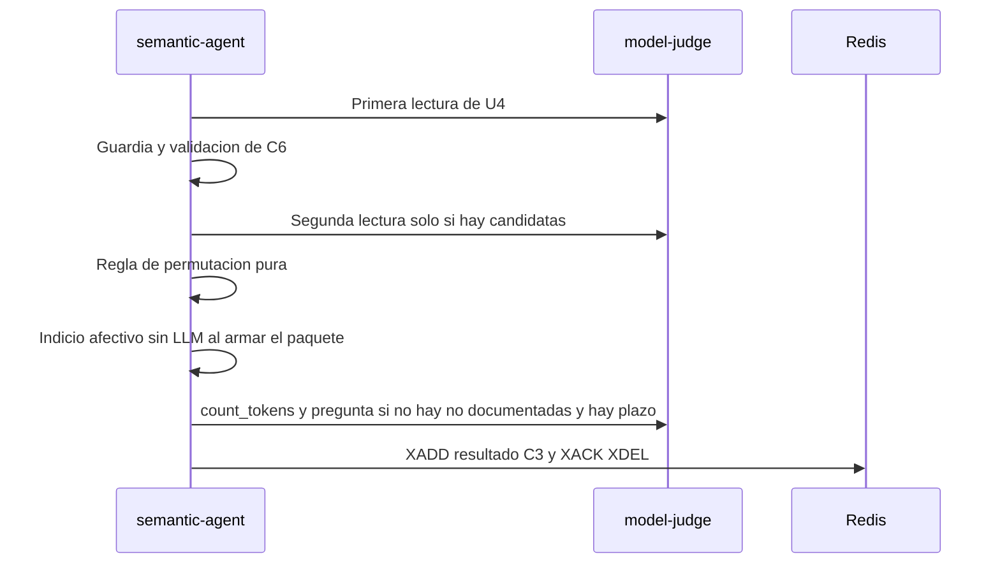

# Diseño de rendimiento — U8 assistant-extras

**Insumos.** `nfr-requirements/performance-requirements.md` (performance-requirements),
`security-requirements.md` (security-requirements), `scalability-requirements.md`
(scalability-requirements), `reliability-requirements.md` (reliability-requirements),
`observability-requirements.md` (observability-requirements) y `tech-stack-decisions.md`
(tech-stack-decisions, D1–D10) de esta unidad; flujos F1–F3 y §8 de
`functional-design/functional-spec.md` (functional-spec); C1–C3, C6, C8, C13 y C14 de
`inception/contract-design/contract-summary.md` (contract-summary); respuestas P1 = A y P2 = A de
`nfr-design-questions.md`; diseño de U4 (camino crítico, cursor `change_seq`, reintento acotado del
juez) y catálogo de límites de U1.

Todas las metas se diseñan para el **perfil CPU** (NFR2.2) con el juez de U4 en una sola ranura. Con
los extras apagados —la configuración por defecto— U8 no ejecuta nada y rige el diseño de U4 tal cual.

## 1. Camino de un turno con los extras (NFR3.1, NFR3.3)

<!-- Texto alternativo: semantic-agent hace la primera lectura de U4 y la valida; si hay afirmaciones incongruentes sobre el umbral hace una sola segunda lectura y aplica la regla de permutación; al armar el paquete busca el indicio afectivo sin llamar al LLM; al final, si ninguna afirmación es no documentada y queda plazo, cuenta los tokens y pide la pregunta; por último publica C3 y confirma el mensaje. -->

| Tramo | Presupuesto de diseño | Técnica | Cuándo se ejecuta |
|---|---|---|---|
| Flujo de U4 | ≤ 60 s | El de U4, sin cambios | Siempre |
| Segunda lectura | ≤ 50 s | Mismo mensaje `system` que la primera, así que `cache_prompt: true` reutiliza el prefijo ya procesado; bloque de datos con solo las candidatas; `max_tokens = min(4 096, 200 × candidatas)` | `permutation` y al menos una candidata (BR1.1) |
| Regla de permutación | < 10 ms | Función pura en `domain/permutation.py` | Con segunda lectura |
| Indicio afectivo | ≤ 10 ms (NFR3.11) | Una expresión regular compilada al arrancar con la alternancia de la lista normalizada | `affective` y hay paquete |
| Comprobación de plazo de la pregunta (P2 = A) | < 1 ms | `ahora + 5 s + 60 s + 15 s < deadline_at` | `suggest_question` y sin «no documentadas» |
| `count_tokens` de la pregunta | ≤ 5 s | `/tokenize` del juez; límite 6 000 (NFR3.5) | Si pasa la comprobación de plazo |
| Pregunta | ≤ 30 s | Instrucciones ≤ 600 *tokens*; `max_tokens = 160`; *timeout* 60 s | Si cabe |

Llamadas al juez por turno: 1 + (1 si hay candidatas) + (1 si hay pregunta), máximo 3 (NFR3.3). Con los
extras apagados, el evaluador no entra en ninguno de los pasos de U8 (NFR3.2): las ramas se deciden con
`options` de C2 antes de construir nada.

**Caché de la ranura.** La pregunta es la última llamada y tiene otro mensaje `system`, así que deja en
la ranura su propio prefijo: el turno siguiente vuelve a procesar las instrucciones del juez (≈ 1 000
*tokens*). El coste entra en el p95 de 150 s y se mide: el reporte de nivel 2 registra `prompt_n` y
`prompt_ms` de las tres llamadas (campos `timings` de `llama-server`). Si la medición no cumple NFR3.1,
es un hallazgo que se corrige por PR (por ejemplo guardar y restaurar la ranura), nunca subiendo la meta.

## 2. Tamaño de los *prompts* (NFR3.4, NFR3.5)

- **Segunda lectura.** El constructor de *prompt* de U4 recibe la lista de candidatas y el parámetro de
  orden (`order="reversed"`): pasajes por similitud ascendente y la afirmación antes de sus pasajes. Es
  un subconjunto de los datos de la primera lectura, así que no se llama a `count_tokens`; una prueba de
  propiedad de nivel 0 (Hypothesis) comprueba que su bloque nunca tiene más elementos ni más caracteres
  que el de la primera.
- **Pregunta.** Bloque `{"turn": …, "passages": [...]}` con cada pasaje recuperado una sola vez; se
  cuenta con `count_tokens` y, si supera 6 000, no se llama al juez y se omite con `too_long`. La
  longitud de las instrucciones (≤ 600 *tokens*) la comprueba una prueba de nivel 0 sobre
  `prompts/suggest-question.v1.md` con el *tokenizer* falso de U4 calibrado por caracteres y, en la
  corrida de nivel 2, con el real.

## 3. Plazo y reclamo con los extras (NFR3.6, NFR3.7)

La validación al arrancar de `session-api` calcula el peor caso de un turno con los extras activos,
incluido el reintento acotado de la segunda lectura (P1 = A) y el `count_tokens` de la pregunta:

| Término | Valor |
|---|---|
| *Embeddings* | 30 s |
| Primera lectura | 180 s + presupuesto de reintento |
| Segunda lectura (si `permutation`) | 180 s + presupuesto de reintento |
| Pregunta (si `suggest_question`) | 5 s + 60 s, sin reintento |
| Presupuesto de reintento por llamada | 2 conexiones fallidas × 2 s + (2 s + 6 s) × 1,2 = 13,6 s |
| **Suma con los tres extras** | **482,2 s** |

Regla: `reclamo > suma` y `plazo base > reclamo`. Los *values* que activan extras fijan **plazo base
600 s** y **reclamo 510 s** (no 480 s: la suma con reintentos ya lo supera; precisión en §7). Pruebas de
nivel 0 de la validación: 480 s de reclamo se rechaza con los tres extras, 510 s se acepta; 450 s de
plazo base se rechaza; 300 s y 240 s se aceptan con todo apagado.

## 4. Base de datos y consola (NFR3.8, NFR3.9, NFR3.10)

| Operación | Diseño | Meta |
|---|---|---|
| `POST /questions/{id}/decision` | Una transacción: `SELECT … FOR UPDATE` de la sesión (para su `change_seq`, mismo orden de bloqueo que U4), `UPDATE suggested_question … WHERE id = :id AND status = 'proposed'`, `INSERT question_decision`; índice por clave primaria | p95 ≤ 300 ms con 100 decisiones (NFR3.8) |
| Sondeo de la sesión | `suggested_question` lleva `change_seq` con índice `(session_id, change_seq)` como turnos, sugerencias y paquetes; la consulta de U4 añade una rama `UNION ALL` acotada por el cursor | p95 ≤ 200 ms con 15 preguntas (NFR3.9) |
| Ingesta de C3 | La pregunta se inserta en la misma transacción de ingesta de U4, con el mismo `change_seq` del turno | Sin transacción extra |
| Tarjeta en M4 | Llega con el sondeo de 2 s de U4; tras «Aprobar» o «Descartar», TanStack Query actualiza la caché con la respuesta 200 (`setQueryData`) sin esperar al sondeo | ≤ 3 s desde `evaluated_at` (NFR3.10) |

Las pruebas `perf` de nivel 1 usan PostgreSQL real con los volúmenes de NFR3.8 y NFR3.9; NFR3.10 la
cubren Playwright (nivel 3, juez *fake*, extras activos) y Vitest.

## 5. Prueba de humo (NFR3.12)

`scripts/smoke.sh` no cambia para U8: corre con la configuración por defecto y *N* = 120 s, y
`frontend/e2e/smoke.spec.ts` comprueba primero que la sesión creada trae las tres opciones en `false`.
Si un PR de despliegue activa algún extra, el mismo PR fija `SMOKE_TIMEOUT_SECONDS=300` en el *job* de
humo de ese despliegue y el caso de Hecho No Documentado comprueba además 0 preguntas sugeridas.

## 6. Recursos

Los extras no añaden procesos ni modelos. La lista afectiva (unos KB) y la expresión regular compilada
viven en memoria de `semantic-agent`; la segunda lectura y la pregunta usan la misma ventana de 12 288
*tokens* del mismo servidor. Los picos se miden en la corrida de nivel 2 con extras
(`scalability-design.md` §2).

## 7. Precisiones a artefactos ya aprobados

No edité ningún artefacto aprobado; decides en la aprobación si se actualizan.

| Artefacto | Qué precisa | Origen |
|---|---|---|
| `assistant-extras/nfr-requirements/performance-requirements.md` (NFR3.6, NFR3.7) | La suma del peor caso cuenta el presupuesto de reintento de la primera y la segunda lectura (13,6 s cada una) y el `count_tokens` de la pregunta (5 s): 482,2 s con los tres extras; el reclamo de los *values* con extras pasa de 480 s a **510 s** (sigue por debajo del plazo base de 600 s) | P1 = A |
| `assistant-extras/nfr-requirements/tech-stack-decisions.md` (§2) | `VERIDICUS_QUEUE_RECLAIM_IDLE_SECONDS` = 510 en los *values* que activan extras | P1 = A |
| `assistant-extras/nfr-requirements/reliability-requirements.md` (§4) | Tras un reinicio entre lecturas, el mensaje vuelve a los 510 s, no a los 480 s | P1 = A |
| `text-flow/functional-design/entities.md` y diseño de U4 (sondeo) | `suggested_question` lleva `change_seq` y entra en la consulta incremental del sondeo; la decisión incrementa el `change_seq` de la sesión | NFR3.9, P2 = A de U4 |
