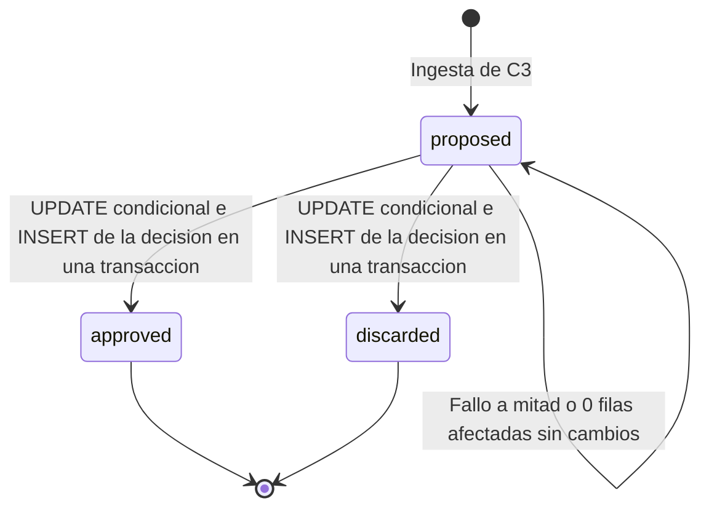

# Diseño de fiabilidad — U8 assistant-extras

**Insumos.** `nfr-requirements/performance-requirements.md` (performance-requirements),
`security-requirements.md` (security-requirements), `scalability-requirements.md`
(scalability-requirements), `reliability-requirements.md` (reliability-requirements),
`observability-requirements.md` (observability-requirements) y `tech-stack-decisions.md`
(tech-stack-decisions) de esta unidad; flujos F1–F3, §3 y §8 de `functional-design/functional-spec.md`
(functional-spec); C1–C3, C6, C13, C14 y C16 de `inception/contract-design/contract-summary.md`
(contract-summary); respuestas P1 = A y P2 = A de `nfr-design-questions.md`; diseño de fiabilidad de
U4 (reintento acotado, plazos, entrega al menos una vez).

El objetivo de fiabilidad de U8 es **no romper el flujo de U4**: con los extras apagados no ejecuta
nada, y con ellos activos un fallo de la pregunta o del indicio nunca convierte el turno en error.

## 1. *Timeouts* (NFR10.11)

| Llamada | *Timeout* | Ajuste |
|---|---|---|
| Segunda lectura | 180 s, el del juez de U4 | `VERIDICUS_JUDGE_TIMEOUT_SECONDS` |
| Pregunta | 60 s | `VERIDICUS_QUESTION_TIMEOUT_SECONDS` (10 ≤ valor ≤ *timeout* del juez) |
| `count_tokens` de la pregunta | 5 s | Fijo (U4) |
| Conexión HTTP al juez | 2 s | `httpx.Timeout(connect=2)` de U4 |
| PostgreSQL y Redis | 2 s y 0,5 s | Los de U4 |

Todos se leen de la configuración validada al arrancar; una prueba de nivel 0 comprueba que cada
llamada de U8 pasa un `timeout_s` explícito al `ModelGateway`.

## 2. Fallos del juez por llamada (P1 = A, NFR10.12, NFR10.13)

El reintento acotado de U4 se activa **por llamada**, no en todo el `ModelGateway`: la primera y la
segunda lectura lo usan; la pregunta no.

| Falla | Segunda lectura | Pregunta |
|---|---|---|
| Conexión rechazada, `502`, `503`, `504` | `call_judge_with_retry` de U4: hasta 2 reintentos (2 s y 6 s, ±20 %) si `ahora + espera + 180 s < deadline_at`; si sigue fallando, no se confirma el mensaje y el turno entero vuelve por `XAUTOCLAIM` a los 510 s (sin efectos dobles: no se publicó nada) | Se omite con motivo `unavailable`; el turno se publica |
| *Timeout* | `turn.error.timeout`, sin reintento | Se omite con motivo `timeout` |
| Salida inválida (C6, pasajes no recuperados, vocabulario C8) | `turn.error.invalid_output` y 0 alertas | Se omite con `invalid_schema` o `forbidden_vocabulary` |
| Bloque de más de 6 000 *tokens* | No aplica (subconjunto de la primera) | Se omite con `too_long`, sin llamar |
| Otro `4xx` | `turn.error.system` | Se omite con `unavailable` |

```python
def judge_call(gateway, request, *, deadline_at, retry: bool, timeout_s: float):
    if retry:
        return call_judge_with_retry(gateway, request, deadline_at, timeout_s=timeout_s)
    return gateway.complete(request, timeout_s=timeout_s)

second = judge_call(gw, reversed_req, deadline_at=d, retry=True, timeout_s=JUDGE_TIMEOUT)
question = judge_call(gw, question_req, deadline_at=d, retry=False, timeout_s=QUESTION_TIMEOUT)
```

Pruebas de nivel 0 con el juez *fake*: un caso por fila y columna; en particular, `503` dos veces y
luego éxito en la segunda lectura da alertas sostenidas sin reclamo, y `503` en la pregunta da 0
reintentos y el turno `evaluated`.

## 3. Plazo de la pregunta opcional (P2 = A)

Antes de pedir la pregunta, `QuestionStep` comprueba:

`ahora + 5 s (count_tokens) + 60 s (timeout de la pregunta) + 15 s (un ciclo del barrido de U4) < deadline_at`

Si no se cumple, no llama al juez, omite la pregunta con motivo `timeout` y el turno se publica con sus
alertas y su paquete; así el barrido de plazos nunca vence un turno válido por un extra opcional. La
segunda lectura no lleva esta comprobación: cuando está activa no es opcional, y su caso ya lo cubre el
reintento acotado. Pruebas de nivel 0 con un reloj falso: 81 s restantes llaman, 80 s omiten.

## 4. Configuración al arrancar y salud (NFR10.14)

| Proceso | Valida | Si falla |
|---|---|---|
| `session-api` (API y trabajador) | Las tres banderas obligatorias, solo `true` o `false`; regla de plazo y reclamo de `performance-design.md` §3 | Termina con código distinto de 0 y el log nombra el ajuste |
| `semantic-agent` | SHA-256 del *prompt* de la pregunta; lista afectiva legible, `schema_version` conocida y sin términos de C8; `VERIDICUS_QUESTION_TIMEOUT_SECONDS` y `VERIDICUS_QUESTION_MAX_TOKENS` en rango | Igual |

Mientras arranca o si la validación falla, `/readyz` responde `503` (C16). Los archivos se validan
**siempre**, aunque los extras estén apagados, para que activar uno por PR no descubra un archivo roto
en el clúster. Pruebas de nivel 0 por ajuste y de nivel 1 de `/readyz`.

## 5. Decisión atómica y consola (NFR10.15, NFR10.16)



<!-- Texto alternativo: una pregunta nace propuesta al ingerir C3; pasa a aprobada o descartada solo con una transacción que hace la actualización condicional y la inserción de la decisión; si la transacción falla a mitad o la actualización no afecta filas, sigue propuesta sin cambios; aprobada y descartada son finales. -->

- La transacción de `performance-design.md` §4: si el `UPDATE … WHERE status = 'proposed'` afecta 0
  filas, se revierte y responde `409 question.already_decided` sin insertar. Prueba de nivel 1 con dos
  decisiones simultáneas y otra que corta la conexión antes del `COMMIT` (la pregunta sigue `proposed`
  sin fila de decisión).
- **Consola.** La mutación de TanStack Query no reintenta sola. Ante red o `5xx`, la tarjeta conserva
  «Pregunta sugerida · requiere tu aprobación», muestra el mensaje del catálogo y vuelve a habilitar
  «Aprobar» y «Descartar»; si un nuevo intento recibe `409`, invalida la consulta de la sesión y la
  tarjeta toma el estado del siguiente sondeo. Vitest con un servidor *fake*.

## 6. Calidad de la IA con los extras (NFR4.1–NFR4.5, NFR6.1)

| Requisito | Diseño | Verificación |
|---|---|---|
| NFR4.1 | `permutation.py` recibe solo candidatas sobre el umbral; devuelve `sustained` = ambas «incongruente»; las no sostenidas van al paquete como «no documentada» con el motivo de BR1.3 | Propiedad Hypothesis: alertas con permutación ⊆ alertas sin ella; 100 % de ramas |
| NFR4.2 | El resultado C3 lleva `permutation_applied` y, por afirmación releída, las dos calificaciones | Nivel 1 con `permutation` en `true` y en `false` |
| NFR4.3 | El arnés `--extras all` aplica los umbrales de NFR4 a las dos lecturas y cuenta preguntas en el caso de Hecho No Documentado | Nivel 2 |
| NFR4.4 | El reporte separa la consistencia *offline* de U4 y la tasa en línea `sustained / candidatas` (> 65 % para activar) | Nivel 2 |
| NFR4.5 | Temperatura 0, `VERIDICUS_JUDGE_SEED` y una ranura en las tres llamadas; el arnés corre dos veces y compara `sustained`, turnos con pregunta y con indicio | Nivel 2 |
| NFR6.1 | La alerta sostenida conserva la CoT de la primera lectura; la de la segunda se valida y se descarta en memoria | Nivel 0 |

## 7. Recuperación y objetivos (NFR8.6, NFR8.7)

| Falla | Qué se pierde | Cómo se recupera |
|---|---|---|
| Reinicio de `semantic-agent` entre lecturas | Nada | No se publicó C3; `XAUTOCLAIM` a los 510 s y el turno se evalúa entero |
| Juez caído un momento en la segunda lectura | Nada | Reintento acotado (§2) |
| Juez caído en la pregunta, o sin plazo | La pregunta de ese turno | Turno `evaluated` (§2, §3) |
| Lista o *prompt* inválidos | Nada; no arranca | `/readyz` en `503` hasta el PR que lo corrige |
| PostgreSQL al decidir | La decisión | Pregunta `proposed`; el analista decide de nuevo |

Estos patrones apuntan a 0 fallos atribuibles a U8 en `scripts/smoke.sh` con extras apagados y al
100 % de turnos `evaluated` o `error` con `code` del catálogo y 0 `turn.error.timeout` en la corrida de
nivel 2 con extras.

## 8. Precisiones a artefactos ya aprobados

No edité ningún artefacto aprobado; decides en la aprobación si se actualizan.

| Artefacto | Qué precisa | Origen |
|---|---|---|
| `assistant-extras/nfr-requirements/reliability-requirements.md` (NFR10.12) | Ante conexión rechazada o `502`–`504`, la segunda lectura usa el reintento acotado de U4 antes de dejar el mensaje para el reclamo | P1 = A |
| `assistant-extras/nfr-requirements/reliability-requirements.md` (NFR10.13) | Se mantiene sin reintento; se añade la omisión con `timeout` cuando no queda plazo antes de llamar | P2 = A |
| Diseño de fiabilidad de U4 (`call_judge_with_retry`) | La función acepta `timeout_s` y se invoca por llamada; el `ModelGateway` no reintenta por sí mismo | P1 = A |
