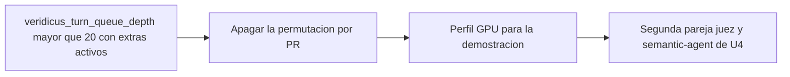

# Diseño de escalado — U8 assistant-extras

**Insumos.** `nfr-requirements/performance-requirements.md` (performance-requirements),
`security-requirements.md` (security-requirements), `scalability-requirements.md`
(scalability-requirements), `reliability-requirements.md` (reliability-requirements),
`observability-requirements.md` (observability-requirements) y `tech-stack-decisions.md`
(tech-stack-decisions) de esta unidad; flujos F1–F3 de `functional-design/functional-spec.md`
(functional-spec); C2, C3 y C14 de `inception/contract-design/contract-summary.md`
(contract-summary); respuestas P1 = A y P2 = A de `nfr-design-questions.md`; diseño de escalado de U4.

## 1. Modelo de capacidad (NFR8.1, NFR8.2)

U8 no añade réplicas ni colas: la capacidad la fija el juez de U4, que atiende un turno a la vez. Con
los tres extras activos cada turno ocupa la ranura hasta tres llamadas en serie.

| Configuración | p95 por turno | Turnos en cola sin vencer (tope 3 600 s) | Cómo se mide |
|---|---|---|---|
| Extras apagados (por defecto) | ≤ 60 s | 60 (U4) | Carga de NFR8 de U4 |
| Tres extras activos | ≤ 150 s | **24** | Corrida de nivel 2 con extras, una sesión a la vez |

- **Carga de NFR8 con extras apagados.** `evaluation/load/run_batches.py` lee `options` de cada sesión
  creada (respuesta de `POST /sessions`) y termina con código distinto de 0 si alguna trae un extra en
  `true`; el reporte lista las opciones. El umbral de ≥ 98 % de U4 se mide así.
- **Límite declarado.** Tres sesiones concurrentes con extras activos no se soportan en el MVP; la
  corrida de nivel 2 con extras usa una sesión a la vez (≤ 15 turnos en cola) y debe terminar con 0
  `turn.error.timeout`.

## 2. Memoria (NFR8.3)

Los extras no suben los topes de U4: `model-judge` ≤ 7 GiB, `semantic-agent` ≤ 512 MiB y trabajador de
`session-api` ≤ 768 MiB. El arnés de nivel 2 con `--extras all` lee el pico de cada contenedor con
`docker stats --no-stream` cada 5 s y lo escribe en el reporte; superar un tope es un hallazgo que se
corrige por PR, no un ajuste del tope.

## 3. Sin estado en memoria (NFR8.4)

- Las opciones viajan en C2 desde la copia de la sesión; el resultado de la permutación viaja en C3;
  la lista afectiva y el *prompt* son de solo lectura y los mismos en cada réplica.
- La decisión se aplica con la actualización condicional en PostgreSQL, así que dos réplicas de la API
  no necesitan coordinarse. Prueba de nivel 1: dos decisiones simultáneas sobre la misma pregunta dan
  exactamente un `200`, un `409 question.already_decided` y una sola fila en `question_decision`.
- Con la segunda pareja juez + `semantic-agent` de U4, cada `semantic-agent` procesa el turno entero
  (las tres llamadas al mismo juez de su pareja), así que la caché de la ranura y la semilla siguen
  siendo las de un solo servidor.

## 4. Datos y crecimiento (NFR8.5)

| Tabla | Crecimiento máximo | Retención |
|---|---|---|
| `suggested_question` | 1 por intento de turno | Todas (auditoría) |
| `question_decision` | 1 por pregunta | Todas (auditoría) |
| Columnas de permutación en la evaluación de la afirmación | 1 juego por afirmación releída | Las de U4 |

Estimado < 5 MB en el MVP; no hay particiones ni purga. Una prueba de nivel 1 comprueba que un segundo
resultado con la misma pregunta del mismo intento no crea otra fila (restricción única `(turn_id,
attempt)` en `suggested_question`).

## 5. Señales para escalar

<!-- Texto alternativo: cuando la profundidad de la cola supera 20 turnos con los extras activos, la primera medida es apagar la permutación por PR; si no alcanza, usar el perfil GPU para la demostración; y como último paso la segunda pareja de juez y semantic-agent de U4. -->

La señal es `veridicus_turn_queue_depth` con `veridicus_extras_enabled` en 1 (regla informativa en
`observability-design.md` §4). Cada medida entra por PR con su medición; el tope de 3 600 s nunca se
sube para que una corrida pase.
