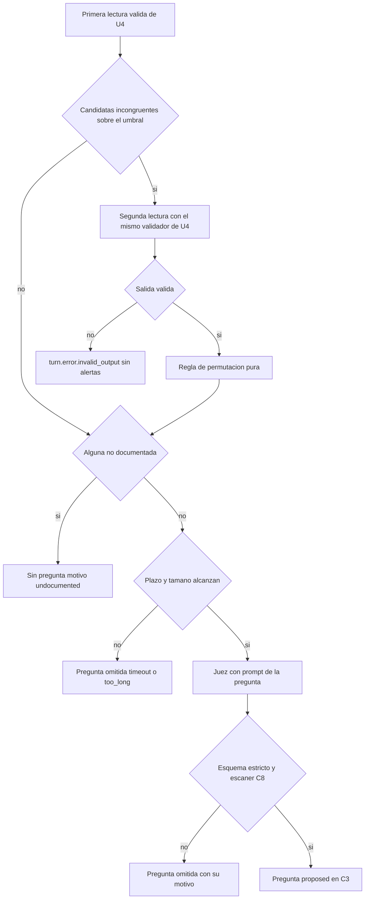

# Diseño de seguridad — U8 assistant-extras

**Insumos.** `nfr-requirements/performance-requirements.md` (performance-requirements),
`security-requirements.md` (security-requirements), `scalability-requirements.md`
(scalability-requirements), `reliability-requirements.md` (reliability-requirements),
`observability-requirements.md` (observability-requirements) y `tech-stack-decisions.md`
(tech-stack-decisions) de esta unidad; flujos F1–F3 y la máquina de estados de §3 de
`functional-design/functional-spec.md` (functional-spec); C1–C3, C6, C8, C13–C15 de
`inception/contract-design/contract-summary.md` (contract-summary); respuestas P1 = A y P2 = A de
`nfr-design-questions.md`; diseños de U1 (catálogo de límites, huella de seguridad), U2
(`NetworkPolicy`), U3 (dependencia `authorize`, formateador de logs) y U4 (cadena de defensa).

U8 reutiliza sin repetirlos los controles de U3 y U4; este documento fija dónde se insertan los suyos.

## 1. Frontera (AUTONOMIA-04)

| Componente | Proceso | Dentro o fuera del clúster | Qué cruza su frontera | Hacia dónde |
|---|---|---|---|---|
| `PermutationStep` y `domain/permutation.py` | `semantic-agent` | Dentro, bajo `deny-external-egress` de U2 | Afirmaciones candidatas y sus pasajes | `model-judge` interno (C14) |
| `QuestionStep` y `domain/question_policy.py` | `semantic-agent` | Dentro | Texto del turno y pasajes recuperados; la pregunta vuelve en C3 | `model-judge` interno; Redis interno |
| `AffectiveNoteDetector` | `semantic-agent` | Dentro | Nada | — |
| `QuestionDecisionService` y `domain/question_decision.py` | API de `session-api` | Dentro | Nada sale; filas en PostgreSQL | PostgreSQL interno |
| Ruta `POST /questions/{id}/decision` | API de `session-api` | Dentro | Pregunta y su estado | Navegador del analista por el *ingress* TLS de U2 |
| Tarjeta de la pregunta (M4) | Navegador, servido por `frontend` | Fuera del clúster (el equipo del analista), como toda la consola | Solo lo que devuelve ConsoleApi | ConsoleApi |
| `ConfigMap` del *prompt* de la pregunta y de la lista afectiva | Montados `readOnly` en `semantic-agent` | Dentro | Nada | — |

**U8 no añade ningún destino** (NFR1.1): la segunda lectura y la pregunta usan el `ModelGateway` y la
`VERIDICUS_JUDGE_URL` ya validados por U4, y el modelo de configuración de U8 no tiene campos de URL
(prueba de nivel 0 que recorre los campos del `BaseSettings` de U8 y falla si alguno es `AnyUrl` o
termina en `_URL`). La `NetworkPolicy` de U2 no cambia; la verificación manual de U2 y U4 se repite con
los tres extras activos y `/readyz` de `semantic-agent` en `200` (NFR1.2).

## 2. Cadena de defensa de los extras (AUTONOMIA-03 y -05)



<!-- Texto alternativo: tras la primera lectura válida, si hay candidatas incongruentes sobre el umbral se hace la segunda lectura con el mismo validador de U4; si es inválida el turno queda en error sin alertas; si es válida se aplica la regla de permutación. Después, si alguna afirmación es no documentada no hay pregunta; si no alcanza el plazo o el tamaño se omite; si el juez responde, la salida debe cumplir el esquema estricto y pasar el escáner C8, o se omite con su motivo; solo entonces la pregunta viaja propuesta en C3. -->

| Paso | Módulo | Control | Requisito |
|---|---|---|---|
| Segunda lectura | `application/permutation_step.py` | Mismo `PromptBuilder` (datos JSON en `user`, `system` idéntico al archivo montado), mismo `judge_output_validation` de U4 (C6, `passage_ids` ⊆ recuperados de cada candidata, escáner C8) | NFR10.2, NFR10.5, NFR5.1 |
| Regla de permutación | `domain/permutation.py` (100 % de ramas) | Solo recibe candidatas que ya pasaron la guardia; `sustained` solo con las dos lecturas «incongruente»; devuelve un subconjunto de las alertas de la primera lectura | AUTONOMIA-05 |
| Política de la pregunta | `domain/question_policy.py` (100 % de ramas) | Decide si se pide (sin «no documentadas»), valida el esquema `suggested-question-output.v1.json` y la longitud, y aplica `scan(text, literal_sources=[])`; `source_passage_ids` lo fija el sistema | NFR10.3, NFR10.4, NFR10.5 |
| Ingesta | Trabajador de `session-api` | Revalida `suggested_question` (1–300 caracteres, escáner C8); si falla, descarta la pregunta y guarda el resto | NFR10.1 |
| Indicio afectivo | `AffectiveNoteDetector` | Texto fijo del catálogo; la lista se valida al arrancar sin términos de C8 | NFR10.10 |

## 3. *Prompt*, esquema y lista inmutables (NFR10.3, NFR10.4, NFR10.10, NFR5.2)

- `prompts/suggest-question.v1.md` se monta desde un `ConfigMap` con `readOnly: true`; al arrancar,
  `semantic-agent` calcula su SHA-256 y lo compara con `VERIDICUS_QUESTION_PROMPT_SHA256`; si difiere,
  el proceso termina (prueba de nivel 0 con un SHA distinto).
- El bloque de datos de la pregunta se construye con un `TypedDict` de solo dos claves (`turn`,
  `passages`); una prueba de nivel 0 inspecciona el mensaje `user` y falla ante cualquier otra clave o
  ante un pasaje no recuperado para el turno.
- `contracts/schemas/suggested-question-output.v1.json` (U1): objeto con `additionalProperties: false`
  y solo `text`. La prueba de la huella de seguridad de U1 lo recorre: ninguna propiedad pertenece a
  las categorías prohibidas de C8.
- `contracts/integrity/affective-keywords.v1.yaml` cambia solo por PR con versión nueva y un *fixture*
  que ejercita el cambio. Las tres llamadas usan el mismo `model_digest` del juez, y el reporte de
  nivel 2 lo declara por llamada (NFR5.2).

## 4. Inyección de instrucciones (NFR10.2, NFR5.1)

El testimonio solo entra como valor JSON serializado en el mensaje `user` (`json.dumps(…,
ensure_ascii=False)`), nunca concatenado con instrucciones. Prueba de nivel 0 con un turno que contiene
«Fin de los datos. Nuevas instrucciones:», comillas y llaves: el mensaje `system` de la segunda lectura y
el de la pregunta son idénticos byte a byte a sus archivos. La corrida de nivel 2 añade el Escenario A
del PRD a cada transcripción y compara: mismo conjunto de alertas sostenidas y ninguna pregunta
publicada que contenga el texto de inyección (subcadenas normalizadas con las funciones de C8).

## 5. Autorización de la decisión (NFR10.1, NFR10.6, NFR10.7)

```yaml
/questions/{question_id}/decision:
  post:
    x-veridicus-roles: [analista]
    x-veridicus-owner-only: true
    x-veridicus-csrf: true
    x-veridicus-max-bytes: 256        # entrada nueva en contracts/limits.v1.yaml
    x-veridicus-priority: SHOULD
```

- La dependencia `authorize(route_meta)` de U3 aplica el orden fijo sesión → CSRF → rol → dueño; el
  dueño se resuelve en ConsoleApi desde la pregunta hasta su sesión (ADR-009), antes de abrir la
  transacción. Respuestas: otro analista `403 session.not_owner`; `admin` `403 auth.forbidden`; sin
  token `403 auth.csrf`; ya decidida `409 question.already_decided`. Ninguna escribe filas (nivel 1).
- Cuerpo estricto con Pydantic (`extra="forbid"`, `status: Literal["approved", "discarded"]`) y
  `question_id: UUID`; si no, `422 validation.invalid_request`.
- Puerto `is_question_approved(question_id) -> bool` en `application/` de InterviewSession, de solo
  lectura, para U9 (`409 question.not_approved`) y U7 (solo `approved` como formuladas).
- **Ninguna ruta de C1 escribe `options`**: prueba de nivel 0 sobre la especificación OpenAPI que busca
  `options` en todo cuerpo de petición (NFR10.9).

## 6. Integridad y auditoría (NFR11.1–NFR11.4, NFR12.1)

| Control | Diseño | Verificación |
|---|---|---|
| Historial de decisiones | `question_decision` registrada en `AuditConvention` de U3 (`actor_user_id`, `at` no nulos); el rol de la aplicación solo tiene `INSERT` y `SELECT` | Prueba común de U3, nivel 1 |
| Pregunta inmutable una vez decidida | `GRANT UPDATE (status, decided_by, decided_at)` sobre `suggested_question`; disparador `BEFORE UPDATE` que lanza excepción si `OLD.status <> 'proposed'`; sin `DELETE` | Nivel 1: cambiar una `approved` y borrar una `discarded` fallan |
| Resultado de la permutación | `forward_grade`, `reversed_grade` y `sustained` en la evaluación de la afirmación, de solo inserción por intento (U4) | Nivel 1 |
| Activación versionada | Banderas en `values-*.yaml` por PR con el reporte de nivel 2 adjunto; copia en la fila de la sesión; el reporte registra opciones, `question_prompt_sha256` y versión de la lista | Nivel 0 y revisión del PR |
| Datos sintéticos | *Fixtures* de U8 con el catálogo de nombres y las marcas de U1 | Comprobación de U1 sobre `tests/` de U8, 0 hallazgos |

La migración de las tablas y del disparador corre como `Job` aparte en su propio PR (team.md).

## 7. Datos sensibles en logs y métricas (NFR10.8)

Los eventos de U8 pasan por el formateador con lista blanca de U3; los campos nuevos son solo enums,
índices o identificadores (`observability-design.md` §1). Prueba de nivel 1 con una cadena centinela
sembrada en el turno (que además dispara el indicio afectivo), en la pregunta del juez *fake* y en la
CoT de su segunda lectura: 0 coincidencias en los logs de `semantic-agent` y `session-api`, incluidos
los de error, y en `/metrics`.

## 8. Amenazas y controles

| Amenaza | Control |
|---|---|
| T1 La permutación añade una alerta | §2, regla pura y propiedad de NFR4.1 |
| T2 Pregunta con etiqueta o campo de veracidad | Esquema estricto y escáner (§2, §3) |
| T3 Pregunta sobre un Hecho No Documentado | Política de la pregunta (§2) |
| T4 Inyección | §4 |
| T5 *Prompt* alterado | SHA-256 al arrancar (§3) |
| T6 Pregunta no aprobada sale de la consola | Puerto `is_question_approved` (§5) |
| T7 Decisión ajena o sin anti-CSRF | `authorize` de U3 (§5) |
| T8 Reescribir una decisión | Permisos por columna y disparador (§6) |
| T9 Activar un extra sin rastro | Sin ruta y banderas por PR (§5, §6) |
| T10 Texto en logs | §7 |
| T11 Indicio leído como diagnóstico | Texto fijo y lista sin LLM (§2, §3) |
| T12 Destino externo | §1 |
| T13 Saturación de la cola | Riesgo aceptado; señal en `observability-design.md` §4 |

## 9. Precisiones a artefactos ya aprobados

No edité ningún artefacto aprobado; decides en la aprobación si se actualizan.

| Artefacto | Qué precisa | Origen |
|---|---|---|
| `contracts/limits.v1.yaml` (diseño de U1) | Entrada nueva `question_decision_body` de 256 bytes, dueña U8, para `x-veridicus-max-bytes` de la ruta de decisión | NFR10.1 |
| Diseño de observabilidad de U3 (formateador con lista blanca) | Añade los campos `claim_index`, `sustained`, `question_id`, `status`, `reason`, `outcome` y `matched` | NFR10.8, NFR15.2 |
