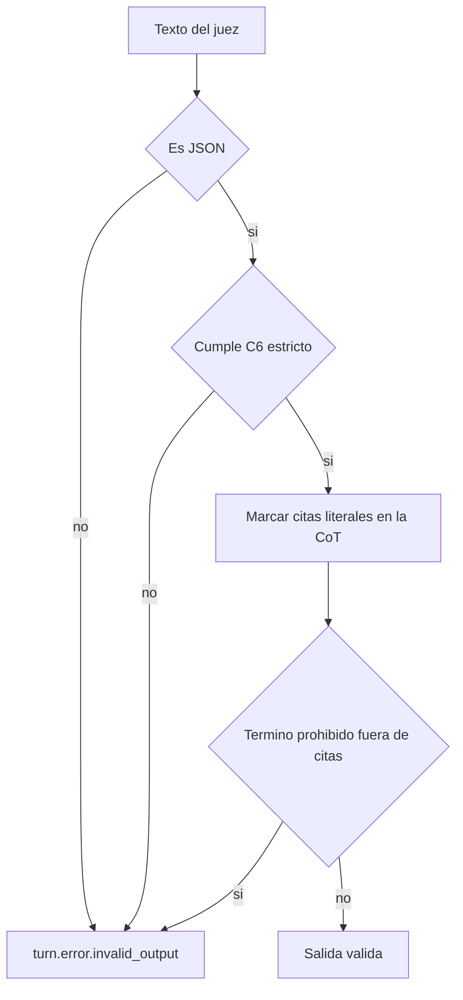
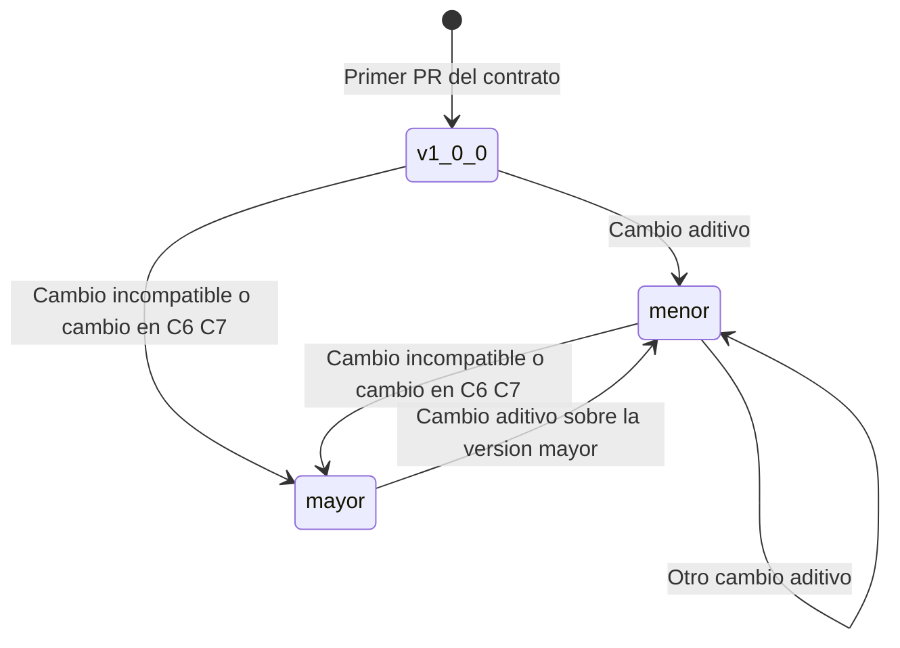
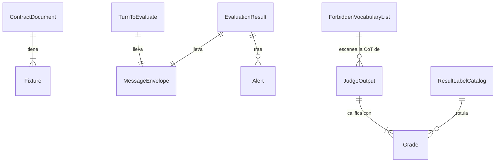

# Especificación funcional — U1 contracts

**Insumos.** Unidad U1 de `inception/units-generation/unit-of-work.md` (unit-of-work) y su mapa de
historias `unit-of-work-story-map.md` (unit-of-work-story-map); contratos C1–C16 de
`inception/contract-design/contract-summary.md` (contract-summary); requisitos de
`inception/requirements-analysis/requirements.md` (requirements); componente IntegrityPolicy de
`inception/domain-design/components.md` (components); respuestas P1–P4 de
`functional-design-questions.md`. Las entidades están en `entities.md` y las reglas en `rules.md`
(fuentes de verdad); este documento es la fuente de verdad de los **flujos**.

## 1. Qué hace la unidad

U1 entrega los contratos versionados de `contracts/` y la **suite de validación de nivel 0** que los
ejercita con *fixtures* positivos y negativos. No tiene comportamiento en ejecución: los servicios
(U3–U10) importan los contratos y los validan en sus fronteras. Cada contrato decide sus cambios en la
unidad dueña (columna Owner de contract-summary); U1 los guarda, los versiona y prueba sus *fixtures*.

**Frontera AUTONOMIA-04.** U1 no corre en el clúster ni fuera de él: son archivos del repositorio y una
suite que corre en CI con datos sintéticos (BR1.6). No transporta datos.

### Inventario que entrega U1

| Archivo en `contracts/` | Contrato | Tipo | Reglas |
|---|---|---|---|
| `api/console.v1.yaml` | C1 | OpenAPI | BR7.1–BR7.3, BR8.1 |
| `errors/error-codes.v1.yaml` | Catálogo de `code` | Catálogo | BR3.4, BR7.2 |
| `queues/turns.v1.yaml` | C2 | AsyncAPI | BR1.2, BR2.1, BR2.2, BR8.1 |
| `queues/results.v1.yaml` | C3 | AsyncAPI | BR2.3–BR2.5 |
| `queues/indexing.v1.yaml` | C4 | AsyncAPI | BR1.1, BR1.2 |
| `queues/speech.v1.yaml` | C5 (SHOULD) | AsyncAPI | BR1.1, BR1.2 |
| `schemas/judge-output.v1.json` | C6 | JSON Schema estricto | BR3.1–BR3.3, BR5.4 |
| `schemas/alert.v1.json` | C7 | JSON Schema estricto | BR4.1, BR4.2 |
| `integrity/forbidden-vocabulary.v1.yaml` | C8 | Lista | BR5.1–BR5.5 |
| `ui/result-labels.v1.yaml` | Catálogo de rótulos (nuevo, P3) | Catálogo | BR6.1–BR6.3 |
| `db/truthframe-read.v1.yaml` | C9 | Vista de solo lectura | BR1.1 |
| `python/human_review.py`, `forensic_ports.py`, `identity.py` | C10–C12 | `Protocol` | Verificación de tipos |
| `metrics/review.v1.yaml` | C15 | Métricas | BR8.2 |
| `health/health.v1.yaml` | C16 | OpenAPI | BR1.1 |
| `format/datetime.v1.yaml` | Formato de fecha (P4) | Formato | BR8.1 |
| `fixtures/<contrato>/{valid,invalid}/…` | *Fixtures* | Datos sintéticos | BR1.6 |

C13 vive en `libs/model_gateway/` y C14 es el subconjunto externo de la API compatible con OpenAI;
U1 solo guarda la copia versionada del subconjunto usado (U4 lo fija).

## 2. Flujos

### F1 — Validar un contrato y sus *fixtures* (suite de nivel 0, cada PR)

1. La suite carga cada `ContractDocument` y comprueba que tiene versión semántica (BR1.1).
2. Para cada `Fixture` con `expectation: accept`, valida el *payload* contra su contrato y exige que
   pase.
3. Para cada `Fixture` con `expectation: reject`, exige que falle **por la regla que nombra
   `reject_reason`** (un *fixture* que falla por otra causa no cuenta como control negativo).
4. Corre las reglas transversales: ningún campo de veracidad en ningún esquema (BR3.3), enum de tres
   calificaciones en C1, C3 y C6 (BR3.2), catálogo de `code` coherente (BR3.4, BR7.2), ninguna ruta
   que escriba el umbral (BR7.1), cuerpos de C1 estrictos (BR7.3), fechas en la forma única (BR8.1),
   métricas con prefijo y etiquetas seguras (BR8.2), rótulos exactos (BR6.1–BR6.3).
5. Comprueba que ningún *fixture* contiene datos reales (BR1.6).
6. Termina en verde solo si todos los pasos pasan; la salida del comando es la evidencia del PR.

### F2 — Validar un mensaje de cola (lo ejecutan productor y consumidor con el contrato de U1)

1. Leer `schema_version`. Si el mayor no es conocido → rechazar a `<cola>:failed` (BR1.2).
2. Validar contra el esquema del mensaje; los campos desconocidos se ignoran (BR1.3).
3. Si falta un campo obligatorio, un tipo no coincide, el texto está vacío o el umbral está fuera de
   [0, 1] → rechazar sin crear filas (BR2.1, BR2.2).
4. En C3, comprobar además los invariantes del resultado (BR2.3–BR2.5); si uno falla, el resultado
   entero se trata como `turn.error.invalid_output`.
5. Aceptar.

### F3 — Validar la salida del juez (contrato C6 + escaneo C8)

1. Si el texto no es JSON → inválida (`turn.error.invalid_output`).
2. Validar contra C6 estricto: sin campos adicionales, `claims` no vacío, enum de tres valores
   (BR3.1, BR3.2).
3. Para cada `cot`: localizar los tramos entre «…»; marcar como excluido solo el tramo cuyo contenido
   aparece literal en el fragmento del turno o en un pasaje recuperado para esa afirmación (BR5.3).
4. Normalizar el resto (sin mayúsculas, sin tildes) y buscar cada término de C8 como palabra completa
   (BR5.2). Una coincidencia → inválida (BR5.4).
5. Si todo pasa, la salida es válida y sigue al armado de alertas (C7, U4).

<!-- Texto alternativo: el texto del juez se rechaza como turn.error.invalid_output si no es JSON, si no cumple C6 estricto o si la CoT tiene un término prohibido fuera de las citas literales; si pasa todo, la salida es válida. -->

### F4 — Validar una alerta (C7; en tres puntos: producir, ingerir, guardar)

1. Validar contra C7 estricto (BR4.2).
2. Si falta o está vacío `fragment`, `quote`, `document_id` o `cot` → rechazar (BR4.1).
3. Los campos `fragment` y `quote` no se escanean; `cot` ya pasó F3 (BR5.5).

### F5 — Cambiar un contrato (flujo de PR)

1. La unidad dueña propone el cambio en un PR que solo toca ese contrato (BR1.5).
2. Clasificar el cambio: aditivo → sube el menor (BR1.3); incompatible, o cualquier cambio en C6 o C7
   → sube el mayor y cambia el `$id`, con productor y consumidores en el mismo PR (BR1.4).
3. Añadir al menos un *fixture* que ejercite el cambio; en C8, cada término nuevo con su control
   negativo (BR5.1).
4. La suite F1 corre en CI; los *fixtures* anteriores siguen aceptándose en un cambio menor.
5. El autor revisa y fusiona con *squash-merge* (team-practices).

### F6 — Resolver un rótulo visible (consola, con el catálogo de U1)

1. La consola recibe una calificación o un tipo de resultado.
2. Busca su fila en `result-labels.v1.yaml`: `incongruente` → «Incongruencia semántica» dentro de la
   tarjeta «Sugerencia de revisión»; `no documentada` → «Hecho No Documentado»; `congruente` → sin
   rótulo de resultado (BR6.2).
3. Un tipo sin fila no se muestra con texto propio: la consola no inventa rótulos (BR6.1).

## 3. Máquinas de estado

U1 no tiene entidades con ciclo de vida en ejecución. El único ciclo es el de la **versión de un
contrato**, que gobierna F5:

<!-- Texto alternativo: un contrato nace en 1.0.0; un cambio aditivo sube la versión menor y puede repetirse; un cambio incompatible, o cualquier cambio en C6 o C7, sube la versión mayor; sobre una versión mayor nueva vuelven a caber cambios aditivos. -->

## 4. Vista derivada: entidades y relaciones

Derivada de `entities.md` (la fuente de verdad es su bloque YAML).

<!-- Texto alternativo: cada contrato tiene uno o más fixtures; los mensajes de turno y de resultado llevan el sobre común; un resultado trae cero o más alertas; la salida del juez califica con el enum Grade; el catálogo de rótulos rotula calificaciones; la lista de vocabulario prohibido escanea la CoT de la salida del juez. -->

## 5. Vista derivada: reglas

Derivada de `rules.md` (la fuente de verdad es su bloque YAML).

| Grupo | Reglas | Flujo donde se aplican |
|---|---|---|
| Versión y cambio | BR1.1–BR1.6 | F1, F2, F5 |
| Mensajes de cola | BR2.1–BR2.5 | F2 |
| Salida del juez | BR3.1–BR3.4 | F1, F3 |
| Alerta | BR4.1–BR4.2 | F4 |
| Vocabulario prohibido | BR5.1–BR5.5 | F3, F4, F5 |
| Rótulos | BR6.1–BR6.3 | F1, F6 |
| API de la consola | BR7.1–BR7.3 | F1 |
| Fecha y métricas | BR8.1–BR8.2 | F1, F2 |

## 6. Escenarios de negocio y casos límite

| # | Escenario | Resultado esperado | Regla |
|---|---|---|---|
| E1 | Mensaje de turno sin `text` | Rechazado a `veridicus:turns:failed`, sin filas | BR2.1 |
| E2 | Mensaje con `schema_version: 2.0.0` y consumidor en 1.x | Rechazado sin procesar | BR1.2 |
| E3 | Mensaje 1.1.0 con un campo nuevo opcional | Aceptado; el campo se ignora | BR1.3 |
| E4 | Umbral 1.2 en el mensaje | Rechazado | BR2.2 |
| E5 | Resultado `error` con una alerta | Inválido (`turn.error.invalid_output`) | BR2.3 |
| E6 | Alerta sobre afirmación `congruente` | Inválido | BR2.4 |
| E7 | Salida del juez con `is_truthful` | Inválida | BR3.1, BR3.3 |
| E8 | Calificación «falsa» en el enum | Inválida | BR3.2 |
| E9 | Alerta sin `quote` (y una por cada uno de los 4 campos) | Rechazada | BR4.1 |
| E10 | CoT: «el compareciente miente» | Inválida | BR5.4 |
| E11 | CoT con «falso» dentro de «…» que es literal del pasaje | Válida | BR5.3 |
| E12 | CoT con «miente» dentro de «…» que no aparece en el turno ni en los pasajes | Inválida | BR5.3, BR5.4 |
| E13 | CoT con «MIENTE» o «mintio» (sin tilde) | Inválida | BR5.2 |
| E14 | CoT con «falsete» o «mienten» | Válida: palabra completa y lista 1.0.0 de 9 términos | BR5.1, BR5.2 |
| E15 | Copia del OpenAPI con `PATCH /config/threshold` | Suite en rojo | BR7.1 |
| E16 | Fecha `2026-10-02T21:40:00.123Z` o `2026-10-02T16:40:00-05:00` | Rechazada | BR8.1 |
| E17 | Catálogo de rótulos con un cuarto rótulo | Suite en rojo | BR6.1 |

E14 deja visible una limitación aceptada en P2: con la lista 1.0.0, las flexiones no listadas
(«mienten», «falsedad») no se detectan; ampliarlas es un PR de C8 con su control negativo (BR5.1).

## 7. Integración con otras unidades

| Consumidor | Qué usa de U1 | Cómo lo verifica |
|---|---|---|
| U3 identity-access | C1 (`/auth/*`, `/users*`), C12, catálogo de `code` | Pruebas de contrato del productor |
| U4 text-flow | C1, C2, C3, C4, C6, C7, C8, C9, rótulos, fecha | Valida en sus fronteras con los mismos esquemas; implementa el escáner de IntegrityPolicy con C8 |
| U5 human-review | C1 (`/suggestions/*/decisions`), C7, C10, C15 | Pruebas de contrato |
| U6, U7 | C1, C11, C8 (reporte), fecha | Pruebas de contrato; U7 escanea el reporte con C8 |
| U2 platform | C15, C16 | Regla de Prometheus y `scripts/smoke.sh` |
| U8, U9, U10 | C2, C3, C5, C13, C14 | Pruebas de contrato cuando se construyan |

## 8. Errores y bordes

- Un *fixture* negativo que falla por una causa distinta de su `reject_reason` hace fallar la suite:
  así un control negativo no queda «verde por accidente».
- La comparación «literal» de BR5.3 es exacta, carácter a carácter: una cita con una palabra cambiada
  ya no es literal y se escanea.
- La suite no necesita red, base de datos ni GPU: corre en CPU en CI (team-practices, nivel 0).

## 9. Precisiones a artefactos ya aprobados

Estas decisiones de la etapa precisan `contract-summary.md`, ya aprobado. No lo edité; decides en la
aprobación si se actualiza.

| Artefacto | Qué precisa | Origen |
|---|---|---|
| `contract-design/contract-summary.md` (C8) | Añade `quote_delimiters: [«, »]` y la regla de cita literal | P1 = A |
| `contract-design/contract-summary.md` (tabla de contratos) | Añade el catálogo de rótulos `ui/result-labels.v1.yaml` (dueño U1) y el formato de fecha `format/datetime.v1.yaml` | P3 = A, P4 = A |
