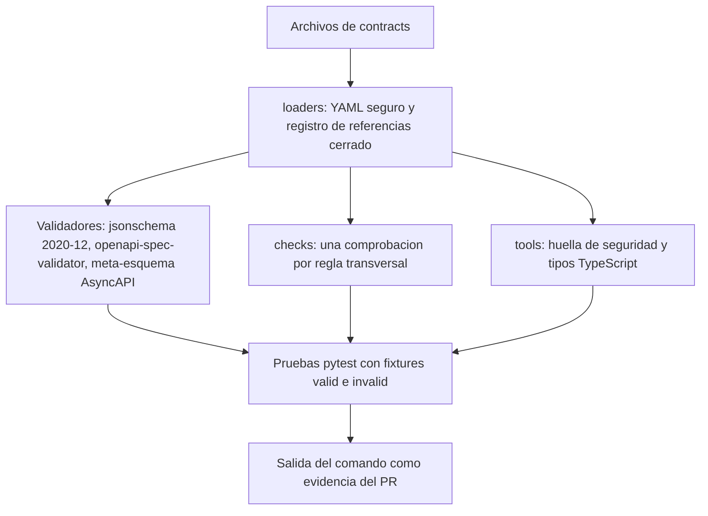

# Diseño de seguridad — U1 contracts

**Insumos.** Requisitos NFR1.1–NFR15.1, amenazas T1–T10 y riesgos residuales de
`nfr-requirements/security-requirements.md` (security-requirements); decisiones D1–D12 y comandos de
§4 de `nfr-requirements/tech-stack-decisions.md` (tech-stack-decisions); inventario de `contracts/` y
flujos F1–F6 de `functional-design/functional-spec.md` (functional-spec); contratos C1–C16, tabla
«Datos sensibles por contrato» y reglas de propiedad de `inception/contract-design/contract-summary.md`
(contract-summary); respuestas P1–P3 de `nfr-design-questions.md`; hallazgos R-01 a R-05 de la
revisión de NFR Requirements de esta unidad; prácticas de `team.md` y `project.md`.

U1 es una unidad `spec`: no corre en ejecución. Su seguridad es la **integridad de los contratos** que
todos los servicios usan para validar sus fronteras, la integridad de la suite que los protege y la
ausencia de datos reales en el repositorio. Este documento diseña los controles que la suite de nivel 0
hace cumplir; el código completo pertenece a Code Generation.

## 1. Alcance y frontera (AUTONOMIA-04)

| Componente | Dónde corre | Qué datos cruzan su frontera | Red |
|---|---|---|---|
| Archivos de `contracts/` | Ningún sitio: son archivos del repositorio | Ninguno; describen datos, no los transportan | — |
| Suite de nivel 0 (`contracts/tests/`, `src/veridicus_contracts/checks/`) | CI (GitHub Actions) y máquina de desarrollo, CPU | Solo *fixtures* sintéticos (NFR12.1) | Bloqueada (`--disable-socket`) |
| Generador de tipos TypeScript (`tools/gen_ts.py`) y de la huella (`tools/security_surface.py`) | CI y máquina de desarrollo | Solo los contratos | Bloqueada |
| Instalación de dependencias y `pip-audit` | CI, pasos aparte | Nombres y versiones de paquetes hacia PyPI | Sí, solo estos pasos (§4.13) |
| Accesor de límites `veridicus_contracts.limits` | Dentro de cada servicio que lo importa, en el clúster | Ninguno: lee un archivo empaquetado | No |

Ningún componente de U1 maneja datos sin anonimizar. Lo que transporta cada contrato en ejecución es lo
que declara la tabla «Datos sensibles por contrato» de contract-summary (C1, C2, C3 y C5 llevan dato
restringido); U1 aporta que ningún contrato pueda declarar un destino fuera del clúster (§4.9).

## 2. Arquitectura de la suite de seguridad

La suite se organiza en capas; cada capa solo usa la de abajo, y las comprobaciones de reglas viven en
`checks/`, que son módulos guardia con 100 % de ramas (NFR13.1).



<!-- Texto alternativo: los archivos de contracts se cargan solo a través de loaders (YAML seguro y registro de referencias cerrado). Sobre esa carga trabajan los validadores estándar, los módulos checks (una comprobación por regla) y las herramientas que generan la huella de seguridad y los tipos TypeScript. Las pruebas pytest ejercitan las tres capas con fixtures válidos e inválidos, y la salida del comando es la evidencia del PR. -->

| Capa | Módulo | Responsabilidad de seguridad |
|---|---|---|
| Carga | `loaders.py` | Único punto que lee YAML y JSON; resuelve `$ref` solo dentro de `contracts/` |
| Validación estándar | `validators.py` | OpenAPI 3.1, AsyncAPI 3.0, JSON Schema 2020-12 con formatos |
| Reglas | `checks/*.py` | Reglas transversales de §4 (una por archivo, sin estado, entrada = documentos ya cargados) |
| Herramientas | `tools/security_surface.py`, `tools/gen_ts.py` | Proyecciones deterministas de los contratos, comparadas con lo versionado |
| Límites | `limits.py` | Accesor de solo lectura del catálogo de límites para la suite y los servicios |

Cada comprobación de `checks/` devuelve una lista de hallazgos con el ID de la regla que viola; la prueba
falla si la lista no está vacía. Así un *fixture* negativo puede exigir que falle **por su**
`reject_reason` (NFR10.10, F1 paso 3).

## 3. Amenazas y controles de diseño

| Amenaza (security-requirements §2) | Controles de diseño | Sección |
|---|---|---|
| T1 Cambio que relaja una regla | Reglas en `checks/`; huella de seguridad versionada; C6 y C7 solo cambian con versión mayor | §4.3, §4.8, §4.11 |
| T2 *Fixture* negativo verde por accidente | Rechazo exigido por la regla declarada; mínimo un positivo y un negativo por regla | §4.10 |
| T3 Datos reales en un *fixture* | `synthetic: true`, `mentions` contra catálogo, patrones de cédula y radicado; `gitleaks` | §4.10 |
| T4 `$ref` remoto o descarga | Registro de referencias cerrado; red bloqueada en la suite | §4.2 |
| T5 YAML con etiquetas de objeto o claves duplicadas | Cargador único seguro; comprobación del código que prohíbe otro cargador | §4.1 |
| T6 `pattern` con retroceso catastrófico | `maxLength` obligatorio con `pattern` y análisis estático del patrón | §4.5 |
| T7 Campo o archivo sin límite | Catálogo único de límites; `maxLength` y `x-veridicus-max-bytes` iguales al catálogo | §4.3, §4.4 |
| T8 Petición sin sesión, sin anti-CSRF o sin rol | Comprobación de seguridad, roles y anti-CSRF por operación; huella | §4.6, §4.11 |
| T9 Dependencia vulnerable | `uv.lock` con *hashes*, `pip-audit`, meta-esquemas con SHA-256, acciones fijadas por SHA | §4.13 |
| T10 Destino externo al clúster | Comprobación de `servers` y de variables de servidor | §4.9 |

## 4. Diseño de los controles

### 4.1 Carga segura de YAML (NFR10.4; cierra R-03)

- `loaders.py` es el único módulo que instancia `ruamel.yaml.YAML(typ="safe", pure=True)`, con
  `allow_duplicate_keys = False` y YAML 1.2 (D5). Devuelve estructuras de Python simples, nunca objetos
  con etiqueta.
- `checks/loader_usage.py` recorre con `ast` todos los `.py` de `src/`, `tests/` y `python/` y falla si
  encuentra `import yaml` (PyYAML), una llamada `YAML(...)` fuera de `loaders.py`, cualquier `typ`
  distinto de `"safe"`, `load_all` o `Loader=`. Es la evidencia del criterio; Ruff `S506` queda como
  segunda línea, no como prueba (R-03).
- Controles negativos: un C8 con `terms` duplicado, un YAML con `!!python/object` y un módulo de prueba
  sintético con `YAML(typ="unsafe")`.

### 4.2 Referencias cerradas y suite sin red (NFR10.5)

- `loaders.py` construye un registro de `referencing` con todos los documentos de `contracts/` y de
  `contracts/vendor/`, indexados por su `$id` o su ruta relativa. La función de recuperación de URI
  lanza un error para cualquier URI que no esté en el registro: no hay descarga posible, ni siquiera de
  los meta-esquemas oficiales.
- `checks/refs.py` falla ante un `$ref` con esquema `http:`, `https:` o `file:`, o que salga de
  `contracts/` tras normalizar `..`.
- `pytest-socket` con `--disable-socket` en la configuración de `pytest` (D6): un intento de red es un
  fallo explícito, no un *timeout*.

### 4.3 Estrictez de cuerpos, mensajes y archivos (NFR10.1, NFR10.2, NFR10.7; cierra R-01)

| Superficie | Regla de diseño | Comprobación |
|---|---|---|
| Cuerpo `application/json` de C1 | `additionalProperties: false` en el objeto raíz y en cada objeto anidado | `checks/strict_bodies.py` |
| Cuerpo `multipart/form-data` de C1 (`/scenarios`, `/scenarios/{id}/versions`, `/voice-turns`) | `additionalProperties: false`; cada parte no binaria (`name`, `client_request_id`) con `maxLength` o `format`; cada parte binaria con `x-veridicus-max-bytes` igual al catálogo y con `encoding.<parte>.contentType` cerrado (`text/markdown, text/plain` o `audio/wav, audio/mpeg`) | `checks/strict_bodies.py`, `checks/limits_match.py` |
| Respuesta de exceso de tamaño | La operación con archivo declara la respuesta que su unidad dueña fijó: `413` `scenario.too_large` (U6) para escenarios y `422` `validation.invalid_request` (U9) para audio, ambas con `$ref` a `Problem` | `checks/limits_match.py` |
| C6 y C7 | `additionalProperties: false` en cada objeto; versión mayor ante cualquier cambio (regla 3 de contract-summary) | `checks/strict_bodies.py` y *fixtures* E7–E9 |
| C2–C5 | Todos los obligatorios, tipos, `minLength`, rangos; los campos desconocidos se ignoran (BR1.3) | Validación contra la carga extraída del AsyncAPI y *fixtures* E1, E3, E4 |
| Texto libre en C1 y C2 | `maxLength` presente **y** igual al catálogo | `checks/limits_match.py` |

### 4.4 Catálogo único de límites (P1 = A; cierra R-05 y la parte de R-02 que toca contratos)

`contracts/limits.v1.yaml` es la única fuente de cada cifra. Cada entrada nombra su unidad dueña, su
unidad de medida y dónde aparece en los contratos:

```yaml
schema_version: 1.0.0
limits:
  turn_text_max_chars:       { value: 2000,    unit: chars,   owner: U4, used_in: [C1, C2] }
  transcript_max_chars:      { value: 100000,  unit: chars,   owner: U6, used_in: [C1] }
  scenario_name_max_chars:   { value: 120,     unit: chars,   owner: U4, used_in: [C1] }
  scenario_file_max_bytes:   { value: 1048576, unit: bytes,   owner: U6, used_in: [C1], too_large: 413/scenario.too_large }
  voice_audio_max_bytes:     { value: 6000000, unit: bytes,   owner: U9, used_in: [C1], too_large: 422/validation.invalid_request, env: VERIDICUS_VOICE_MAX_BYTES }
  voice_audio_base64_max_chars: { value: 8000000, unit: chars, owner: U9, used_in: [C5], derived_from: voice_audio_max_bytes }
  web_session_max_age_s:     { value: 43200,   unit: seconds, owner: U3, used_in: [C1] }
  web_session_idle_s:        { value: 1800,    unit: seconds, owner: U3, used_in: [C1] }
```

- **En los contratos.** Cada `maxLength`, `x-veridicus-max-bytes` y atributo de cookie que corresponde a
  una entrada declara además `x-veridicus-limit: <clave>`. `checks/limits_match.py` exige que todo
  campo de texto libre de C1 y C2 y toda parte binaria tenga esa marca y que su valor sea igual al del
  catálogo; `voice_audio_base64_max_chars` se comprueba como `4 × ⌈voice_audio_max_bytes / 3⌉`.
- **Cookie de sesión.** El esquema `sessionCookie` de C1 declara
  `x-veridicus-cookie: { http_only: true, secure: true, same_site: Strict, path: /, max_age_s: … }`, con
  `max_age_s` marcado contra `web_session_max_age_s`. Así la duración de la sesión que fijó U3 queda
  en el contrato y en la huella (R-02).
- **En los servicios.** `veridicus_contracts.limits.get("<clave>")` devuelve el entero del catálogo
  empaquetado; los servicios no escriben la cifra en su código. Una variable de entorno de ajuste solo
  puede **bajar** el límite: el servicio no arranca si su valor es mayor que el del catálogo o menor que
  1 (regla «una configuración faltante impide arrancar» de team.md). La prueba de cada unidad dueña
  usa el accesor, no una constante propia.
- **Cambiar una cifra** es un cambio menor del catálogo y del contrato que la usa, en un PR de la unidad
  dueña; la huella (§4.11) lo muestra como diff.

### 4.5 Patrones sin retroceso catastrófico (P2 = A; cierra R-04 a)

Comprobación determinista, sin reloj, en `checks/redos.py`:

1. **Entrada acotada.** Todo esquema de tipo `string` con `pattern` declara `maxLength` ≤ 256. Una
   excepción mayor se declara en `contracts/limits.v1.yaml` con su motivo y entra por PR.
2. **Análisis del patrón.** El patrón se compila con `re.compile` y se analiza su árbol con
   `re._parser.parse` (Python 3.12). Se rechaza: (a) una repetición ilimitada (`*`, `+`, `{n,}`) que
   contiene otra repetición ilimitada; (b) una repetición ilimitada sobre una alternancia cuyas ramas
   pueden empezar por el mismo carácter; (c) referencias hacia atrás (`\1`), que no hacen falta en
   ningún contrato.
3. **Corrección, no tiempo.** Hypothesis genera cadenas válidas e inválidas de hasta `maxLength`
   caracteres para comprobar que el validador acepta y rechaza bien. Ninguna prueba mide tiempo de pared.

```python
def nested_unbounded(node, inside_unbounded=False) -> bool:
    for op, arg in node:
        if op in (MAX_REPEAT, MIN_REPEAT):
            lo, hi, sub = arg
            unbounded = hi == MAXREPEAT
            if unbounded and inside_unbounded:
                return True
            if nested_unbounded(sub, inside_unbounded or unbounded):
                return True
        elif op == SUBPATTERN and nested_unbounded(arg[-1], inside_unbounded):
            return True
    return False
```

Controles negativos: `^(a+)+$`, `^(a|aa)*$`, `^(\w+)\1$` y un campo con `pattern` sin `maxLength`.
Este diseño cambia el criterio de NFR10.6 (precisión en §8).

### 4.6 Sesión, anti-CSRF, roles e inmutabilidad en C1 (NFR10.11, NFR10.12, NFR11.1, NFR3.1)

`checks/auth_surface.py` recorre cada operación de C1 y comprueba:

| Regla | Excepciones permitidas | Hallazgo |
|---|---|---|
| Seguridad efectiva = `sessionCookie` | `POST /auth/login` con `security: []` | Una ruta pública nueva |
| Toda POST o PATCH referencia `CsrfToken` (`minLength: 32`) | `/auth/login` | Escritura sin anti-CSRF |
| Toda operación declara `x-veridicus-roles` con valores del enum `Role` | `/auth/login`, `/auth/logout`, `/auth/me` | Ruta que la autorización por defecto de U3 negaría siempre |
| `x-veridicus-owner-only`, si aparece, es booleano y va con `x-veridicus-roles` | — | Marca de dueño sin roles |
| Toda operación con seguridad declara `401` y `403` con `$ref` a `Problem` | `/auth/login` solo `401` | Error sin Problem Details |
| Sin DELETE ni PUT; la única PATCH es `/users/{user_id}` | — | Operación que borra o reemplaza |
| Las seis operaciones que encolan trabajo de IA solo declaran `202` como 2xx | — | Interfaz bloqueante |

En C16, `/healthz` y `/readyz` son públicas dentro del clúster y no llevan cookie. La regla de roles se
aplica a **toda** operación y no solo a POST y PATCH, porque la autorización de U3 niega por defecto una
ruta sin roles (precisión en §8).

### 4.7 Errores con Problem Details y catálogo único (NFR10.3)

- `errors/error-codes.v1.yaml` lista cada `code` con su estado HTTP, su unidad dueña y si es visible al
  usuario. `checks/error_codes.py` exige que el enum `ErrorCode` de C1 y el catálogo coincidan
  exactamente, que todo `code` usado en C1–C5 exista y que toda respuesta 4xx y 5xx de C1 sea
  `$ref: '#/components/responses/Problem'`.
- Las cuatro respuestas `409` que contract-summary describe sin Problem Details se escriben con
  `$ref` a `Problem`; `GET /questions/{id}/audio` usa `question.not_approved`, que ya confirmaron U8
  y U9.
- El `detail` vive en el catálogo de mensajes de la consola: el contrato no lleva textos con datos.
  Ninguna descripción de error de los contratos contiene ejemplos con nombres o identificadores
  (cubierto por §4.10 sobre los ejemplos de los documentos).

### 4.8 Integridad frente a AUTONOMIA-03 (NFR11.3, NFR10.8)

- `checks/veracity.py`: ningún nombre de propiedad, parámetro, valor de enum o rótulo de ningún
  documento coincide (sin mayúsculas ni tildes, palabra completa) con un término de C8 o con
  `categories_forbidden_in_schemas`; el enum de calificación es exactamente `congruente`,
  `incongruente`, `no documentada` en C1, C3 y C6; C8 1.0.0 tiene exactamente sus 9 términos; el
  catálogo de rótulos tiene exactamente sus tres filas (BR6.1–BR6.3).
- `checks/threshold.py`: ninguna operación POST, PUT, PATCH o DELETE contiene `threshold` o `umbral`
  en ruta, parámetro o cuerpo; `similarity_threshold` de C2 está en [0, 1] (E4, E15).
- Las descripciones y ejemplos de los contratos se escanean con la misma lista: un ejemplo de CoT con
  «miente» fuera de comillas «…» literales hace fallar la suite.

### 4.9 Soberanía de datos (NFR1.1)

`checks/servers.py` recorre `servers[].url` y cada `variables.*.default` de C1, C14 y C16, y de los
`servers` de los AsyncAPI. Acepta solo una ruta relativa (`/api/v1`) o una URL cuyo host termina en
`.svc.cluster.local` (con puerto opcional) y esquema `http`. Control negativo: copia de C14 con
`https://api.openai.com`. La comprobación en ejecución de que la URL configurada es interna es de U4
(ModelGateway, ADR-005), no de U1.

### 4.10 Datos sintéticos y controles negativos (NFR12.1, NFR12.2, NFR10.10)

- Cada *fixture* declara `synthetic: true`, `expectation` (`accept` o `reject`), `reject_reason` con un
  ID de regla si es `reject`, y `mentions`. `checks/synthetic.py` exige que cada mención exista en
  `fixtures/synthetic-names.yaml` y aparezca en el texto, y rechaza en todo campo de texto (y en los
  `example` de los contratos) secuencias de 6 a 10 dígitos y de 23 dígitos con o sin separadores.
- `checks/fixture_coverage.py` exige al menos un *fixture* `accept` y uno `reject` por cada regla
  BR1.1–BR8.2 que se prueba en nivel 0, y falla si un `reject` no falla o falla por otra regla.
- `gitleaks` corre en pre-commit y en CI sobre todo el repositorio (team.md).

### 4.11 Huella de seguridad versionada (P3 = A)

`tools/security_surface.py` genera `contracts/security-surface.json`, una proyección determinista
(claves ordenadas, una línea por elemento, sin fechas) de lo que importa a la seguridad:

| Sección | Qué registra por elemento |
|---|---|
| `operations` | Método y ruta de C1, C14 y C16; seguridad efectiva; `x-veridicus-roles`; `x-veridicus-owner-only`; anti-CSRF; códigos de respuesta; límites por `x-veridicus-limit` |
| `schemas` | Por esquema de C1, C2–C7: estrictez (`additionalProperties`), campos obligatorios, campos con texto libre y su `maxLength` |
| `cookie` | Atributos de `sessionCookie` |
| `servers` | Cada URL o valor por defecto |
| `integrity` | Versión y *hash* de C8, del catálogo de rótulos, de `error-codes` y de `limits` |

La prueba `test_security_surface.py` regenera la huella en memoria y falla si difiere del archivo
versionado, mostrando el diff. Regenerarla es un acto explícito
(`uv run --directory contracts python -m veridicus_contracts.tools.security_surface --write`) que
queda en el PR como un diff legible: una ruta que pasa a pública, un rol que desaparece o un límite que
sube se ven aunque las reglas los permitan. La plantilla de PR del repositorio pide justificar todo
cambio en este archivo.

### 4.12 Fechas, idioma y métricas (NFR11.2, NFR14.1, NFR15.1)

- `checks/datetime_format.py`: todo campo `date-time` lleva el `pattern` de `format/datetime.v1.yaml`
  (`AAAA-MM-DDTHH:MM:SSZ`) y la validación de formato rechaza fechas imposibles (E16).
- `checks/naming.py`: propiedades, parámetros y métricas en ASCII `snake_case`; `code` en
  `dominio.motivo`; los valores de enum que fija el PRD se comparan con su lista exacta.
- `checks/metrics.py`: todo nombre de C15 empieza por `veridicus_` y cada etiqueta es un identificador
  o un enum declarado; 0 etiquetas de texto libre.

### 4.13 Cadena de suministro y CI (NFR10.9, NFR2.1, NFR13.1, NFR13.2; cierra R-04 b)

El *job* `contracts-level0` separa los pasos con red de los pasos sin red:

| Paso | Red | Comando | Umbral |
|---|---|---|---|
| 1 Instalar | Sí | `uv sync --frozen --directory contracts` | `uv.lock` con *hashes*; falla si no coincide |
| 2 Auditar dependencias | Sí | `uv run --directory contracts pip-audit` | 0 `HIGH`/`CRITICAL` con corrección |
| 3 Suite | No | `timeout 60 uv run --offline --directory contracts pytest` (con `--disable-socket`, cobertura 80 % de líneas) | Verde en ≤ 60 s |
| 4 Ramas guardia | No | `uv run --offline --directory contracts coverage report --include="src/veridicus_contracts/checks/*" --fail-under=100` | 100 % |
| 5 Tipos y *lint* | No | `mypy --strict src python` y `ruff check .` | 0 errores |
| 6 Tipos TypeScript | No | `python -m veridicus_contracts.tools.gen_ts --check` | Sin diferencias |

- Solo los pasos 1 y 2 tienen red y quedan fuera del `timeout 60` y de `--disable-socket`.
- Los meta-esquemas de `vendor/` se verifican contra `vendor/SHA256SUMS` dentro de la suite.
- El *workflow* declara `permissions: contents: read`, fija cada acción por SHA y no tiene credenciales
  del clúster (team.md, AUTONOMIA-01).
- El límite de 60 s es el techo; la meta de diseño es una suite de ≤ 20 s, para que la carga de la CI no
  acerque el techo. Ninguna prueba individual mide tiempo de pared (§4.5).

## 5. Correspondencia con AUTONOMIA-01..05

| Regla | Qué aporta el diseño de U1 | Secciones |
|---|---|---|
| AUTONOMIA-01 | La suite solo lee archivos; el *job* no tiene credenciales del clúster | §4.13 |
| AUTONOMIA-02 | Cada control tiene su comando y umbral en la tabla de §4.13 | §4.13 |
| AUTONOMIA-03 | Sin campos ni rótulos de veracidad; sin ruta que escriba el umbral; huella de C8 | §4.8, §4.11 |
| AUTONOMIA-04 | Ningún destino externo en los contratos; frontera de cada componente de U1 | §1, §4.9 |
| AUTONOMIA-05 | C7 estricto con sus cuatro campos; *fixtures* E9 por cada campo | §4.3, §4.10 |

## 6. Decisiones de diseño y alternativas

| # | Decisión | Alternativas descartadas | Consecuencias |
|---|---|---|---|
| DS1 | Catálogo único de límites con accesor para los servicios; el entorno solo baja el límite (P1 = A) | Tabla de cifras dentro de la prueba (B); solo exigir que exista el límite (C) | Contrato y servicio no pueden divergir; a cambio, los servicios dependen del accesor y U9 pierde el margen hasta 8 000 000 bytes (§8) |
| DS2 | ReDoS por análisis estático del patrón y `maxLength` obligatorio, sin reloj (P2 = A) | Medir 50 ms (B); análisis más medición de 1 s (C) | Determinista y sin pruebas inestables; a cambio, rechaza algún patrón seguro que el análisis no sabe probar, que se reescribe |
| DS3 | Huella de seguridad versionada y comparada por la suite (P3 = A) | Solo las reglas (B); `oasdiff` en Go (C) | Todo cambio de seguridad se ve en el diff del PR sin otra pila; a cambio, regenerar la huella es un paso más en cada cambio de contrato |
| DS4 | Cargador YAML único verificado por análisis del código | Confiar en Ruff `S506` | Cubre `ruamel.yaml`, que `S506` no ve (R-03) |
| DS5 | Pasos con red separados de la suite sin red | Un solo paso bajo `timeout 60` | El techo de 60 s mide solo la suite; `pip-audit` no rompe la regla de red bloqueada (R-04 b) |

## 7. Riesgos residuales

| Riesgo | Por qué queda | Tratamiento |
|---|---|---|
| Un nombre real que el autor no declara en `mentions` | No se detecta de forma exacta (P4 de NFR Requirements) | Revisión del autor en el PR; prohibición de `project.md` |
| El análisis estático de patrones no prueba todo patrón seguro | Las reglas son conservadoras | Reescribir el patrón; una excepción entra por PR con su motivo |
| Regenerar la huella sin leer el diff | Depende del autor | La plantilla de PR pide justificar el cambio de `security-surface.json` |
| Flexiones no listadas en C8 | Lista 1.0.0 de 9 términos (E14) | Ampliar por PR con su control negativo |
| La copia de los meta-esquemas queda vieja | Sin Node ni red (D4) | Actualizarla por PR con su SHA-256 nuevo |

## 8. Precisiones a artefactos ya aprobados

No edité ningún artefacto aprobado; decides en la aprobación si se actualizan.

| Artefacto | Qué precisa | Origen |
|---|---|---|
| `contracts/nfr-requirements/security-requirements.md` (NFR10.6) | El criterio pasa de «responde en menos de 50 ms frente a 10 000 caracteres» a «todo `pattern` con `maxLength` ≤ 256 y sin cuantificadores ilimitados anidados, alternancias solapadas repetidas ni referencias hacia atrás», sin medición de tiempo | P2 = A, R-04 |
| `contracts/nfr-requirements/security-requirements.md` (NFR10.7) | La suite comprueba el **valor** de cada límite contra `limits.v1.yaml`, no solo su presencia; se añaden las partes binarias de multipart con `x-veridicus-max-bytes` | P1 = A, R-01, R-05 |
| `contracts/nfr-requirements/security-requirements.md` (NFR10.12) | `x-veridicus-roles` se exige en toda operación de C1 salvo `/auth/login`, `/auth/logout` y `/auth/me`, no solo en POST y PATCH | Negación por defecto de U3 |
| `contracts/nfr-requirements/tech-stack-decisions.md` (§2 y §4) | Se añaden `limits.v1.yaml`, `limits.py`, `security-surface.json` y `tools/security_surface.py`; el *job* se parte en pasos con y sin red (§4.13) | P1, P3, R-04 |
| `contracts/functional-design/functional-spec.md` (§1 inventario) | Se añaden `limits.v1.yaml` y `security-surface.json` | P1, P3 |
| `contract-design/contract-summary.md` (C1) | `sessionCookie` declara `x-veridicus-cookie` con los atributos y `max_age_s` de U3; cada límite lleva `x-veridicus-limit`; las cuatro respuestas `409` usan `Problem` | P1, R-02, NFR10.3 |
| Requisitos de U9 (`VERIDICUS_VOICE_MAX_BYTES`) | El rango admitido pasa de 1–8 000 000 a 1–6 000 000: el entorno solo puede bajar el límite del catálogo | P1 = A |
