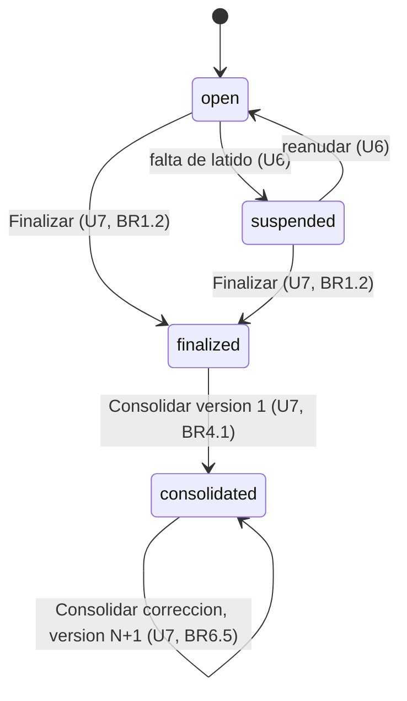
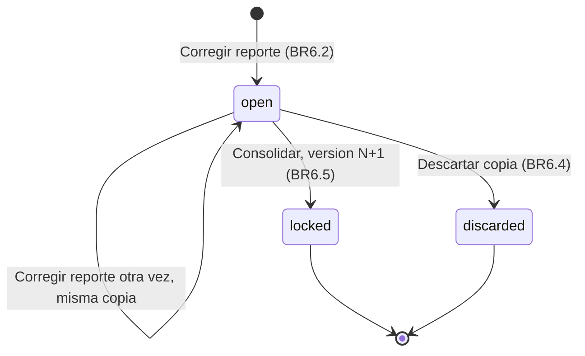
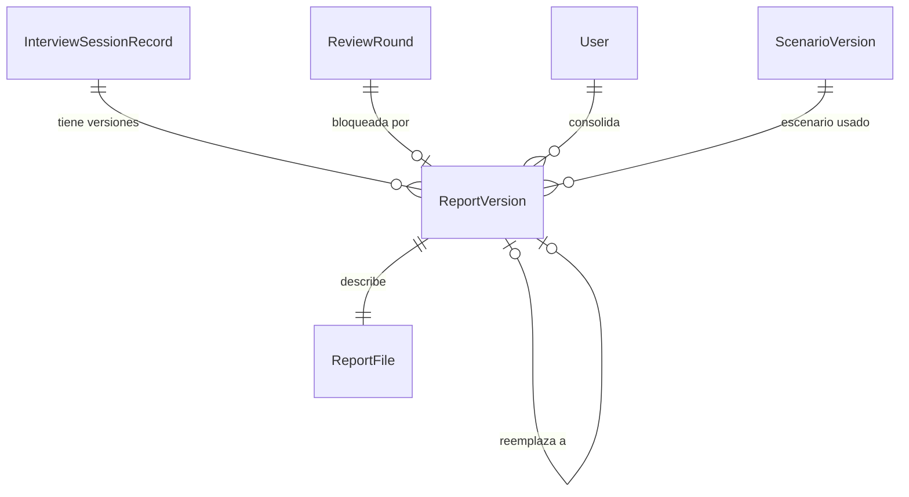

# Especificación funcional — U7 forensic-report

**Unidad.** U7 `forensic-report` (tipo `service`, MUST). Entrega cuatro cosas: finalizar la sesión e
iniciar MTTV (US2.4); consolidar con sus precondiciones, el escaneo y el SHA-256 (US6.1); descargar con
verificación de integridad (US6.2); y corregir con una versión nueva (US6.3). Vive en `services/session-api`
como el módulo ForensicReport, más sus pantallas en AnalystConsole. Usa las rondas y decisiones de U5 sin
definirlas.

**Fuente de verdad.** Este archivo manda en los flujos y las máquinas de estado. Los datos están en
`entities.md` y las decisiones en `rules.md`; el diagrama ER y el resumen de reglas de abajo se derivan de
ellos.

**Respuestas de la etapa.** P1 = A: la copia de corrección se descarta con un estado nuevo `discarded`.
P2 = A: primero se guarda el archivo y después la fila. P3 = A: una sugerencia editada muestra la de la IA
y la del analista. P4 = A: leen los analistas y no los `admin`.

---

## 1. Componentes y frontera del clúster (AUTONOMIA-04)

| Componente | Dónde corre | Datos que maneja | ¿Cruza la frontera del clúster? |
|---|---|---|---|
| ForensicReport (módulo de `session-api`) | Dentro del clúster | Transcripción, sugerencias, CoT, notas y reporte completo | No: no llama a ningún servicio externo ni a ModelGateway |
| Volumen persistente de reportes | Dentro del clúster | Archivos Markdown del reporte | No |
| PostgreSQL (CloudNativePG) | Dentro del clúster | `ReportVersion` (sin texto del caso) | No |
| AnalystConsole | Navegador del analista, servido dentro del clúster | Vista y descarga del reporte | El reporte llega al navegador del analista por C1. Es la entrega prevista, no una salida a internet |

`session-api` ya está bajo la `NetworkPolicy` de salida denegada que entrega U2. U7 no le añade ningún
destino de salida.

## 2. Flujos

### F1 — Finalizar la sesión (US2.4)

1. El dueño pulsa «Finalizar sesión». La consola abre el diálogo de BR1.5 con el número de turnos en cola
   o procesando.
2. Si pulsa «Cancelar», no se envía nada.
3. Con «Finalizar», la consola envía `POST /sessions/{session_id}/finalize` con `X-CSRF-Token`.
4. ConsoleApi comprueba el rol y que el actor sea el dueño (BR1.1, ADR-009).
5. ForensicReport lee el estado con `SessionReader.snapshot`. Si la sesión no está `open` ni
   `suspended`, responde `409 session.finalized` (BR1.2).
6. ForensicReport pide a InterviewSession la transición a `finalized` con el actor. InterviewSession guarda
   `finalized_at` en UTC y el cambio de estado en su historial de solo inserción (BR1.3). La operación
   `SessionLifecycle.finalize` se propone para C11 v1.1.0 (§6).
7. La respuesta `200` trae la `SessionView`. La consola muestra los pendientes y el acceso a la primera
   sugerencia pendiente (BR1.6).
8. Los turnos que seguían en cola o procesando terminan y sus resultados se guardan (BR1.4). Mientras
   tanto, `consolidation_blockers` incluye `report.turns_in_progress`.

### F2 — Consolidar la ronda inicial (US6.1)

1. La consola calcula el botón «Finalizar y Consolidar» con `can_consolidate` y `consolidation_blockers`
   de la `SessionView`. Con bloqueos, el botón queda deshabilitado con su motivo (BR2.5).
2. Sin bloqueos, el dueño pulsa el botón y ve el diálogo de resumen (BR8.1). Con «Consolidar», la consola
   envía `POST /sessions/{session_id}/reports`.
3. ConsoleApi comprueba el rol y que el actor sea el dueño (BR2.1).
4. ForensicReport abre la transacción compartida (`UnitOfWork`) y lee:
   - `SessionReader.snapshot`: estado, dueño, `finalized_at`, umbral vigente, turnos, paquetes y turnos en
     curso;
   - `ReviewRounds.open_round`: la ronda abierta;
   - `ReviewRounds.pending_count`: los pendientes de esa ronda;
   - `ScenarioReader.version_info`: el identificador y el SHA-256 del escenario.
5. Evalúa la guardia en este orden y responde con el primer bloqueo:
   - sesión no finalizada → `409 report.session_not_finalized` (BR2.2);
   - turnos en curso → `409 report.turns_in_progress` (BR2.3);
   - sin ronda abierta → `409 report.conflict` (BR2.7);
   - pendientes > 0 → `409 report.pending_suggestions` (BR2.4).
6. Lee `ReviewRounds.decisions` y arma `ReportContent` (BR3.1). Renderiza el Markdown canónico (BR3.2).
7. Escanea el Markdown con IntegrityPolicy, excluyendo fragmentos, citas, notas y reformulaciones. Si hay
   una coincidencia, revierte la transacción y responde `409 report.forbidden_vocabulary` con la ubicación
   (BR3.3).
8. Genera `report_version_id`, calcula el SHA-256 de los bytes (BR3.4) y escribe el archivo temporal. Lo
   fuerza a disco y lo renombra a `<report_version_id>.md` (BR4.1).
9. Dentro de la misma transacción:
   - inserta `ReportVersion` con `version_number = 1`;
   - llama a `ReviewRounds.lock_round(round_id, report_version_id, actor)`;
   - pide a InterviewSession la transición a `consolidated` (`SessionLifecycle.mark_consolidated`, §6).
10. Confirma. Si la confirmación o `lock_round` fallan, revierte, borra el archivo y responde
    `409 report.conflict` cuando perdió la carrera, o `500` en otro caso (BR4.2, BR4.3).
11. Responde `201` con la `ReportVersion`. La consola muestra quién y cuándo, el SHA-256 completo,
    «Copiar SHA-256» y «Descargar reporte» (BR8.2).

### F3 — Descargar y comprobar integridad (US6.2)

1. Cualquier analista abre la lista de versiones (`GET /sessions/{session_id}/reports`). Un `admin` o una
   identidad de servicio recibe `403` (BR5.3).
2. Al pulsar «Descargar reporte», la consola pide `GET /reports/{report_version_id}/download`.
3. ForensicReport lee el archivo de `storage_path` y recalcula su SHA-256.
4. Si coincide con el registrado, responde `200 text/markdown` con `X-Veridicus-SHA256`. La consola muestra
   ese SHA-256 junto a la descarga.
5. Si no coincide o el archivo falta, responde `409 report.integrity_mismatch`, no envía bytes y registra un
   ERROR solo con el `report_version_id` (BR5.1).
6. Si la sesión no tiene versiones, la consola no ofrece la descarga. La API responde
   `409 report.not_consolidated`, el code propuesto en §6 (BR5.2).

### F4 — Abrir o retomar la copia de trabajo (US6.3)

1. El dueño pulsa «Corregir reporte» en una sesión `consolidated` (BR6.1).
2. ForensicReport llama a `ReviewRounds.open_correction_round(session_id, current_version_id, actor)`.
   - Si no hay ronda abierta, HumanReview abre una de tipo `correction` que hereda de la ronda bloqueada
     por la versión vigente.
   - Si ya hay una, devuelve la misma (BR6.2).
3. La consola muestra «Copia de trabajo de la versión N. Solo puedes cambiar estados y notas» (BR8.3).
4. Las decisiones dentro de la copia usan `POST /suggestions/{id}/decisions` y las reglas de U5. Cualquier
   intento de cambiar la transcripción o la salida de la IA responde `422 validation.invalid_request`
   (BR6.3).

### F5 — Descartar la copia de trabajo (US6.3, P1 = A)

1. El dueño pulsa «Descartar copia» y confirma en un diálogo modal (BR8.3).
2. La consola envía la petición de descarte (ruta propuesta en §6).
3. ForensicReport llama a `ReviewRounds.discard_correction_round(session_id, actor)` (C11 v1.1.0). La
   ronda pasa a `discarded` con quién y cuándo. Sus decisiones quedan como rastro y no cuentan para
   ninguna versión (BR6.4).
4. No se crea versión y la versión vigente no cambia. Si no hay copia abierta, responde
   `409 report.conflict`.

### F6 — Consolidar la copia de trabajo (US6.3)

1. Usa los pasos de F2 sobre la ronda de corrección abierta, con las mismas precondiciones (BR2) y el
   mismo escaneo (BR3).
2. La nueva fila lleva `version_number = N + 1` y `supersedes_version_id` igual a la versión vigente
   (BR6.5).
3. `lock_round` bloquea la ronda de corrección. La sesión sigue `consolidated`, así que no hay transición
   de sesión.
4. El archivo de la versión anterior no se toca y su SHA-256 sigue siendo el mismo (BR6.5).
5. La lista de versiones marca la nueva como vigente. Cada versión conserva los estados de su propia ronda
   (BR6.6).

### F7 — Barrido de huérfanos al arrancar (P2 = A)

1. Al arrancar, antes de pasar `/readyz`, ForensicReport lista el volumen.
2. Borra los archivos temporales y los archivos finales cuyo `report_version_id` no tiene fila. Por cada uno
   registra un WARN con el nombre del archivo (BR4.3).
3. Si el volumen no está montado o no se puede escribir, `/readyz` no pasa: falla al arrancar.

## 3. Máquinas de estado

### Sesión: transiciones que dispara U7

Los estados son de InterviewSession (U4/U6); U7 dispara las transiciones a `finalized` y a `consolidated`.

<!-- Texto alternativo: la sesión nace abierta. U6 la suspende y la reanuda. U7 la finaliza desde abierta o suspendida y la consolida desde finalizada al crear la versión 1. Cada corrección consolidada crea una versión nueva y la sesión sigue consolidada. -->

| Desde | Hacia | Quién | Precondición | Efecto |
|---|---|---|---|---|
| `open` / `suspended` | `finalized` | Dueño | BR1.1, BR1.2 | `finalized_at` en UTC; empieza MTTV; los turnos nuevos responden `409` |
| `finalized` | `consolidated` | Dueño | BR2.1–BR2.7, BR3.3 | Versión 1, ronda 1 bloqueada, archivo y SHA-256 |
| `consolidated` | `consolidated` | Dueño | Copia abierta, BR2 y BR3 | Versión N+1 que reemplaza a la vigente |

### Copia de trabajo (ronda de corrección)

La ronda es de HumanReview (U5). U7 la abre, la bloquea al consolidar y la descarta. El estado
`discarded` se propone en §6.

<!-- Texto alternativo: «Corregir reporte» abre la copia o devuelve la misma si ya está abierta. Consolidarla la bloquea y crea la versión nueva. Descartarla la cierra sin versión. Una copia bloqueada o descartada nunca vuelve a abrirse. -->

### Versión del reporte

`ReportVersion` no cambia de estado: se crea inmutable. Ser la vigente es un valor derivado (la de mayor
`version_number`), así que una corrección no reescribe la fila anterior.

## 4. Vista ER derivada (fuente: `entities.md`)

<!-- Texto alternativo: una sesión tiene cero o más versiones del reporte. Cada versión bloquea exactamente una ronda, puede reemplazar a una versión anterior, la consolida un usuario, usa una versión de escenario y describe exactamente un archivo. -->

## 5. Resumen de reglas derivado (fuente: `rules.md`)

| Grupo | Reglas | Idea clave |
|---|---|---|
| Finalizar | BR1.1–BR1.6 | Solo el dueño, una vez, desde `open` o `suspended`; inicio de MTTV |
| Precondiciones | BR2.1–BR2.7 | Dueño, finalizada, 0 turnos en curso, ronda abierta y 0 pendientes; orden fijo de bloqueos |
| Contenido | BR3.1–BR3.4 | IA y analista separados, render canónico, escaneo antes de guardar, SHA-256 de los bytes |
| Persistencia | BR4.1–BR4.5 | Archivo antes que fila, una sola gana, sin huérfanos, solo inserción, sesión bloqueada |
| Descarga | BR5.1–BR5.3 | Integridad en cada descarga, nada antes de consolidar, solo analistas |
| Corrección | BR6.1–BR6.6 | Una copia por sesión, solo estados y notas, descarte sin versión, versión nueva que conserva la anterior |
| Medición | BR7.1–BR7.2 | MTTV con marcas guardadas; registros solo con IDs |
| Consola | BR8.1–BR8.5 | Diálogos, vista del reporte, copia rotulada, accesibilidad, solo lectura |

## 6. Cambios entre unidades para decidir en la aprobación

No edito artefactos ya aprobados ni el diseño de otra unidad. Lo que U7 necesita de otros contratos queda
aquí; tú decides en la aprobación si se actualiza el original.

| # | Qué falta | Dónde | Propuesta | Origen |
|---|---|---|---|---|
| X1 | Descartar una copia de corrección | U5 `entities.md` (`ReviewRound.status`) y C11 `ReviewRounds` | Estado `discarded` (desde `open`, con `discarded_by` y `discarded_at`, sin volver a `open`) y `discard_correction_round(uow, session_id, actor)`; C11 sube a v1.1.0 en su propio PR | P1 = A, AC6.3.2 |
| X2 | U7 dispara transiciones de la sesión, pero C11 solo tiene `SessionReader` | C11 (dueño InterviewSession, U4/U6) | Puerto `SessionLifecycle` con `finalize(uow, session_id, actor)` y `mark_consolidated(uow, session_id, report_version_id, actor)`, ambos dentro de la transacción compartida | FR3.5, FR7.5, session-lifecycle (transiciones de U7) |
| X3 | El reporte lleva el umbral de la sesión y los turnos del entrevistador | C11 `SessionSnapshot` | Declarar en el docstring el umbral vigente y el hablante de cada turno | AC6.1.3, session-lifecycle |
| X4 | Descargar sin versión debe dar `409` con code estable | C1 `ErrorCode` | Agregar `report.not_consolidated` | AC6.2.2 |
| X5 | Quién lee y descarga | C1: `GET /sessions/{id}/reports` y `GET /reports/{id}/download` | `x-veridicus-roles: [analista]`, sin `x-veridicus-owner-only` | P4 = A |
| X6 | Ruta de descarte | C1 | `POST /sessions/{session_id}/correction-rounds/current/discard` (dueño, CSRF) → `204`; `409 report.conflict` si no hay copia | P1 = A |

Todos son cambios aditivos. La versión mayor de C1 y C11 no cambia.

## 7. Errores en la frontera

| Situación | Respuesta | Code |
|---|---|---|
| No es el dueño, es `admin` o es una identidad de servicio (finalizar, consolidar, corregir, descartar) | `403` | `auth.forbidden` |
| `admin` o una identidad de servicio lee o descarga | `403` | `auth.forbidden` |
| Finalizar una sesión ya finalizada o consolidada | `409` | `session.finalized` |
| Consolidar sin finalizar / con turnos en curso / con pendientes | `409` | `report.session_not_finalized` / `report.turns_in_progress` / `report.pending_suggestions` |
| Vocabulario prohibido en el reporte | `409` | `report.forbidden_vocabulary` |
| Perder la carrera o consolidar sin ronda abierta | `409` | `report.conflict` |
| Descargar con SHA-256 distinto o sin archivo | `409` | `report.integrity_mismatch` |
| Descargar o corregir sin versión consolidada | `409` | `report.not_consolidated` (X4) |
| Cambiar transcripción o salida de la IA en la copia | `422` | `validation.invalid_request` |
| Fallo de escritura en el volumen o de la base | `500` | code de sistema de la jerarquía de `libs/`; sin filas ni archivo final |

Todos los errores salen como `application/problem+json` con `detail` en español (NFR10). Toda E/S al
volumen y a la base lleva un *timeout* explícito, que fija NFR Requirements. Ninguna operación de este
módulo se reintenta sola: consolidar no es idempotente y el analista decide si repite.

## 8. Escenarios de negocio

| Escenario | Resultado esperado | Reglas |
|---|---|---|
| Camino feliz: finaliza, revisa todo y consolida | Versión 1, SHA-256 visible, descarga que coincide | BR1, BR2, BR3, BR4, BR5.1 |
| Finaliza con 2 turnos procesando | El diálogo dice 2; los resultados llegan; consolidar espera a que terminen | BR1.4, BR1.5, BR2.3 |
| Un turno quedó en error | No bloquea; aparece como «turno no evaluado» con su code | BR2.6 |
| Dos pestañas consolidan a la vez | Una `201` y otra `409 report.conflict`; un solo archivo | BR4.2 |
| El volumen falla al renombrar | `500`, 0 filas, sin huérfanos tras el barrido | BR4.1, BR4.3 |
| Alguien altera el archivo en el volumen | La descarga responde `409 report.integrity_mismatch` | BR5.1 |
| Corrige, cambia una decisión y consolida | Versión 2 que reemplaza a la 1; la 1 intacta | BR6.2, BR6.5, BR6.6 |
| Abre la copia y la descarta | Ronda `discarded`, sin versión nueva | BR6.4 |
| Otro analista abre la sesión | Lee y descarga; no ve botones de decisión | BR5.3, BR8.5 |
| Un `admin` pide la descarga | `403` | BR5.3 |

## 9. Pruebas que exige el diseño

- **Nivel 0.** Render determinista (BR3.2). Escaneo con su control negativo: «miente» en un texto del
  sistema hace fallar el reporte, y «falso» dentro de una cita no (BR3.3). Orden de bloqueos (BR2.5).
  Registros sin texto del caso (BR7.2). Pruebas Vitest de diálogos y vistas (BR1.5, BR1.6, BR8).
- **Nivel 1** (PostgreSQL y volumen reales en contenedor). Guardia completa con 100 % de ramas (BR2, BR4,
  BR6). Carrera de consolidación (BR4.2). Fallo inyectado entre archivo y fila (BR4.3). Solo inserción
  (BR4.4). Integridad de descarga (BR5.1). Autorización por rol (BR5.3, BR6.1).
- **Nivel 3.** Suite `axe` y recorrido con teclado de las pantallas de U7 (BR8.4).
- **Arnés de evaluación.** MTTV sobre el Golden Dataset (BR7.1).
