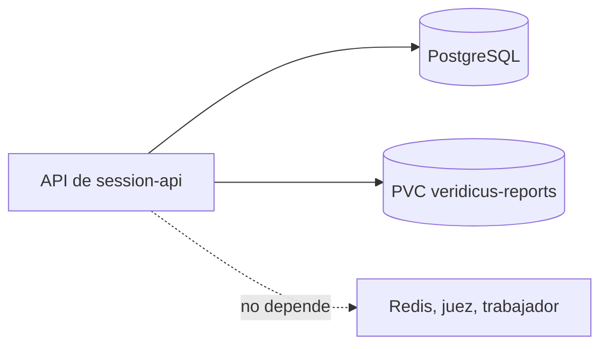

# Componentes lógicos — U7 forensic-report

**Insumos.** `nfr-requirements/performance-requirements.md` (performance-requirements),
`security-requirements.md` (security-requirements), `scalability-requirements.md`
(scalability-requirements), `reliability-requirements.md` (reliability-requirements),
`observability-requirements.md` (observability-requirements) y `tech-stack-decisions.md`
(tech-stack-decisions, D1–D12) de esta unidad; `functional-design/functional-spec.md` (functional-spec);
C1, C8, C11, C15 y C16 de `inception/contract-design/contract-summary.md` (contract-summary); respuestas
P1 = A y P2 = A de `nfr-design-questions.md`; los demás documentos de diseño de esta carpeta.

## 1. Inventario

| Componente lógico | Proceso | Dentro / fuera del clúster | Datos que cruzan su frontera | Patrones de NFR |
|---|---|---|---|---|
| Rutas de U7 (`/finalize`, `/reports`, `/correction-rounds`, descarte, `/download`) | API de `session-api` | Dentro | Peticiones del navegador; `ReportVersion` y Markdown al navegador | `authorize` de U3; cuerpo cerrado con `expected_cursor` (P1 = A); sin reintentos |
| `consolidation_guard`, `correction_policy`, `render`, `mttv` | `forensic_report/domain` | Dentro (código puro) | Ninguno (sin E/S) | 100 % de ramas; render determinista |
| `consolidate`, `finalize`, `correct`, `discard` | `forensic_report/application` | Dentro | Llamadas en proceso a C11 y C8 | Una `UnitOfWork`; orden sesión → ronda; reloj único |
| `ReportStore` (`volume_report_store`) | `forensic_report/adapters` | Dentro | Bytes del reporte hacia y desde el PVC | `O_EXCL`, `fsync`, enlace sin reemplazo, plazo de 5 s, `CancelToken` (P2 = A) |
| `orphan_sweep` | API, al arrancar | Dentro | Nombres de archivo y filas | Margen de 300 s; respaldo de la limpieza del hilo |
| `verify_store` | Comando y `Job` revisable | Dentro (volumen en solo lectura) | Identificadores y conteos por la salida estándar | Código 0 solo si todo coincide |
| `change_cursor.bump` | `session_api/shared` (de U5) | Dentro | Fila de la sesión | Compartido con U4, U5 y U6 |
| `ReviewRounds`, `SessionReader`, `SessionLifecycle`, `ScenarioReader` (C11) | Módulos de U4 y U5 | Dentro | Datos del caso en memoria | Puertos tipados de `contracts/python/forensic_ports.py` |
| `IntegrityPolicy.scan` (C8) | `libs/integrity_policy` (U4) | Dentro | Texto del reporte en memoria | Antes del SHA-256 |
| `ReportMetrics` | API | Dentro | Contadores al puerto interno | `after_commit`; etiquetas de enum |
| PVC `veridicus-reports` | Volumen | Dentro (`StorageClass` local) | Archivos completos del caso | Montaje único, `0700`/`0400` |
| Diálogos, vista del reporte, lista de versiones, copia de trabajo | `frontend` (navegador) | Dentro (solo ConsoleApi) | Vista como texto, descarga | Cursor congelado del diálogo; `retry: false` |
| Arnés de MTTV | Máquina de desarrollo | Fuera del clúster | Solo marcas de tiempo e identificadores por la API | Nunca decide ni descarga |

## 2. Dominios de falla y radio de impacto

<!-- Texto alternativo: la API de session-api, donde vive U7, depende solo de PostgreSQL y del volumen de reportes; no depende de Redis, del juez ni del trabajador. -->

| Falla | Qué deja de funcionar | Qué sigue | Radio |
|---|---|---|---|
| PostgreSQL | Todo U7 | — | Todo el sistema |
| Volumen lleno o sin montar | Consolidar y descargar (`500`/`503`); `/readyz` en `503` | Nada de la API mientras no esté lista | La API entera (1 réplica) |
| Volumen lento | Consolidaciones de más de 5 s (`503`) | Lecturas de la sesión y decisiones | Consolidación y descarga |
| Bloqueo de una sesión retenido | Decisiones y turnos de **esa** sesión (`503` a los 2 s) | Las demás sesiones | Una sesión |
| Juez, Redis, trabajador | Nada de U7 | Finalizar, consolidar, descargar, corregir | — |
| Prometheus o Grafana | Métricas y panel | Todo U7 | Observabilidad |

## 3. Recursos compartidos

| Recurso | Compartido con | Aislamiento |
|---|---|---|
| Proceso de la API | U3, U4, U5, U6 | Capas e import-linter; `forensic_report.domain` sin E/S; *executor* propio de 2 hilos para el volumen |
| Fila de la sesión (`change_seq`) | U4, U5, U6 | Orden único sesión → ronda; consolidación ≤ 2 s bajo bloqueo; el latido de U6 no espera (`SKIP LOCKED`) |
| Base PostgreSQL | Todas | Solo inserción en `report_version` |
| PVC de reportes | Solo la API (y `verify_store` en solo lectura) | Política de montajes de nivel 0 |
| `/metrics` | U3, U4, U5 | Prefijo `veridicus_report_*` y `veridicus_session_mttv_seconds` |

## 4. Entrega a Infrastructure Design

- PVC `veridicus-reports` `ReadWriteOnce` de 1 GiB en una `StorageClass` local, montado solo en el
  contenedor de la API con `fsGroup` del proceso; respaldo conjunto con CloudNativePG y restauración
  validada con `verify_store`.
- API con `replicas: 1` y `strategy: Recreate`; sumar ≤ 96 MiB de U7 al `limits.memory` con ≥ 20 % de
  margen.
- `Job` revisable de `verify_store` con el volumen en solo lectura (AUTONOMIA-01: lo aplica el humano).
- Valores `VERIDICUS_REPORTS_DIR`, `VERIDICUS_REPORT_STORAGE_TIMEOUT_SECONDS`,
  `VERIDICUS_REPORT_CONSOLIDATION_TIMEOUT_SECONDS`, `VERIDICUS_REPORT_ORPHAN_MIN_AGE_SECONDS` y
  `VERIDICUS_REPORT_MIN_FREE_BYTES` en los *values* de `session-api`.
- La tabla `report_version`, sus permisos e índices entran por el `Job` de migración en su propio PR.

## 5. Calidad, pruebas y textos (NFR2.1, NFR10.22, NFR13.1, NFR13.2, NFR13.3, NFR14.2)

- **CPU y sin modelos (NFR2.1).** U7 no llama a modelos; niveles 0 y 1 con PostgreSQL real y un
  directorio real del contenedor; ninguna prueba exige GPU ni descarga nada.
- **Render determinista (NFR10.22).** Pruebas de nivel 0: dos renders iguales; propiedad de Hypothesis
  que baraja la entrada; dos subprocesos con `PYTHONHASHSEED` distintos con el mismo SHA-256;
  normalización de `\r\n`, NFD y espacios finales; *golden file* sintético de `format_version` 1 byte a
  byte. El render nunca lee el reloj: recibe `consolidated_at` como dato.
- **Cobertura (NFR13.1).** ≥ 80 % de líneas en `services/session-api` y `frontend`, bloqueante en CI.
- **Ramas (NFR13.2).** 100 % con `.coveragerc-guards` en `domain/consolidation_guard.py` (BR2 y la
  comprobación del cursor de P1 = A), `application/consolidate.py` (cada fallo, limpieza y la rama del
  testigo de P2 = A), `application/orphan_sweep.py`, `adapters/volume_report_store.py` (cada punto de
  consulta del testigo) y `domain/correction_policy.py`:
  `uv run --directory services/session-api pytest tests/forensic_report --cov-branch --cov-config=.coveragerc-guards`.
- **Fronteras (NFR13.3).** import-linter: `forensic_report.domain` no importa `api`, `adapters`,
  `sqlalchemy` ni otros módulos; ForensicReport usa InterviewSession, HumanReview y TruthFrame solo por
  `forensic_ports.py` y puede usar `session_api.shared`; `consolidate` solo desde la ruta. `lint-imports`
  con control negativo: 0 errores.
- **Glosario (NFR14.2).** `report_version`, `forensic_report`, `consolidation_blocker`, `report_file`,
  `mttv_sample`, `undocumented_fact`, `review_suggestion`; los nuevos `cancel_token` y `view_outdated`
  entran al glosario de U1. Comprobación de glosario: 0 hallazgos.

## 6. Precisiones a artefactos ya aprobados

No edité ningún artefacto aprobado; decides en la aprobación si se actualizan.

| Artefacto | Qué precisa | Origen |
|---|---|---|
| Glosario de U1 (`contracts/`) | Nuevos términos `cancel_token` (testigo de cancelación del almacén) y `view_outdated` (vista desactualizada del diálogo de consolidar) | P1 = A, P2 = A |
| `forensic-report/nfr-requirements/tech-stack-decisions.md` (NFR13.2) | Los módulos guardia cubren también la comprobación del cursor y las ramas del testigo de cancelación | P1 = A, P2 = A |
