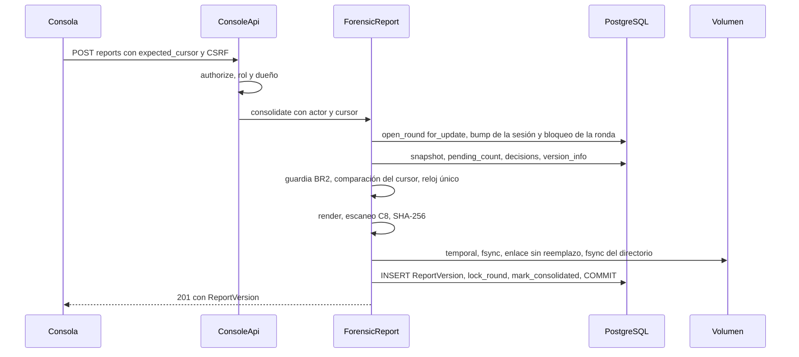

# Diseño de rendimiento — U7 forensic-report

**Insumos.** `nfr-requirements/performance-requirements.md` (performance-requirements),
`security-requirements.md` (security-requirements), `scalability-requirements.md`
(scalability-requirements), `reliability-requirements.md` (reliability-requirements),
`observability-requirements.md` (observability-requirements) y `tech-stack-decisions.md`
(tech-stack-decisions, D1–D12) de esta unidad; flujos F1–F7 de `functional-design/functional-spec.md`
(functional-spec); C1, C8, C11 y C15 de `inception/contract-design/contract-summary.md`
(contract-summary); respuestas P1 = A y P2 = A de `nfr-design-questions.md`; diseño de U5 (orden
sesión → ronda con `change_cursor.bump`) y de U4 (cursor `change_seq`, sondeo).

Todas las metas se miden en la máquina de desarrollo con el perfil CPU, PostgreSQL real en contenedor y
el volumen como directorio real (nunca `tmpfs`), con el caso de 100 turnos de performance-requirements §1.
U7 no llama a modelos ni a la red: su costo es base de datos, CPU de render y `fsync`.

## 1. Camino crítico de la consolidación (NFR3.2, NFR3.3, P1 = A)

<!-- Texto alternativo: la consola envía la consolidación con el cursor de la vista que resumió y el token anti-CSRF. ConsoleApi autoriza rol y dueño y delega. ForensicReport abre la ronda con bloqueo, lo que primero incrementa el change_seq de la sesión y después bloquea la ronda; lee el estado, aplica la guardia y compara el cursor; toma la hora una sola vez; renderiza, escanea y calcula el SHA-256 en memoria; escribe el archivo con fsync y enlace sin reemplazo; inserta la versión, bloquea la ronda, marca la sesión como consolidada y confirma. -->

| Tramo (NFR3.3) | Presupuesto p95 | Diseño |
|---|---|---|
| `bump` + bloqueo de ronda + lecturas de C11 | ≤ 300 ms | Un número fijo de sentencias: `bump` (1), ronda `FOR UPDATE` (1), `snapshot` (3: sesión, turnos con su evaluación, paquetes), `pending_count` (1), `decisions` con estado vigente `DISTINCT ON` de U5 (1), `version_info` (1). Ninguna consulta por turno ni por sugerencia (sin N+1); prueba de nivel 1 que cuenta sentencias con un *listener* de SQLAlchemy: ≤ 10 |
| Guardia + cursor (P1 = A) | ≤ 1 ms | Función pura sobre datos ya leídos; el `change_seq` previo sale del valor que devolvió `bump` (n − 1), sin otra consulta |
| Render | ≤ 400 ms | Funciones puras que añaden fragmentos a una lista y un único `"".join(...).encode("utf-8")`; NFC y normalización de saltos una sola vez por texto (D2); los tramos literales se registran como desplazamientos al renderizar (D4), sin volver a buscar |
| Escaneo C8 | ≤ 200 ms | Una pasada de `scan(text, literal_sources)` sobre el texto completo con los tramos ya calculados |
| SHA-256 | ≤ 20 ms | `hashlib.sha256` sobre los bytes en memoria; los mismos bytes se escriben (BR3.4) |
| Archivo | ≤ 300 ms | Una sola llamada `write` del búfer completo, un `fsync` del archivo, `link` + `unlink`, un `fsync` del directorio (D5); en el hilo del almacén con plazo (reliability-design §3) |
| Inserción + `lock_round` + `mark_consolidated` + *commit* | ≤ 150 ms | Tres sentencias y el *commit*; la sesión ya está bloqueada por el `bump`, así que `mark_consolidated` no espera |
| **Total** | **≤ 1 500 ms; máximo ≤ 2 000 ms** | Verificación: `pytest tests/forensic_report -m perf` (variantes A y B, 30 corridas cada una); el reporte de la prueba registra cada tramo |

- **Bloqueo retenido.** La fila de la sesión y la de la ronda quedan bloqueadas desde el `bump` hasta el
  *commit* (≤ 2 s). Es el precio de que el reporte sea exactamente el estado bloqueado (NFR10.14). En
  una sesión finalizada sin turnos en curso solo compiten las decisiones del mismo analista y el latido
  de U6, que usa `SKIP LOCKED` y no espera (diseño de U6).
- **Reloj único.** `consolidated_at` se toma una vez del reloj inyectable de U3 justo después de la
  guardia; el mismo valor va al Markdown (BR3.1) y a la fila (NFR7.3). Prueba de nivel 0 con reloj fijo.

## 2. Rechazos baratos (NFR3.6, NFR3.7)

- **Sin render.** Los `403` ocurren en `authorize` antes de abrir la transacción. Los `409` de BR2.2–BR2.4,
  BR2.7, `report.view_outdated` (P1 = A), `report.not_consolidated` y `session.finalized` se deciden con
  las lecturas del §1 y revierten antes de renderizar: p95 ≤ 150 ms, 0 filas, 0 archivos. La prueba
  `perf` lista el volumen después de cada rechazo.
- **Vocabulario prohibido.** `report.forbidden_vocabulary` renderiza y escanea pero no escribe: el
  escaneo va antes del SHA-256 y del almacén, así que no se crea temporal (p95 ≤ 1 000 ms).

## 3. Otras rutas (NFR3.1, NFR3.4, NFR3.5, NFR3.8)

| Ruta | Meta p95 | Diseño |
|---|---|---|
| `POST /finalize` (NFR3.1) | ≤ 200 ms | `bump` + `UPDATE … WHERE status IN ('open','suspended')` + `INSERT` del historial + lectura de la `SessionView` en la misma transacción, con los índices `(session_id, change_seq)` de U4. Sin render |
| `GET /reports/{id}/download` (NFR3.4) | ≤ 250 ms (caso de 100 turnos); ≤ 500 ms (2 MiB) | Una consulta por clave primaria; lectura completa en el hilo del almacén (`O_NOFOLLOW`), SHA-256 y `hmac.compare_digest` antes de responder (D9); una `Response` con los bytes ya leídos. Sin *streaming* porque la comprobación debe ir antes del primer byte |
| `GET /sessions/{id}/reports` (NFR3.5) | ≤ 100 ms con 10 versiones | Una consulta por el índice único `(session_id, version_number)`, sin leer archivos |
| Corregir y descartar (NFR3.8) | ≤ 200 ms | `bump` + operación de C11 sobre la ronda; sin render ni archivo |

## 4. Consola (NFR3.9–NFR3.11)

- **Envío único.** Mutación de TanStack Query con `retry: false`, sin actualización optimista (D11); el
  botón pasa a «Consolidando…» y se deshabilita en el mismo ciclo de render del clic (≤ 100 ms), y
  la mutación ignora clics mientras `isPending`. Vitest con servidor *fake* que tarda 2 s: 5 clics,
  1 petición.
- **Cursor del diálogo (P1 = A).** Al abrir el diálogo de BR8.1, la consola congela el cursor de la
  `SessionView` con la que calculó el resumen y lo envía como `expected_cursor`. Si llega `409`
  `report.view_outdated`, invalida la consulta de la sesión, vuelve a pedirla y reabre el resumen con
  los datos nuevos y el aviso del catálogo; no reenvía sola.
- **Botón que se habilita sin recargar (NFR3.10).** El botón depende de `can_consolidate` y
  `consolidation_blockers` del sondeo de U4 (2 s con turnos en curso, 15 s sin ellos); tras una
  decisión, U5 vuelve a pedir la sesión. Playwright: ≤ 3 s y ≤ 1 s.
- **Descarga (NFR3.11).** Enlace `<a href>` con `Content-Disposition: attachment`; el SHA-256 se toma
  de la `ReportVersion` ya mostrada y se compara con `X-Veridicus-SHA256`. Playwright compara el
  SHA-256 del archivo descargado con el mostrado.
- **Otra pestaña u otro analista.** Cuando un sondeo trae un cambio de `status` o de la ronda, la
  consola invalida la consulta `GET /sessions/{id}/reports`; así la lista de versiones se actualiza
  sin columna nueva en `ReportVersion`.

## 5. MTTV (NFR7.1–NFR7.3)

- `finalized_at` y `consolidated_at` salen del reloj inyectable en la capa de aplicación (§1); la
  función pura `domain/mttv.py` es la única que calcula el MTTV, y la usan el arnés y la métrica.
- El arnés `evaluation/golden/mttv.py` solo lee la API; nunca decide ni consolida (AUTONOMIA-03).
  Verificación: `uv run --directory evaluation python -m golden.mttv --run out/level2.json --report
  out/mttv.json`, media < 600 s.
- El tiempo de servidor de U7 (p95 de finalizar + p95 de consolidar ≤ 1,7 s) se comprueba con las
  mismas corridas `perf` del §1 y §3 (NFR7.2).

## 6. Memoria (NFR8.1)

- El Markdown (≤ 2 MiB) existe una sola vez como `bytes`; la lista de fragmentos se libera al unirla.
  Pico esperado por consolidación ≈ 3 × tamaño del reporte (fragmentos, texto y bytes) + datos leídos:
  ≤ 48 MiB con el caso de 100 turnos.
- La descarga lee el archivo entero (≤ 2 MiB) y lo entrega sin copias intermedias: ≤ 16 MiB.
- Verificación: pico de RSS durante las pruebas `perf` de NFR3.2 (1 y 3 consolidaciones simultáneas,
  ≤ 48 MiB y ≤ 96 MiB) y NFR3.4. Infrastructure Design suma este margen al `limits.memory` de la API.
