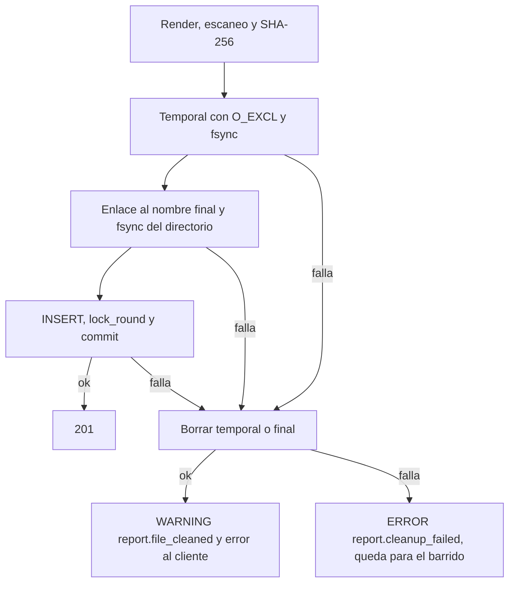

# Diseño de fiabilidad — U7 forensic-report

**Insumos.** `nfr-requirements/performance-requirements.md` (performance-requirements),
`security-requirements.md` (security-requirements), `scalability-requirements.md`
(scalability-requirements), `reliability-requirements.md` (reliability-requirements),
`observability-requirements.md` (observability-requirements) y `tech-stack-decisions.md`
(tech-stack-decisions, D1–D12) de esta unidad; flujos F1–F7 y §7 de
`functional-design/functional-spec.md` (functional-spec); C1, C11 y C16 de
`inception/contract-design/contract-summary.md` (contract-summary); respuestas P1 = A y P2 = A de
`nfr-design-questions.md`; diseño de U5 (orden sesión → ronda, `change_cursor.bump`, `lock_timeout`),
U4 (revisión de plazos de turnos) y U6 (latido con `SKIP LOCKED`).

U7 no usa colas ni modelos: su fiabilidad descansa en una transacción de PostgreSQL con el orden de
bloqueo único de `session-api`, en «archivo antes que fila» sobre el volumen y en que ninguna operación
que escribe se reintenta sola.

## 1. Orden de bloqueo y atomicidad (NFR10.12–NFR10.14, NFR10.21, P1 = A)

Regla de U5 para todo `session-api`: primero la fila de la sesión (`change_cursor.bump`), después la de
la ronda. U7 no emite nunca un `FOR UPDATE` propio sobre `review_round`: lo hace el repositorio de U5.

| Operación de U7 | Paso 1 (sesión) | Paso 2 (ronda) | Resto en la misma `UnitOfWork` |
|---|---|---|---|
| Finalizar (F1) | `bump` vía `SessionLifecycle.finalize` | — | `UPDATE … WHERE status IN ('open','suspended')` (1 fila o `409` `session.finalized`) + historial |
| Consolidar (F2, F6) | `bump` dentro de `open_round(for_update=True)` | Ronda `open` `FOR UPDATE` | Lecturas, guardia y cursor, render, escaneo, archivo, `INSERT`, `lock_round`, `mark_consolidated` (solo versión 1), *commit* |
| Corregir (F4) | `bump` dentro de `open_correction_round` | Ronda | Devuelve la abierta o abre una |
| Descartar (F5) | `bump` dentro de `discard_correction_round` | Ronda `open` | `discarded_by`, `discarded_at` |

- **Todo o nada (NFR10.12).** Una sola `UnitOfWork`. Las métricas y el log `report.consolidated` van en
  `after_commit`. Fallo inyectado en cada paso (tras la guardia, tras el render, tras el temporal, tras
  el enlace, tras el `INSERT`, dentro de `lock_round`, dentro de `mark_consolidated` y en el *commit*):
  0 filas, ronda `open`, sesión sin cambio, `change_seq` sin cambio, 0 archivos tras la limpieza (§2).
- **Una consolidación gana (NFR10.13).** La segunda espera el bloqueo de la sesión; al obtenerlo ya no
  hay ronda abierta → `409` `report.conflict`. Si la ganadora retiene más de 2 s, la perdedora recibe
  `503` `system.unavailable` por `lock_timeout` en ≤ 2,5 s. `UNIQUE (session_id, version_number)` es la
  segunda barrera. Nivel 1: 50 + 50 repeticiones con barrera, 1 `201`, 1 `409`, 1 fila, 1 archivo.
- **Nada queda fuera del reporte (NFR10.14).** Como `decide` de U5 y la ingesta de U4 también empiezan
  con `bump`, ninguna escritura de la sesión confirma entre la lectura y el *commit* de la
  consolidación: la decisión simultánea entra antes (y está en el reporte) o espera y recibe `409`
  `review.round_locked`. Un C3 que llega durante la consolidación espera el bloqueo; la guardia ya lo
  vio en curso y la consolidación responde `409` `report.turns_in_progress`.
- **Cursor del diálogo (P1 = A).** El valor que devuelve el `bump` de la consolidación es `n`; el estado
  que la consola resumió es actual solo si `decode(expected_cursor) = n − 1`. Como el bloqueo serializa
  todos los cambios visibles de la sesión, la comparación no tiene carrera.
- **Finalizar una sola vez (NFR10.21).** Dos finalizaciones: un `200` y un `409` `session.finalized`,
  1 fila de historial; un turno nuevo simultáneo entra antes o recibe `409` `session.finalized`. Los
  turnos colgados pasan a `error` por la revisión de plazos de U4 antes de `deadline_at` + 30 s, así que
  la guardia BR2.3 nunca bloquea para siempre.
- **Sin interbloqueos.** Prueba de nivel 1 de U5 ampliada: cuatro hilos (decisión de U5, ingesta de U4,
  consolidación y descarte de U7) sobre la misma sesión, barrera, 50 repeticiones: 0 errores `40P01`.

## 2. Archivo antes que fila y limpieza síncrona (NFR10.15)



<!-- Texto alternativo: tras renderizar, escanear y calcular el SHA-256 se escribe el temporal con fsync, se enlaza al nombre final con fsync del directorio y después se inserta la fila, se bloquea la ronda y se confirma. Si falla la escritura, el enlace o la base, se borra el archivo creado y se registra report.file_cleaned; si el borrado también falla, se registra report.cleanup_failed y el archivo queda para el barrido. -->

- El escaneo y el SHA-256 van antes de tocar el volumen: un rechazo por vocabulario no crea archivo.
- Códigos: volumen (`ENOSPC`, `EACCES`, destino existente) → `500` `report.storage_failed`; carrera
  perdida → `409` `report.conflict`; *timeout* → `503` `system.unavailable`.
- Verificación de nivel 1: sistema de archivos pequeño lleno, directorio sin escritura y *commit*
  fallido: 0 filas y 0 archivos (sin esperar al barrido).

## 3. Plazos y cancelación cooperativa del almacén (NFR10.17, P2 = A)

| E/S | Plazo | Al vencer |
|---|---|---|
| Sentencia de PostgreSQL | `statement_timeout` 2 s (U3) | *Rollback*, `503` |
| Espera de bloqueo | `lock_timeout` 2 s (U5) | *Rollback*, `503` |
| Operación del volumen | 5 s (`VERIDICUS_REPORT_STORAGE_TIMEOUT_SECONDS`), hilo del `ThreadPoolExecutor` de 2 hilos (D6) | Testigo marcado, *rollback*, `503` |
| Consolidación completa | 10 s antes del *commit* (`VERIDICUS_REPORT_CONSOLIDATION_TIMEOUT_SECONDS`); `idle_in_transaction_session_timeout` 15 s de respaldo | *Rollback*, limpieza, `503` |

**Cancelación cooperativa (P2 = A).** El hilo del almacén no se puede interrumpir, así que limpia lo
suyo:

- `ReportStore.write_new(report_version_id, data, deadline, token)` recibe un `CancelToken`
  (`threading.Event`). El hilo lo consulta en tres puntos: antes de crear el temporal, después del
  `fsync` del archivo y antes del enlace. Si está marcado, borra lo que haya creado y termina sin
  enlazar.
- Al vencer el plazo, la consolidación marca el testigo y registra `future.add_done_callback(cleanup)`.
  La función de limpieza corre cuando el hilo termina (o enseguida, si ya terminó) y borra
  `<uuid>.md.tmp` y `<uuid>.md` si existen. Con eso no queda carrera: o el hilo ve el testigo, o la
  limpieza corre después de él.
- **Invariante.** La fila se inserta solo después de que `future.result()` devuelve sin error; un
  *timeout* nunca deja fila, así que la limpieza nunca borra un archivo registrado. Prueba de nivel 0
  con un almacén *fake* que intenta borrar con fila: el chequeo falla.
- Registro: `WARNING` `report.file_cleaned` (motivo `timeout`); si el borrado falla, `ERROR`
  `report.cleanup_failed`, y el barrido del arranque queda como respaldo (§4).
- Si los 2 hilos quedan bloqueados (volumen colgado), las siguientes escrituras esperan en la cola del
  *executor* y vencen igual: `503` en ≤ 5,5 s, nunca una petición colgada.

```python
# application/consolidate.py (ilustrativo)
token = CancelToken()
future = store.submit_write(version_id, data, token)
try:
    future.result(timeout=settings.storage_timeout)
except FutureTimeout:
    token.cancel()
    future.add_done_callback(lambda _: store.cleanup(version_id))
    raise StorageUnavailable()  # 503 system.unavailable tras el rollback
```

Verificación de nivel 1: almacén que tarda 6 s → `503` en ≤ 6,5 s, 0 filas y **0 archivos a los 10 s**;
el testigo marcado antes del enlace deja 0 temporales; el testigo marcado tras el enlace deja 0 finales.
Base retenida 3 s → `503` en ≤ 2,5 s; consolidación de más de 10 s → `503` en ≤ 10,5 s.

## 4. Barrido al arrancar y salud (NFR10.16, NFR10.19)

- **Barrido.** Antes de que `/readyz` responda `200`, `orphan_sweep` lista el directorio y borra
  `<uuid>.md.tmp` y `<uuid>.md` sin fila con `st_mtime` de más de 300 s; otros nombres solo se registran
  (`report.unexpected_file`). 1 réplica con `Recreate` (NFR8.6). Con P2 = A el barrido es el respaldo de
  `report.cleanup_failed`, no el camino normal. Pruebas: huérfano viejo borrado; archivo de 10 s de una
  consolidación en vuelo intacto y descarga íntegra; final con fila intacto; 1 000 archivos en ≤ 5 s.
- **`/readyz` (C16).** `503` si falta o es inválida la configuración de U7, si el directorio no existe,
  no es escribible o no tiene `0700`, si quedan menos de 50 MiB libres o si el barrido no terminó. Una
  configuración inválida termina el proceso con código distinto de 0 y un log que nombra el ajuste.
  Pruebas de nivel 0 por regla de configuración y de nivel 1 con volumen sin montar, de solo lectura y
  casi lleno.

## 5. Sin reintentos automáticos (NFR10.18)

- Finalizar, consolidar, corregir y descartar no son idempotentes: ni servidor ni consola los
  reintentan (`retry: false`, D11). Ante red caída, `500` o `503`, la consola muestra el mensaje del
  catálogo y vuelve a pedir la sesión; si la consolidación sí se guardó, aparece `consolidated` y un
  reenvío manual recibe `409` `report.conflict`.
- Ante `409` `report.view_outdated` la consola tampoco reenvía: vuelve a pedir la sesión y el analista
  confirma de nuevo el resumen actualizado (P1 = A).
- La descarga es de lectura y se repite solo a mano. Verificación: Vitest con servidor *fake* que
  falla, que responde `503`, `409` `report.conflict` y `409` `report.view_outdated`.

## 6. Verificación del almacén y respaldo (NFR10.20, NFR8.8)

- `python -m session_api.forensic_report.verify_store` (y su `Job` revisable con el volumen en solo
  lectura, AUTONOMIA-01): recalcula el SHA-256 de cada `ReportVersion`, lista huérfanos y sale con 0
  solo si hay 0 versiones sin archivo y 0 SHA-256 distintos. Prueba de nivel 1 con un archivo alterado y
  otro borrado: código 1 y los dos identificadores.
- **NFR8.8.** Tras toda la suite de nivel 1 (incluidos los fallos inyectados del §1–§3), el comando
  informa 0 versiones sin archivo, 0 SHA-256 distintos y 0 huérfanos de más de 300 s; con P2 = A no hace
  falta reiniciar para cumplirlo.
- El RPO y el RTO son los del respaldo conjunto de CloudNativePG y del PVC (Infrastructure Design); tras
  restaurar se ejecuta `verify_store`. Si la base queda más nueva que el volumen, esas versiones
  responden `409` `report.integrity_mismatch`; nunca se entrega un archivo distinto del registrado.

## 7. Recuperación y degradación

| Falla | Qué se pierde | Recuperación |
|---|---|---|
| Reinicio de la API a mitad de consolidar | Nada confirmado | El archivo, si quedó, lo borra el barrido pasado su margen; el analista vuelve a consolidar |
| Volumen lento o colgado | Nada | `503` y limpieza del propio hilo (§3) |
| Volumen lleno o sin escritura | Nada | `500` `report.storage_failed`; `/readyz` en `503` bajo 50 MiB y alerta del 80 % antes |
| PostgreSQL no responde | Nada | `503`; el archivo escrito se limpia (§2) |
| Archivo alterado o borrado | La descarga de esa versión | `409` `report.integrity_mismatch`; se restaura del respaldo y `verify_store` confirma |
| Juez, Redis, trabajador o Prometheus caídos | Nada de U7 | U7 solo necesita PostgreSQL y el volumen: se finaliza, consolida (sin turnos en curso), descarga y corrige igual |

## 8. Objetivo de punta a punta (NFR8.7)

`frontend/e2e/report.spec.ts` (finalizar con 2 turnos en curso, esperar, decidir la última pendiente,
consolidar, copiar el SHA-256, descargar y comparar, corregir, consolidar la versión 2, abrir y
descartar otra copia, ver la sesión como otro analista en solo lectura y, con dos pestañas, recibir
`report.view_outdated` tras decidir en la otra) pasa con 0 fallos en cada corrida de nivel 3:
`npx --prefix frontend playwright test e2e/report.spec.ts`.

## 9. Precisiones a artefactos ya aprobados

No edité ningún artefacto aprobado; decides en la aprobación si se actualizan.

| Artefacto | Qué precisa | Origen |
|---|---|---|
| `forensic-report/nfr-requirements/tech-stack-decisions.md` (D5, D6) | `ReportStore.write_new` recibe un `CancelToken`; al vencer el plazo la aplicación marca el testigo y registra una limpieza en `add_done_callback`; el riesgo «el hilo que vence deja un huérfano hasta el arranque» queda mitigado sin esperar al barrido | P2 = A |
| `forensic-report/nfr-requirements/reliability-requirements.md` (NFR10.16, NFR10.17) | El barrido del arranque pasa a ser respaldo de `report.cleanup_failed`; la prueba del almacén que tarda 6 s exige además 0 archivos a los 10 s | P2 = A |
| `forensic-report/functional-design/functional-spec.md` (F2 pasos 4–10, F4, F5) | El orden explícito es `bump` de la sesión → ronda en las cuatro operaciones; `consolidated_at` se toma una vez tras la guardia y va igual al Markdown y a la fila | Orden de U5; BR3.1, NFR7.3 |
| `inception/contract-design/contract-summary.md` (C11 `discard_correction_round` y `SessionLifecycle.finalize`) | Ambas operaciones hacen `change_cursor.bump` antes de tocar la ronda o la sesión, como `open_correction_round` y `lock_round` | Orden de U5 (su tabla no listaba estas dos) |
| `human-review/nfr-design/reliability-design.md` §2 (U5) | La prueba sin interbloqueos incluye el descarte de U7 como cuarto hilo | Orden de U5 |
