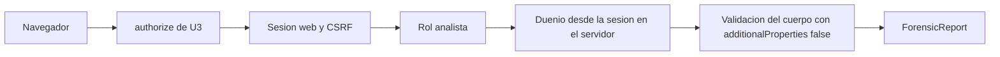

# Diseño de seguridad — U7 forensic-report

**Insumos.** `nfr-requirements/performance-requirements.md` (performance-requirements),
`security-requirements.md` (security-requirements), `scalability-requirements.md`
(scalability-requirements), `reliability-requirements.md` (reliability-requirements),
`observability-requirements.md` (observability-requirements) y `tech-stack-decisions.md`
(tech-stack-decisions, D1–D12) de esta unidad; flujos F1–F7 y §7 de
`functional-design/functional-spec.md` (functional-spec); C1, C8, C11 y C15 de
`inception/contract-design/contract-summary.md` (contract-summary); respuestas P1 = A y P2 = A de
`nfr-design-questions.md`; diseños de U1 (`contracts/limits.v1.yaml`, catálogo), U2 (`NetworkPolicy`,
perfil `restricted`, Kyverno CLI), U3 (`authorize`, formateador de logs) y U4 (`scan`, cursor).

El reporte junta en un solo archivo todo el caso, así que se trata como el activo más sensible del
sistema aunque los datos del MVP sean sintéticos (NFR12).

## 1. Frontera de la unidad (AUTONOMIA-04; NFR1.1, NFR1.2)

| Componente | Dentro / fuera del clúster | Qué datos cruzan su frontera | Control |
|---|---|---|---|
| Rutas de U7 en ConsoleApi | Dentro (API de `session-api`, salida denegada por la `NetworkPolicy` de U2) | Peticiones del navegador; `ReportVersion` y el Markdown hacia el navegador del analista por HTTPS del *ingress* (entrega prevista, no salida a internet) | `authorize` de U3; §2 |
| ForensicReport | Dentro (módulo de la API) | Llamadas en proceso a C11 y C8; filas en PostgreSQL | import-linter: sin `httpx`, `requests`, `urllib`, Redis ni `model_gateway` (NFR1.1), con control negativo |
| PVC `veridicus-reports` | Dentro, montado solo en el contenedor de la API | Archivos Markdown completos | Política Kyverno sobre `helm template`: ningún otro pod, `Job` o `CronJob` lo monta, salvo el `Job` de `verify_store` en solo lectura (NFR1.2) |
| PostgreSQL (CloudNativePG) | Dentro | Identificadores, SHA-256, tamaños, actor y hora; nunca texto del caso | Usuario de la aplicación con `INSERT`/`SELECT` en `report_version` |
| `/metrics` | Dentro (puerto interno, solo Prometheus) | Contadores e histogramas con etiquetas de enum | NFR10.10 |
| Consola (navegador) | Dentro (solo habla con ConsoleApi, ADR-004) | Vista del reporte como texto, descarga | `react/no-danger` en error |
| Arnés de MTTV | Máquina de desarrollo | Solo marcas de tiempo e identificadores por la API | Nunca descarga reportes |

Ningún componente de U7 llama fuera del clúster ni a un modelo. Verificación: `lint-imports` (0
errores) y `kyverno apply deploy/policies/ --resource -` sobre el render (0 violaciones), nivel 0.

## 2. Entrada y autorización (NFR10.1–NFR10.3, NFR10.11)



<!-- Texto alternativo: la petición pasa por la dependencia authorize de U3, que comprueba la sesión web y el token anti-CSRF, el rol analista y, en las rutas que escriben, que el actor sea el dueño leído en el servidor; después se valida el cuerpo sin campos extra y solo entonces entra a ForensicReport. -->

- **Metadatos desde C1.** Las cuatro rutas que escriben (`/finalize`, `POST /reports`,
  `/correction-rounds`, descarte) declaran `x-veridicus-roles: [analista]` y
  `x-veridicus-owner-only: true`; la lista y la descarga declaran solo `[analista]` (P4 = A). El dueño
  lo resuelve un puerto de ConsoleApi a partir de `session_id` (ADR-009), nunca del cuerpo.
- **Cuerpos cerrados.** `POST /reports` lleva ahora un cuerpo `{ "expected_cursor": <Cursor> }`
  obligatorio (P1 = A), con el mismo esquema `Cursor` que el parámetro `since` del sondeo de U4 y su
  tope en `contracts/limits.v1.yaml`; las demás rutas no llevan cuerpo. `additionalProperties: false`:
  `consolidated_by`, `consolidated_at`, `finalized_at`, `actor_user_id` u otro campo → `422`
  `validation.invalid_request` (T15). Un cursor ilegible → `422`, nunca `500`.
- **Orden de rechazo.** Sesión → CSRF → rol → dueño → cuerpo, todo antes de abrir la transacción: 0
  filas, 0 cambios de estado, 0 archivos. Verificación: pruebas de nivel 1 por ruta (otro analista
  `403` `session.not_owner`; `admin` e identidad de servicio `403` `auth.forbidden`; sin sesión `401`;
  sin CSRF `403` `auth.csrf`) que además listan el volumen.
- **Copia de trabajo (NFR10.11).** Las rutas de corrección solo admiten estados y notas a través de C10
  de U5; cualquier intento de cambiar transcripción, fragmento, cita, documento o CoT → `422`. La
  prueba de nivel 1 compara el SHA-256 de esos campos y de los bytes de la versión vigente antes y
  después.

## 3. Consolidación explícita y vinculada a lo revisado (AUTONOMIA-03; NFR11.2, NFR10.9, P1 = A)

| Control | Diseño | Verificación |
|---|---|---|
| Única entrada | `consolidate` solo se importa desde la ruta `POST /sessions/{id}/reports`; import-linter lo prohíbe en el trabajador, `semantic-agent`, `evaluation/` y cualquier otro módulo | `lint-imports` con control negativo (nivel 0) |
| Quién y cuándo | `consolidated_by` es el principal autenticado; `consolidated_at` el reloj del servidor, tomado una vez y escrito igual en el Markdown y en la fila (`NOT NULL`) | Nivel 1: la fila y el archivo llevan el mismo actor y la misma hora |
| Lo que el analista vio (P1 = A) | Dentro de la transacción, después de `open_round(for_update=True)` (que hace `bump` de la sesión), `consolidation_guard` recibe `expected_seq = decode(expected_cursor)` y `current_seq = bump_value − 1`; tras pasar BR2.2–BR2.4 y BR2.7, si difieren → `409` `report.view_outdated`, *rollback*, 0 filas, 0 archivos | Nivel 1: una decisión confirmada entre el diálogo y la consolidación da `409` en 50 de 50 repeticiones; sin cambios intermedios, `201` en 50 de 50. Nivel 0: tabla de la guardia con 100 % de ramas |
| Sin falsos rechazos | Solo los cambios visibles incrementan `change_seq` (el latido de U6 y `cot-views` de U5 no lo hacen), así que un cursor solo queda viejo si algo que el resumen muestra cambió | Nivel 1: 10 latidos y 10 `cot-views` entre el diálogo y la consolidación → `201` |
| Sin etiquetas de veracidad (NFR10.9) | El Markdown completo pasa por `scan(text, literal_sources)` antes del SHA-256; son literales los turnos, fragmentos, citas, pasajes, notas y reformulaciones; se escanean plantilla, CoT y textos del sistema | Nivel 0: «miente» en una CoT bloquea con la ubicación; «falso» en un turno o nota no bloquea; plantilla vacía con 0 coincidencias. Nivel 1: 0 filas y 0 archivos tras el rechazo |

```python
# domain/consolidation_guard.py (ilustrativo)
def evaluate(snapshot, open_round, pending, expected_seq, current_seq) -> Decision:
    for blocker in ordered_blockers(snapshot, open_round, pending):  # BR2.2, 2.3, 2.7, 2.4
        return Blocked(blocker)
    if expected_seq != current_seq:
        return Blocked("report.view_outdated")
    return Allowed()
```

## 4. Integridad y versiones (NFR11.1, NFR11.3–NFR11.6)

- **Solo inserción.** `report_version` registrada en `AuditConvention` de U3; el usuario de la
  aplicación tiene `INSERT` y `SELECT`. Restricciones: `UNIQUE (session_id, version_number)`,
  `UNIQUE (round_id)`, `UNIQUE (storage_path)`, `CHECK` de la versión 1 sin `supersedes_version_id`,
  `CHECK` del formato del SHA-256 y de `byte_size > 0`, claves foráneas. Una prueba de nivel 1 por
  restricción y la prueba común de auditoría de U3.
- **Archivo inmutable.** Temporal con `O_CREAT` + `O_EXCL` + `O_NOFOLLOW` y modo `0600`; `fsync`;
  `os.link` al nombre final (falla si existe) y `unlink` del temporal; `fsync` del directorio;
  `chmod 0400`. Un archivo plantado con el nombre siguiente hace fallar con `500`
  `report.storage_failed` sin tocarlo.
- **SHA-256 en cada descarga.** Lectura completa, `hashlib.sha256`, `hmac.compare_digest` con la fila;
  si difiere, falta o es un enlace simbólico → `409` `report.integrity_mismatch` sin bytes, `ERROR`
  con solo `report_version_id`. Pruebas con 1 byte alterado, archivo truncado y borrado.
- **Corrección.** La versión N+1 apunta a la vigente en `supersedes_version_id`; la fila y el archivo
  de la N no se tocan (mismo `st_mtime` y SHA-256). El descarte deja `discarded_by` y `discarded_at` en
  la ronda y ninguna versión la referencia; un segundo descarte → `409` `report.conflict`.

## 5. Descarga (NFR10.4, NFR10.5)

- **Ruta calculada.** `report_version_id` se valida como UUID; la ruta es `<VERIDICUS_REPORTS_DIR>/<uuid>.md`
  y debe ser igual a `storage_path`; el valor de la petición nunca se concatena. Sin fila → `409`
  `report.not_consolidated`. Pruebas con `..%2F`, ruta absoluta y enlace simbólico plantado.
- **Cabeceras.** `Content-Type: text/markdown; charset=utf-8`, `Content-Disposition: attachment;
  filename="veridicus-reporte-<uuid>.md"`, `X-Content-Type-Options: nosniff`, `Cache-Control: no-store`
  y `X-Veridicus-SHA256`. Ningún `403` ni `409` envía bytes ni esa cabecera.
- **Consola.** La vista del reporte muestra el Markdown como texto (`react/no-danger`); Vitest con
  `<script>` e `` sembrados en una nota: no se ejecutan.

## 6. Volumen (NFR10.6)

- Contenedor sin root (perfil `restricted` de U2) con `fsGroup` propio; `umask 077` al arrancar;
  directorio `0700`, archivo final `0400`.
- `/readyz` comprueba existencia, escritura y permisos (reliability-design §4). Prueba de nivel 1 con
  `stat()` del archivo y del directorio; política de nivel 0 sobre montajes (§1).

## 7. Datos sensibles fuera de logs, errores y métricas (NFR10.7, NFR10.8, NFR10.10)

- **Logs.** Formateador JSON de `libs/` con lista blanca (U3); U7 solo añade identificadores, conteos
  y el SHA-256 (observability-design §1). El *engine* usa `hide_parameters=True` (U5 D5).
- **Errores.** Problem Details con `code` de C1 y `detail` del catálogo de U1;
  `report.forbidden_vocabulary` da la ubicación (turno o sugerencia y sección), nunca el término ni su
  contexto; `report.view_outdated` no dice qué cambió.
- **Métricas.** Etiquetas solo de enum; sin `session_id` ni `report_version_id`.
- **Verificación.** Prueba de nivel 1 con una cadena centinela en turno, CoT, nota, reformulación y
  pasaje: 0 coincidencias en logs, cuerpos de error y `/metrics` en todos los caminos (`200`, `201`,
  `403`, cada `409`, `422`, `500`, `503`, barrido y limpieza tardía de reliability-design §3).

## 8. Datos sintéticos e idioma (NFR12.1, NFR14.1)

- *Fixtures*, *golden files* de `services/session-api/tests/forensic_report/` e informes del arnés usan
  el catálogo de nombres sintéticos de U1; `evaluation/out/` está en `.gitignore`. Comprobación de U1
  sobre esas rutas: 0 hallazgos (nivel 0).
- Textos fijos de la plantilla y diálogos del catálogo de U1, incluido el nuevo de
  `report.view_outdated`; prueba de nivel 0 que recorre la plantilla. Fechas del reporte en ISO 8601
  UTC; de la consola en hora de Colombia.

## 9. Amenazas y controles

| # | Amenaza | Control | Dónde |
|---|---|---|---|
| T1, T15 | Otro actor escribe o suplanta actor y hora | `authorize` + dueño en el servidor + cuerpo cerrado | §2 |
| T2 | `admin` o servicio lee reportes | Rol `analista` en lista y descarga | §2, §5 |
| T3 | CSRF | Token de U3 en las cuatro rutas que escriben | §2 |
| T4 | Consolidación automática | Entrada única e import-linter | §3 |
| T5 | Carrera entre guardia y bloqueo | `open_round(for_update=True)` con `bump` previo | reliability-design §1 |
| T6, T7, T8 | Alterar archivo, fila o versión anterior | Solo inserción, `0400`, enlace sin reemplazo, SHA-256 en cada descarga | §4 |
| T9, T10 | Recorrido de rutas; otro proceso lee el volumen | Ruta calculada, `O_NOFOLLOW`, montaje único, `0700` | §5, §6 |
| T11 | Texto del caso en logs, errores o métricas | Lista blanca y centinela | §7 |
| T12 | Etiqueta de veracidad en el reporte | Escaneo C8 antes del SHA-256 | §3 |
| T13 | Markdown interpretado o en caché | Cabeceras y vista como texto | §5 |
| T14 | Cambiar datos de la IA en la copia | `422` y SHA-256 antes y después | §2 |
| T16 | Consolidar un estado que el analista no vio (P1 = A) | `expected_cursor` comparado bajo el bloqueo de la sesión | §3 |
| T17 | Copia del caso sin dueño en el volumen tras un *timeout* (P2 = A) | Testigo de cancelación y limpieza del propio hilo | reliability-design §3 |

## 10. Precisiones a artefactos ya aprobados

No edité ningún artefacto aprobado; decides en la aprobación si se actualizan.

| Artefacto | Qué precisa | Origen |
|---|---|---|
| `inception/contract-design/contract-summary.md` (C1 `POST /sessions/{session_id}/reports`) | Cuerpo obligatorio `{ expected_cursor }` con el esquema `Cursor` del parámetro `since` de U4 y `additionalProperties: false`; respuesta `409` con el nuevo `code` `report.view_outdated` y `422` | P1 = A |
| `inception/contract-design/contract-summary.md` (C1 `ErrorCode`) y catálogo de U1 | Nuevo `report.view_outdated` (`409`) con `detail` en español: «El resumen cambió desde que abriste el diálogo. Revísalo de nuevo antes de consolidar.» Entra en el mismo PR de U1 que `report.storage_failed` y `report.not_consolidated` | P1 = A |
| `contracts/limits.v1.yaml` (diseño de U1) | El cuerpo de `POST /reports` usa el tope de longitud del cursor ya declarado para `since` (sin entrada nueva si U4 la declaró; si no, `cursor_max_chars`, dueño U4) | P1 = A |
| `forensic-report/functional-design/rules.md` (BR2, BR8.1) | Tras BR2.2–BR2.4 y BR2.7 se añade la comprobación del cursor (`report.view_outdated`); el diálogo de BR8.1 congela el cursor de la vista que resumió y, ante ese `409`, vuelve a pedir la sesión y reabre el resumen | P1 = A |
| `forensic-report/nfr-requirements/security-requirements.md` (NFR10.1, §2) | El cuerpo de `POST /reports` ya no está vacío: solo admite `expected_cursor`; se añaden las amenazas T16 y T17 | P1 = A, P2 = A |
