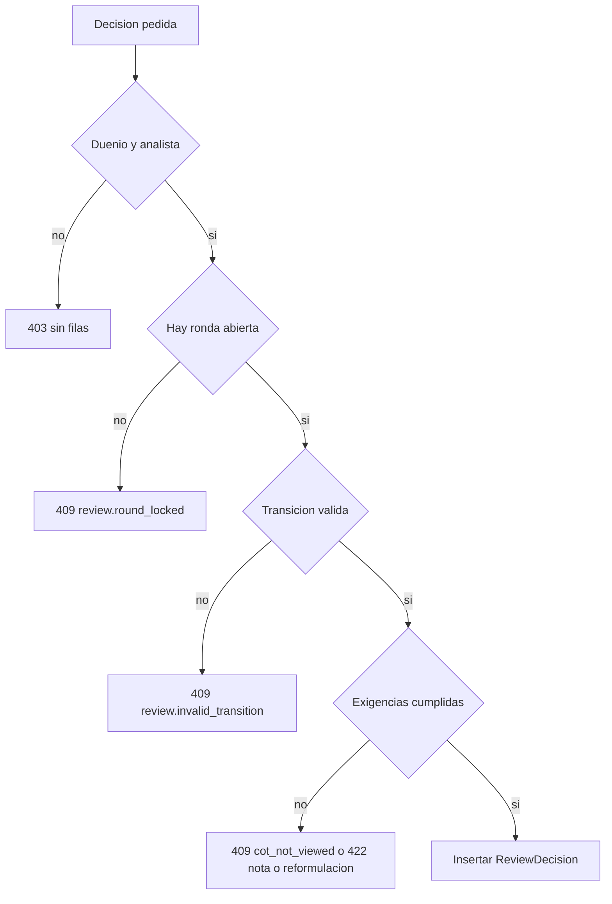
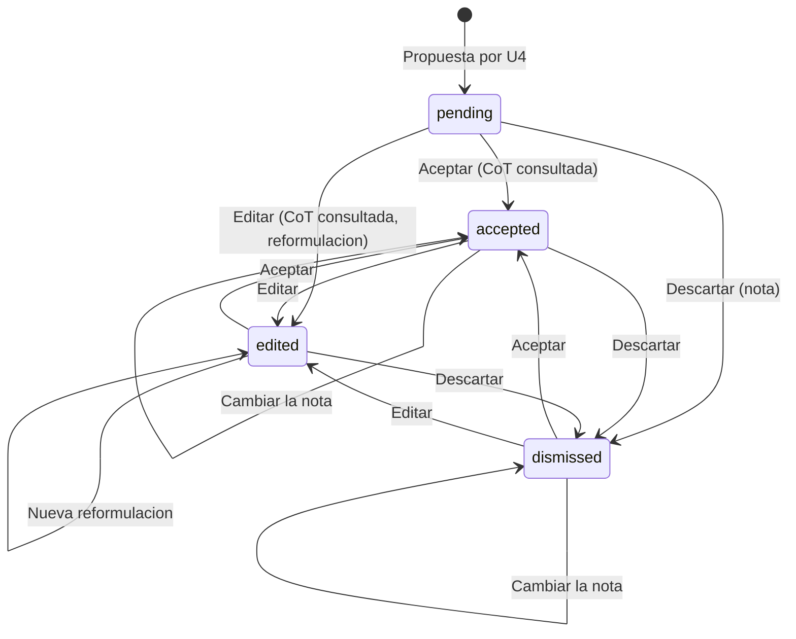
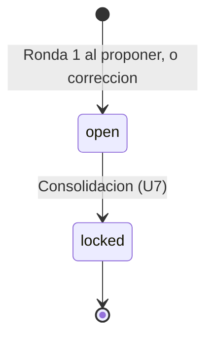
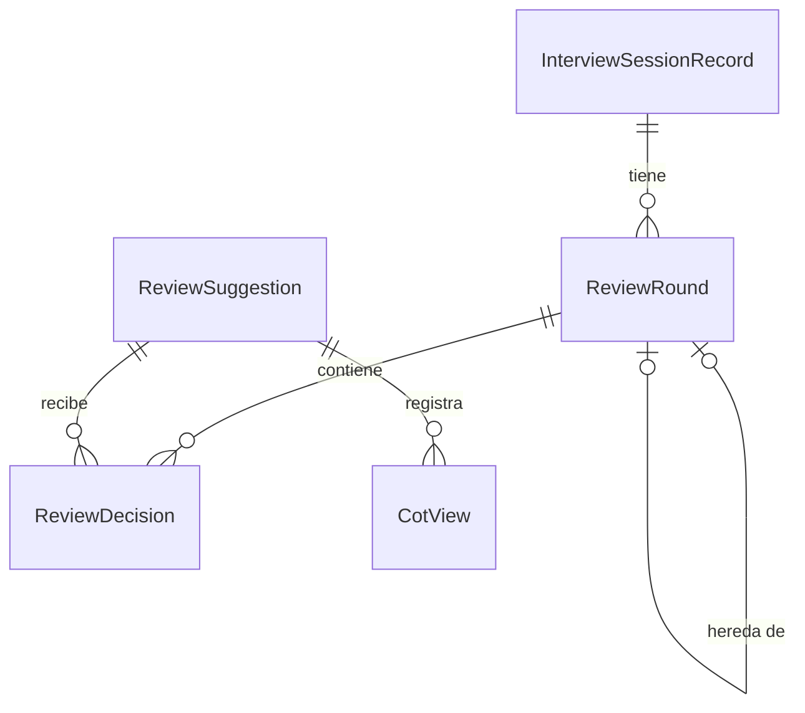

# Especificación funcional — U5 human-review

**Insumos.** Unidad U5 de `inception/units-generation/unit-of-work.md` (unit-of-work) y su mapa de
historias `unit-of-work-story-map.md` (unit-of-work-story-map); FR6, FR1.2 y NFR11 de
`inception/requirements-analysis/requirements.md` (requirements); HumanReview, ADR-003, ADR-007 y
ADR-009 de `inception/domain-design/components.md` (components); C1, C10, C11 y C15 de
`inception/contract-design/contract-summary.md` (contract-summary); ReviewSuggestionCard de
`refined-mockups/interaction-spec.md`; respuesta P1 de `functional-design-questions.md`. Las entidades
están en `entities.md` y las reglas en `rules.md`; este documento es la fuente de verdad de los flujos y
de la máquina de estados.

## 1. Qué hace la unidad

U5 convierte cada sugerencia de la IA en una decisión humana trazable: el dueño de la sesión acepta,
edita o descarta, con la CoT consultada y la nota que corresponda, y cada cambio queda como fila nueva en
una ronda de revisión (AUTONOMIA-03). También entrega a U7 las operaciones de rondas que necesita para
consolidar y corregir (C11).

| Componente | Proceso | Dentro / fuera del clúster | Datos que cruzan la frontera |
|---|---|---|---|
| HumanReview | `session-api` | Dentro | Ninguno sale |
| ConsoleApi (rutas de decisión) | `session-api` | Dentro | Decisiones y CoT hacia el navegador, dentro del clúster |
| AnalystConsole (tarjeta) | `frontend` | Dentro | Solo habla con ConsoleApi |
| Métricas C15 | `session-api` `/metrics` | Dentro | Solo identificadores y contadores |

## 2. Flujos

### F1 — Consultar la CoT

1. El usuario pulsa «Ver justificación (CoT)» en la tarjeta.
2. La consola despliega la CoT y llama `POST /suggestions/{id}/cot-views` (BR1.3).
3. HumanReview inserta `CotView` si no existía ninguno de ese usuario para esa sugerencia.
4. Si el usuario es el dueño, «Aceptar» y «Editar» se habilitan (BR5.1).

### F2 — Decidir sobre una sugerencia (US5.1–US5.3)

1. El dueño elige «Aceptar» (nota opcional), «Editar» (reformulación) o «Descartar» (nota).
2. `POST /suggestions/{id}/decisions`. ConsoleApi exige rol `analista` y dueño (BR1.1).
3. HumanReview, en una transacción:
   1. Busca la ronda `open` de la sesión; si no hay → 409 `review.round_locked` (BR3.1).
   2. Calcula el estado vigente (BR3.2).
   3. Valida la transición (BR2.1).
   4. Valida las exigencias: CoT consultada para aceptar o editar (BR2.2), nota para descartar
      (BR2.3), reformulación para editar (BR2.4).
   5. Inserta `ReviewDecision` con estado anterior, nuevo, actor y hora (BR2.6).
4. Actualiza las métricas (BR4.1) y responde 201 con la sugerencia y su estado vigente.

<!-- Texto alternativo: una decisión de alguien que no es el analista dueño recibe 403 sin filas; sin ronda abierta, 409 review.round_locked; con una transición inválida, 409 review.invalid_transition; sin CoT consultada, nota o reformulación según el caso, 409 o 422; si todo se cumple, se inserta la decisión. -->

### F3 — Cambiar una decisión dentro de la ronda

1. En una tarjeta decidida, el dueño pulsa «Cambiar decisión».
2. Sigue F2 con el estado vigente como estado anterior; las exigencias son las mismas (AC5.1.4).

### F4 — Proponer sugerencias (lo llama U4, C10)

1. U4 llama `SuggestionProposer.propose` dentro de su transacción de ingesta.
2. Si la sesión no tiene rondas → abre la ronda 1 (`initial`, `opened_by` nulo por ser el sistema).
3. Si hay ronda `open` → cada candidata se guarda `pending` en ella (sin `ReviewDecision`).
4. Si todas las rondas están `locked` → rechaza con `review.round_locked` y no guarda nada (BR3.5).

### F5 — Rondas para el reporte (los llama U7, C11)

1. `open_round` devuelve la ronda abierta o nada.
2. `pending_count` cuenta las sugerencias con estado vigente `pending` (BR3.6).
3. `decisions` devuelve el estado vigente, la nota, la reformulación, el actor y la hora de cada una.
4. `lock_round` bloquea la ronda con la versión del reporte; si ya estaba bloqueada → `report.conflict`
   (BR3.4).
5. `open_correction_round` crea la ronda siguiente que hereda de la ronda bloqueada por la versión del
   reporte, o retoma la ya abierta (BR3.3).

## 3. Máquina de estados de una sugerencia (por ronda)

<!-- Texto alternativo: una sugerencia nace pendiente; desde pendiente pasa a aceptada (con CoT consultada), editada (con CoT consultada y reformulación) o descartada (con nota); entre aceptada, editada y descartada se puede cambiar en cualquier dirección con las mismas exigencias; una editada admite una reformulación nueva y aceptada o descartada admiten cambiar su nota; nunca se vuelve a pendiente. Todas las transiciones exigen una ronda abierta. -->

| Desde | Hacia | Exigencia | Error si falta |
|---|---|---|---|
| cualquiera | `pending` | — (prohibida) | 409 `review.invalid_transition` |
| `pending`/`edited`/`dismissed` | `accepted` | CotView del actor | 409 `review.cot_not_viewed` |
| `pending`/`accepted`/`dismissed`/`edited` | `edited` | CotView del actor; reformulación no en blanco | 409 / 422 |
| `pending`/`accepted`/`edited` | `dismissed` | Nota no en blanco | 422 `review.note_required` |
| igual a igual | igual | Cambia la nota o la reformulación | 409 `review.invalid_transition` si no cambia nada |
| cualquiera | cualquiera | Ronda `open` y actor dueño | 409 `review.round_locked` / 403 |

### Ronda

<!-- Texto alternativo: una ronda nace abierta (la 1 al proponer la primera sugerencia, o una de corrección pedida por U7) y pasa a bloqueada al consolidar; bloqueada es final. -->

## 4. Vista derivada: entidades y relaciones

Derivada de `entities.md`.

<!-- Texto alternativo: una sesión tiene rondas; una ronda contiene decisiones; una sugerencia recibe decisiones y registra consultas de su CoT; una ronda de corrección hereda de otra ronda. -->

## 5. Vista derivada: reglas

| Grupo | Reglas | Flujo |
|---|---|---|
| Autorización | BR1.1–BR1.3 | F1, F2 |
| Máquina de estados | BR2.1–BR2.6 | F2, F3 |
| Rondas | BR3.1–BR3.6 | F2, F4, F5 |
| Métricas | BR4.1 | F2 |
| Consola | BR5.1–BR5.5 | F1, F2, F3 |

## 6. Escenarios de negocio y casos límite

| # | Escenario | Resultado esperado | Regla |
|---|---|---|---|
| E1 | Aceptar sin haber desplegado la CoT | 409 `review.cot_not_viewed`; tras desplegar, 201 | BR2.2 |
| E2 | Descartar sin haber desplegado la CoT, con nota | 201 | BR2.2, BR2.3 |
| E3 | Descartar con nota «   » | 422; la sugerencia no cambia | BR2.3 |
| E4 | Editar intentando cambiar la cita | 422; SHA-256 de los 4 campos igual | BR2.4 |
| E5 | Volver a `pending` | 409 | BR2.1 |
| E6 | Otro analista decide | 403, 0 filas | BR1.1 |
| E7 | `admin` decide | 403 | BR1.1 |
| E8 | Decidir con la ronda bloqueada y sin corrección | 409 `review.round_locked` | BR3.1 |
| E9 | Corrección: sugerencia sin decisión nueva | Estado vigente = el de la ronda bloqueada | BR3.2 |
| E10 | Corrección: aceptar algo que en la ronda 1 se descartó, con la CoT ya consultada en la ronda 1 | 201 sin volver a desplegar | BR2.2, P1 = A |
| E11 | Dos consolidaciones simultáneas | Una gana; la otra `report.conflict` | BR3.4 |
| E12 | U4 propone tras la consolidación sin corrección abierta | Rechazo `review.round_locked`; 0 sugerencias | BR3.5 |
| E13 | `UPDATE` sobre `ReviewDecision` | Falla por permisos | BR2.6 |

## 7. Integración con otras unidades

| Unidad | Relación |
|---|---|
| U4 text-flow | Crea `ReviewSuggestion` y llama `propose`; ante `review.round_locked` debe tratar el resultado (ver §9) |
| U7 forensic-report | Usa `open_round`, `pending_count`, `decisions`, `lock_round` y `open_correction_round` (C11) |
| U3 identity-access | Autorización por dueño en ConsoleApi; convención de auditoría |
| U2 platform | Regla AIR sobre las métricas de C15 |

## 8. Errores y bordes

- Toda decisión es una transacción; un fallo no deja una fila a medias.
- Los logs llevan `suggestion_id`, `round_id` y `user_id`, nunca la nota, la reformulación ni la CoT.
- La comprobación de dueño la hace ConsoleApi (ADR-009); HumanReview recibe el actor ya autorizado y
  solo registra quién y cuándo.

## 9. Precisiones a artefactos ya aprobados

| Artefacto | Qué precisa | Origen |
|---|---|---|
| `contract-design/contract-summary.md` (C10) | `propose` rechaza con `review.round_locked` si todas las rondas de la sesión están bloqueadas | BR3.5; hallazgo R-02 de la revisión de U4 |
| Functional Design de U4 (BR5.9) | Reintentar un turno solo se permite si la sesión no está consolidada o tiene una ronda de corrección abierta; si no, 409 | BR3.5 |
| `domain-design/decisions.md` (ADR-007) | La herencia entre rondas es la regla de estado vigente de BR3.2 | ADR-007 lo dejó a esta etapa |
