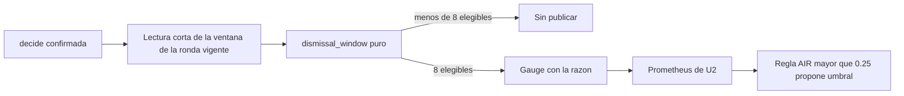

# Diseño de observabilidad — U5 human-review

**Insumos.** `nfr-requirements/performance-requirements.md` (performance-requirements),
`security-requirements.md` (security-requirements), `scalability-requirements.md`
(scalability-requirements), `reliability-requirements.md` (reliability-requirements),
`observability-requirements.md` (observability-requirements) y `tech-stack-decisions.md`
(tech-stack-decisions, D1–D12) de esta unidad; flujos F1–F5 de `functional-design/functional-spec.md`
(functional-spec); C15 y C16 de `inception/contract-design/contract-summary.md` (contract-summary);
respuesta P1 = A de `nfr-design-questions.md`; diseño de U3 (formateador de logs y `request_id`) y de
U2 (Prometheus, Grafana, regla AIR).

## 1. Logs estructurados (NFR15.5)

- Se usa el formateador JSON único de U3 en `libs/` (lista blanca). Cada línea lleva `timestamp`,
  `level`, `service`, `request_id` (U3) y `event`, más solo estos campos de U5: `session_id`,
  `suggestion_id`, `round_id`, `decision_id`, `report_version_id`, `user_id`, `state`, `previous_state`,
  `kind`, `first`, `code`, `duration_ms`. Cualquier otro campo se descarta (precisión en
  reliability-design §7).
- La correlación es por `request_id` dentro de una petición y por `suggestion_id` y `round_id` entre
  peticiones; no hay trazas distribuidas porque U5 vive en un solo proceso.

| Evento | Nivel | Campos |
|---|---|---|
| `review.decision_recorded` | `INFO` | `decision_id`, `suggestion_id`, `round_id`, `previous_state`, `state`, `user_id` |
| `review.decision_rejected` | `INFO` | `suggestion_id`, `user_id`, `code` |
| `review.cot_viewed` | `INFO` | `suggestion_id`, `user_id`, `first` |
| `review.round_opened` | `INFO` | `round_id`, `session_id`, `kind` |
| `review.round_locked` | `INFO` | `round_id`, `report_version_id` |
| *Timeout* de bloqueo o de sentencia | `WARNING` | `code` `system.unavailable`, `duration_ms` |
| `metrics.update_failed` | `WARNING` | `session_id`, `code` |
| Base sin respuesta | `ERROR` | `code` `system.unavailable` |

Los eventos se emiten en el `after_commit` (o tras el *rollback*, para los rechazos), así que un log
`decision_recorded` siempre corresponde a una fila confirmada. **Verificación (nivel 1).** Una prueba
reconstruye la historia de una sugerencia (propuesta, CoT consultada, aceptada, descartada, ronda
bloqueada) solo con los logs capturados, y la cadena centinela de security-design §6 da 0 coincidencias.

## 2. Métricas (NFR15.1–NFR15.4)

| Métrica | Tipo | Etiquetas | Dónde se actualiza |
|---|---|---|---|
| `veridicus_review_decisions_total` | counter | `state` (3 valores) | `after_commit` de `decide` |
| `veridicus_review_rejections_total` | counter | `code` (5 valores) | Manejador de rechazos de las rutas de U5 |
| `veridicus_session_dismissal_ratio` | gauge | `session_id` (UUID) | `after_commit` de `decide`; `remove` en el `after_commit` de `lock_round` |

<!-- Texto alternativo: tras confirmar una decisión, una lectura corta trae la ventana de la ronda vigente; la función pura dismissal_window devuelve sin publicar si hay menos de 8 alertas elegibles o la razón si hay 8; el gauge se publica en Prometheus de U2, cuya regla AIR con umbral mayor que 0,25 solo propone un umbral. -->

- **Ventana (NFR15.2, D8).** `VERIDICUS_AIR_WINDOW = 8`, sobre la ronda vigente con la herencia de
  BR3.2: elegible = estado vigente decidido, o `pending` con una alerta posterior ya decidida
  («ignorada»); razón = (descartadas + ignoradas) / 8 de las 8 más recientes por creación. Sin 8
  elegibles no hay serie.
- **Función pura (NFR15.3).** `human_review/domain/dismissal_window.py` recibe la lista ordenada con su
  estado vigente y devuelve la razón o «sin publicar». Casos de tabla de nivel 0: 7 → sin publicar; 8
  con 2 descartes → 0,25; 8 con 3 → 0,375; 10 → solo las 8 más recientes; `pending` seguida de una
  decidida → ignorada; `pending` al final → no cuenta; corrección sin decisión nueva → estado heredado.
  Nivel 1 de punta a punta: tras 8 decisiones con 3 descartes, `/metrics` muestra `0.375`.
- **Etiquetas validadas** al registrarlas (enum, catálogo de C1, UUID) y prueba de nivel 0 que las
  recorre (NFR10.8).
- **Entrega a U2 (NFR15.4).** `services/session-api/tests/human_review/fixtures/air_series.yaml` con
  una sesión en 0,25 (sin alerta) y otra en 0,375 (con alerta) para `promtool test rules` de U2. La
  regla de U2 compara con `> 0.25`, su anotación es una propuesta y ninguna regla escribe el umbral.

## 3. SLI y objetivos del MVP

| SLI | Fuente | Objetivo |
|---|---|---|
| Latencia de la decisión | p95 de la prueba `perf` de NFR3.1 | ≤ 200 ms |
| Rechazos por CoT no consultada | `veridicus_review_rejections_total{code="review.cot_not_viewed"}` | Informativo; > 0 en uso real indica un cliente que no es la consola |
| Señal AIR | `veridicus_session_dismissal_ratio` | Informativo; U2 propone sobre 0,25 |
| Esperas por bloqueo | Logs `WARNING` con `system.unavailable` en rutas de U5 | 0 en la corrida E2E de nivel 3 |

## 4. Panel y alertas

- **Panel de Grafana (SHOULD, lo instala U2 por PR).** Decisiones por estado (`rate` de
  `veridicus_review_decisions_total`), rechazos por `code` y razón de descarte por sesión, junto al
  panel de U4.
- **Alertas.** Ninguna despierta a alguien en el MVP; la única regla relacionada es la AIR de U2, que
  solo propone.
