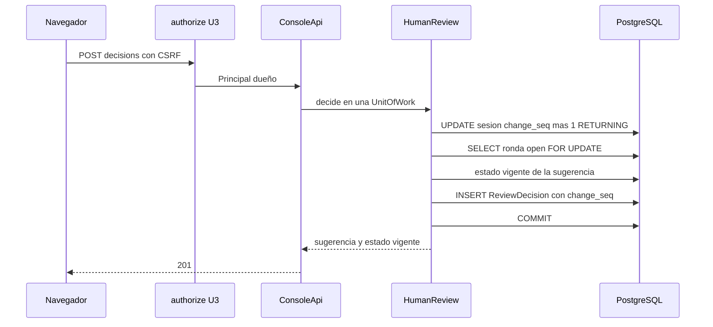

# Diseño de rendimiento — U5 human-review

**Insumos.** `nfr-requirements/performance-requirements.md` (performance-requirements),
`security-requirements.md` (security-requirements), `scalability-requirements.md`
(scalability-requirements), `reliability-requirements.md` (reliability-requirements),
`observability-requirements.md` (observability-requirements) y `tech-stack-decisions.md`
(tech-stack-decisions, D1–D12) de esta unidad; flujos F1–F5 de `functional-design/functional-spec.md`
(functional-spec); C1, C10, C11, C15 y C16 de `inception/contract-design/contract-summary.md`
(contract-summary); respuesta P1 = A de `nfr-design-questions.md`; diseños de U3 (`authorize`) y de U4
(cursor `change_seq`).

U5 no llama a modelos ni a Redis: todo su tiempo es CPU de `session-api` y PostgreSQL. No hay caché:
el estado vigente se calcula siempre desde la base (D2), porque una caché de estados sería una segunda
verdad sobre una tabla de auditoría. Todas las mediciones usan el escenario de performance-requirements
§1 (50 sugerencias, 3 rondas) en la máquina de desarrollo (CPU), con PostgreSQL real en contenedor.

## 1. Camino de una decisión (NFR3.1, NFR3.3, P1 = A)

<!-- Texto alternativo: el navegador envía la decisión con el token anti-CSRF; la dependencia authorize de U3 entrega el principal dueño; ConsoleApi llama a decide dentro de una unidad de trabajo; HumanReview primero incrementa el change_seq de la sesión (lo que bloquea su fila), después bloquea la ronda abierta, calcula el estado vigente, inserta la decisión marcada con ese change_seq y confirma; la respuesta es 201. -->

| Tramo | Sentencias | Presupuesto p95 |
|---|---|---|
| `authorize` de U3 (sesión, CSRF, rol, dueño de la sugerencia) | 2 (sesión web y dueño) | 25 ms (NFR3.2 de U3) |
| Bloqueo de la sesión y `change_seq` (P1 = A) | 1 (`UPDATE … RETURNING`) | 10 ms |
| Ronda `open` con `FOR UPDATE` | 1 | 10 ms |
| Estado vigente de **una** sugerencia y `CotView` del actor | 1 (consulta de D2 filtrada por `suggestion_id`, con `EXISTS` del `CotView`) | 30 ms |
| Validación pura (`state_machine.check`) | 0 | < 1 ms |
| `INSERT` de `ReviewDecision` y `COMMIT` | 1 | 30 ms |
| Respuesta (serialización) | 0 | 10 ms |
| **Total** | **≤ 6** después de `authorize` (NFR3.4) | **≤ 200 ms** (NFR3.1) |

- Los rechazos (NFR3.3) cortan antes: `403` en `authorize` sin abrir la transacción de escritura;
  `409`/`422` de validación del cuerpo antes de tocar la base; `409` de la máquina de estados después
  de leer el estado vigente y con *rollback* (0 filas, p95 ≤ 100 ms).
- Las métricas se actualizan en el `after_commit` (D7) y no cuentan en la respuesta salvo el
  incremento del contador; el recálculo de la ventana es una lectura corta en su propia transacción
  (observability-design §2).
- **Verificación.** `uv run --directory services/session-api pytest tests/human_review -m perf`:
  NFR3.1 p95 ≤ 200 ms con 200 decisiones; NFR3.3 p95 ≤ 100 ms con 50 rechazos por `code` y 0 filas
  nuevas; un contador de sentencias con `before_cursor_execute` comprueba ≤ 6 sentencias.

## 2. Consultas y número fijo de sentencias (NFR3.4, NFR3.5)

| Consulta | Forma | Índice | Meta |
|---|---|---|---|
| Estado vigente de toda la sesión | Una sentencia `DISTINCT ON (suggestion_id)` sobre las decisiones de las rondas con `number ≤ :n`, orden `number DESC, at DESC, seq DESC`, `LEFT JOIN` desde `ReviewSuggestion` (sin decisión → `pending`) | `ReviewDecision (suggestion_id, round_id, at, seq)`; `ReviewRound (session_id, number)` | p95 ≤ 50 ms con 50 sugerencias y 10 rondas; el número de sentencias no cambia con 1, 3 o 10 rondas |
| Estado vigente de una sugerencia | La misma consulta con `WHERE suggestion_id = :id` | Igual | Dentro del tramo de §1 |
| Sugerencias cambiadas desde el cursor (sondeo, P1 = A) | `suggestion_id` con `ReviewSuggestion.change_seq > :c` **o** con alguna decisión de la sesión con `change_seq > :c`; después, la consulta del estado vigente solo para esos ID | `ReviewDecision (round_id, change_seq)` | Suma ≤ 20 ms al sondeo de U4, que sigue en p95 ≤ 200 ms (NFR3.3 de U4) |
| C11 para la consolidación | `open_round(for_update=True)` → `pending_count` → `decisions` → `lock_round` en una transacción | Los anteriores y el único parcial `ReviewRound (session_id) WHERE status = 'open'` | p95 ≤ 150 ms en total (NFR3.5) |

La consulta del estado vigente vive en un solo lugar (`human_review/adapters/effective_state_query.py`)
y la usan `decide`, la vista de sesión de U4, el sondeo y `decisions` de C11; una prueba de propiedad
(Hypothesis) la compara con la función pura `domain/effective_state.py` (D2).

## 3. Rutas ligeras (NFR3.2, NFR3.6)

- **`cot-views`.** `INSERT … ON CONFLICT (suggestion_id, user_id) DO NOTHING` en una transacción sin
  bloqueos de sesión ni de ronda (no cambia el estado vigente ni `change_seq`): p95 ≤ 100 ms, igual la
  primera vez que al repetirla.
- **`/metrics`.** Sirve los valores en memoria de `prometheus-client` sin consultar la base (D7): p95
  ≤ 100 ms con 60 series. Prueba `perf` de nivel 1.

## 4. Consola (NFR3.7, NFR3.8)

| Interacción | Patrón | Umbral y prueba |
|---|---|---|
| Decidir | Mutación de TanStack Query sin actualización optimista (D11); la tarjeta pinta el estado del cuerpo `201` y se invalida la consulta de la sesión, que vuelve con `since=<cursor>` y ya trae la decisión (P1 = A) | Clic → estado visible ≤ 1 s, Playwright nivel 3 |
| Desplegar la CoT | La CoT ya vino con la sesión; el `POST cot-views` va en segundo plano y «Aceptar»/«Editar» se habilitan con el `204` | ≤ 1 s, Playwright; Vitest: siguen deshabilitados si el `POST` falla |

## 5. Contribución al MTTV y recursos (NFR7.1, NFR8.1)

- **MTTV.** 30 `cot-views` + 30 decisiones ≤ 9 s de servidor (≤ 1,5 % de los 10 min). Las horas `at` y
  `viewed_at` salen del reloj inyectable de U3 en UTC (D10), nunca del navegador; U7 las usa para el
  MTTV. Se comprueba con las mediciones de NFR3.1 y NFR3.2.
- **Memoria.** U5 no carga nada pesado: sin modelos, sin cachés y con resultados acotados a una sesión.
  La prueba `perf` de NFR3.1 mide el pico de RSS del proceso API con y sin decisiones: ≤ 32 MiB de
  diferencia. Infrastructure Design suma ese tope a los de U3 y U4 al fijar `limits.memory` de la API
  de `session-api`, con ≥ 20 % de margen.
