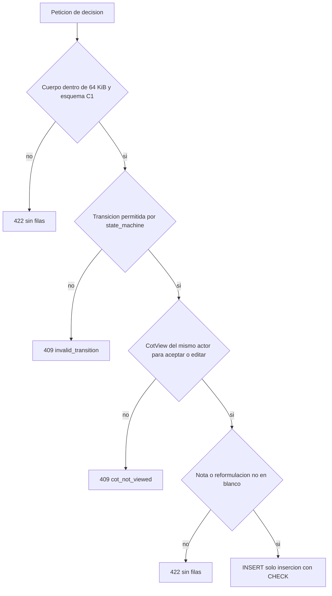

# Diseño de seguridad — U5 human-review

**Insumos.** `nfr-requirements/performance-requirements.md` (performance-requirements),
`security-requirements.md` (security-requirements, amenazas T1–T13), `scalability-requirements.md`
(scalability-requirements), `reliability-requirements.md` (reliability-requirements),
`observability-requirements.md` (observability-requirements) y `tech-stack-decisions.md`
(tech-stack-decisions, D1–D12) de esta unidad; flujos F1–F5 y §8 de
`functional-design/functional-spec.md` (functional-spec); C1, C8, C10, C11 y C15 de
`inception/contract-design/contract-summary.md` (contract-summary); respuesta P1 = A de
`nfr-design-questions.md`; diseño de U1 (catálogo de límites, escáner de C8), U2 (`NetworkPolicy`),
U3 (`authorize`, convención de auditoría) y U4 (`scan`); prácticas de `team.md` y `project.md`.

## 1. Frontera (AUTONOMIA-04, NFR1.1)

| Componente | Dónde corre | Qué datos cruzan su frontera | Destinos permitidos |
|---|---|---|---|
| Rutas `decisions` y `cot-views` de ConsoleApi | API de `session-api`, dentro del clúster | Decisión, nota y reformulación desde el navegador; sugerencia con estado vigente hacia el navegador (C1), por HTTPS del *ingress* de U2 | Navegador |
| HumanReview (`human_review/`) | Módulo de la API de `session-api`, dentro | Llamadas en proceso de U4 (C10) y U7 (C11); filas en PostgreSQL | PostgreSQL |
| Métricas de C15 | `/metrics` en el puerto interno de `session-api`, dentro | Contadores, valores de enum y `session_id` | Prometheus de U2 |
| Tarjeta de sugerencia (AnalystConsole) | Navegador, servida por `frontend` | Solo habla con ConsoleApi | ConsoleApi |

- **Ningún componente de U5 llama fuera del clúster ni a un modelo.** El contrato de import-linter
  `human_review_no_network` prohíbe a `human_review` importar `httpx`, `requests`, `redis`,
  `libs.model_gateway` y `socket`, con un control negativo en la CI (nivel 0). La defensa de fondo es la
  `NetworkPolicy` de salida denegada de U2 sobre `session-api` (política estática de nivel 0 de U2).

## 2. Autorización (NFR10.1, NFR10.2)

- Las dos rutas pasan por la dependencia única `authorize(route_meta)` de U3, con el orden fijo
  sesión → CSRF → rol → dueño, antes de abrir la transacción de escritura.
- C1 declara en ambas `x-veridicus-roles: [analista]` y `x-veridicus-owner-only: true`; el mapa se genera
  desde C1 al arrancar (niega por defecto, U3).
- **Puerto de dueño.** U5 registra en el punto de extensión de U3 el resolvedor
  `suggestion_owner(suggestion_id)`: una consulta `ReviewSuggestion → InterviewSession` que devuelve el
  `owner_user_id` o nada. «Nada» y «otro dueño» responden el **mismo** `403` `session.not_owner`
  (sin filtrar si el ID existe).
- El actor que llega a `ReviewCommands.decide` es siempre el `Principal`; el esquema del cuerpo es
  `additionalProperties: false`, así que `actor_user_id`, `at` o `previous_state` en el cuerpo dan `422`.
- **Verificación (nivel 1).** Otro analista (E6), `admin` (E7), sin sesión (`401`), ID inexistente o de
  otra sesión, y sin `X-CSRF-Token` o con uno distinto (`403` `auth.csrf`): cada caso deja 0 filas en
  `ReviewDecision` y `CotView`.

## 3. Defensa de AUTONOMIA-03 en capas

<!-- Texto alternativo: una petición de decisión primero se valida por tamaño (64 KiB) y por el esquema de C1, si no 422 sin filas; luego la máquina de estados comprueba la transición, si no 409 invalid_transition; para aceptar o editar exige un CotView del mismo actor, si no 409 cot_not_viewed; exige nota o reformulación no en blanco, si no 422; solo entonces inserta en una tabla de solo inserción con restricciones CHECK como segunda barrera. -->

| Control | Dónde | Requisito | Verificación |
|---|---|---|---|
| Máquina de estados pura | `human_review/domain/state_machine.py`, tabla de functional-spec §3 como dato (D1) | BR2.1–BR2.5 | Nivel 0, 100 % de ramas, celda por celda |
| CoT consultada por el **servidor** | `decide` lee el `CotView` (`suggestion_id`, `actor`) en la misma consulta del estado vigente; uno de otro usuario no cuenta | NFR10.3 | Nivel 1: llamada directa sin `CotView` → `409`, 0 filas; tras `cot-views` → `201`; descartar no lo exige |
| Edición sin tocar lo de la IA | El esquema de la decisión no tiene `fragment`, `quote`, `document_id` ni `cot`; la aplicación no tiene `UPDATE` sobre `ReviewSuggestion` | NFR10.4 | Nivel 1: SHA-256 de los 4 campos igual tras 3 ediciones; cuerpo con uno de ellos → `422` |
| Rótulos sin veracidad | Rótulos de estado y recordatorio de BR5.2 solo del catálogo de U1; `scan(text, literal_sources)` de U4 | NFR10.9 | Nivel 0 sobre el catálogo (0 coincidencias); nivel 3 sobre la interfaz con nota y reformulación como `literal_sources` (una nota con término de C8 no se marca; un rótulo con él sí) |

## 4. Entrada acotada (NFR10.5)

- **Catálogo de U1.** Se añaden a `contracts/limits.v1.yaml` `review_text_max_chars: 2000` (dueño U5,
  usado en C1 por `note` y `reformulation`) y `review_body_max_bytes: 65536` (dueño U5). C1 marca ambos
  campos con `maxLength` y `x-veridicus-limit`, y `checks/limits_match.py` exige que coincidan.
  `VERIDICUS_REVIEW_TEXT_MAX_CHARS` se valida al arrancar contra el catálogo (`limits.py`).
- **Lectura acotada (D12).** Una dependencia de las rutas de U5 lee el cuerpo por bloques y corta al pasar
  65 536 bytes con `422` `validation.invalid_request`, antes de Pydantic.
- **«En blanco» (D6).** `str.strip()` de Python es la autoridad; nota en blanco al descartar →
  `422` `review.note_required`; reformulación en blanco → `422` `validation.invalid_request`;
  `reformulation` con un estado distinto de `edited` → `422`.
- **Verificación.** Nivel 0: Hypothesis con cadenas de solo espacios Unicode (U+00A0, U+3000, U+2003…)
  y límites 2 000 / 2 001 caracteres; nivel 1: cuerpo de 65 537 bytes → `422` y 0 filas.

## 5. Integridad en la base (NFR11.1–NFR11.4)

| Barrera | Diseño | Verificación |
|---|---|---|
| Solo inserción | Rol `veridicus_app`: `INSERT`, `SELECT` en `review_decision` y `cot_view`; ambas registradas en `AuditConvention` de U3 | Prueba común de U3 (`-k audit_convention`): `UPDATE`, `DELETE`, `TRUNCATE` fallan (E13) |
| `CHECK` de texto | `state <> 'dismissed' OR length(btrim(note)) > 0`; `state <> 'edited' OR length(btrim(reformulation)) > 0` | Nivel 1: una inserción directa que viola cada `CHECK` falla |
| Ronda definitiva | `UPDATE` solo sobre `status`, `locked_by_report_version_id`, `locked_at`; sin `DELETE`; *trigger* `review_round_locked_is_final` que rechaza cualquier `UPDATE` de una fila `locked`; único parcial de ronda `open` por sesión | Nivel 1: volver a `open`, cambiar la versión o abrir otra ronda fallan |
| Nada después de bloquear | `decide` exige ronda `open` bajo el bloqueo de la sesión y de la ronda (P1 = A); `propose` rechaza con todas las rondas `locked` | Nivel 1: E8, E12 y la consulta «ninguna `at` posterior a `locked_at`» en la prueba de concurrencia de NFR10.12 |
| Umbral intocable | La regla estática de U3 (NFR11.2 de U3) cubre `human_review`: ningún código escribe el umbral; U5 solo publica métricas | Nivel 0 |

Las tablas, permisos, *trigger* e índices entran por la migración de U5 en su propio PR y corren como
`Job` aparte, nunca al arrancar el pod (AUTONOMIA-01; prohibición de `project.md`).

## 6. Texto del analista fuera de logs, errores y métricas (NFR10.6–NFR10.8, NFR12.1)

- **Logs.** El formateador de lista blanca de U3 en `libs/` solo emite los campos de identificadores de
  observability-design §1; el *engine* usa `hide_parameters=True` (D5), así que una violación de
  restricción no imprime la nota.
- **Errores.** Un solo manejador traduce la jerarquía de excepciones de `libs/` a Problem Details con el
  `code` de C1 y el `detail` del catálogo de U1; nunca se interpola el texto recibido.
- **Métricas.** Las etiquetas se validan contra su patrón al registrarlas (enum de C10, catálogo de C1,
  UUID para `session_id`).
- **Verificación (nivel 1).** Una cadena centinela sembrada en nota, reformulación y CoT da 0
  coincidencias en los logs capturados (caminos `201`, `403`, `409`, `422` y violación de `CHECK`), en
  los cuerpos de error y en la salida de `/metrics`. Nivel 0: prueba que recorre las series registradas
  y valida cada etiqueta.
- **Datos sintéticos.** Los *fixtures* de `services/session-api/tests/human_review/` usan el catálogo de
  nombres sintéticos de U1; su comprobación da 0 hallazgos (nivel 0).

## 7. Amenazas y controles

| Amenaza | Control principal | Sección |
|---|---|---|
| T1 IDOR | `authorize` + `suggestion_owner` | §2 |
| T2 CSRF | Anti-CSRF de U3 | §2 |
| T3 Aceptar a ciegas | `CotView` comprobado en el servidor | §3 |
| T4 Reescribir lo de la IA | Esquema sin esos campos; sin `UPDATE` | §3 |
| T5 Suplantar actor u hora | `Principal` y reloj del servidor; `additionalProperties: false` | §2 |
| T6 Cuerpos enormes | 64 KiB y 2 000 caracteres del catálogo | §4 |
| T7, T8 Fugas de texto | Lista blanca, `hide_parameters`, etiquetas validadas | §6 |
| T9 Etiqueta de veracidad | Catálogo y `scan` | §3 |
| T10 Repudio | Solo inserción, actor y hora no nulos | §5 |
| T11, T12 Ronda bloqueada | Bloqueos y *trigger* | §5 |
| T13 AIR cambia el umbral | Regla estática de U3 | §5 |
