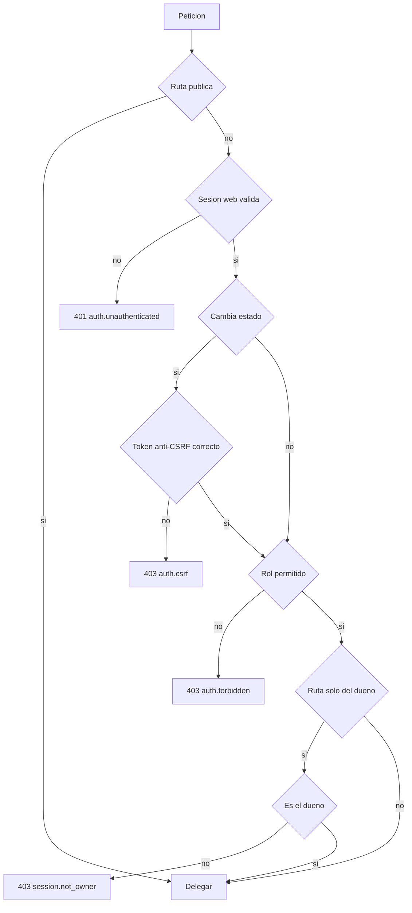
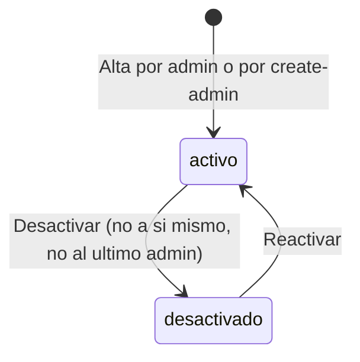
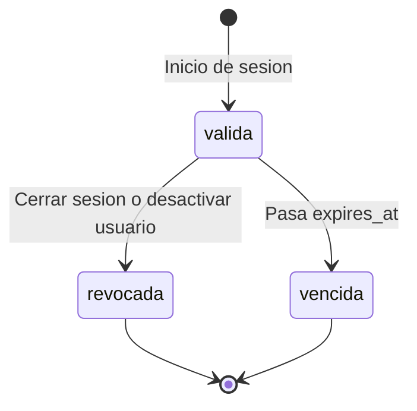
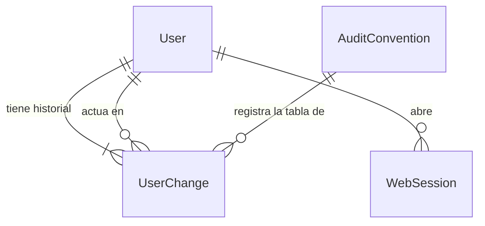

# Especificación funcional — U3 identity-access

**Insumos.** Unidad U3 de `inception/units-generation/unit-of-work.md` (unit-of-work) y su mapa de
historias `unit-of-work-story-map.md` (unit-of-work-story-map); FR1, FR9, NFR10 y NFR11 de
`inception/requirements-analysis/requirements.md` (requirements); IdentityAccess, ConsoleApi,
ADR-003, ADR-004 y ADR-009 de `inception/domain-design/components.md` (components); C1 y C12 de
`inception/contract-design/contract-summary.md` (contract-summary); pantallas M0 y M6 de
`refined-mockups/mockups.md`; respuestas P1–P3 de `functional-design-questions.md`. Las entidades están
en `entities.md` y las reglas en `rules.md` (fuentes de verdad); este documento es la fuente de verdad
de los flujos y las máquinas de estado.

## 1. Qué hace la unidad

U3 deja la base sobre la que se apoyan las demás unidades: quién es el usuario (inicio de sesión y
sesión web), qué puede hacer (matriz de FR1.2 aplicada en ConsoleApi, ADR-009), quién gestiona usuarios
(el `admin`), cómo nace el primer `admin` (P1) y cómo se garantiza que ningún historial se reescriba
(convención de ADR-003 con su prueba común). También fija que el umbral nunca se escribe desde la
consola (AC8.3.1–AC8.3.3).

| Componente | Proceso | Dentro / fuera del clúster | Datos que cruzan la frontera |
|---|---|---|---|
| IdentityAccess | `session-api` | Dentro | Ninguno sale del clúster |
| ConsoleApi (autenticación y autorización) | `session-api` | Dentro | Cookie y respuestas al navegador del analista, dentro del clúster (C1) |
| AnalystConsole (M0, M6) | `frontend` estático | Dentro | Solo habla con ConsoleApi (ADR-004) |
| Comando `create-admin` | `Job` de `session-api` | Dentro | Lee usuario y contraseña de un Secret; no los registra |

## 2. Flujos

### F1 — Iniciar sesión (US8.1)

1. El usuario envía usuario y contraseña desde M0 (`POST /auth/login`).
2. IdentityAccess normaliza el usuario y busca el `User`.
3. Si no existe, verifica la contraseña contra un hash señuelo; si existe, contra su `password_hash`.
4. Si no coincide, el usuario no existe o está desactivado → `401` `auth.invalid_credentials`, mismo
   cuerpo en los tres casos (BR1.2). M0 muestra «Usuario o contraseña incorrectos.» y lleva el foco al
   mensaje.
5. Si coincide → crea la `WebSession` con su token anti-CSRF y responde `204` con la cookie (BR1.3).
6. La consola llama `GET /auth/me` para obtener rol y token anti-CSRF.
7. Navega según BR1.7: de vuelta a la ruta guardada si venía de una sesión vencida del mismo usuario
   (AC8.1.5); si no, `analista` → M1 lista de sesiones, `admin` → M6 gestión de usuarios (AC8.1.1).

### F2 — Validar cada petición (ConsoleApi, toda ruta)

1. Si la ruta es pública (`/auth/login`, `/healthz`, `/readyz`) → delegar.
2. Resolver la cookie (`Authenticator.resolve`, C12). Sin cookie, revocada, vencida o usuario
   desactivado → `401` `auth.unauthenticated` (BR1.4). La consola guarda la ruta actual y va a M0.
3. Si el método cambia estado, comparar `X-CSRF-Token` → si no coincide, `403` `auth.csrf` (BR1.5).
4. Si la ruta declara `x-veridicus-roles` y el rol no está → `403` `auth.forbidden` (BR4.1).
5. Si la ruta declara `x-veridicus-owner-only` y el principal no es el dueño → `403`
   `session.not_owner` (BR4.2; la consulta del dueño la aporta la unidad dueña de la ruta).
6. Delegar con el `Principal` ya autorizado; ningún rechazo crea filas.

<!-- Texto alternativo: una petición a una ruta pública se delega; si no, sin sesión web válida responde 401; si cambia estado y el token anti-CSRF no coincide, 403 auth.csrf; si el rol no está permitido, 403 auth.forbidden; si la ruta es solo del dueño y el usuario no lo es, 403 session.not_owner; en otro caso se delega. -->

### F3 — Cerrar sesión

1. `POST /auth/logout` con token anti-CSRF.
2. Se fija `revoked_at` en la `WebSession` y responde `204` (BR1.6).

### F4 — Crear un usuario (US8.2)

1. El `admin` abre «Crear usuario» en M6 y envía usuario, rol y contraseña inicial (`POST /users`).
2. F2 autoriza solo a `admin` (BR2.1).
3. Si el nombre ya existe sin distinguir mayúsculas → `409` `user.duplicate_username` (BR2.3).
4. Guarda el `User` activo con el hash y, en la misma transacción, `UserChange created` con el `admin`
   como actor (BR2.2, BR2.8). Responde `201`.

### F5 — Desactivar o reactivar un usuario

1. El `admin` pulsa «Desactivar» en M6; la consola confirma con «El usuario no podrá entrar; sus
   acciones pasadas conservan su autoría».
2. `PATCH /users/{user_id}` con `active: false`.
3. Si es el propio principal → `409` `user.self_deactivation` (BR2.5).
4. En una transacción con bloqueo sobre los `admin` activos: si es el último `admin` activo → `409`
   `user.last_admin` (BR2.6).
5. Fija `active = false`, revoca sus `WebSession` e inserta `UserChange deactivated` (BR2.4, BR2.8).
6. Reactivar (`active: true`) inserta `UserChange reactivated`; no restaura sesiones web.

### F6 — Cambiar el rol de un usuario

1. `PATCH /users/{user_id}` con `role`.
2. Si pasa de `admin` a `analista` y es el último `admin` activo → `409` `user.last_admin` (BR2.6).
3. ConsoleApi pregunta al puerto de sesiones de InterviewSession cuántas sesiones del usuario están
   `open`, `suspended` o `finalized` sin consolidar; si hay alguna → `409` `user.has_open_sessions`
   (BR2.7). La consulta va en ConsoleApi, no en IdentityAccess, para no crear dependencia de
   IdentityAccess hacia InterviewSession (mismo criterio que ADR-009).
4. Cambia el rol e inserta `UserChange role_changed` con rol anterior y nuevo (BR2.8).

Mientras U4 no exista, el puerto de sesiones no tiene tabla que leer y su adaptador devuelve 0; la
prueba de BR2.7 con sesiones reales entra en el PR de U4 que crea la tabla de sesiones.

### F7 — Crear el primer `admin` (P1)

1. El humano crea el Secret con usuario y contraseña desde su `.env` no versionado (team-practices).
2. Aplica a mano el manifiesto del `Job` `create-admin`, que entró antes por PR (AUTONOMIA-01).
3. El comando comprueba, en una transacción, que no hay ningún `admin` activo (BR3.1).
4. Si lo hay → termina con código distinto de 0 y no cambia nada.
5. Si no → crea el `admin` e inserta `UserChange created` con `actor_kind: system`.
6. El comando no imprime la contraseña ni la escribe en logs (BR1.1).

### F8 — Verificar la convención de auditoría (US8.4, prueba común de nivel 1)

1. La prueba lee el registro de `AuditConvention` (tablas de historial de todas las unidades).
2. Comprueba que no existe una tabla de historial sin registrar (BR6.3).
3. Por cada tabla registrada: intenta un `INSERT` con actor nulo y otro con hora nula → ambos fallan
   (BR6.1).
4. Con el usuario de la aplicación, intenta `UPDATE` y `DELETE` sobre una fila → ambos fallan por
   permisos (BR6.2).

### F9 — Cambiar el umbral (US8.3)

1. El `admin` abre un PR que cambia el valor del umbral en la configuración del despliegue (`deploy/`).
2. La CI corre la regla estática de BR5.2 y la validación del OpenAPI de BR5.1.
3. El autor revisa y fusiona; la fusión en `main` protegida es la aprobación registrada (BR5.3).
4. El humano aplica el artefacto fusionado (o Argo CD sincroniza desde el Módulo 8). Las sesiones ya
   abiertas conservan su instantánea del umbral (ADR-006).

## 3. Máquinas de estado

### Usuario

<!-- Texto alternativo: un usuario nace activo por alta de un admin o por el comando create-admin; pasa a desactivado si un admin lo desactiva (nunca a sí mismo ni al último admin activo); vuelve a activo si se reactiva. -->

| Desde | Hacia | Quién | Guardia | Efecto |
|---|---|---|---|---|
| — | activo | `admin` o `create-admin` | Nombre único; `create-admin` solo sin `admin` activo | `UserChange created` |
| activo | desactivado | `admin` | No es él mismo; no es el último `admin` activo | Revoca sesiones web; `UserChange deactivated` |
| desactivado | activo | `admin` | — | `UserChange reactivated` |
| activo | activo (cambio de rol) | `admin` | No el último `admin`; sin sesiones pendientes | `UserChange role_changed` |

### Sesión web

<!-- Texto alternativo: una sesión web nace válida al iniciar sesión; queda revocada al cerrar sesión o al desactivar al usuario; queda vencida al pasar su hora de expiración; ambos estados son finales. -->

## 4. Vista derivada: entidades y relaciones

Derivada de `entities.md` (la fuente de verdad es su bloque YAML).

<!-- Texto alternativo: un usuario tiene uno o más cambios en su historial y cero o más sesiones web; un usuario actúa como autor de cero o más cambios de otros usuarios; la convención de auditoría registra la tabla del historial de usuarios. -->

## 5. Vista derivada: reglas

Derivada de `rules.md` (la fuente de verdad es su bloque YAML).

| Grupo | Reglas | Flujo |
|---|---|---|
| Autenticación | BR1.1–BR1.7 | F1, F2, F3 |
| Gestión de usuarios | BR2.1–BR2.8 | F4, F5, F6 |
| Primer `admin` | BR3.1–BR3.2 | F7 |
| Matriz de roles | BR4.1–BR4.3 | F2 |
| Umbral | BR5.1–BR5.3 | F9 |
| Auditoría | BR6.1–BR6.3 | F8 |
| Accesibilidad de M0 y M6 | BR7.1–BR7.3 | F1, F4, F5 (interfaz, §6) |

## 6. Interfaz (M0 y M6)

| Pantalla | Estados y textos | Reglas |
|---|---|---|
| M0 Inicio de sesión | Inicial; Cargando («Entrando…»); Error de credenciales («Usuario o contraseña incorrectos.», foco al mensaje); Error del sistema («No se pudo conectar con el servidor. Intenta de nuevo.»); Sesión web vencida (vuelve a la ruta guardada) | BR1.2, BR1.7 |
| M6 Gestión de usuarios | Tabla usuario / rol / estado / acciones; «Crear usuario» (usuario, rol, contraseña inicial); «Desactivar» con confirmación modal; mensajes de `409` para último `admin`, autodesactivación, nombre duplicado y sesiones pendientes; ningún control de umbral | BR2.1–BR2.7, BR5.1 |

Ambas pantallas entran en la suite `axe` que entrega U4 (US5.6; BR7.1–BR7.3: 0 violaciones serious o critical, todo operable con teclado y estados con texto o icono además del color) y pasan el escaneo del catálogo de
mensajes con la lista de vocabulario prohibido de U1.

## 7. Escenarios de negocio y casos límite

| # | Escenario | Resultado esperado | Regla |
|---|---|---|---|
| E1 | Usuario inexistente / contraseña errónea / usuario desactivado | `401`, mismo cuerpo byte a byte | BR1.2 |
| E2 | Contraseña sembrada buscada en todas las columnas de texto y en los logs | 0 coincidencias; prefijo de hash adaptativo | BR1.1 |
| E3 | Cada ruta del OpenAPI salvo login y salud, sin cookie | `401` | BR1.4 |
| E4 | `POST` sin `X-CSRF-Token` | `403` `auth.csrf`, sin filas | BR1.5 |
| E5 | `analista` llama `POST /users` | `403` `auth.forbidden`, sin filas | BR2.1, BR4.1 |
| E6 | Usuario desactivado con cookie vigente | `401`; sus filas de historial siguen con su autoría | BR2.4 |
| E7 | `admin` se desactiva a sí mismo | `409` `user.self_deactivation` | BR2.5 |
| E8 | Dos `admin` desactivan a la vez al otro, siendo los dos únicos | Uno gana, el otro recibe `409` `user.last_admin` | BR2.6 |
| E9 | Cambiar a `admin` a un analista con una sesión abierta | `409` `user.has_open_sessions` | BR2.7 |
| E10 | `create-admin` con un `admin` activo ya creado | Termina con error; nada cambia | BR3.1 |
| E11 | Copia del OpenAPI con `PATCH /config/threshold` | Suite de nivel 0 en rojo | BR5.1 |
| E12 | Un módulo fuera del cargador asigna el umbral | Regla estática en rojo | BR5.2 |
| E13 | `UPDATE` sobre `UserChange` con el usuario de la aplicación | Falla por permisos | BR6.2 |
| E14 | Migración nueva con una tabla de historial no registrada | Prueba común en rojo | BR6.3 |
| E15 | Sesión web vence con una entrevista abierta; el mismo analista vuelve a entrar | Vuelve a esa sesión sin pérdida | BR1.7 |

## 8. Integración con otras unidades

| Unidad | Qué recibe de U3 |
|---|---|
| U1 contracts | Los `code` nuevos `user.duplicate_username`, `user.self_deactivation`, `user.last_admin`, `user.has_open_sessions` (cambio menor del catálogo, por PR de U1) |
| U4, U5, U6, U7 | El mecanismo de F2 para sus rutas (`x-veridicus-roles`, `x-veridicus-owner-only`) y la convención de auditoría con su prueba común (registran sus tablas) |
| U4 InterviewSession | El puerto de lectura «sesiones pendientes del usuario» que usa F6, implementado cuando existe la tabla de sesiones |
| U2 platform | El manifiesto del `Job` `create-admin` y la referencia a su Secret |

## 9. Errores y bordes

- Toda E/S con la base lleva *timeout* explícito; un error de base en el inicio de sesión responde
  Problem Details de error del sistema, nunca un `401` que confunda al usuario.
- Los logs llevan `user_id`, nunca nombre de usuario ni contraseña (NFR10).
- El hash señuelo de BR1.2 evita que el tiempo de respuesta revele si el usuario existe.

## 10. Precisiones a artefactos ya aprobados

Estas decisiones de la etapa precisan artefactos ya aprobados. No los edité; decides en la aprobación si
se actualizan.

| Artefacto | Qué precisa | Origen |
|---|---|---|
| `contract-design/contract-summary.md` (C1 `ErrorCode`) | Añade `user.duplicate_username`, `user.self_deactivation`, `user.last_admin`, `user.has_open_sessions` y la respuesta `409` de `POST /users` y `PATCH /users/{user_id}` | P2 = A, P3 = A |
| `contract-design/contract-summary.md` (C11/C12) | Añade un puerto en proceso de InterviewSession hacia ConsoleApi: «cuántas sesiones pendientes tiene el usuario» | P3 = A |
| `contract-design/contract-summary.md` (C12) | `UserChange` admite `actor_kind: system` solo para el alta del primer `admin` | P1 = A |
