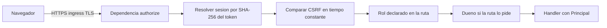

# Diseño de seguridad — U3 identity-access

**Insumos.** `nfr-requirements/performance-requirements.md` (performance-requirements),
`security-requirements.md` (security-requirements), `scalability-requirements.md`
(scalability-requirements), `reliability-requirements.md` (reliability-requirements),
`observability-requirements.md` (observability-requirements) y `tech-stack-decisions.md`
(tech-stack-decisions, D1–D12) de esta unidad; flujos F1–F9 de `functional-design/functional-spec.md`
(functional-spec); C1, C12, C15 y C16 de `inception/contract-design/contract-summary.md`
(contract-summary); respuestas P1–P2 de `nfr-design-questions.md`; diseño de seguridad de U1
(catálogo de límites y huella de seguridad) y prácticas de `team.md` y `project.md`.

## 1. Frontera (AUTONOMIA-04)

| Componente | Dónde corre | Datos que cruzan su frontera |
|---|---|---|
| `IdentityAccess` (`application/`, `domain/`) | `session-api`, namespace `veridicus` | Ninguno sale del clúster |
| Dependencia de autorización de ConsoleApi (`api/`) | `session-api` | Cookie, anti-CSRF y respuestas al navegador, dentro del clúster |
| Adaptadores PostgreSQL y Redis (`adapters/`) | `session-api` hacia servicios internos | Hashes, tokens en SHA-256, claves HMAC y contadores |
| `Job` `create-admin` | Dentro del clúster | Usuario y contraseña desde un Secret; no se imprimen |

Datos guardados: nombres de usuario y hashes Argon2id (confidencial); tokens de sesión solo como
SHA-256 (restringido). La salida a internet la niega la `NetworkPolicy` de U2 (NFR1.1). Todo
usuario de las pruebas y de los datos de demostración sale del catálogo sintético de U1 y se declara
en `mentions` (NFR12.1).

## 2. Defensa en profundidad de una petición (F2)

<!-- Texto alternativo: la petición llega por HTTPS al ingress; la dependencia authorize resuelve la sesión por el SHA-256 del token, compara el token anti-CSRF en tiempo constante, comprueba el rol declarado en la ruta y, si la ruta lo pide, que el usuario sea el dueño; solo entonces el handler recibe el Principal. -->

- **Una sola dependencia** `authorize(route_meta)` de FastAPI, registrada como dependencia global del
  router de `/api/v1`. Lee de la ruta los metadatos que vienen del contrato (`x-veridicus-roles`,
  `x-veridicus-owner-only`) en un mapa generado al arrancar desde C1, no escritos a mano.
- **Niega por defecto (NFR10.9).** Al arrancar, `session-api` compara sus rutas con C1: una ruta no
  pública sin roles declarados, o una ruta del código que no existe en C1, impide arrancar. En ejecución,
  una ruta sin metadatos responde `403` `auth.forbidden`.
- **Orden fijo**: sesión → CSRF → rol → dueño. Cada rechazo es Problem Details y ocurre antes de abrir
  cualquier transacción de escritura (0 filas).
- La consulta del dueño la aporta la unidad dueña de la ruta mediante un puerto registrado; U3 solo
  define el punto de extensión (ADR-009).

## 3. Contraseñas

| Control | Diseño | Requisito |
|---|---|---|
| Hash | `argon2-cffi` `PasswordHasher(time_cost=3, memory_cost=65536, parallelism=1, hash_len=32, salt_len=16)` con parámetros de la configuración validada (mínimos de OWASP) | NFR10.1 |
| Re-hash | Tras una verificación correcta, `check_needs_rehash` y, si hace falta, actualizar el hash en la misma transacción que crea la sesión web | NFR10.1 |
| Política | Validador puro en `domain/password_policy.py`; lista común en `services/session-api/data/common-passwords.txt` comprobada contra su SHA-256 al arrancar; máximo 128 caracteres antes de calcular el hash | NFR10.2 |
| Usuario inexistente | Hash señuelo calculado al arrancar con una contraseña aleatoria y los mismos parámetros; misma ruta de código y mismo semáforo | NFR10.6 |
| Respuesta | Un único constructor de la respuesta `401` para los tres casos de E1 | NFR10.6 |

## 4. Sesión web y anti-CSRF

- Token de sesión y token anti-CSRF: `secrets.token_urlsafe(32)` cada uno (D8). Del token de sesión,
  la base solo guarda `token_sha256` y la búsqueda es por igualdad de hash. El token anti-CSRF se
  guarda en la fila de la sesión, porque por sí solo no da acceso sin la cookie, y se compara con
  `hmac.compare_digest` (NFR10.4).
- Cookie `veridicus_session`: `HttpOnly`, `Secure`, `SameSite=Strict`, `Path=/`, `Max-Age=43200`, con
  `max_age` leído del catálogo de límites de U1 (`web_session_max_age_s`). `Secure` exige HTTPS:
  el *ingress* termina TLS (diseño de seguridad de U2).
- Validez: `revoked_at IS NULL AND now() < created_at + max AND now() < last_seen_at + idle`, con
  `last_seen_at` escrito en cada petición autenticada (P1 = A) y reloj inyectable (D12).
- Al desactivar un usuario: `UPDATE web_session SET revoked_at = now() WHERE user_id = :id AND
  revoked_at IS NULL` en la misma transacción que el cambio (F5).
- `GET /auth/me`, `/auth/login` y `/auth/logout` responden `Cache-Control: no-store` (NFR10.10).

## 5. Limitador de intentos (NFR10.5)

| Clave en Redis | Valor | Caducidad |
|---|---|---|
| `veridicus:auth:fail:u:<HMAC-SHA256(usuario normalizado)>` | contador | 900 s desde el primer fallo |
| `veridicus:auth:fail:ip:<HMAC-SHA256(dirección de origen)>` | contador | 900 s desde el primer fallo |

- Antes de verificar: si cualquiera de los dos contadores ≥ 5 → `429` `auth.too_many_attempts` con
  `Retry-After` = TTL restante, sin tocar la base ni Argon2id.
- Tras un fallo: `INCR` + `EXPIRE NX 900` en un *pipeline*. Tras un éxito: `DEL` del contador del
  usuario (el de la dirección no se borra).
- Dirección de origen: la del par TCP, salvo que venga de `VERIDICUS_TRUSTED_PROXY` (el *ingress*);
  en ese caso, el último salto de `X-Forwarded-For` añadido por el proxy.
- Redis caído: falla cerrado (`503`), nunca deja pasar (reliability-design §2).

## 6. Datos sensibles fuera de logs y columnas (NFR10.7)

- Un filtro del *logger* raíz descarta cualquier campo llamado `password`, `token`, `cookie`,
  `username` o `authorization`, y el formateador JSON solo emite los campos de observability-design.
- Las excepciones de validación de Pydantic se traducen sin el valor de entrada (`input` se omite).
- Prueba E2 de nivel 1: contraseña y tokens sembrados, búsqueda en todas las columnas de texto y en los
  logs capturados: 0 coincidencias.

## 7. `create-admin` (NFR10.8, AUTONOMIA-01)

`python -m session_api.cli.create_admin` lee `VERIDICUS_BOOTSTRAP_ADMIN_USERNAME` y
`VERIDICUS_BOOTSTRAP_ADMIN_PASSWORD` desde `secretKeyRef`, valida la política, abre una transacción con
`SELECT … FOR UPDATE` sobre los `admin` activos y termina con código 2 si existe alguno. Su `Job` (de
U2) corre sin root, con `backoffLimit: 0`, `ttlSecondsAfterFinished: 600` y sin
`automountServiceAccountToken`. Nunca se ejecuta desde la CI.

## 8. Integridad del historial (NFR11.1, NFR11.2)

- `user_change` con `actor_user_id` y `at` `NOT NULL` (salvo `actor_kind = 'system'` con
  `CHECK`), registrada en `AuditConvention`. La migración concede al rol de la aplicación solo
  `INSERT, SELECT` sobre la tabla (`REVOKE UPDATE, DELETE`).
- Umbral: una regla de import-linter y una prueba AST impiden que un módulo fuera de
  `config/loader.py` asigne el ajuste del umbral (E12); la ausencia de rutas la prueba U1.

## 9. Amenazas y controles

| Amenaza (security-requirements) | Controles de este diseño |
|---|---|
| T1 Probar contraseñas | Limitador §5; Argon2id §3 |
| T2 Ataque fuera de línea | Argon2id con 64 MiB; tokens solo en SHA-256 |
| T3 Robo de la cookie | `HttpOnly`, `Secure`, `SameSite=Strict`, TLS en el *ingress*, caducidad doble |
| T4 CSRF | `SameSite=Strict` más token comparado en tiempo constante |
| T5 Enumerar usuarios | Respuesta única y señuelo con el mismo costo |
| T6 Ruta sin rol | Mapa generado desde C1 y arranque fallido ante una ruta sin roles |
| T7 Usuario desactivado | Revocación en la misma transacción; sin caché |
| T8 Secretos en logs | Filtro de *logger* y prueba E2 |
| T9 Reescribir historial | Permisos `INSERT, SELECT` y `AuditConvention` |
| T10 Memoria por Argon2id | Semáforo de 2 con espera de 5 s (performance-design §2) |

## 10. Precisiones a artefactos ya aprobados

No edité ningún artefacto aprobado; decides en la aprobación si se actualizan.

| Artefacto | Qué precisa | Origen |
|---|---|---|
| `nfr-requirements/tech-stack-decisions.md` (§2) | Nuevo ajuste `VERIDICUS_ARGON2_QUEUE_SECONDS` (por defecto 5, entero 1–30) | P2 = A |
| `contract-design/contract-summary.md` (C1 `/auth/login`) | La respuesta `503` `system.unavailable` lleva `Retry-After` también cuando la causa es la cola del semáforo | P2 = A |
