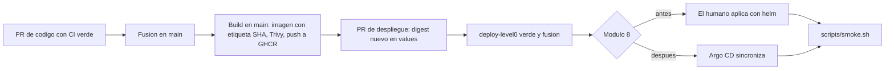

# Pipeline de CI/CD — U2 platform

**Insumos.** Dónde se aplican las políticas, nada aplica cambios al clúster, imágenes y Secrets de
`nfr-design/security-design.md` (security-design §4, §6, §8 y §9); comandos de verificación y D3–D11
de `nfr-requirements/tech-stack-decisions.md`; NFR1.1–NFR15.1 de
`nfr-requirements/security-requirements.md`; C14–C16 de `inception/contract-design/contract-summary.md`
(contract-summary); procesos desplegables de `inception/domain-design/components.md` (components) y
de `unit-of-work.md`; `infrastructure-specification.md` y `monitoring-design.md` de esta carpeta;
respuestas P1–P5 de `infrastructure-design-questions.md`; `## Way of Working`, `## Testing Posture`,
`## Deployment` y `## Code Style` de `team.md`.

Este documento cubre lo que es de la plataforma: la validación de `deploy/` y `scripts/`, cómo llega
una imagen ya construida al clúster, el orden de despliegue y la reversión. La construcción y las
pruebas de cada servicio las define su unidad (U3 para `session-api`).

## 1. Principios

- **La CI no despliega.** Ningún *workflow* tiene `kubeconfig` ni credenciales del clúster; todos
  declaran `permissions: contents: read` y fijan cada acción por SHA. Solo los *jobs* de *build* de
  imágenes tienen `packages: write` (team.md).
- **La fusión en `main` protegida es la aprobación humana registrada** (AUTONOMIA-01). Antes del
  módulo 8 el humano aplica lo fusionado; desde el módulo 8 lo sincroniza Argo CD.
- **Todo despliegue es un artefacto revisable**: un cambio de chart, de valores (digest de imagen),
  de `models.lock` o de migraciones, cada uno en su PR con la evidencia de su verificación.

## 2. *Workflows* de la plataforma

| *Workflow* | Se dispara con | Pasos en orden | Bloquea la fusión |
|---|---|---|---|
| `deploy-level0.yml` | PR que toca `deploy/**`, `scripts/**` o `.github/**` | 1 `yamllint deploy/` · 2 `helm lint deploy/veridicus` · 3 `helm dependency build` contra `Chart.lock` · 4 `helm template` con `values-cpu.yaml` y con `values-gpu.yaml` · 5 `kubeconform -strict -schema-location deploy/schemas` (Kubernetes v1.31 y CRD de CloudNativePG, Prometheus Operator y Argo CD copiados en el repositorio) · 6 `kyverno apply deploy/policies/` sobre cada render y `kyverno test deploy/policies/tests/` · 7 `scripts/check-no-cluster-apply.sh` · 8 `scripts/check-no-downloads.sh` · 9 `promtool test rules` · 10 `hadolint` de los `Dockerfile` cambiados | Sí (comprobación obligatoria) |
| `deploy-level1.yml` | Ídem | `verify-model` en un contenedor local con un archivo correcto (sale 0) y uno alterado (sale distinto de 0), NFR10.4; sin clúster | Sí |
| `secrets-scan.yml` | Todo PR | `gitleaks` sobre el repositorio completo (NFR10.3, NFR12.1) | Sí |
| `semgrep.yml` | Todo PR | Semgrep | No (solo avisa) |
| Dependabot | Semanal | `github-actions`, `docker` y los ecosistemas de cada servicio | No (abre PR) |

Todo corre sin red hacia el clúster ni internet más allá de descargar las herramientas fijadas. Las
excepciones viven en `.trivyignore` y `.gitleaksignore` con motivo y fecha de caducidad.

| Puerta | Comando | Umbral | Requisitos |
|---|---|---|---|
| Esquemas | `kubeconform -strict` | 0 recursos inválidos | NFR8.1, NFR10.2 |
| Políticas | `kyverno apply` / `kyverno test` | 0 violaciones; cada control negativo falla como se espera | NFR1.1–NFR1.3, NFR2.1, NFR10.1–NFR10.3, NFR10.6–NFR10.10, NFR11.1 |
| AUTONOMIA-01 | `scripts/check-no-cluster-apply.sh` | 0 apariciones | NFR10.5 |
| Sin descargas en pods | `scripts/check-no-downloads.sh` | 0 apariciones | NFR1.2 |
| Regla AIR | `promtool test rules` | Casos por debajo y por encima pasan | NFR15.1 |
| Verificación de modelos | `deploy-level1.yml` | Correcto 0, alterado ≠ 0 | NFR10.4 |

## 3. De la imagen al clúster (promoción)

<!-- Texto alternativo: un PR de código con la CI en verde se fusiona en main; en main, el job de build crea la imagen con la etiqueta del SHA, la escanea con Trivy y la sube a GHCR; luego un PR de despliegue cambia el digest en los valores del chart; con deploy-level0 en verde se fusiona; antes del módulo 8 el humano aplica el chart con helm y después lo sincroniza Argo CD; en ambos casos termina con scripts/smoke.sh. -->

1. El PR de código pasa la CI de su servicio y se fusiona (squash) en `main`.
2. En `main`, el *job* de *build* del servicio construye la imagen, la escanea con Trivy (bloquea
   `HIGH`/`CRITICAL` con corrección), la publica en GHCR con la etiqueta del SHA y escribe el digest en
   el resumen del *job*.
3. Un **PR de despliegue** cambia solo el digest en `values-cpu.yaml` y `values-gpu.yaml`, con el
   enlace al *job* de *build* como evidencia. `deploy-level0.yml` vuelve a validar el render.
4. Al fusionarlo, se aplica (§4) y se ejecuta la prueba de humo.

Separar el PR de despliegue del de código mantiene la regla de que cada cambio al clúster sea un
artefacto revisado, y evita que un *bot* con permisos de escritura abra PR que la CI no revisaría.

## 4. Despliegue

### 4.1 Antes del módulo 8 (aplicación manual)

El humano sigue `docs/operacion/instalacion.md`, que lista los comandos en orden; ningún *script* los
ejecuta (AUTONOMIA-01, security-design §9):

| Paso | Qué se aplica | Una sola vez |
|---|---|---|
| 1 | `scripts/cluster-up.sh` (crea el clúster local con Calico e ingress-nginx) | Sí |
| 2 | Operador de CloudNativePG con su chart oficial en `cnpg-system` | Sí |
| 3 | `scripts/create-secrets.sh` genera los Secrets con `--dry-run=client -o yaml`; el humano los revisa y los aplica | Sí (y al rotar) |
| 4 | Chart `deploy/veridicus` con `values-cpu.yaml`: base, Redis, modelos, `migrations-job`, servicios, `NetworkPolicy` e `Ingress` | En cada PR de despliegue |
| 5 | `create-admin-job` con `createAdmin.enabled=true` (desactivado por defecto) | Sí |
| 6 | `scripts/smoke.sh https://veridicus.local` | En cada despliegue |

### 4.2 Desde el módulo 8 (Argo CD, SHOULD)

- Una `Application` apunta a `deploy/veridicus` en `main` con `values-cpu.yaml` (o `values-gpu.yaml`
  en esa máquina) y `syncPolicy.automated` con `prune: false` y `selfHeal: true`. Además, el `Cluster`
  de CloudNativePG, sus PVC y el PVC de Redis llevan `argocd.argoproj.io/sync-options: Prune=false`
  (NFR11.1; política `no-prune-on-data`).
- Ondas de sincronización: base y Redis (−2), `migrations-job` (−1), servicios (0), `Ingress` (1).
- `create-admin-job` queda fuera de la `Application`: se aplica una sola vez a mano.
- Argo CD lee el repositorio con una *deploy key* de solo lectura y no tiene acceso a GHCR más allá
  del Secret `ghcr-pull` que ya usa el nodo.

### 4.3 Estrategia por componente

Las estrategias (`Recreate` para los modelos, `RollingUpdate` sin indisponibilidad para los servicios,
`Job` versionado para las migraciones) están en `infrastructure-specification.md` §5. No hay
*blue-green* ni *canary*: un solo nodo y una sola réplica no los justifican.

## 5. Migraciones

- Las escribe cada unidad dueña de tablas con Alembic en `services/session-api/`; corren solo en
  `migrations-job` con el rol `veridicus_owner`, nunca al arrancar un pod (prohibición de
  `project.md`; política `no-migrations-in-deployments`).
- Cada cambio de esquema entra en **su propio PR** antes del PR que despliega el código que lo usa, y
  sigue *expand–contract*: primero se añade, después se despliega el código, y la limpieza va en un PR
  posterior.
- El nombre del `Job` lleva la revisión de Alembic, así un `Job` nuevo no choca con uno ya terminado.

## 6. Reversión

| Qué falló | Cómo se revierte |
|---|---|
| `smoke.sh` falla tras un PR de despliegue | `git revert` del commit de despliegue en un PR, fusión y nueva aplicación o sincronización (team.md) |
| Una imagen nueva rompe un servicio | El mismo `git revert` vuelve al digest anterior |
| Una migración | Las migraciones solo avanzan; se corrige con una migración nueva. Como el esquema se expandió primero, el código anterior sigue funcionando con él |
| Un modelo nuevo da peores resultados | `git revert` de `models.lock`, `fetch-models.sh` y reinicio del servidor de modelos |
| Se borró el clúster | `scripts/cluster-up.sh`, pasos 2–5 de §4.1 y restauración del último volcado (`infrastructure-specification.md` §6) |

## 7. Entornos y promoción

| Entorno | Qué es | Valores |
|---|---|---|
| CI | Solo render y políticas; sin clúster | `values-cpu.yaml` y `values-gpu.yaml` |
| Máquina de desarrollo | Minikube con 18 GiB y 10 CPU; todo el sistema en CPU | `values-cpu.yaml` |
| Máquina GPU (opcional) | Minikube con GPU para la etapa del perfil GPU y el ensayo de la demo | `values-gpu.yaml` |

No hay *staging* ni producción (team.md). Los dos clústeres usan el mismo chart y los mismos
digests; solo cambian los valores de recursos y GPU. No se usan *feature flags*: las partes SHOULD y
COULD se encienden con valores del chart (`whisper.enabled`, `audioWorker.enabled`,
`monitoring.enabled`, `keda.enabled`), cada cambio en su PR.

## 8. Secretos en CI/CD

| Secreto | Dónde vive | Quién lo usa |
|---|---|---|
| `GITHUB_TOKEN` con `packages: write` | GitHub Actions, solo en los *jobs* de *build* | Publicar imágenes en GHCR |
| Token de solo lectura de paquetes | `.env` del humano → Secret `ghcr-pull` | El nodo de Minikube para descargar imágenes |
| *Deploy key* de solo lectura | Secret de Argo CD creado por el humano | Argo CD (módulo 8) |
| Contraseñas de base y Redis, clave HMAC, `--api-key` de los modelos, primer `admin`, certificado TLS | `.env` del humano → `create-secrets.sh` → Secrets | Pods por `secretKeyRef` (NFR10.3) |

Ningún secreto vive en el repositorio ni en variables de la CI; `gitleaks` corre en *pre-commit* y en
cada PR.
