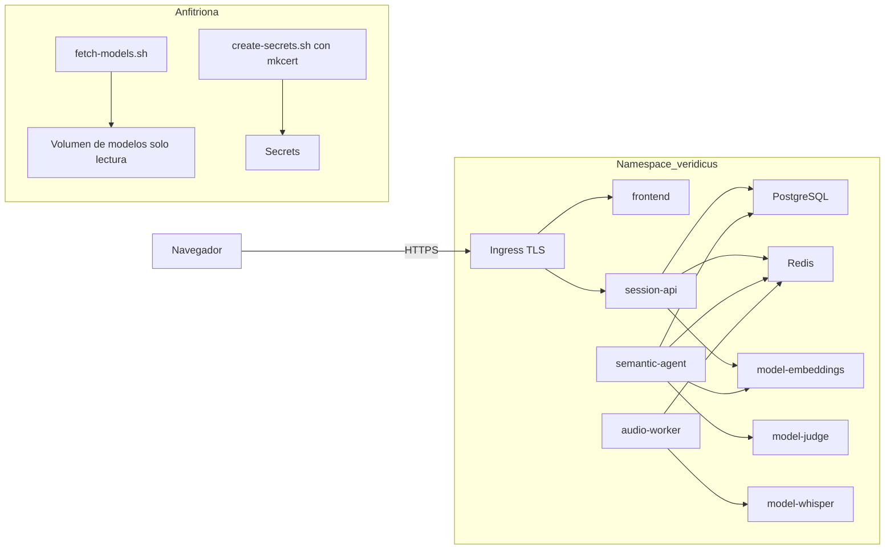

# Diseño de seguridad — U2 platform

**Insumos.** Requisitos NFR1.1–NFR15.1 y amenazas T1–T10 de `nfr-requirements/security-requirements.md`
(security-requirements); decisiones D1–D11, estructura de `deploy/` y tabla de dependencias de red de
`nfr-requirements/tech-stack-decisions.md` (tech-stack-decisions); tabla «Datos sensibles por
contrato», C9, C14, C15 y C16 de `inception/contract-design/contract-summary.md` (contract-summary);
respuestas P1–P2 de `nfr-design-questions.md`; `## Deployment` y `## Forbidden` de `team.md` y
`project.md`; diseño de seguridad de U1 (catálogo de límites) y de U3 (cookie `Secure`).

U2 es `packaging`: entrega el chart, las políticas y los *scripts* revisables. Este documento diseña
cómo se hacen cumplir los requisitos en el render del chart (nivel 0, sin red ni clúster) y qué queda
para la verificación manual. Distribución de Kubernetes, CNI, *ingress controller* y recursos
concretos los fija Infrastructure Design.

## 1. Zonas de confianza (AUTONOMIA-04)

<!-- Texto alternativo: en la máquina anfitriona, fetch-models.sh descarga y verifica los modelos en un volumen de solo lectura y create-secrets.sh crea los Secrets, incluido el certificado de mkcert. En el namespace veridicus, el navegador entra solo por HTTPS al ingress, que reparte a frontend y session-api. session-api habla con PostgreSQL, Redis y el servidor de embeddings; semantic-agent con PostgreSQL, Redis, el juez y embeddings; audio-worker con Redis y Whisper. Ninguna flecha sale del namespace hacia internet. -->

| Zona | Componentes | Datos sin anonimizar | Salida a internet |
|---|---|---|---|
| Navegador | Consola del analista | Sí, por HTTPS | — |
| Namespace `veridicus` | Pods de aplicación, base, Redis, modelos | Sí | **Negada** (§2) |
| Anfitriona | `fetch-models.sh`, `create-secrets.sh`, `mkcert` | No | Solo para descargar modelos verificados |
| CI y GHCR | *Build*, políticas, Trivy | No | Sí, sin acceso al clúster |

## 2. Red: negar todo y abrir por dependencia (NFR1.1, NFR10.6–NFR10.8)

- Subchart `network-policies` con `veridicus-default-deny` (`podSelector: {}`, `Ingress` y `Egress`) y
  una `NetworkPolicy` por pod que abre **solo** las filas de la tabla de tech-stack-decisions §3, más
  DNS hacia `kube-dns` (53 UDP/TCP).
- Selectores por etiqueta `app.kubernetes.io/name` en origen y destino, nunca por `ipBlock`, salvo la
  regla del `anonymizer-proxy` (COULD), que declara su destino externo en `values` con un comentario de
  justificación.
- Puertos de métricas (`/metrics`) separados del puerto de la API: solo Prometheus (SHOULD) los
  alcanza.

| Política Kyverno (`deploy/policies/`) | Qué rechaza | Control negativo en `policies/tests/` |
|---|---|---|
| `require-default-deny` | Namespace sin la política de negar todo | Render sin `veridicus-default-deny` |
| `deny-external-egress` | `ipBlock` con `0.0.0.0/0` o cualquier CIDR fuera de los rangos del clúster, salvo el `anonymizer-proxy` | Regla de salida con `0.0.0.0/0` en `session-api` |
| `restrict-datastore-ingress` | Entrada a Redis, PostgreSQL o servidores de modelos desde un pod que no figura en la tabla | `frontend` con acceso a Redis |
| `internal-model-urls` | `VERIDICUS_*_URL` de modelos que no terminan en `.svc.cluster.local` (NFR1.3) | `VERIDICUS_JUDGE_URL=https://api.openai.com` |

Verificación manual antes de la sustentación (NFR1.1): desde cada pod, `wget -T 5 https://example.com`
falla; se registra la salida en el PR de la entrega. Requiere un CNI que haga cumplir `NetworkPolicy`
(Infrastructure Design).

## 3. Acceso HTTPS a la consola (P1 = A)

- El *ingress* de `frontend` y `session-api` exige TLS: `spec.tls` con el Secret
  `veridicus-ingress-tls` y redirección de HTTP a HTTPS (anotación del controlador que elija
  Infrastructure Design). Así la cookie `Secure` de U3 funciona en la demostración.
- `scripts/create-secrets.sh` crea, con `mkcert` en la anfitriona, una CA local y un certificado para
  el nombre de la consola (por ejemplo `veridicus.local`), y lo carga como Secret `kubernetes.io/tls`.
  La clave de la CA queda en la anfitriona; ningún certificado ni clave entra al repositorio
  (`.gitignore` cubre `*.pem` y `*.key`).
- El navegador de la demostración confía en la CA de `mkcert` (`mkcert -install` en esa máquina).
- Política `require-ingress-tls`: todo `Ingress` del chart declara `tls`; control negativo con un
  `Ingress` sin `tls`.
- `session-api` recibe `VERIDICUS_TRUSTED_PROXY` con la red del *ingress* para leer la dirección de
  origen (limitador de U3).

## 4. Imágenes y cadena de suministro (NFR10.1, NFR1.2, NFR10.4)

| Control | Diseño | Política o comprobación |
|---|---|---|
| Digest | Toda imagen en `values` como `repositorio@sha256:…`; el *build* publica en GHCR con la etiqueta del SHA y el chart usa su digest | `require-image-digest`; control negativo con `:latest` y con una etiqueta sin digest |
| Charts de terceros | Versión exacta en `Chart.yaml` y `Chart.lock` versionado | `helm dependency build` con `Chart.lock` en la CI |
| Vulnerabilidades | Trivy en el *job* de *build*: falla con `HIGH` o `CRITICAL` con corrección; excepciones en `.trivyignore` con motivo y caducidad | CI |
| Modelos | `fetch-models.sh` descarga en la anfitriona y verifica contra `deploy/models.lock` (URL, revisión, `sha256`); los pods montan el volumen con `readOnly: true` | `models-readonly`; control negativo con el volumen en escritura |
| Modelos al arrancar | `initContainer` `verify-model` (imagen mínima fijada) calcula el `sha256` y termina con error si no coincide | `require-model-verify` para los `Deployment` `model-*` |
| Sin descargas en pods | Comprobación estática del render y de los `Dockerfile`: 0 `curl`, `wget`, `huggingface-cli` en comandos de contenedores | `scripts/check-no-downloads.sh` con control negativo |

## 5. Endurecimiento de pods (NFR10.2, NFR10.9, NFR8.1)

- Namespace con `pod-security.kubernetes.io/enforce: restricted` y `warn: restricted`.
- Un *helper* común del chart (`_securityContext.tpl`) que todos los subcharts usan: `runAsNonRoot`,
  `allowPrivilegeEscalation: false`, `capabilities.drop: [ALL]`, `seccompProfile: RuntimeDefault`,
  `readOnlyRootFilesystem: true` y `emptyDir` para `/tmp`.
- `automountServiceAccountToken: false` en cada pod; ningún `Role` ni `ClusterRole` para la aplicación.
- `requests` y `limits` de CPU y memoria en todo contenedor e `initContainer`; los valores por máquina
  vienen de `values-cpu.yaml` y `values-gpu.yaml` (Infrastructure Design).

| Política | Qué rechaza |
|---|---|
| `restricted-security-context` | Contenedor sin cualquiera de los campos de arriba |
| `no-sa-token` | Pod con `automountServiceAccountToken` distinto de `false` |
| `require-resources` | Contenedor o `initContainer` sin `requests` o `limits` |
| `gpu-only-in-gpu-values` | `nvidia.com/gpu` en el render de `values-cpu.yaml` (NFR2.1) |

## 6. Secretos (NFR10.3)

- Los manifiestos solo usan `secretKeyRef` o `envFrom.secretRef`; 0 objetos `Secret` con `data` o
  `stringData` en `deploy/` (política `no-inline-secrets`).
- `scripts/create-secrets.sh` lee un `.env` no versionado y ejecuta `kubectl create secret … --dry-run=client -o yaml`,
  que el humano revisa y aplica; el *script* no aplica nada por sí mismo (AUTONOMIA-01).
- Secrets esperados: contraseña de Redis, credenciales de PostgreSQL (los genera CloudNativePG), clave
  HMAC del limitador y datos del primer `admin` de U3, `--api-key` de `llama-server`, certificado TLS
  del *ingress*.

## 7. Datos persistentes (NFR10.6, NFR10.7, NFR10.10, NFR11.1)

- **PostgreSQL**: `Cluster` de CloudNativePG con `enableSuperuserAccess: false`, TLS por defecto, rol de
  aplicación y rol `veridicus_judge_ro` de solo lectura (C9). Migraciones solo en el `Job`
  `migrations-job` en su propio archivo del chart; política `no-migrations-in-deployments` que rechaza
  `alembic` en `Deployment` o `initContainer`.
- **Redis**: `requirepass` desde Secret, `protected-mode yes`, comandos peligrosos renombrados a vacío
  (`FLUSHALL`, `FLUSHDB`, `CONFIG`, `DEBUG`) en el `ConfigMap` de Redis, AOF en PVC.
- **Argo CD (SHOULD)**: anotación `argocd.argoproj.io/sync-options: Prune=false` en el `Cluster`, sus
  PVC y el PVC de Redis; política `no-prune-on-data` con control negativo; *deploy key* de solo lectura.

## 8. Dónde se hacen cumplir las políticas (P2 = A)

| Lugar | Qué corre | Cuándo |
|---|---|---|
| Máquina de desarrollo | `helm lint`, `yamllint`, `helm template` → `kubeconform` → `kyverno apply` y `kyverno test` | Antes del PR |
| CI (*job* `deploy-level0`) | Lo mismo, sin red ni `kubeconfig`, con los esquemas de Kubernetes y CRD copiados en `deploy/schemas` | Cada PR; bloquea la fusión |
| Clúster | Solo Pod Security `restricted` del namespace | En cada admisión |

No se instala Kyverno como controlador de admisión: todo cambio al clúster entra por PR con el render
validado (AUTONOMIA-01) y se evita otro componente que consuma memoria. El riesgo de un manifiesto
aplicado a mano que no pasó por el chart queda en §10.

## 9. Nada aplica cambios al clúster (NFR10.5, AUTONOMIA-01)

`scripts/check-no-cluster-apply.sh` busca en `.github/`, `scripts/` y `deploy/` las órdenes
`kubectl apply`, `kubectl create` (salvo con `--dry-run=client`), `kubectl delete`, `helm install`,
`helm upgrade`, `terraform apply` y migraciones contra el clúster; falla con la línea encontrada. Su
control negativo es un *workflow* de prueba en `deploy/policies/tests/`. Los *workflows* declaran
`permissions: contents: read` y no tienen `kubeconfig`.

## 9b. Datos sintéticos y regla AIR (NFR12.1, NFR15.1)

- `deploy/` no lleva *seeds*, `ConfigMap` ni valores con testimonios, nombres o expedientes; el Golden
  Dataset vive en `evaluation/` con las reglas de U1. `gitleaks` corre sobre todo el repositorio y la
  revisión del PR confirma que ningún archivo de `deploy/` trae datos.
- La `PrometheusRule` (SHOULD) dispara con `veridicus_session_dismissal_ratio > 0.25` (C15) y solo
  añade una anotación que **propone** un umbral; no tiene `webhook` ni acción que cambie la
  configuración. `promtool test rules` prueba un caso por debajo y otro por encima.

## 10. Riesgos residuales

| Riesgo | Por qué queda | Tratamiento |
|---|---|---|
| Un manifiesto aplicado a mano que no pasó por el chart | Sin Kyverno en el clúster (P2 = A) | Solo se aplica lo fusionado en `main`; Pod Security `restricted` sigue activo |
| El CNI no hace cumplir `NetworkPolicy` | Depende de la máquina | Infrastructure Design elige el CNI; verificación manual de §2 |
| La CA de `mkcert` queda instalada en el navegador de la demostración | Necesaria para HTTPS local | Usar un perfil de navegador dedicado a la demostración |
| `llama-server` no garantiza todo C6 por gramática | Limitación del servidor | U4 valida siempre contra C6 |

## 11. Precisiones a artefactos ya aprobados

No edité ningún artefacto aprobado; decides en la aprobación si se actualizan.

| Artefacto | Qué precisa | Origen |
|---|---|---|
| `platform/nfr-requirements/tech-stack-decisions.md` (§2 y §4) | Se añaden el Secret TLS del *ingress* creado con `mkcert` en `create-secrets.sh`, las políticas `require-ingress-tls`, `no-prune-on-data` y `no-migrations-in-deployments`, y `scripts/check-no-downloads.sh` | P1 = A |
| `platform/nfr-requirements/security-requirements.md` (NFR1.1) | La verificación manual registra su salida en el PR de la entrega | Evidencia de AUTONOMIA-02 |
