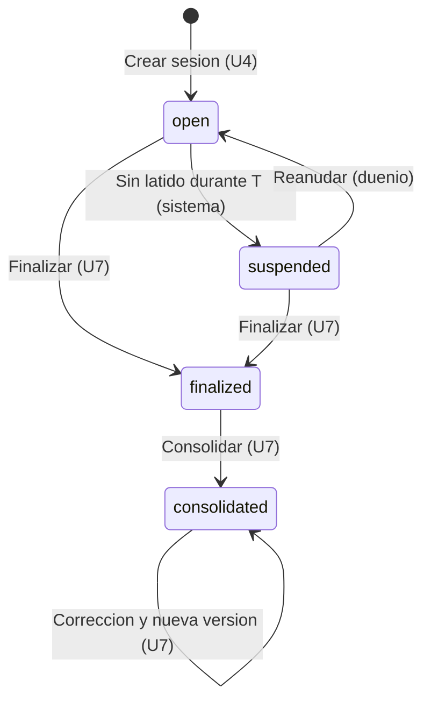
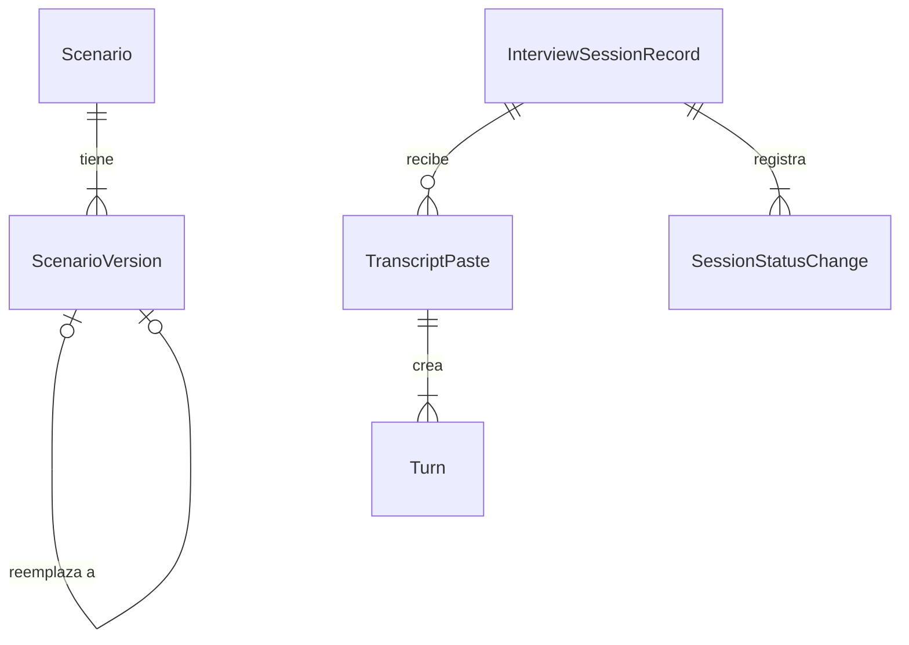

# Especificación funcional — U6 session-lifecycle

**Insumos.** Unidad U6 de `inception/units-generation/unit-of-work.md` (unit-of-work) y su mapa de
historias `unit-of-work-story-map.md` (unit-of-work-story-map); FR2.4, FR3.3, FR8, FR10.1 y FR11.2 de
`inception/requirements-analysis/requirements.md` (requirements); TruthFrame e InterviewSession de
`inception/domain-design/components.md` (components); C1 y C2 de
`inception/contract-design/contract-summary.md` (contract-summary); PasteTranscriptDialog y flujo F3 de
`refined-mockups/interaction-spec.md`; respuestas P1–P3 de `functional-design-questions.md`. Las
entidades están en `entities.md` y las reglas en `rules.md`; este documento es la fuente de verdad de los
flujos y de la máquina de estados de la sesión.

## 1. Qué hace la unidad

U6 completa el ciclo de vida alrededor del flujo de texto de U4: corregir un escenario con una versión
nueva, pegar una transcripción entera, listar sesiones, suspender una sesión cuando la consola deja de
latir y reanudarla sin perder ni duplicar nada, y mostrar el progreso de cada turno.

| Componente | Proceso | Dentro / fuera del clúster | Datos que cruzan la frontera |
|---|---|---|---|
| TruthFrame (versiones) | `session-api` | Dentro | Ninguno sale |
| InterviewSession (pegado, latido, suspensión, reanudación) | `session-api` | Dentro | Mensajes C2 por Redis interno |
| ConsoleApi (rutas de U6) | `session-api` | Dentro | Testimonio pegado desde el navegador, dentro del clúster |
| AnalystConsole (M1, diálogos, historial lateral) | `frontend` | Dentro | Solo habla con ConsoleApi |

## 2. Flujos

### F1 — Cargar una versión nueva de un escenario (US1.2)

1. En M2, el usuario elige un escenario y «Cargar versión nueva» (`POST /scenarios/{id}/versions`).
2. Se aplican las validaciones de carga de U4 (tamaño, formato, UTF-8, documentos `[DOC-…]`).
3. Si el SHA-256 ya existe → 409 con «Este documento ya está cargado como <escenario> versión <n>»
   (BR1.3).
4. Crea la versión con el número siguiente en `indexing` y encola su indexación; la anterior no cambia
   (BR1.1). Las sesiones existentes siguen ligadas a su versión.

### F2 — Pegar una transcripción (US2.3)

1. En M4, el dueño abre «Pegar transcripción» y pega el texto.
2. «Continuar» divide el texto en la consola con la regla de BR2.1 y muestra la vista previa: número de
   turnos, hablante y rol de cada uno, y los que superan 2 000 caracteres marcados (BR2.3, BR2.4).
3. Si hay más de 100 turnos o 100 000 caracteres, o algún turno es demasiado largo, «Crear N turnos»
   queda deshabilitado con su motivo.
4. «Cancelar» o Escape cierran sin llamar a la API.
5. «Crear N turnos» envía el texto completo (`POST /sessions/{id}/transcript` con `client_request_id`).
6. El servidor vuelve a dividir con la misma regla (nunca confía en la división de la consola), valida y,
   en una transacción, crea todos los turnos numerados seguidos y el `TranscriptPaste` (BR2.5).
7. Los turnos `interviewer` quedan guardados como contexto sin encolar (BR2.2); los `testimony` se
   encolan en orden por C2 y siguen el flujo de U4.

### F3 — Ver la lista de sesiones (US2.5, US11.2)

1. M1 llama `GET /sessions` (opcionalmente `status`) y muestra escenario y versión, dueño, fecha en hora
   de Colombia y estado con icono y texto (BR3.1, BR6.1).
2. El filtro «Solo las mías» filtra por `owner_user_id` en la consola.
3. Sin sesiones → estado vacío (BR3.2).
4. En M4, el historial lateral (COULD) muestra las sesiones del usuario por fecha (BR3.3).

### F4 — Latido y suspensión (US7.1)

1. Mientras M4 está abierta, el sondeo de la sesión de U4 cuenta como latido del dueño (BR4.1); sin
   turnos en proceso, la consola mantiene un sondeo lento o `POST /heartbeat`.
2. Una tarea periódica de `session-api` pasa a `suspended` las sesiones `open` sin latido durante *T*
   segundos e inserta el cambio con actor sistema (BR4.2).
3. Los turnos ya encolados siguen procesándose (BR4.3); los nuevos se rechazan con 409
   `session.not_open`.

### F5 — Reanudar (US7.1)

1. El dueño entra a M1 o abre su sesión `suspended`; aparece el diálogo de reanudación (BR4.4).
2. «Más tarde» → vuelve a M1; la sesión sigue «Suspendida».
3. «Reanudar» → `POST /sessions/{id}/resume`; la sesión vuelve a `open` desde el último turno registrado,
   con el cambio en el historial (BR4.5). No se reenvía ni se duplica nada.
4. M4 se abre con los turnos tal como quedaron: los que terminaron mientras tanto, «Evaluado» o «Error»
   con sus alertas.

### F6 — Progreso de un turno (US10.1, SHOULD)

1. TurnItem muestra la etapa del turno (`transcribing` → «Procesando audio…», `retrieving` →
   «Consultando marco de verdad…», `judging` → «Evaluando…») y un cronómetro relativo (BR5.1).
2. La región `aria-live` anuncia cada cambio de etapa una vez.
3. Al vencer el plazo, el turno pasa a «Error» con «Reintentar evaluación» (BR5.2).

## 3. Máquina de estados de la sesión (completa)

<!-- Texto alternativo: una sesión nace abierta; pasa a suspendida si falta el latido durante T segundos; vuelve a abierta al reanudar; desde abierta o suspendida pasa a finalizada (U7); de finalizada a consolidada (U7); una corrección produce una versión nueva del reporte sin cambiar el estado consolidado. -->

| Desde | Hacia | Quién | Guardia | Efecto |
|---|---|---|---|---|
| `open` | `suspended` | Sistema | Sin latido durante *T* | `suspended_at`; cambio con actor sistema |
| `suspended` | `open` | Dueño | Estado `suspended` | Cambio con actor dueño; nada más cambia |
| `open`/`suspended` | `finalized` | Dueño (U7) | Ver U7 | Empieza MTTV |
| `finalized` | `consolidated` | Dueño (U7) | Ver U7 | Versión del reporte |

Que `finalized` se alcance también desde `suspended` lo decide U7; U6 solo lo deja permitido en la
máquina.

## 4. Vista derivada: entidades y relaciones

Derivada de `entities.md`.

<!-- Texto alternativo: un escenario tiene versiones y cada versión nueva reemplaza a la anterior sin borrarla; una sesión recibe transcripciones pegadas, cada una crea uno o más turnos; una sesión registra sus cambios de estado. -->

## 5. Vista derivada: reglas

| Grupo | Reglas | Flujo |
|---|---|---|
| Versiones | BR1.1–BR1.4 | F1 |
| Pegado | BR2.1–BR2.6 | F2 |
| Lista | BR3.1–BR3.3 | F3 |
| Suspensión | BR4.1–BR4.6 | F4, F5 |
| Progreso | BR5.1–BR5.2 | F6 |
| Accesibilidad | BR6.1 | F2, F3, F5 |

## 6. Escenarios de negocio y casos límite

| # | Escenario | Resultado esperado | Regla |
|---|---|---|---|
| E1 | Versión corregida de un escenario usado por S1 | Versión 2 nueva; S1 sigue en la versión 1 con sus pasajes | BR1.1 |
| E2 | `DELETE` sobre un pasaje | 404/405; `DELETE` directo con el usuario de la aplicación falla | BR1.2 |
| E3 | Documento idéntico a la versión 1 | 409 con «… versión 1» | BR1.3 |
| E4 | «Compareciente: …», línea vacía, «Analista: …», «Compareciente: …» | 3 turnos; el del analista como contexto | BR2.1, BR2.2 |
| E5 | Línea «Hora: 14:30» | No es marca (tiene dígitos): queda en el texto del turno | BR2.1 |
| E6 | 101 turnos | 422 `transcript.too_large` | BR2.3 |
| E7 | Un turno de 2 100 caracteres en la vista previa | Marcado; «Crear N turnos» deshabilitado | BR2.3 |
| E8 | Cancelar en la vista previa | 0 turnos | BR2.4 |
| E9 | Navegador reenvía la confirmación | Mismos turnos, sin duplicar | BR2.5 |
| E10 | Golden Dataset pegado vs. turno a turno | Resultados iguales | BR2.6 |
| E11 | Consola cerrada más de *T* | «Suspendida» en ≤ *T* + intervalo | BR4.2 |
| E12 | Transcripción cortada a mitad; reanudar | Conteos iguales, sin duplicados | BR4.5 |
| E13 | Turnos en cola durante la suspensión | Terminan; al reanudar se ven evaluados | BR4.3 |
| E14 | Otro analista intenta reanudar | 403 | BR4.5 |

## 7. Integración con otras unidades

| Unidad | Relación |
|---|---|
| U4 text-flow | U6 reutiliza la carga, la indexación, la creación de turnos, C2 y la tarea de plazos; amplía `Turn` y la sesión |
| U7 forensic-report | Usa los estados `suspended` y `finalized`; el reporte muestra los turnos del entrevistador como contexto |
| U8 assistant-extras | Los turnos `interviewer` no reciben pregunta sugerida |
| U3 identity-access | Autorización por dueño; convención de auditoría |

## 8. Errores y bordes

- La división del servidor es la autoridad; la de la consola solo sirve para la vista previa y usa la
  misma especificación con los mismos ejemplos de prueba.
- Los logs llevan `session_id` y `paste_batch_id`, nunca el texto pegado.
- La tarea de suspensión es idempotente: una sesión ya `suspended` no genera otra fila.

## 9. Precisiones a artefactos ya aprobados

| Artefacto | Qué precisa | Origen |
|---|---|---|
| `contract-design/contract-summary.md` (C1 `ErrorCode`) | Añade `transcript.too_large` (422) | P3 = A |
| `contract-design/contract-summary.md` (C1 `Turn`) | Añade `speaker` y `role` (`testimony`/`interviewer`) | P1 = A, P2 = A |
| Functional Design de U4 (`Turn` y turnos previos del paquete) | Los turnos `interviewer` no se encolan, pero cuentan como turnos previos del paquete | P2 = A |
