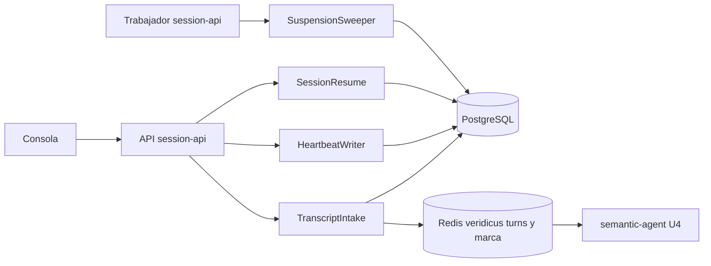

# Componentes lógicos — U6 session-lifecycle

**Insumos.** `nfr-requirements/performance-requirements.md` (performance-requirements),
`security-requirements.md` (security-requirements), `scalability-requirements.md`
(scalability-requirements), `reliability-requirements.md` (reliability-requirements),
`observability-requirements.md` (observability-requirements) y `tech-stack-decisions.md`
(tech-stack-decisions) de esta unidad; `functional-design/functional-spec.md` (functional-spec); C1,
C2, C4, C11 y C15 de `inception/contract-design/contract-summary.md` (contract-summary); respuestas
P1–P2 de `nfr-design-questions.md`; los demás documentos de diseño de esta carpeta y los componentes
lógicos de U4.

## 1. Inventario

Todos corren **dentro del clúster** (AUTONOMIA-04); ningún componente de U6 tiene destino externo.

| Componente lógico | Proceso | Responsabilidad | Patrones de NFR |
|---|---|---|---|
| Rutas de U6 en ConsoleApi | API de `session-api` | `/transcript`, `/heartbeat`, `/resume`, `GET /sessions`, `/scenarios/{id}/versions` | `authorize` de U3; cuerpo acotado; Problem Details |
| `TranscriptSplit` | `domain/` de InterviewSession (Python) y consola (TypeScript) | Regla BR2.1 y D6 con el archivo compartido | Código puro; mismos ejemplos en ambas suites |
| `TranscriptIntake` | API de `session-api` | Transacción del pegado y `publish_batch` | Bloqueo de la sesión; `change_seq` una vez por lote; marca del lote con `WATCH` (P1 = A) |
| `HeartbeatWriter` | API de `session-api` | Latido tras el sondeo de U4 y en `/heartbeat` | `SKIP LOCKED`; sin `change_seq` (P2 = A) |
| `SessionResume` | API de `session-api` | `suspended → open` | `UPDATE` condicional; `change_seq`; historial |
| `SuspensionSweeper` | Trabajador de `session-api` | `open → suspended` cada 30 s | `SKIP LOCKED`; idempotente; supervisión de hilos de U4 |
| `SessionList` | API de `session-api` | `GET /sessions` | Una consulta; vista de pendientes de U5 |
| `ScenarioVersionUpload` | API de `session-api` (indexación en el trabajador, U4) | Versión nueva | Inmutabilidad por permisos; restricción única |
| M1, `PasteTranscriptDialog`, diálogo de reanudación, historial lateral, progreso de TurnItem | `frontend` | Consola de U6 | Vista previa local; catálogo de textos; axe |

<!-- Texto alternativo: la consola llama a la API de session-api, que contiene TranscriptIntake, HeartbeatWriter y SessionResume; los tres escriben en PostgreSQL y TranscriptIntake publica en Redis la cola de turnos y la marca del lote, que consume semantic-agent de U4. El trabajador de session-api ejecuta SuspensionSweeper, que escribe en PostgreSQL. -->

## 2. Dominios de falla y radio de impacto

| Falla | Qué deja de funcionar en U6 | Qué sigue | Radio |
|---|---|---|---|
| Redis | Pegado (`503`, `/readyz` en `503`) | Lista, reanudación, latido, revisión | Pegados nuevos; un pegado confirmado sin publicar espera el reenvío o vence por plazo |
| Trabajador de `session-api` | Revisión de suspensión (y lo de U4) | Pegado, lista, reanudación | Las suspensiones se retrasan hasta que reinicia; ninguna se pierde |
| Juez o `semantic-agent` | Evaluación de los turnos pegados (U4) | Todo U6 | Los turnos esperan o vencen por plazo |
| PostgreSQL | Todo | — | Todo el sistema |
| Consola cerrada | — | Todo el servidor | Esa sesión pasa a `suspended` en 165–210 s |

## 3. Recursos compartidos

| Recurso | Compartido con | Aislamiento |
|---|---|---|
| Fila `interview_session` | U4 (encolar, ingerir, plazos), U7 (finalizar) | U6 nunca espera el bloqueo en el latido ni en la revisión (`SKIP LOCKED`); el pegado y la reanudación sí, acotados por los *timeouts* de §1 de reliability-design |
| Contador `change_seq` | U4, U5, U7 | Un incremento por transacción que cambia algo visible; el latido no lo toca |
| Redis | U3, U4, U8, U9 | Prefijo nuevo `veridicus:paste-published:` con expiración de 24 h; C2 sin cambios |
| Trabajador de `session-api` | U4 | Un hilo más bajo la misma supervisión; sin memoria propia |
| Vista `human_review.session_pending_suggestions` | U5 (dueña) | Solo lectura para ConsoleApi; U6 no lee tablas de U5 |

## 4. Entrega a Infrastructure Design

- Sin `Deployment` nuevos: API y trabajador de `session-api` existentes (U4). Los tres ajustes de U6 en
  el `ConfigMap` que leen ambos procesos.
- Redis con `maxmemory-policy noeviction` (marca del lote, reliability-design §2) además del AOF
  `everysec` de U2.
- `Job` de migraciones con las columnas, la tabla, el índice parcial de expresión y la vista de U5.
- Topes de memoria: los de U4; U6 añade ≤ 50 MiB de pico a la API (performance-design §7).

## 5. Calidad, pruebas y textos (NFR2.1, NFR2.2, NFR13.1, NFR13.2, NFR14.1, NFR14.2)

- **Dobles y CPU.** Juez y *embeddings* son los *fakes* de U4; PostgreSQL y Redis reales en contenedor;
  ninguna prueba de niveles 0 y 1 descarga un modelo ni pide GPU. NFR3.11, NFR4.1 (nivel 2) y NFR9.1 se
  miden con `values-cpu.yaml`.
- **Reloj.** `veridicus_now()` en SQL y el reloj inyectable de U3 en Python permiten probar los bordes
  de 165, 179, 180 y 210 s sin esperar.
- **Cobertura.** ≥ 80 % de líneas en `services/session-api` y `frontend` con U6 incluido, en CI y
  bloqueante. U6 no añade módulos guardia; los turnos pegados pasan por los de U4.
- **División idéntica.** `pytest` y Vitest leen el mismo archivo de ejemplos (incluidos E4, E5 y las
  variantes de D6) y pasan el 100 %; una prueba de propiedad con Hypothesis comprueba que dividir el
  texto armado desde turnos válidos devuelve esos turnos.
- **Textos y accesibilidad.** Solo cadenas del catálogo de U1 (prueba de nivel 0 contra literales
  visibles), fechas en `America/Bogota`; `@axe-core/playwright` en nivel 3 sobre M1, diálogos de pegado y
  reanudación e historial lateral con 0 violaciones `serious` o `critical`; cada flujo completo solo con
  teclado; «Suspendida» con icono y texto (Vitest); la región `aria-live` anuncia cada cambio de etapa
  una vez.
