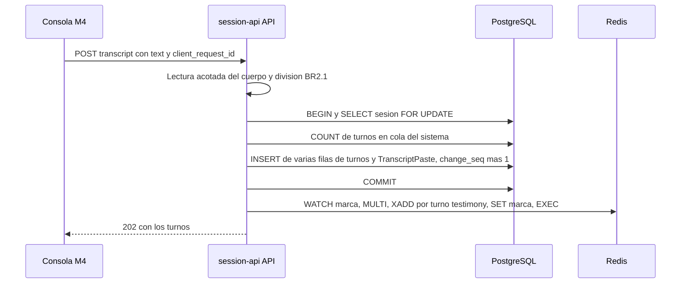

# Diseño de rendimiento — U6 session-lifecycle

**Insumos.** `nfr-requirements/performance-requirements.md` (performance-requirements),
`security-requirements.md` (security-requirements), `scalability-requirements.md`
(scalability-requirements), `reliability-requirements.md` (reliability-requirements),
`observability-requirements.md` (observability-requirements) y `tech-stack-decisions.md`
(tech-stack-decisions, D1–D10) de esta unidad; flujos F1–F6 de `functional-design/functional-spec.md`
(functional-spec); C1, C2, C4 y C10 de `inception/contract-design/contract-summary.md`
(contract-summary); respuestas P1–P2 de `nfr-design-questions.md`; diseño de U4 (cursor `change_seq`,
trabajador de `session-api`, plazos), U1 (catálogo de límites) y U3 (`authorize`).

Todas las metas se diseñan para el **perfil CPU** (NFR2.2), con PostgreSQL y Redis reales. U6 no llama a
ningún modelo: el costo de los turnos pegados en el juez es el de U4.

## 1. Pegar una transcripción (NFR3.1, NFR3.10)



<!-- Texto alternativo: la consola envía el texto completo con su client_request_id. La API lee el cuerpo con un tope, lo divide con la regla BR2.1 y abre una transacción que bloquea la fila de la sesión, cuenta los turnos en cola del sistema, inserta todos los turnos en una sola sentencia junto con el TranscriptPaste e incrementa una vez el change_seq. Tras confirmar, publica en Redis los turnos de testimonio en orden y la marca del lote en una sola transacción MULTI/EXEC vigilada con WATCH, y responde 202 con los turnos. -->

| Tramo | Presupuesto (peor caso: 200 turnos, 100 000 caracteres) | Técnica |
|---|---|---|
| Lectura del cuerpo | ≤ 50 ms | Lectura por bloques con corte a 524 288 bytes (security-design §2) |
| División y validación | ≤ 100 ms | Código puro en `domain/` de InterviewSession; un recorrido lineal por líneas, sin expresiones regulares con retroceso |
| Transacción | ≤ 1 200 ms | Una sola ida y vuelta por tipo de fila: un `INSERT … VALUES` de varias filas para los turnos (D4) y uno para `TranscriptPaste`; `change_seq` se incrementa **una vez** por pegado y todas las filas nuevas llevan ese valor |
| Publicación | ≤ 300 ms | Un único `pipeline` de `redis-py` con `WATCH`/`MULTI`/`EXEC` (reliability-design §2): 60 `XADD` y un `SET` en una ida y vuelta |
| Respuesta | ≤ 200 ms | Serializar los turnos creados, sin volver a leerlos de la base |

Con 15 turnos el mismo camino cabe holgado en 500 ms. La transacción respeta el *timeout* de 5 s de
NFR10.9 (reliability-design §1).

**Plazos de los turnos pegados (NFR3.10).** Dentro de la transacción se calcula `n₀` con
`SELECT count(*) FROM turn WHERE status IN ('queued','processing')` (el índice parcial de U4 sobre ese
estado) y cada turno de testimonio *k* recibe `deadline_at = enqueued_at + 300 s × (1 + n₀ + k − 1)`,
con tope de 3 600 s, en la misma sentencia de inserción. La función es pura (`domain/deadlines.py`,
compartida con U4) y la prueba de nivel 0 cubre `n₀ = 0` (turnos 1, 2, 12 → 300, 600, 3 600 s) y
`n₀ = 5` (turno 1 → 1 800 s). Los turnos `interviewer` no reciben plazo.

## 2. Latido dentro del sondeo (NFR3.3, NFR3.8; P2 = A)

El sondeo `GET /sessions/{id}?since` de U4 conserva su lectura sin cambios. El latido se escribe
**después** de leer, en una transacción corta aparte, sin esperar ningún bloqueo:

```sql
UPDATE interview_session s
   SET last_heartbeat_at = veridicus_now()
 WHERE s.id = (SELECT id FROM interview_session
                WHERE id = :session_id AND owner_user_id = :user_id
                  AND status = 'open'
                  AND (last_heartbeat_at IS NULL
                       OR last_heartbeat_at <= veridicus_now()
                          - make_interval(secs => :write_min_s))
                FOR UPDATE SKIP LOCKED);
-- Sin change_seq: el latido no es un cambio que la consola muestre.
```

- `veridicus_now()` devuelve `now()` y, solo en pruebas, la hora inyectada en la sesión de base de datos
  (D3).
- Si la fila está bloqueada por otra escritura de la sesión (encolar, ingerir, pegar), el latido se omite:
  esa escritura dura ≤ 5 s y el siguiente sondeo (2 s o 15 s) vuelve a intentarlo. El sondeo nunca espera
  un bloqueo, así que su p95 ≤ 200 ms de U4 no depende de que haya un pegado en curso.
- Sin condición cumplida (no es el dueño, no está `open` o el valor tiene < 15 s), la sentencia no toca
  ninguna fila: una lectura del índice primario.
- `POST /sessions/{id}/heartbeat` ejecuta la misma sentencia y responde `204`; meta p95 ≤ 100 ms.
- La prueba de nivel 1 de NFR3.3 cuenta ≤ 1 `UPDATE` efectivo por cada 15 s de reloj con 200 sondeos
  cada 2 s, y mide el p95 del sondeo con un pegado de peor caso en paralelo.

## 3. Revisión de suspensión (NFR3.7, NFR3.9; P2 = A)

La tarea `SuspensionSweeper` del trabajador de `session-api` corre cada
`VERIDICUS_SUSPENSION_SWEEP_SECONDS` (30 s) una sola sentencia que elige, bloquea sin esperar y
suspende (sentencia completa en reliability-design §3).

- **Índice parcial de expresión**: `CREATE INDEX … ON interview_session
  ((COALESCE(last_heartbeat_at, created_at))) WHERE status = 'open'`. Con 500 sesiones y 50 abiertas,
  la sentencia recorre solo las abiertas; meta p95 ≤ 100 ms (prueba `perf` de nivel 1).
- **Bordes de tiempo**: con *T* = 180 s y revisión cada 30 s, una sesión sin latido pasa a `suspended`
  entre 180 y 210 s después de su `last_heartbeat_at`; con 179 s no. Contado desde el último sondeo
  real, entre 165 y 210 s por la escritura acotada del latido (NFR3.8). Prueba de nivel 1 con reloj
  controlado en ambos bordes.

## 4. Lista de sesiones y reanudación (NFR3.2, NFR3.4)

| Operación | Diseño | Meta |
|---|---|---|
| `GET /sessions` | Una sola consulta: sesiones con `JOIN` a versión, escenario y usuario, más `LEFT JOIN` a la vista de solo lectura `human_review.session_pending_suggestions` (precisión en reliability-design §7), ordenada por `created_at DESC`; filtro `status` opcional en `WHERE`; índice `(created_at DESC)` | p95 ≤ 300 ms con 500 sesiones; ≤ 2 sentencias (la del `authorize` de U3 y esta); respuesta ≤ 200 KB porque `SessionSummary` no lleva texto |
| `POST /sessions/{id}/resume` | Una transacción: `UPDATE … WHERE id = :id AND status = 'suspended' RETURNING`, `INSERT` del `SessionStatusChange` y lectura de la `SessionView` completa (cursor nulo) con los índices `(session_id, change_seq)` de U4 | p95 ≤ 300 ms con 60 turnos |

La reanudación sí espera el bloqueo de la fila (es una acción del dueño y la espera máxima es la de una
escritura en curso, acotada por el `statement_timeout` de 2 s).

## 5. Versiones nuevas de un escenario (NFR3.5, NFR9.1)

- `POST /scenarios/{id}/versions` reutiliza el cargador de U4: lectura por bloques con corte a
  1 048 576 bytes, SHA-256 calculado mientras se lee (sin segunda pasada), comprobación de duplicado
  por el índice único de `source_sha256`, fila en `indexing` con `version_number` siguiente y mensaje C4
  publicado tras confirmar. Meta p95 ≤ 2 000 ms con 1 MB.
- El número siguiente se toma con `SELECT max(version_number) … FOR UPDATE` sobre la fila del
  `Scenario`; la restricción única `(scenario_id, version_number)` es la red de seguridad.
- La indexación es la de U4 sin código propio: el mensaje se valida contra C4 y la versión de 1 MB queda
  `ready` en < 180 s, medido en la corrida de nivel 2 de U4.

## 6. Consola: vista previa y progreso (NFR3.6, NFR3.12)

- **Vista previa.** La división en TypeScript recorre el texto una vez por líneas, con las etiquetas y
  los límites leídos del archivo compartido de D5; no hay estado de red en el diálogo. Meta ≤ 200 ms
  para 100 000 caracteres (Vitest con `performance.now()`) y 0 peticiones al pulsar «Continuar» y
  «Cancelar».
- **Lista de la vista previa.** Hasta 200 filas se pintan de una vez (sin virtualización); cada fila es
  un componente memoizado por índice.
- **Progreso del turno.** El cronómetro mm:ss es un temporizador local de 1 s por TurnItem visible que
  no provoca peticiones; la etapa llega con el sondeo de 2 s de U4. Meta ≤ 3 s del cambio en el servidor
  a la pantalla (Vitest con temporizadores falsos y Playwright de nivel 3 con el *fake* del juez).

## 7. Pegado máximo y recursos (NFR3.11, NFR8.1)

| Aspecto | Diseño | Verificación |
|---|---|---|
| 60 turnos de testimonio con la cola vacía | Plazos de §1 (el turno 60 recibe el tope de 3 600 s); los turnos se publican en orden en una sola transacción de Redis, así que el juez los atiende seguidos | Corrida de nivel 2 a demanda: 60 `evaluated`, 0 `turn.error.timeout` |
| RSS de la API | El cuerpo se lee una vez (≤ 512 KiB); la división produce una lista de ≤ 200 turnos y no copia el texto entero más de una vez | Pico de RSS ≤ +50 MiB durante la prueba de NFR3.1 |
| RSS del trabajador | La revisión de suspensión no guarda nada en memoria: solo los identificadores devueltos | El tope de 768 MiB del trabajador (U4) se mantiene en la corrida de NFR8 de U4 |

Si la corrida de 60 turnos falla en CPU, se resuelve por PR (perfil GPU o bajar el límite del catálogo),
nunca subiendo el tope del plazo.
