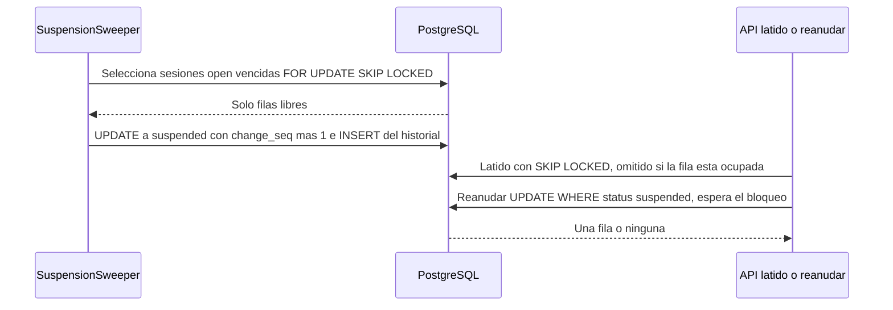

# Diseño de fiabilidad — U6 session-lifecycle

**Insumos.** `nfr-requirements/performance-requirements.md` (performance-requirements),
`security-requirements.md` (security-requirements), `scalability-requirements.md`
(scalability-requirements), `reliability-requirements.md` (reliability-requirements),
`observability-requirements.md` (observability-requirements) y `tech-stack-decisions.md`
(tech-stack-decisions, D1–D10) de esta unidad; flujos F2, F4 y F5, la máquina de estados de §3 y §8 de
`functional-design/functional-spec.md` (functional-spec); C1, C2, C4, C10 y C11 de
`inception/contract-design/contract-summary.md` (contract-summary); respuestas P1–P2 de
`nfr-design-questions.md`; diseño de U4 (cursor `change_seq`, plazos, ingesta idempotente, supervisión
de hilos) y de U2 (Redis con AOF `everysec`).

## 1. *Timeouts* y configuración (NFR10.9, NFR10.10)

| Llamada | *Timeout* | Dónde se fija |
|---|---|---|
| Consulta a PostgreSQL | 2 s (`statement_timeout`) | Configuración de U4 |
| Transacción del pegado y de la revisión de suspensión | 5 s (`idle_in_transaction_session_timeout` y `SET LOCAL statement_timeout = '5s'` en esas dos transacciones) | Configuración de U4 |
| Operación de Redis, incluida la canalización del pegado | 0,5 s (`socket_timeout`) | Configuración de U4 |
| Latido y revisión frente a filas bloqueadas | 0 s: `SKIP LOCKED`, nunca esperan (P2 = A) | Sentencia |

U6 no añade *timeouts* propios. Sus tres ajustes se validan al arrancar con `pydantic-settings`:

| Ajuste | Regla | Proceso |
|---|---|---|
| `VERIDICUS_HEARTBEAT_TIMEOUT_SECONDS` | Entero 60–1 800 y ≥ 60 s (4 × 15 s) | Trabajador |
| `VERIDICUS_SUSPENSION_SWEEP_SECONDS` | Entero 5 – *T*/2 | Trabajador |
| `VERIDICUS_HEARTBEAT_WRITE_MIN_SECONDS` | Entero 1 – *T*/4 | API |

Un valor fuera de rango termina el proceso con código distinto de 0 y un log que nombra el ajuste;
`/readyz` responde `503` mientras falte. Como la API también necesita *T* para validar el mínimo del
latido, ambos procesos leen los tres ajustes del mismo `ConfigMap`. Nivel 0: una prueba por regla con su
control positivo.

## 2. Pegado todo o nada y publicación con marca de lote (NFR8.10, NFR10.11; P1 = A)

**Transacción.** Bloqueo de la fila de la sesión (`FOR UPDATE`), comprobación de `status = 'open'`
(si no, `409` `session.not_open` o `session.finalized`), numeración de todos los turnos, `TranscriptPaste`,
plazos y un incremento de `change_seq`, todo en una transacción. Un fallo a mitad (inyectado en la
prueba) deja 0 turnos y 0 mensajes. La restricción única `(session_id, client_request_id)` hace que dos
envíos simultáneos del mismo pegado creen un solo lote: el segundo espera el bloqueo de la sesión,
encuentra el lote y sigue el camino de reenvío.

**Publicación.** Después de confirmar, los turnos de testimonio del lote que siguen `queued` se publican
en orden junto con la marca del lote, en una sola transacción de Redis vigilada con `WATCH`:

```python
def publish_batch(redis, paste_batch_id, messages):
    key = f"veridicus:paste-published:{paste_batch_id}"
    with redis.pipeline() as pipe:
        pipe.watch(key)
        if pipe.exists(key):
            return Outcome.ALREADY_PUBLISHED
        pipe.multi()
        for msg in messages:                      # testimony aún queued, por número
            pipe.xadd("veridicus:turns", msg.fields())
        pipe.set(key, "1", ex=PASTE_MARKER_TTL_S)  # 86 400 s
        try:
            pipe.execute()
        except WatchError:                        # otro proceso publicó primero
            return Outcome.ALREADY_PUBLISHED
    return Outcome.PUBLISHED
```

- `EXEC` aplica los `XADD` y la marca juntos o nada; con AOF `everysec` (U2) la transacción se escribe
  entera en el archivo, así que tras un reinicio de Redis se conservan ambos o se pierden ambos.
- **Reintento dentro de la petición.** Si `EXEC` vence su *timeout* de 0,5 s sin saber si llegó, el único
  reintento aprobado vuelve a llamar `publish_batch`: si llegó, encuentra la marca y no duplica.
- **Si el reintento falla.** `ERROR` `transcript.publish_failed` con `session_id` y `paste_batch_id`,
  `503` `system.unavailable`.
- **Reenvío del navegador** con el mismo `client_request_id`: se devuelven los turnos del lote y se llama
  `publish_batch`; con marca, `202` sin publicar nada; sin marca, publica lo que siga `queued` (los turnos
  que ya vencieron por plazo quedan en `error`, con su reintento manual).
- **Dos reenvíos a la vez.** Ambos vigilan la marca; el `EXEC` del segundo falla con `WatchError` o ve la
  marca: un solo lote en la cola.
- **Expiración de 24 h.** Muy por encima del tope de plazo de 3 600 s: cuando la marca expira, ningún
  turno del lote puede seguir `queued`. Una prueba de nivel 0 exige `PASTE_MARKER_TTL_S > 3 600`.
- **Redis sin desalojo.** La marca no debe desaparecer por memoria: Redis de U2 corre con
  `maxmemory-policy noeviction` (entrega a Infrastructure Design en logical-components §4).

Pruebas de nivel 1 con Redis real: (a) Redis detenido justo tras confirmar → `503`, reenvío → 15
mensajes; (b) `EXEC` aplicado y respuesta perdida (fallo inyectado tras `execute`) → reenvío → 0 mensajes
nuevos; (c) dos reenvíos simultáneos → 15 mensajes en total; (d) un doble que llegue igual se absorbe
por la ingesta idempotente de U4 (`turn_id`, `attempt`).

## 3. Suspensión y reanudación sin competir (NFR8.9, NFR10.12; P2 = A)



<!-- Texto alternativo: la revisión de suspensión selecciona las sesiones abiertas vencidas con FOR UPDATE SKIP LOCKED, así que solo toma las filas libres; las pasa a suspendidas incrementando change_seq e inserta su historial en la misma transacción. El latido usa también SKIP LOCKED y se omite si la fila está ocupada. Reanudar sí espera el bloqueo y actualiza solo si la sesión sigue suspendida, por lo que afecta una fila o ninguna. -->

```sql
WITH due AS (
  SELECT id FROM interview_session
   WHERE status = 'open'
     AND COALESCE(last_heartbeat_at, created_at)
         < veridicus_now() - make_interval(secs => :t)
   FOR UPDATE SKIP LOCKED)
UPDATE interview_session s
   SET status = 'suspended', suspended_at = veridicus_now(),
       change_seq = s.change_seq + 1
  FROM due WHERE s.id = due.id
RETURNING s.id, s.change_seq,
  extract(epoch FROM veridicus_now() - COALESCE(s.last_heartbeat_at, s.created_at));
```

En la misma transacción se inserta un `SessionStatusChange` (`open → suspended`, `actor_kind = system`)
por cada fila devuelta.

- **Idempotente.** Una sesión ya `suspended` no cumple la condición: 0 filas, 0 historial.
- **Dos revisiones a la vez** (dos réplicas): la segunda salta las filas que la primera tiene bloqueadas
  y, al terminar esta, ya no cumplen la condición. Exactamente 1 fila por transición.
- **Una fila ocupada se revisa en la siguiente vuelta.** Si otra transacción la tiene (un pegado, una
  ingesta), la sesión está activa; a lo sumo se retrasa un intervalo (30 s).
- **Revisión justo después de reanudar.** Reanudar pone `last_heartbeat_at = veridicus_now()` en su
  `UPDATE`; en `READ COMMITTED`, si la revisión tomaba la fila después del `COMMIT` de la reanudación,
  PostgreSQL vuelve a evaluar la condición sobre la versión nueva y no la suspende.
- **Reanudar.** `UPDATE … SET status = 'open', last_heartbeat_at = veridicus_now(),
  change_seq = change_seq + 1 WHERE id = :id AND status = 'suspended' RETURNING`; 0 filas → `409`
  `session.not_suspended`; 1 fila → `INSERT` del historial (`suspended → open`, el dueño). Dos
  reanudaciones seguidas: la segunda `409` y 1 sola fila de historial.
- **El latido nunca incrementa `change_seq`**; la revisión y la reanudación sí, para que la consola reciba
  el estado nuevo en su siguiente sondeo con cursor (contrato de U4: todo cambio visible de la sesión lo
  incrementa).
- **Fallos.** Si PostgreSQL no responde, la revisión registra `ERROR`, cuenta
  `veridicus_suspension_sweep_seconds{result="error"}` y espera al siguiente intervalo; como la condición
  se evalúa sobre el estado, ninguna suspensión se pierde. Un error del latido registra `WARNING` y el
  sondeo responde 200. La revisión es una tarea más bajo la supervisión de hilos del trabajador de U4:
  si su hilo termina por una excepción no controlada, el proceso termina y Kubernetes lo reinicia.

Pruebas de nivel 1 (con reloj controlado): dos revisiones en hilos distintos → 1 fila; revisión y
reanudación a la vez → estado final coherente con las filas de historial; base detenida dos intervalos →
la sesión se suspende en el primer intervalo con base disponible.

## 4. La suspensión no detiene lo encolado (NFR8.11)

- La ingesta de U4 (`ResultIngestor`) y la tarea de plazos no miran el estado de la sesión: los turnos
  `queued` o `processing` de una sesión `suspended` terminan `evaluated` o `error` y sus resultados se
  guardan, incrementando `change_seq` como siempre.
- `TurnEnqueuer` (U4) y `TranscriptIntake` comprueban `status = 'open'` con la fila bloqueada: un turno o
  pegado nuevo responde `409` `session.not_open` con 0 filas.
- `finalize` desde `suspended` lo trata U7.

## 5. Versiones de escenario (NFR8.12)

- La sesión guarda `scenario_version_id` y su SHA-256 al crearse (U4); cargar la versión 2 no toca
  sesiones ni versiones anteriores, y la recuperación de C9 filtra por `version_id`.
- Dos cargas simultáneas del mismo escenario se serializan por el bloqueo de la fila del `Scenario`
  (performance-design §5); la restricción única `(scenario_id, version_number)` garantiza números
  consecutivos sin repetir aunque falle ese bloqueo.
- La indexación de la versión nueva es la de U4, todo o nada.

## 6. Reanudar sin pérdida y equivalencia del pegado (NFR8.8, NFR4.1)

- **Sin pérdida ni duplicados (nivel 1).** Pegado de 15 turnos con el *fake* del juez; el dueño deja de
  sondear tras el turno 6; la revisión suspende; los turnos en cola terminan; el dueño reanuda. Se
  comprueba: números 1–15 sin huecos ni repetidos, un resultado por (`turn_id`, `attempt`), el mismo
  número de alertas y paquetes que la corrida sin corte, y exactamente 2 filas nuevas de historial. Al
  reanudar, la consola pide la vista completa (cursor nulo), así que ve todo lo que terminó mientras
  tanto.
- **Equivalencia pegado/escrito.** Los turnos pegados entran en C2 con el mismo constructor que los
  escritos (security-design §6), así que la evaluación es idéntica por construcción. La comparación usa
  el ordinal entre turnos de testimonio: nivel 1 con el *fake* del juez en cada PR (las 10
  transcripciones del Golden Dataset y el caso de Hecho No Documentado, sin líneas del entrevistador,
  100 % de coincidencia) y nivel 2 con el modelo real (temperatura 0, semilla fija, una ranura). Con
  líneas del entrevistador el reporte de nivel 2 registra las diferencias sin bloquear.

## 7. Precisiones a artefactos ya aprobados

No edité ningún artefacto aprobado; decides en la aprobación si se actualizan.

| Artefacto | Qué precisa | Origen |
|---|---|---|
| `session-lifecycle/nfr-requirements/reliability-requirements.md` (NFR10.11) y `tech-stack-decisions.md` (D7) | La canalización `MULTI`/`EXEC` incluye la marca `veridicus:paste-published:<paste_batch_id>` (24 h) y va vigilada con `WATCH`; el reintento dentro de la petición y el reenvío solo publican si la marca no existe. Así no se duplican turnos en la cola del juez | P1 = A |
| `session-lifecycle/nfr-requirements/tech-stack-decisions.md` (D1) | El latido se escribe después de la lectura del sondeo, en una transacción aparte con `FOR UPDATE SKIP LOCKED` y sin incrementar `change_seq` | P2 = A |
| `session-lifecycle/nfr-requirements/tech-stack-decisions.md` (D2) | La revisión selecciona con `FOR UPDATE SKIP LOCKED` e incrementa `change_seq` en el mismo `UPDATE`; el índice parcial es de expresión sobre `COALESCE(last_heartbeat_at, created_at)` | P2 = A; NFR3.9 |
| `session-lifecycle/nfr-requirements/tech-stack-decisions.md` (§2) | La API también lee `VERIDICUS_HEARTBEAT_TIMEOUT_SECONDS` para validar el mínimo del latido (*T*/4) | NFR10.10 |
| `session-lifecycle/nfr-requirements/tech-stack-decisions.md` (D9) | El conteo de pendientes llega por la vista de solo lectura `human_review.session_pending_suggestions` en lugar de que ConsoleApi agregue tablas de HumanReview | Fronteras de módulos (import-linter) |
| `text-flow/nfr-design/reliability-design.md` §10 y `text-flow/functional-design/entities.md` (`change_seq`) | La revisión de suspensión, la reanudación y el pegado incrementan `change_seq` (el pegado una sola vez por lote); el latido es la única escritura de la sesión que no lo incrementa, porque no es un cambio visible | P2 = A |
| `human-review/functional-design/functional-spec.md` (U5) y C11 de `contract-summary.md` | U5 publica, en su migración, la vista de solo lectura `human_review.session_pending_suggestions(session_id, pending)` con la misma regla de `pending_count` (estado vigente `pending`, 0 sin ronda) | NFR3.2, D9 |
| Infrastructure Design (Redis de U2) | `maxmemory-policy noeviction`, para que la marca del lote no se desaloje | P1 = A |
