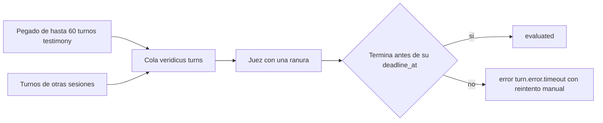

# Diseño de escalado — U6 session-lifecycle

**Insumos.** `nfr-requirements/performance-requirements.md` (performance-requirements),
`security-requirements.md` (security-requirements), `scalability-requirements.md`
(scalability-requirements), `reliability-requirements.md` (reliability-requirements),
`observability-requirements.md` (observability-requirements) y `tech-stack-decisions.md`
(tech-stack-decisions) de esta unidad; flujos F2–F4 de `functional-design/functional-spec.md`
(functional-spec); C1 y C2 de `inception/contract-design/contract-summary.md` (contract-summary);
respuestas P1–P2 de `nfr-design-questions.md`; modelo de capacidad de U4.

## 1. Sin estado en los procesos (NFR8.2)

| Elemento | Réplicas en el MVP | Qué garantiza que dos instancias no se pisen |
|---|---|---|
| API de `session-api` (pegado, latido, reanudación, lista, versiones) | 1 | Bloqueo de la fila de la sesión en el pegado; restricción única `(session_id, client_request_id)`; marca del lote con `WATCH` en Redis (P1 = A); `UPDATE … WHERE status = 'suspended'` en la reanudación |
| Trabajador de `session-api` (`SuspensionSweeper`) | 1 | `FOR UPDATE SKIP LOCKED` y condición sobre el estado (P2 = A) |
| Consola | — | La vista previa es local; el estado vive en el servidor |

Ningún latido, lote ni temporizador de sesión vive en memoria del proceso: el latido es una columna, la
revisión es una sentencia sin estado y el lote es una fila más una clave de Redis. Prueba de nivel 1 con
dos instancias de la aplicación y dos revisiones en hilos distintos: cada transición y cada lote quedan
una sola vez.

## 2. Tamaño del pegado frente a la cola (NFR8.3, NFR8.4)

- **Límites.** ≤ 60 turnos de testimonio, ≤ 200 en total, ≤ 100 000 caracteres, ≤ 2 000 por turno y
  cuerpo ≤ 524 288 bytes, leídos del catálogo de U1 por la consola y por el servidor
  (security-design §2). Prueba de nivel 0: ambas lecturas del archivo de división dan los mismos valores
  y coinciden con el catálogo.
- **Capacidad del juez.** Un turno a la vez (U4). Con la cola vacía, el turno 60 de un pegado recibe el
  tope de 3 600 s; a 45 s por turno el pegado termina en ≈ 2 700 s y al p95 de 60 s llega justo al tope.
  La publicación sin duplicados (P1 = A) es parte del margen: un reenvío no vuelve a meter 60 turnos en
  la cola.
- **Riesgo aceptado.** Si la cola ya tiene turnos de otras sesiones, los últimos del pegado pueden vencer
  (security-requirements §5); se ve en `veridicus_turn_queue_depth` y en
  `veridicus_transcript_paste_turns`.

<!-- Texto alternativo: un pegado de hasta 60 turnos de testimonio y los turnos de otras sesiones comparten la cola de turnos, que atiende un juez con una sola ranura; cada turno termina evaluado si acaba antes de su plazo o en error por plazo, con reintento manual, si no. -->

## 3. Lista sin paginar (NFR8.5)

`GET /sessions` devuelve todas las sesiones con una sola consulta agregada (performance-design §4). Con
≤ 500 sesiones la respuesta queda ≤ 200 KB. El disparador para paginar es medible: más de 1 000 sesiones
en la base o NFR3.2 en rojo; entonces se añade paginación por cursor sobre `(created_at, session_id)`
como cambio menor de C1 en un PR propio.

## 4. Escrituras del latido y crecimiento (NFR8.6, NFR8.7)

- **Latido acotado.** ≤ 1 `UPDATE` efectivo cada 15 s por sesión abierta: con 50 sesiones, ≤ 200
  escrituras por minuto. Los latidos omitidos por `SKIP LOCKED` solo pueden bajar esa cifra. Prueba de
  nivel 1 que cuenta sentencias efectivas con reloj controlado.
- **La revisión no crece con el total.** El índice parcial solo contiene sesiones `open` (≤ 50), así que
  el costo de cada vuelta no depende de las 500 sesiones totales.
- **Tablas.** `TranscriptPaste` y `SessionStatusChange` son de solo inserción, sin purga, < 5 MB con
  ≤ 500 sesiones; las columnas nuevas de `Turn` no cambian el estimado < 100 MB de U4. Las marcas de lote
  en Redis expiran a las 24 h y ocupan < 100 bytes cada una.

## 5. Señales para escalar

| Señal | Umbral | Acción, en este orden, por PR con medición |
|---|---|---|
| `veridicus_turn_queue_depth` tras un pegado | > 30 durante 10 minutos | Perfil GPU para la demostración; bajar `transcript_max_testimony_turns` en el catálogo; segunda pareja juez + `semantic-agent` (U4) |
| Corrida de 60 turnos (NFR3.11) | Algún `turn.error.timeout` | Igual que arriba; nunca subir el tope del plazo |
| Sesiones en la base | > 1 000 o NFR3.2 en rojo | Paginación por cursor en `GET /sessions` |
| `veridicus_suspension_sweep_seconds` p95 | > 100 ms | Revisar el índice parcial; no alargar el intervalo en silencio |
