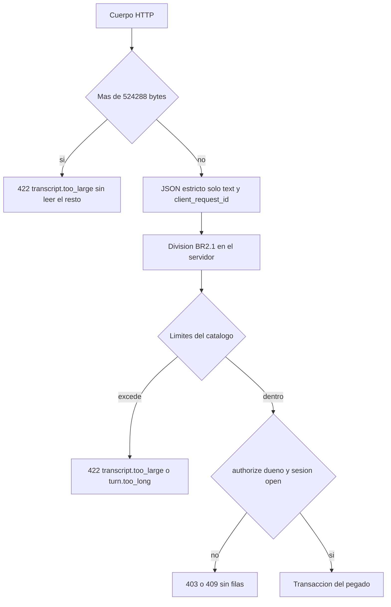

# Diseño de seguridad — U6 session-lifecycle

**Insumos.** `nfr-requirements/performance-requirements.md` (performance-requirements),
`security-requirements.md` (security-requirements, amenazas T1–T10), `scalability-requirements.md`
(scalability-requirements), `reliability-requirements.md` (reliability-requirements),
`observability-requirements.md` (observability-requirements) y `tech-stack-decisions.md`
(tech-stack-decisions, D1–D10) de esta unidad; flujos F1–F6 y §8 de
`functional-design/functional-spec.md` (functional-spec); C1, C2, C4, C8 y C15 de
`inception/contract-design/contract-summary.md` (contract-summary); respuestas P1–P2 de
`nfr-design-questions.md`; diseño de U1 (catálogo `contracts/limits.v1.yaml`, escáner C8), U2
(`NetworkPolicy`), U3 (`authorize`, formateador de logs con lista blanca, `AuditConvention`) y U4
(validación de C2, `XDEL`, guardia del umbral); reglas AUTONOMIA-01..05 de `team.md` y prohibiciones de
`project.md`.

## 1. Frontera (AUTONOMIA-04; NFR1.1, NFR1.2)

| Componente | Dónde corre | Qué datos cruzan su frontera | Destinos permitidos |
|---|---|---|---|
| Rutas de U6 en ConsoleApi | API de `session-api`, dentro del clúster | Testimonio pegado desde el navegador por HTTPS; `SessionSummary` (sin texto de turnos) hacia el navegador | Navegador por el *ingress* TLS de U2 |
| `TranscriptIntake` (división, pegado, publicación) | API de `session-api`, dentro | Turnos de testimonio en C2 y la marca del lote (solo el UUID) hacia Redis | PostgreSQL, Redis |
| `HeartbeatWriter`, `SessionResume` | API de `session-api`, dentro | Solo identificadores y horas | PostgreSQL |
| `SuspensionSweeper` | Trabajador de `session-api`, dentro | Solo identificadores y horas | PostgreSQL |
| `ScenarioVersionUpload` | API y trabajador de `session-api`, dentro | Documento sintético hacia el indexador de U4 (C4) y pasajes hacia `model-embeddings` (C14) | PostgreSQL, Redis, `model-embeddings` |
| M1, diálogos de pegado y reanudación, historial lateral | Navegador | La vista previa se calcula en el navegador; solo habla con ConsoleApi | ConsoleApi |

**Ningún componente de U6 llama fuera del clúster.** Los pods de API y trabajador de `session-api`
quedan bajo `veridicus-default-deny` y la regla `deny-external-egress` de U2; U6 no añade reglas de
salida. Verificación: los `/readyz` de ambos procesos pasan con la política aplicada (nivel 1 en el
clúster local y verificación manual de U2 antes de la sustentación) y la revisión de dependencias del PR
confirma 0 dependencias de ejecución nuevas (`pip-audit` verde). La vista previa en el navegador hace 0
peticiones (Vitest de NFR3.6).

## 2. Entrada del pegado (NFR10.1; T1, T2)

<!-- Texto alternativo: el cuerpo HTTP se corta al pasar 524 288 bytes y responde 422 transcript.too_large sin leer el resto. Dentro del tope, el JSON solo admite text y client_request_id; el servidor divide el texto con BR2.1 y compara con los límites del catálogo; si excede, 422 transcript.too_large o turn.too_long. La autorización de U3 exige dueño y la sesión abierta; si no, 403 o 409 sin filas. Solo entonces se abre la transacción del pegado. -->

- **Lectura acotada.** Un lector por bloques sobre el *stream* de la petición corta al pasar
  `transcript_body_max_bytes` (524 288) antes de parsear; prueba de nivel 1 con 5 MB: `422` y crecimiento
  de RSS ≤ 20 MiB.
- **Esquema estricto.** El cuerpo es el de C1 con `additionalProperties: false`; los roles o una
  división enviados por la consola no tienen campo donde entrar (T2).
- **El servidor divide.** `domain/transcript_split.py` aplica BR2.1 y D6 con el archivo compartido; el
  rol de cada turno sale de las etiquetas del entrevistador, nunca del cliente.
- **Límites de una sola fuente.** 60 turnos de testimonio, 200 turnos en total, 100 000 caracteres,
  2 000 por turno y 524 288 bytes de cuerpo se leen con `veridicus_contracts.limits.get(...)` del
  catálogo de U1; el archivo de división los declara por clave y una prueba de nivel 0 exige que sus
  valores sean iguales a los del catálogo (precisión en §9). Rechazos: E6 (61 de testimonio), E7 (turno
  de 2 100 caracteres) y 201 turnos del entrevistador, cada uno con 0 filas y 0 mensajes en C2.

## 3. Autorización y latido del dueño (NFR10.2, NFR10.3; T3, T10)

| Ruta | `x-veridicus-roles` | `x-veridicus-owner-only` | Anti-CSRF |
|---|---|---|---|
| `POST /sessions/{id}/transcript` | `[analista]` | `true` | Sí |
| `POST /sessions/{id}/heartbeat` | `[analista]` | `true` | Sí |
| `POST /sessions/{id}/resume` | `[analista]` | `true` | Sí |
| `POST /scenarios/{id}/versions` | `[analista, admin]` | — | Sí |
| `GET /sessions` | `[analista, admin]` | — | No (lectura) |

- Todas pasan por la dependencia `authorize` de U3; la comprobación del dueño la hace ConsoleApi con la
  consulta de InterviewSession (ADR-009). Pruebas `403` de nivel 1: otro analista pega, reanuda o envía
  latido (E14); un `admin` pega; petición sin anti-CSRF. Todas con 0 filas.
- **El latido es del dueño.** La sentencia del latido (performance-design §2) lleva
  `owner_user_id = :user_id` en su condición: un sondeo de otro usuario no escribe nada aunque la ruta
  `GET` sea legible para él. Prueba de nivel 1: solo sondea otro usuario y la sesión se suspende a
  tiempo.
- `GET /sessions` serializa `SessionSummary` con un modelo Pydantic cerrado: escenario, versión, dueño,
  fecha, estado y conteo de pendientes; ningún campo con texto de turnos (prueba de nivel 1 sobre las
  claves de la respuesta).

## 4. Datos sensibles en logs, errores y Redis (NFR10.4, NFR10.5; T5)

- **Logs.** El formateador de `libs/` (U3) amplía su lista blanca con `paste_batch_id`, `scenario_id`,
  `turn_count`, `testimony_count`, `char_count` e `idle_seconds`. Nunca el texto pegado, el de un turno
  ni el nombre de un hablante. Las excepciones del pegado se registran con su tipo y `code`, sin su
  mensaje.
- **Errores.** Los Problem Details de U6 llevan `detail` fijo del catálogo de U1; ningún `detail` se
  arma con el texto recibido (por ejemplo, `turn.too_long` dice el número de turno, no su contenido).
- **Prueba centinela (nivel 1).** Una cadena centinela sembrada en un pegado aceptado, en uno rechazado
  por tamaño y en el nombre de un hablante: 0 coincidencias en los logs capturados de API y trabajador
  y en los Problem Details.
- **Redis.** Los turnos pegados usan C2 tal cual, con el `XACK` + `XDEL` de U4 tras el efecto; tras
  evaluar un pegado de 15 turnos, `XRANGE` de `veridicus:turns` y `veridicus:results` no contiene el
  texto. La marca `veridicus:paste-published:<paste_batch_id>` (P1 = A) solo contiene el valor `1` y su
  clave solo el UUID del lote, con expiración de 24 h. El residuo en el AOF de U2 es el mismo riesgo ya
  registrado por U4 para C2 (datos sintéticos, NFR12).

## 5. Estado, inmutabilidad y auditoría (NFR10.6, NFR11.1, NFR11.2; T4, T6, T7)

- **Sin rutas peligrosas.** La comprobación del OpenAPI de C1 (nivel 0) falla si hay `PUT`, `PATCH` o
  `DELETE` sobre `/scenarios/*`, `/scenario-versions/*` o pasajes, o si un cuerpo acepta `status`. La
  transición `open → suspended` solo existe en `SuspensionSweeper`, y `suspended → open` solo en
  `SessionResume`.
- **Permisos de la base.** El rol de la aplicación no tiene `UPDATE` ni `DELETE` sobre pasajes ni
  `DELETE` sobre `ScenarioVersion`; `TranscriptPaste` y `SessionStatusChange` son de `INSERT, SELECT`
  únicamente. El latido y la marca de publicación **no** escriben en `TranscriptPaste` (P1 = A), así que
  la tabla sigue siendo de solo inserción. Prueba de nivel 1: `UPDATE` y `DELETE` directos fallan por
  permisos; cargar la versión 2 deja la 1 con el mismo SHA-256 y número de pasajes.
- **Actor de cada cambio.** `open → suspended` con `actor_kind = system` y sin usuario; `suspended → open`
  con `actor_kind = user` y el dueño. Ambas tablas están registradas en `AuditConvention` de U3 y las
  recorre la prueba común.
- **Migraciones (AUTONOMIA-01).** Columnas `speaker`, `role`, `paste_batch_id`, `suspended_at`, tabla
  `TranscriptPaste`, índice parcial de la revisión y la vista de pendientes entran en un `Job` de
  migraciones en su propio PR, aditivas; nada se aplica al arrancar un pod.

## 6. Guardia del umbral y vocabulario (NFR10.7, NFR10.8; T8, T9)

- **AUTONOMIA-05.** `TranscriptIntake` construye cada mensaje C2 con el mismo constructor que
  `TurnEnqueuer` de U4, que toma la instantánea del umbral de la sesión; no existe otro camino a C2. Los
  turnos `interviewer` no generan mensaje. Prueba de nivel 1: el caso de Hecho No Documentado pegado da
  0 alertas, 0 preguntas y 1 paquete, igual que turno a turno.
- **AUTONOMIA-03.** Los textos de M1, de los diálogos de pegado y reanudación, del historial lateral y de
  TurnItem salen del catálogo de U1 y pasan `scan(text, literal_sources)` de `libs/integrity_policy` en
  nivel 0 (sobre el catálogo) y en nivel 3 (sobre la interfaz renderizada), con 0 coincidencias.

## 7. Datos sintéticos (NFR12.1)

Las transcripciones pegadas de prueba, el archivo de ejemplos de división y las versiones de escenario
usan el catálogo de nombres y las marcas de datos sintéticos de U1. La comprobación de U1 corre en nivel
0 sobre `services/session-api/tests/`, `frontend/src/**/__tests__/` y el archivo de división: 0
hallazgos.

## 8. Amenazas y controles

| Amenaza | Controles de este diseño |
|---|---|
| T1 Pegado enorme | §2 (corte de cuerpo y límites del catálogo) |
| T2 División o roles manipulados | §2 (el servidor divide; cuerpo estricto) |
| T3 Sesión ajena o latido ajeno | §3 |
| T4 Forzar estado o modificar versiones | §5 |
| T5 Texto en logs, errores o Redis | §4 |
| T6 Reescribir historial o versión | §5 |
| T7 Suspensión sin autor | §5 (`actor_kind = system`) |
| T8 Saltar la guardia del umbral | §6 |
| T9 Etiqueta de veracidad en textos nuevos | §6 |
| T10 Lista que expone de más | §3 |

## 9. Precisiones a artefactos ya aprobados

No edité ningún artefacto aprobado; decides en la aprobación si se actualizan.

| Artefacto | Qué precisa | Origen |
|---|---|---|
| `contracts/nfr-design/security-design.md` §4.4 (catálogo `contracts/limits.v1.yaml` de U1) | Se añaden, con dueño U6: `transcript_max_testimony_turns: 60`, `transcript_max_turns: 200` y `transcript_body_max_bytes: 524288` (`too_large: 422/transcript.too_large`); `transcript_max_chars` (100 000) y `turn_text_max_chars` (2 000) ya están | NFR8.3, NFR10.1; P1 = A de U1 (fuente única de cifras) |
| `session-lifecycle/nfr-requirements/tech-stack-decisions.md` (D5) | El archivo `transcript-split.v1.json` guarda etiquetas y ejemplos, y declara los límites por su clave del catálogo; una prueba de nivel 0 exige que sus valores coincidan con `limits.v1.yaml`. El catálogo es la autoridad | NFR8.3, NFR13.2 |
| `identity-access/nfr-design/observability-design.md` §1 (lista blanca del formateador) | Se añaden los campos `paste_batch_id`, `scenario_id`, `turn_count`, `testimony_count`, `char_count` e `idle_seconds` | NFR10.4, NFR15.2 |
