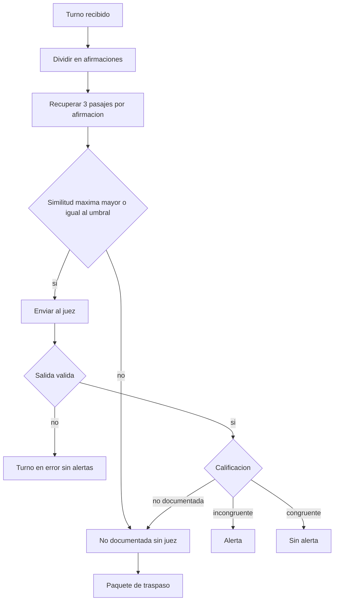
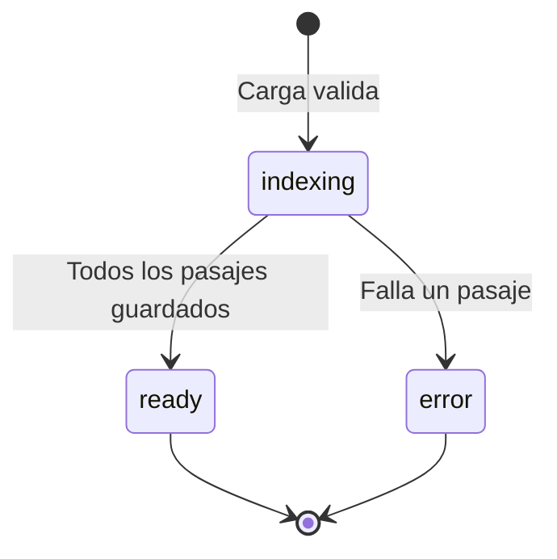
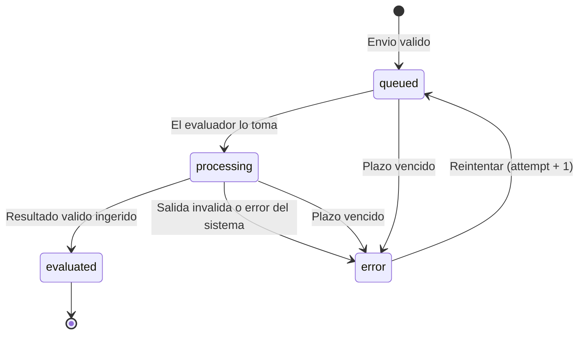
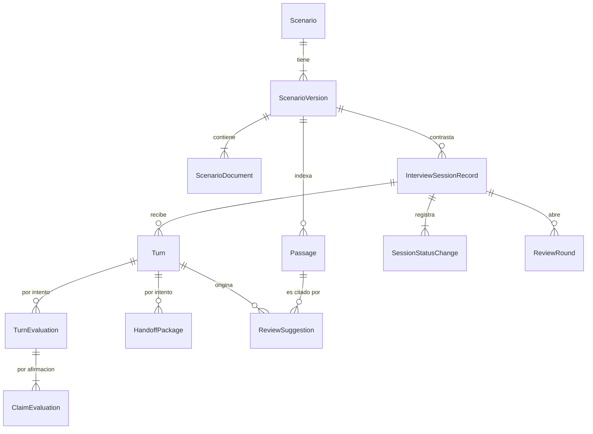

# Especificación funcional — U4 text-flow

**Insumos.** Unidad U4 de `inception/units-generation/unit-of-work.md` (unit-of-work) e historias
asignadas en `unit-of-work-story-map.md` (unit-of-work-story-map); FR2–FR5 y NFR10–NFR14 de
`inception/requirements-analysis/requirements.md` (requirements); componentes y ADR-001 a ADR-009 de
`inception/domain-design/components.md` (components); contratos C1–C4, C6–C10, C13 y C14 de
`inception/contract-design/contract-summary.md` (contract-summary); `refined-mockups/interaction-spec.md`
y `mockups.md` (M2, M3, M4); respuestas P1–P5 de `functional-design-questions.md`. Las entidades están
en `entities.md`, las reglas en `rules.md` y los componentes de la consola en `frontend-components.md`;
este documento es la fuente de verdad de los flujos y las máquinas de estado.

## 1. Qué hace la unidad

U4 es el flujo de texto de punta a punta que team-practices fija como primera rebanada: cargar el
escenario de control → ingresar un testimonio en texto → consultar `pgvector` → mostrar la alerta con
su CoT al analista. Incluye la guardia del umbral (AUTONOMIA-05) como módulo de dominio puro con 100 %
de ramas y el escáner de vocabulario prohibido (AUTONOMIA-03).

### Frontera AUTONOMIA-04 por componente

| Componente | Proceso | Dentro / fuera del clúster | Datos que cruzan la frontera |
|---|---|---|---|
| ConsoleApi | `session-api` | Dentro | Testimonio, alertas y CoT hacia el navegador del analista, dentro del clúster (C1) |
| TruthFrame (carga e indexador) | `session-api` | Dentro | Ninguno sale; *embeddings* por ModelGateway a un servidor interno |
| InterviewSession | `session-api` | Dentro | Mensajes C2/C3 por Redis interno |
| HumanReview (sugerencias) | `session-api` | Dentro | Ninguno |
| SemanticEvaluation | `semantic-agent` | Dentro, bajo la `NetworkPolicy` de salida denegada | Afirmaciones y pasajes al juez interno (C14); nada sale |
| ModelGateway | `libs/`, en ambos servicios | Dentro | Un destino no interno impide arrancar (C13, AC9.1.4) |
| IntegrityPolicy (escáner) | `libs/` | Dentro | Ninguno |
| AnalystConsole (M2, M3, M4) | `frontend` | Dentro | Solo habla con ConsoleApi (ADR-004) |

## 2. Flujos

### F1 — Cargar un escenario (US1.1)

1. El analista o el `admin` abre «Cargar escenario de control» en M2, escribe el nombre y elige el
   archivo (`POST /scenarios`, multipart).
2. ConsoleApi autoriza (U3) y TruthFrame valida tamaño, firma binaria, UTF-8 y vacío (BR1.1); un fallo
   responde 413, 415 o 422 con el mensaje de AC1.1.2 y no guarda nada.
3. Calcula el SHA-256; si ya existe → 409 `scenario.duplicate_sha256` (BR1.2).
4. Reconoce los documentos por sus encabezados `# [DOC-…]` (BR1.3); un ID repetido → 422.
5. Guarda `Scenario`, `ScenarioVersion` 1 en `indexing` y sus `ScenarioDocument`, y publica C4
   (BR1.4). Responde 202; M2 muestra «Indexando…».

### F2 — Indexar una versión (trabajador de `session-api`, C4)

1. El indexador recibe `IndexScenarioVersion` y lee la fuente por `version_id`.
2. Segmenta por documento, párrafo y encabezado; parte los párrafos largos en oraciones completas hasta
   el máximo por pasaje (BR2.1).
3. Pide los *embeddings* por lotes a ModelGateway con *timeout* explícito.
4. En una sola transacción guarda todos los pasajes y pasa la versión a `ready` con `ready_at`; si
   cualquier paso falla, la versión pasa a `error` con su `code` y 0 pasajes (BR2.2).
5. Confirma el mensaje (`XACK`). Una reentrega de una versión ya `ready` o `error` se confirma sin
   efectos.

### F3 — Elegir el escenario y crear la sesión (US1.3, US2.1)

1. El analista pulsa «Nueva sesión»; M3 muestra el catálogo con la versión `ready` más reciente
   preseleccionada (BR3.1).
2. Pulsa «Crear sesión» (`POST /sessions`). Si es `admin` → 403 (BR4.2); si la versión no está `ready`
   → 409 `scenario.not_ready` (BR2.3).
3. InterviewSession crea la sesión `open` con la versión, su SHA-256, el umbral del cargador de
   configuración y `top_k = 3` como instantáneas, e inserta `SessionStatusChange` (BR4.1).
4. Responde 201; la consola abre M4 con la cabecera (escenario, versión, 12 primeros caracteres del
   SHA-256 y umbral) y el estado vacío (BR13.6).

### F4 — Enviar un turno (US2.2)

1. El analista escribe y pulsa «Enviar turno» o `Ctrl+Enter` (`POST /sessions/{id}/turns` con
   `client_request_id`).
2. ConsoleApi exige rol `analista` y ser el dueño (BR4.3).
3. Valida longitud 1–2 000 (BR5.1) y que la sesión esté `open` (BR5.5).
4. Si el `client_request_id` ya existe → devuelve el turno existente (BR5.3).
5. Bajo bloqueo de la sesión asigna el número siguiente (BR5.2), guarda el turno `queued` con
   `deadline_at` y publica C2 con el umbral, el SHA-256, `top_k` y hasta 3 turnos previos (BR5.4).
6. Responde 202 sin esperar; el turno se ve «En cola».

### F5 — Evaluar un turno (`semantic-agent`, C2 → C3)

1. Recibe `TurnToEvaluate`; si no cumple C2 o trae un mayor desconocido → `veridicus:turns:failed`
   (BR5.6).
2. Informa «Procesando» (etapa `retrieving`) y divide el turno en afirmaciones (BR7.1).
3. Por cada afirmación: calcula su *embedding*, recupera 3 pasajes de la versión de la sesión con el
   usuario de solo lectura (BR7.2) y aplica la guardia con el umbral del mensaje (BR7.3, BR6.2).
4. Si ninguna afirmación pasa la guardia → no llama al juez (BR7.4) y salta al paso 8.
5. Construye el *prompt*: instrucciones del archivo montado con SHA-256 verificado y, en el bloque
   delimitado de datos, solo las afirmaciones que pasaron la guardia con sus pasajes (BR9.1). Etapa
   `judging`.
6. Llama al juez una vez por turno (temperatura 0, semilla fija) con *timeout* (BR8.2).
7. Valida la salida: C6 estricto (BR8.1), referencias dentro de los pasajes recuperados (BR8.3) y CoT
   sin vocabulario prohibido fuera de citas literales (BR8.4). Cualquier fallo → resultado `error` para
   todo el turno.
8. Arma el resultado: «no documentada» por guardia o por el juez (BR7.5) → paquete (BR10.1–BR10.5);
   «incongruente» sobre el umbral → alerta armada por el sistema (BR7.6, BR8.6) y validada contra C7
   (BR8.5); «congruente» → nada.
9. Publica C3 y solo después confirma C2 (`XACK`).

<!-- Texto alternativo: el turno se divide en afirmaciones; por cada una se recuperan 3 pasajes; si la similitud máxima está por debajo del umbral, la afirmación es no documentada sin llamar al juez y va al paquete de traspaso; si está en o sobre el umbral, va al juez; una salida inválida deja el turno en error sin alertas; si es válida, incongruente produce alerta, no documentada va al paquete y congruente no produce nada. -->

### F6 — Ingerir el resultado (`session-api`, C3)

1. Recibe `EvaluationResult`; vuelve a validar sus invariantes y cada alerta contra C7 (BR8.5).
2. Si el `attempt` es menor que el vigente, el turno ya está `evaluated` o su plazo venció → confirma y
   descarta (BR5.7, BR5.8).
3. Si `outcome` es `error` → turno `error` con su `code`, sin más filas (BR11.3).
4. Si es `evaluated` → en una transacción guarda `TurnEvaluation` y sus `ClaimEvaluation` (BR7.7), el
   `HandoffPackage` si hay, llama `SuggestionProposer.propose` (abre la ronda 1 si hace falta) y pasa el
   turno a `evaluated` (BR11.1, BR11.2).
5. Confirma C3 (`XACK`).

### F7 — Plazos y reintento

1. Una tarea periódica de `session-api` pasa a `error` con `turn.error.timeout` los turnos `queued` o
   `processing` con `deadline_at` vencido (BR5.8).
2. El dueño pulsa «Reintentar evaluación» (`POST …/turns/{n}/retry`), también en sesión finalizada:
   si el turno está en `error` pasa a `queued` con `attempt + 1`, nuevo `deadline_at`, y se publica C2;
   si no, 409 `turn.not_in_error` (BR5.9).
3. La salida inválida del juez nunca se reintenta sola (contract-design P3).

### F8 — Ver resultados en la consola (sondeo)

1. Mientras haya turnos `queued` o `processing`, M4 consulta `GET /sessions/{id}?since=<cursor>` cada
   pocos segundos (intervalo de NFR Requirements; contract-design P6).
2. Cada respuesta trae solo lo que cambió: estados de turnos, sugerencias nuevas y paquetes.
3. La consola agrega las tarjetas sin modal ni foco (BR13.1), actualiza el contador de pendientes y
   anuncia el agregado en la región `aria-live`.
4. Un turno en error muestra su causa (BR13.3); un turno con paquete muestra el aviso (BR13.5); uno
   evaluado sin nada muestra «Evaluado · sin sugerencias de revisión» (BR13.4).

### F9 — Paquete de Contexto de Traspaso (US4.2)

1. Se arma en F5 paso 8 con: texto del turno, turnos previos (BR10.2), los 3 pasajes distintos más
   cercanos de las afirmaciones no documentadas (BR10.3) y la CoT interrumpida determinista (BR10.4).
2. Formato fijo de la CoT interrumpida, una línea por afirmación no documentada:
   `Afirmación <i>: «<texto>». Pasajes: <document_id>/<posición> (<similitud>), … Similitud máxima
   <X> < umbral <Y>.` o `… El juez la calificó «no documentada».`, con similitudes de 4 decimales y una
   línea final `Validación detenida: requiere control manual.`
3. En M4, el aviso abre el panel lateral no modal (BR13.5).

### F10 — Escaneo de vocabulario prohibido (US5.5)

1. El escáner `scan(text, literal_sources)` de `libs/integrity_policy` aplica C8: normaliza, busca por
   palabra completa y excluye los tramos «…» que aparecen literales en `literal_sources` (BR12.1).
2. Se aplica a la CoT de cada salida del juez (F5 paso 7), al catálogo de mensajes y rótulos de la
   consola en nivel 0, al Golden Dataset en nivel 2 y a la interfaz renderizada en nivel 3 (BR12.2,
   BR12.3). U7 lo aplica al reporte y U8 a la pregunta y al indicio afectivo.

## 3. Máquinas de estado

### Versión de escenario

<!-- Texto alternativo: una versión nace en indexing con una carga válida; pasa a ready cuando todos sus pasajes se guardan y a error si falla cualquiera; ready y error son finales: corregir crea otra versión (U6). -->

### Turno

<!-- Texto alternativo: un turno nace en queued; pasa a processing cuando el evaluador lo toma; a evaluated cuando se ingiere un resultado válido; a error por salida inválida, error del sistema o plazo vencido (desde queued o processing); desde error, Reintentar lo devuelve a queued con attempt más uno; evaluated es final. -->

| Desde | Hacia | Quién | Guardia | Efecto |
|---|---|---|---|---|
| — | `queued` | Dueño (`analista`) | Sesión `open`; 1–2 000 caracteres | Número sin huecos; C2 publicado |
| `queued` | `processing` | `semantic-agent` | — | `processing_stage` |
| `processing` | `evaluated` | Ingesta C3 | Intento vigente; plazo no vencido | Evaluación, paquete y sugerencias en una transacción |
| `queued`/`processing` | `error` | Ingesta C3 o tarea de plazos | Intento vigente | `error_code` |
| `error` | `queued` | Dueño | Turno en `error` | `attempt + 1`; C2 publicado |

### Sesión (parte de U4)

U4 crea la sesión en `open`. Las transiciones a `suspended` y de vuelta son de U6; a `finalized`, de
U7 (`/finalize`); a `consolidated`, de U7. Toda transición deja `SessionStatusChange`.

## 4. Vista derivada: entidades y relaciones

Derivada de `entities.md` (la fuente de verdad es su bloque YAML).

<!-- Texto alternativo: un escenario tiene versiones; cada versión contiene documentos e indexa pasajes y contrasta sesiones; una sesión recibe turnos, registra cambios de estado y abre rondas; cada turno tiene evaluaciones y paquetes por intento y origina sugerencias; cada evaluación tiene una evaluación por afirmación; cada sugerencia cita un pasaje. -->

## 5. Vista derivada: reglas

Derivada de `rules.md` (la fuente de verdad es su bloque YAML).

| Grupo | Reglas | Flujo |
|---|---|---|
| Carga | BR1.1–BR1.4 | F1 |
| Indexación | BR2.1–BR2.4 | F2, F3 |
| Catálogo | BR3.1–BR3.2 | F3 |
| Sesión | BR4.1–BR4.3 | F3, F4 |
| Turnos | BR5.1–BR5.9 | F4, F5, F6, F7 |
| Umbral | BR6.1–BR6.2 | F3, F5 |
| Evaluación (guardia AUTONOMIA-05) | BR7.1–BR7.7 | F5, F6 |
| Validación | BR8.1–BR8.6 | F5, F6 |
| Prompt | BR9.1–BR9.2 | F5 |
| Paquete | BR10.1–BR10.5 | F5, F9 |
| Ingesta y auditoría | BR11.1–BR11.4 | F6 |
| Vocabulario | BR12.1–BR12.4 | F5, F10 |
| Consola | BR13.1–BR13.7 | F8, F9 |

## 6. Escenarios de negocio y casos límite

| # | Escenario | Resultado esperado | Regla |
|---|---|---|---|
| E1 | Archivo de 1 048 576 bytes | 202; «Indexando…» → «Listo» con ≥ 1 pasaje | BR1.1, BR2.2 |
| E2 | 1 048 577 bytes / `%PDF` / byte `0xE9` / 0 bytes | 413 / 415 / 422 / 422, 0 pasajes | BR1.1 |
| E3 | Dos encabezados `# [DOC-7]` | 422; nada se guarda | BR1.3 |
| E4 | *Fake* de *embeddings* que falla en el pasaje 2 | Versión «Error», 0 pasajes, no elegible | BR2.2, BR2.3 |
| E5 | 10 envíos concurrentes | Turnos 1..10 sin huecos ni duplicados | BR5.2 |
| E6 | Turno de 2 001 caracteres | 422 `turn.too_long` | BR5.1 |
| E7 | Juez bloqueado; se envía otro turno y se consulta una alerta | 202 y 200 antes de liberar el juez | BR5.4 |
| E8 | Trabajador muere a mitad | Un solo resultado por intento | BR5.7 |
| E9 | Sesión S1 con T1; reinicio con T2; afirmación con similitud entre T1 y T2 | Resultado según T1; S2 guarda T2 | BR4.1, BR6.2 |
| E10 | Similitud umbral − δ / umbral / umbral + δ, juez «incongruente» | No documentada / alerta / alerta | BR7.3, BR7.6 |
| E11 | Juez forzado a «incongruente» y todas bajo el umbral | 0 alertas, 0 preguntas, 1 paquete; juez no llamado | BR7.3, BR7.4, BR10.1 |
| E12 | Sobre el umbral, juez «no documentada» | Paquete, sin alerta, sin pregunta | BR7.5, BR10.5 |
| E13 | Una no documentada y una incongruente sobre el umbral | 1 alerta y 1 paquete | BR7.6, BR10.1 |
| E14 | Juez: texto no JSON / falta campo / calificación fuera del enum / 1 de 3 mal formada / *timeout* | 0 alertas, turno «Error»; `invalid_output` en (a)–(d), `timeout` en (e) | BR8.1, BR8.2 |
| E15 | CoT cita un pasaje no recuperado | `invalid_output`, 0 alertas | BR8.3 |
| E16 | CoT «el compareciente miente» / «falso» en cita literal | Inválida / válida | BR8.4 |
| E17 | Alerta con `quote` de solo espacios o `document_id` de otra versión | Rechazada en los tres puntos | BR8.5 |
| E18 | Reintentar dos veces el mismo turno | Mismo número; sin alertas duplicadas | BR5.9, BR11.2 |
| E19 | Turno 2 con paquete | «Turnos previos disponibles: 1 de 3» | BR10.2 |
| E20 | Inyección del Escenario A en el testimonio | Mismo conjunto de alertas (nivel 2) | BR9.1 |
| E21 | Umbral `abc`, `NaN`, vacío o fuera de rango | El servicio no arranca; log sin el valor | BR6.1 |
| E22 | Prompt montado con SHA-256 distinto | El servicio no arranca | BR9.1 |
| E23 | `admin` intenta crear sesión | 403, 0 filas; no ve «Nueva sesión» | BR4.2 |

## 7. Integración con otras unidades

| Unidad | Qué usa de U4 o qué aporta |
|---|---|
| U1 contracts | Aporta C1–C4, C6–C10, C8, catálogo de rótulos y formato de fecha; U4 los valida en sus fronteras |
| U3 identity-access | Aporta la autenticación, la matriz y la convención de auditoría; U4 registra `SessionStatusChange` y declara sus rutas |
| U5 human-review | Recibe `ReviewSuggestion` y `ReviewRound`; crea `ReviewDecision` y `CotView` |
| U6 session-lifecycle | Reutiliza F4 para la transcripción pegada y la máquina de la sesión |
| U7 forensic-report | Lee sesión, turnos y paquetes (C11); usa el escáner de F10 |
| U8 assistant-extras | Añade permutación, pregunta e indicio afectivo a F5 |
| U9 voice | Entra en F4 con `origin: voice` tras la transcripción |
| U2 platform | Monta el prompt `readOnly` desde un `ConfigMap`, la `NetworkPolicy`, el rol de solo lectura del juez y los servidores de modelos |

## 8. Errores y bordes

- Toda E/S (base, Redis, ModelGateway) lleva *timeout* explícito; los reintentos automáticos se limitan
  a la reentrega de colas (errores recuperables, operaciones idempotentes).
- Los logs llevan solo `session_id`, `turn_id`, `attempt` y `code`; nunca texto del testimonio, de las
  afirmaciones ni de los pasajes (NFR10).
- Una versión `error` no se reintenta: se carga otra versión (U6).
- Un turno con 0 afirmaciones con letras (p. ej. «…») se trata como una afirmación con el turno entero
  (BR7.1), para que siempre haya resultado.

## 9. Precisiones a artefactos ya aprobados

Estas decisiones de la etapa precisan artefactos ya aprobados. No los edité; decides en la aprobación si
se actualizan.

| Artefacto | Qué precisa | Origen |
|---|---|---|
| `contract-design/contract-summary.md` (C1 `ErrorCode`) | Añade `turn.too_long` (422) y `session.not_open` (409, sesión suspendida) | P5 = A; BR5.5 |
| `contract-design/contract-summary.md` (C2) | Añade `top_k` a `TurnToEvaluate` como instantánea de la sesión (cambio menor) | P4 = A |
| `contract-design/contract-summary.md` (C3) | `handoff_package` añade `undocumented_claim_indexes` y `threshold_used` (cambio menor) | BR10.1, BR10.4 |
| `contract-design/contract-summary.md` (C1 `ScenarioVersion`) | Añade la lista de documentos (`document_id`, `title`) de la versión | P3 = A |
| Functional Design de U1 (BR5.3) | El escáner que exige BR5.3 de U1 vive en `libs/integrity_policy` y lo implementa U4 (F10), con firma `scan(text, literal_sources)` | Hallazgo R-01 de la revisión de U1 |
