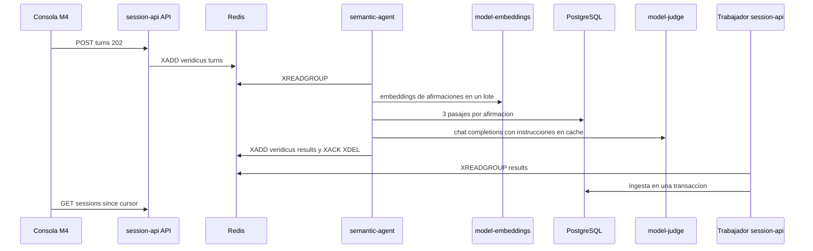

# Diseño de rendimiento — U4 text-flow

**Insumos.** `nfr-requirements/performance-requirements.md` (performance-requirements),
`security-requirements.md` (security-requirements), `scalability-requirements.md`
(scalability-requirements), `reliability-requirements.md` (reliability-requirements),
`observability-requirements.md` (observability-requirements) y `tech-stack-decisions.md`
(tech-stack-decisions, D1–D16) de esta unidad; flujos F1–F9 de `functional-design/functional-spec.md`
(functional-spec); C1–C4, C6, C7, C9, C13 y C14 de `inception/contract-design/contract-summary.md`
(contract-summary); respuestas P1–P2 de `nfr-design-questions.md`; diseño de U1 (catálogo de límites)
y U3 (autorización); prácticas de `team.md`.

Todas las metas se diseñan para el **perfil CPU** (NFR2.2); el perfil GPU solo puede acortar tiempos.

## 1. Camino crítico de un turno de texto (NFR3.1, p95 ≤ 60 s)

<!-- Texto alternativo: la consola envía el turno y recibe 202; la API lo publica en la cola de turnos. semantic-agent lo lee, pide los embeddings de las afirmaciones en un solo lote, busca 3 pasajes por afirmación en PostgreSQL, llama al juez con las instrucciones ya en caché y publica el resultado, confirmando y borrando el mensaje. El trabajador de session-api ingiere el resultado en una transacción y la consola lo recibe en su siguiente sondeo. -->

| Tramo | Presupuesto de diseño | Técnica |
|---|---|---|
| Encolar (`POST` → `XADD`) | ≤ 50 ms | Validación de C2 con el validador compilado al arrancar; una transacción corta |
| Espera en cola | 0 s con la cola vacía | Un turno a la vez (NFR8.7); la espera es la de turnos anteriores |
| *Embeddings* de las afirmaciones | ≤ 3 s | Un solo lote con todas las afirmaciones del turno (≤ 32), prefijo `query: ` |
| Recuperación | ≤ 1 s (≤ 100 ms por afirmación, NFR3.4) | Búsqueda exacta por versión (§3) |
| Guardia del umbral | < 10 ms | Código puro en `domain/`; las afirmaciones bajo el umbral no van al juez |
| Juez | ≤ 50 s | Instrucciones fijas al inicio del mensaje con `cache_prompt: true`; CoT de 20–80 palabras; `max_tokens = min(4 096, 200 × afirmaciones)` |
| Publicar e ingerir | ≤ 2 s | Una transacción de ingesta; `XACK` y `XDEL` en un *pipeline* |
| Llegar a la consola | ≤ 2 s | Sondeo cada 2 s con turnos en curso (NFR3.7, NFR3.8) |

**Calentamiento del juez.** Al arrancar, `semantic-agent` envía una petición con las instrucciones y un
bloque de datos sintético mínimo para que `llama-server` deje las instrucciones en su caché de
*prompt*; `/readyz` responde `200` solo después. Así el primer turno real no paga el procesamiento de
las instrucciones (≈ 1 000 *tokens*).

## 2. Tamaño del *prompt* (NFR3.11, NFR3.12)

1. Construir el bloque de datos en JSON (D8) con cada pasaje una sola vez.
2. Contarlo con `ModelGateway.count_tokens` (`/tokenize` del juez, *timeout* 5 s).
3. Si supera `VERIDICUS_JUDGE_MAX_DATA_TOKENS` (6 000) → resultado `error` con `turn.error.system`,
   sin llamar al juez, 0 alertas, 0 paquetes.
4. Las instrucciones están acotadas a 1 000 *tokens* por una prueba de nivel 0 sobre el archivo del
   *prompt*.

## 3. Base de datos

| Consulta | Diseño | Meta |
|---|---|---|
| Pasajes de una afirmación (C9) | `SELECT passage_id, document_id, text, 1 - (embedding <=> :q) AS similarity FROM truthframe.passage_search WHERE version_id = :v ORDER BY embedding <=> :q LIMIT 3`, con índice B-tree sobre `version_id` y sin índice aproximado (D5) | p95 ≤ 100 ms con 1 100 pasajes por versión (NFR3.4, NFR8.9) |
| Sondeo de la sesión (P2 = A) | Índices `(session_id, change_seq)` en turnos, sugerencias y paquetes; la consulta trae solo filas con `change_seq > :cursor` | p95 ≤ 200 ms con 50 turnos, 20 sugerencias y 5 paquetes (NFR3.3) |
| Encolar un turno | `SELECT … FOR UPDATE` de la fila de la sesión (numeración BR5.2 y `change_seq`), `INSERT` del turno, `XADD` tras confirmar | p95 ≤ 300 ms, también con el juez bloqueado (NFR3.2) |
| Indexar una versión | `COPY` de los pasajes con sus vectores en una transacción (≤ 5 s) | NFR9.1 |

Pools: API de `session-api` `pool_size = 5`, `max_overflow = 5`; trabajador `pool_size = 3`;
`semantic-agent` `pool_size = 2` (rol de solo lectura). `statement_timeout` según
reliability-design §1.

## 4. Indexación del escenario (NFR9.1–NFR9.3)

- El trabajador lee el archivo ya validado, lo segmenta en pasajes de ≤ 1 000 caracteres (BR2.1) y
  pide *embeddings* en lotes de 32 con prefijo `passage: ` y *timeout* de 30 s por lote.
- Los lotes se calculan fuera de la transacción; la escritura de todos los pasajes es una sola
  transacción al final (todo o nada, NFR10.18).
- Presupuesto para 1 MB (≈ 1 100 pasajes, ≈ 35 lotes): ≤ 150 s de *embeddings* en CPU + ≤ 5 s de
  escritura, bajo los 180 s de NFR9.1. Lo confirma la medición de nivel 2.

## 5. Separación de procesos (D11, D12)

| Proceso | Qué hace | Por qué no frena la consola |
|---|---|---|
| API de `session-api` | Solo HTTP | No consume colas ni indexa |
| Trabajador de `session-api` | Hilos de ingesta de C3, indexador de C4 y revisión de plazos | Proceso aparte, mismo código e imagen |
| `semantic-agent` | Bucle consumidor de C2, un turno a la vez | Proceso aparte; su servidor HTTP solo atiende salud y métricas |

## 6. Consola

- TanStack Query con `refetchInterval` de 2 000 ms si hay turnos `queued` o `processing` y 15 000 ms si
  no (NFR3.7). El cursor de la última respuesta se guarda en la caché de la consulta.
- Las tarjetas nuevas se agregan sin volver a renderizar la lista entera (clave estable por
  `suggestion_id`), para que escribir y enviar no esperen (NFR3.9).

## 7. Recursos (NFR8.1–NFR8.4)

| Pod | Tope medido | Cómo se respeta en el diseño |
|---|---|---|
| `model-judge` | ≤ 7 GiB | Ventana de 12 288 *tokens* y una sola ranura |
| `model-embeddings` | ≤ 1,5 GiB | Lotes de 32 |
| `semantic-agent` | ≤ 512 MiB | Un turno a la vez; sin caché de pasajes |
| Trabajador de `session-api` | ≤ 768 MiB | Segmenta y envía por lotes; el archivo de 1 MB se lee una vez |

Infrastructure Design fija `limits.memory` con ≥ 20 % sobre cada pico medido.
