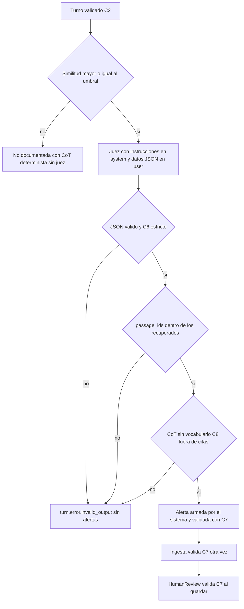

# Diseño de seguridad — U4 text-flow

**Insumos.** `nfr-requirements/performance-requirements.md` (performance-requirements),
`security-requirements.md` (security-requirements, amenazas T1–T14), `scalability-requirements.md`
(scalability-requirements), `reliability-requirements.md` (reliability-requirements),
`observability-requirements.md` (observability-requirements) y `tech-stack-decisions.md`
(tech-stack-decisions, D1–D16) de esta unidad; flujos F1–F9 de `functional-design/functional-spec.md`
(functional-spec); C1–C4, C6–C9, C13 y C14 de `inception/contract-design/contract-summary.md`
(contract-summary); respuestas P1–P2 de `nfr-design-questions.md`; diseño de U1 (contratos, C8,
catálogo de límites), U2 (red y montajes) y U3 (autorización); prácticas de `team.md` y `project.md`.

## 1. Frontera (AUTONOMIA-04)

| Componente | Dónde corre | Qué datos cruzan su frontera | Destinos permitidos |
|---|---|---|---|
| Rutas de U4 en ConsoleApi | API de `session-api` | Testimonio, alertas, CoT y pasajes hacia el navegador por HTTPS | Navegador (C1) |
| TruthFrame (carga e indexador) | Trabajador de `session-api` | Pasajes sintéticos hacia `model-embeddings` | `model-embeddings` (C14) |
| InterviewSession (turnos, ingesta, plazos) | API y trabajador de `session-api` | Mensajes C2 y C3 | Redis, PostgreSQL |
| SemanticEvaluation | `semantic-agent` | Afirmaciones y pasajes hacia los modelos | `model-judge`, `model-embeddings`, Redis, PostgreSQL de solo lectura |
| ModelGateway | `libs/model_gateway`, en ambos servicios | Lo que se envía a un modelo | Solo URL internas validadas al construir |
| AnalystConsole M2–M4 | Navegador | Solo habla con ConsoleApi | ConsoleApi |

Ningún componente llama fuera del clúster; la `NetworkPolicy` de U2 lo hace cumplir (NFR1.2) y el
adaptador lo rechaza antes (NFR1.1).

## 2. Cadena de defensa de la evaluación (AUTONOMIA-03 y -05)

<!-- Texto alternativo: un turno validado pasa primero la guardia del umbral; bajo el umbral la afirmación es no documentada con una CoT determinista y sin llamar al juez. Sobre el umbral va al juez con las instrucciones en el mensaje system y los datos en JSON en el mensaje user. La salida se rechaza como turn.error.invalid_output si no es JSON válido que cumple C6, si cita pasajes no recuperados o si la CoT tiene vocabulario prohibido fuera de citas. Si pasa, el sistema arma la alerta y la valida con C7 al producirla, al ingerirla y al guardarla. -->

| Paso | Módulo | Control | Requisito |
|---|---|---|---|
| Guardia del umbral | `semantic-agent/domain/threshold_guard.py` (100 % de ramas) | Decide antes del juez; bajo el umbral no hay alerta ni pregunta | AUTONOMIA-05 |
| Aislamiento del *prompt* | `semantic-agent/application/prompt_builder.py` | Instrucciones solo en `system`, leídas del archivo montado; datos como un objeto JSON serializado en `user` (`json.dumps(…, ensure_ascii=False)`); orden de pasajes como parámetro | NFR10.2, NFR4.5, NFR5.1 |
| Validación de la salida | `domain/judge_output_validation.py` (100 % de ramas) | JSON → C6 estricto → `passage_ids` ⊆ recuperados de esa afirmación → escáner C8 | NFR4.3, NFR10.1, NFR10.5 |
| Armado de la alerta | `domain/alert_assembly.py` (100 % de ramas) | `fragment`, `quote`, `document_id` y `passage_id` salen de los datos del sistema, nunca del juez; validación C7 | NFR10.4 |
| Ingesta | `session-api` (trabajador) | C3 y C7 otra vez; un resultado `error` no puede traer alertas ni paquete | NFR10.1, NFR10.4 |

## 3. *Prompt* inmutable y modelos fijados (NFR10.3, NFR10.12, NFR5.2)

- El archivo del *prompt* vive en el repositorio y llega como `ConfigMap` montado `readOnly`; al
  arrancar, `semantic-agent` calcula su SHA-256 y no arranca si difiere de
  `VERIDICUS_JUDGE_PROMPT_SHA256`. La política de U2 rechaza otro tipo de montaje.
- Cada resultado C3 lleva `prompt_sha256` y `model_digest` (el que reporta el servidor o el del archivo
  verificado por el `initContainer` de U2).
- El reporte de nivel 2 declara la familia del juez y la del generador del Golden Dataset y falla si
  coinciden (NFR5.2).

## 4. Inyección de instrucciones (T1, NFR5.1)

- El testimonio y los pasajes son datos JSON, nunca texto concatenado a las instrucciones; una
  prueba de nivel 0 con comillas, llaves, saltos de línea y «Fin de los datos. Nuevas instrucciones:»
  comprueba que el mensaje `system` es idéntico al archivo y que el bloque vuelve a leerse como JSON.
- Las instrucciones dicen que todo el contenido del mensaje `user` son datos a evaluar.
- Aunque el juez obedezca una inyección, no puede crear una alerta: la guardia del umbral decide antes,
  la alerta la arma el sistema y una CoT con vocabulario prohibido se rechaza. El Escenario A de nivel 2
  exige el mismo conjunto de alertas con y sin inyección.

## 5. Mínimo privilegio en datos

| Identidad | Permisos | Requisito |
|---|---|---|
| `semantic-agent` (`veridicus_judge_ro`) | `SELECT` solo sobre `truthframe.passage_search`; ninguna otra credencial de base | NFR10.6 |
| Aplicación de `session-api` | `INSERT, SELECT` sobre `TurnEvaluation`, `ClaimEvaluation`, `HandoffPackage`, `SessionStatusChange` y `ReviewSuggestion`; sin `UPDATE` ni `DELETE` | NFR11.1, NFR11.2 |
| Indexador | Además, `UPDATE` de las columnas de estado de indexación de `ScenarioVersion` con un rol propio | NFR11.1 |
| Redis | La contraseña del Secret de U2; claves con prefijo `veridicus:` | NFR10.9 |

## 6. Datos sensibles en tránsito y en reposo (NFR10.7–NFR10.9)

- **Logs.** El formateador de `libs/` solo emite la lista blanca de identificadores (`session_id`,
  `turn_id`, `attempt`, `message_id`, `version_id`, `code`, duraciones y conteos). Las excepciones se
  registran con su tipo y `code`; nunca su mensaje cuando viene de la base, de `httpx` o del modelo.
  Prueba de nivel 1 con una cadena centinela en turno, escenario y CoT *fake*: 0 coincidencias.
- **Redis.** El consumidor hace `XACK` y `XDEL` del mensaje de C2 o C3 en el mismo *pipeline*, después
  del efecto. Las entradas de `<cola>:failed` llevan solo `message_id`, `turn_id`, `attempt` y `code`,
  con `MAXLEN ~ 1000`.
- **Servidores de modelos.** `llama-server` sin `--verbose` ni registro de peticiones; verificación
  manual con la cadena centinela antes de la sustentación.

## 7. Entrada, autorización y cargas

- Las rutas de U4 usan la dependencia `authorize` de U3 con sus `x-veridicus-roles` y
  `x-veridicus-owner-only`; la consulta del dueño de la sesión la aporta InterviewSession (NFR10.10).
- `POST /scenarios`: lectura por bloques que se corta al pasar 1 048 576 bytes (catálogo de límites
  de U1) con `413` `scenario.too_large`, antes de crear filas; UTF-8 estricto y tipo Markdown o texto
  (NFR10.11).
- Turno: 1–2 000 caracteres, leído del catálogo de U1 (NFR10.1).
- Mensajes C2–C4: validación al publicar y al consumir; versión mayor desconocida o mensaje inválido
  van a `<cola>:failed` sin filas.
- Todo error sale como Problem Details con `code` del catálogo y `detail` en español, sin SQL, trazas
  ni texto del modelo (NFR10.13).

## 8. Integridad y umbral (NFR11.1–NFR11.3, NFR12.1)

- Las tablas de historial de U4 están registradas en `AuditConvention` de U3; la prueba común las
  recorre.
- El umbral se lee solo en el cargador de configuración (regla de import-linter y prueba AST); cada
  sesión guarda su instantánea; no hay ruta que lo escriba (prueba de U1).
- Los *fixtures* de U4 (escenarios, turnos y salidas *fake* del juez) usan el catálogo de nombres de U1
  y pasan su comprobación de datos sintéticos.

## 9. Amenazas y controles

| Amenaza | Controles de este diseño |
|---|---|
| T1 Inyección | §4 |
| T2 *Prompt* alterado | §3 |
| T3 Cita inventada | §2 (pasajes recuperados y alerta armada por el sistema) |
| T4 Etiqueta de veracidad | §2 (escáner C8) y escaneo de la interfaz en nivel 3 |
| T5 Alerta parcial | §2 (C7 en tres puntos) |
| T6 Evaluador con privilegios | §5 |
| T7 Texto en logs o colas | §6 |
| T8 Destino externo | §1 y validación de URL de ModelGateway |
| T9 Sesión ajena | §7 |
| T10 Archivo enorme | §7 |
| T11 Mensaje mal formado | §7 |
| T12 Inundar la cola | Riesgo aceptado; se vigila `veridicus_turn_queue_depth` |
| T13 Cambio silencioso de umbral o modelo | §3 y §8 |
| T14 Reescribir historial | §5 y §8 |
