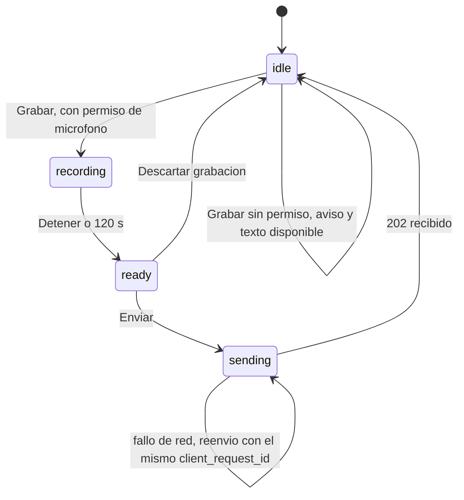
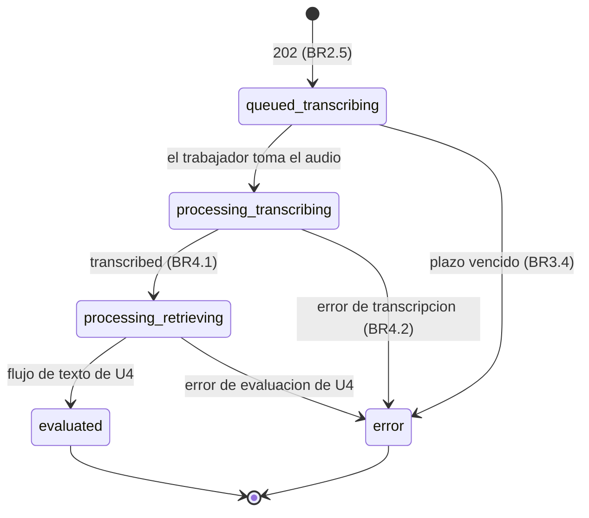

# Especificación funcional — U9 voice

**Unidad.** U9 `voice` (tipo `service`, SHOULD) entrega dos cosas. La primera es grabar un turno por voz y
transcribirlo con Whisper en CPU dentro del clúster (US10.2). La segunda es escuchar la pregunta aprobada
(US10.4). La unidad toca:

- la consola (AnalystConsole), con el botón *push-to-talk* y «Escuchar audio»;
- `session-api` (InterviewSession y ConsoleApi), con la recepción y la ingesta;
- `audio-worker` (SpeechProcessing), con la transcripción y la síntesis;
- ModelGateway, con los adaptadores de Whisper y TTS.

Se construye solo cuando el flujo de texto funciona de punta a punta (team-practices).

**Fuente de verdad.** Este archivo manda en los flujos y las máquinas de estado. Los datos están en
`entities.md` y las decisiones en `rules.md`.

**Respuestas de la etapa.**

- P1 = A: máximo 120 s por grabación.
- P2 = A: si la transcripción falla, el turno queda en «Error» y se graba de nuevo, sin guardar audio.
- P3 = A: la transcripción no se corrige y se rotula como automática.

---

## 1. Componentes y frontera del clúster (AUTONOMIA-04)

| Componente | Dónde corre | Datos que maneja | ¿Cruza la frontera del clúster? |
|---|---|---|---|
| AnalystConsole (grabación) | Navegador del analista | Audio crudo durante la grabación | Va al clúster por C1 (HTTPS). Nunca a un tercero; no se guarda en el navegador |
| `session-api` (InterviewSession, ConsoleApi) | Dentro del clúster | Audio en tránsito, texto transcrito | No |
| Redis (`veridicus:audio`, `veridicus:transcripts`) | Dentro del clúster | Audio en base64 hasta confirmarlo; texto | No |
| `audio-worker` (SpeechProcessing) | Dentro del clúster, pod con datos sin anonimizar | Audio y texto | No: `NetworkPolicy` de salida denegada; solo alcanza Redis y los servidores Whisper y TTS (BR6.1) |
| Servidores Whisper y TTS | Dentro del clúster | Audio, texto de la pregunta | No: los despliega U2 sin salida a internet |

Ningún componente de U9 llama a un servicio externo. Por eso no aplica el anonimizador (U10).

## 2. Flujos

### F1 — Grabar y enviar un turno de voz (US10.2)

1. En una sesión abierta, el dueño pulsa «Grabar». Si el navegador niega el micrófono, la consola muestra
   el aviso de BR1.1 y el campo de texto sigue disponible.
2. Durante la grabación se ven «Grabando…», el tiempo y el icono, y la región *aria-live* lo anuncia
   (BR1.2). En los últimos 15 s se ve el tiempo restante. A los 120 s la grabación se detiene sola con su
   aviso (BR1.3).
3. El analista pulsa «Detener» y luego «Enviar». La consola codifica la grabación a WAV mono de 16 kHz
   (BR1.4) y genera un `client_request_id`.
4. La consola envía `POST /sessions/{session_id}/voice-turns` (multipart, con `X-CSRF-Token`).
5. ConsoleApi comprueba el rol y que el actor sea el dueño (BR2.1). InterviewSession comprueba que la
   sesión esté abierta (BR2.2), valida el audio (BR2.3) y deduplica por `client_request_id` (BR2.4).
6. Crea el turno con el siguiente número, `origin: voice`, `status: queued` y
   `processing_stage: transcribing`. Publica `AudioToTranscribe` con `attempt: 1` y `deadline_at`, y
   responde `202` (BR2.5).
7. La consola muestra el turno con «Procesando audio…». El analista puede grabar o escribir el siguiente
   turno sin esperar (BR1.5).
8. Si la red falla antes de recibir el `202`, la consola reenvía con el mismo `client_request_id` y obtiene
   el mismo turno (BR2.4).

### F2 — Transcribir en el audio-worker

1. El trabajador del grupo `audio-worker` lee `AudioToTranscribe`.
2. Si ya publicó un resultado para ese `turn_id` y `attempt`, lo confirma y lo borra sin llamar a Whisper
   (BR3.6).
3. Si el mensaje llegó después de `deadline_at`, publica `error` con `turn.error.timeout` sin llamar a
   Whisper (BR3.4).
4. Si no, llama a `ModelGateway.transcribe(audio, formato, timeout)`, que llama a Whisper interno con
   `language: es` (BR3.1).
5. Publica `TranscriptResult` en `veridicus:transcripts`. El resultado depende de lo que pasó:
   - texto no vacío → `transcribed` con texto y `model_digest` (BR3.2);
   - texto vacío → `error` con `turn.error.invalid_output` (BR3.3);
   - *timeout* → `turn.error.timeout` (BR3.4);
   - error de Whisper → `turn.error.system` (BR3.4).
6. Confirma (`XACK`) y borra (`XDEL`) el mensaje de audio (BR3.5). El audio no existe ya en ninguna parte.

### F3 — Ingerir la transcripción en session-api

1. El grupo `session-api` lee `TranscriptResult`.
2. Si el turno ya está en error por plazo o ya tiene texto para ese intento, descarta y confirma el
   resultado (BR4.3).
3. Con `transcribed`, guarda el texto en el turno, pasa `processing_stage` a `retrieving` y publica el
   turno en la cola de evaluación (C2). Desde aquí el turno sigue el flujo de texto de U4 (BR4.1).
4. Con `error`, el turno pasa a `error` con su `code`. La consola muestra «No se pudo transcribir el audio»
   con «Grabar de nuevo» y «Escribir el turno». Ambas acciones crean un turno nuevo (BR4.2).
5. Un turno de voz muestra siempre «Turno por voz (transcripción automática)» y no se edita (BR1.6, BR4.4).

### F4 — Escuchar la pregunta aprobada (US10.4)

1. La pregunta sugerida (U8) aparece con «Aprobar» y «Descartar». «Escuchar audio» solo se habilita
   cuando está aprobada.
2. El dueño pulsa «Escuchar audio». La consola pide `GET /questions/{question_id}/audio`.
3. ConsoleApi comprueba que el actor sea el dueño de la sesión de la pregunta (BR5.4). Si la pregunta no
   está aprobada, responde `409` (BR5.1).
4. SpeechProcessing llama a `ModelGateway.synthesize(texto, timeout)` en CPU dentro del clúster y devuelve
   `audio/wav`, que no se guarda (BR5.3). La consola lo reproduce.
5. Si el TTS falla, responde `503 speech.unavailable` y la consola muestra el aviso de BR5.3.
6. Si nadie pulsa «Escuchar audio», el TTS no recibe ninguna llamada (BR5.2).

## 3. Máquinas de estado

### Grabación en la consola

<!-- Texto alternativo: la grabación empieza inactiva. Con permiso de micrófono pasa a grabando y, sin permiso, sigue inactiva con el aviso. Al detener o llegar a 120 s queda lista. Al enviar pasa a enviando y, con el 202, vuelve a inactiva. Si falla la red, reenvía con el mismo identificador. -->

### Turno de voz

El estado es del `Turn` de InterviewSession (U4). U9 añade la etapa `transcribing` y la regla de no
reintentar.

<!-- Texto alternativo: el turno de voz nace en cola en la etapa de transcripción. Pasa a procesando cuando el trabajador lo toma. Con texto, sigue el camino del texto hasta evaluado o error. Si la transcripción falla o vence el plazo, termina en error; un error de transcripción no se reintenta y se resuelve grabando un turno nuevo. -->

| Estado / etapa | Qué ve el analista | Acciones |
|---|---|---|
| `queued` · `transcribing` | «Procesando audio…» con cronómetro | Ninguna; puede seguir grabando o escribiendo |
| `processing` · `transcribing` | «Procesando audio…» | Ninguna |
| `processing` · `retrieving` / `judging` | Texto con rótulo de transcripción automática y el indicador de U4 | Las de U4 |
| `error` en transcripción | «No se pudo transcribir el audio» y su `code` | «Grabar de nuevo», «Escribir el turno» |
| `error` en evaluación | Igual que un turno de texto en error | «Reintentar» de U4 (el texto ya existe) |

Un turno de voz que falló en la evaluación, no en la transcripción, sí admite «Reintentar». Su texto ya
está guardado y el reintento no necesita el audio.

## 4. Cambios entre unidades para decidir en la aprobación

No edito artefactos ya aprobados ni el diseño de otra unidad. Lo que U9 necesita queda aquí, y tú decides
en la aprobación si se actualiza el original.

| # | Qué falta | Dónde | Propuesta | Origen |
|---|---|---|---|---|
| X1 | Transcripción vacía como error | C5 `TranscriptResult.error_code` | Agregar `turn.error.invalid_output` al enum (versión menor 1.1.0) | P2 = A, BR3.3 |
| X2 | Reintentar un turno de voz sin audio | C1 `ErrorCode` y la regla de reintento de U4 | Agregar `turn.audio_unavailable`. `POST /turns/{n}/retry` responde `409` con ese code cuando el turno es de voz y falló en `transcribing` | P2 = A, BR4.2 |
| X3 | Fallo del TTS | C1 `ErrorCode` y la ruta de audio | Agregar `speech.unavailable` y la respuesta `503` en `GET /questions/{id}/audio` | BR5.3 |
| X4 | Quién escucha la pregunta | C1 `GET /questions/{id}/audio` | `x-veridicus-roles: [analista]` y `x-veridicus-owner-only: true` | BR5.4 |
| X5 | Tamaño máximo del audio (pregunta abierta de C5) | NFR Requirements | 120 s en WAV mono de 16 kHz son unos 3,8 MB, unos 5,1 MB en base64. Se propone `VERIDICUS_VOICE_MAX_BYTES` = 6 MB y conservar el audio dentro del mensaje | P1 = A |

## 5. Errores en la frontera

| Situación | Respuesta | Code |
|---|---|---|
| No es el dueño (enviar voz o escuchar) | `403` | `auth.forbidden` |
| Sesión finalizada o consolidada | `409` | `session.finalized` |
| Sesión suspendida | `409` | `session.not_open` (como en U4) |
| Formato, cabecera, tamaño o duración inválidos | `422` | `validation.invalid_request` |
| Reintentar un turno de voz que falló al transcribir | `409` | `turn.audio_unavailable` (X2) |
| Escuchar una pregunta no aprobada | `409` | code de U8 para pregunta no aprobada |
| TTS caído o con *timeout* | `503` | `speech.unavailable` (X3) |
| Transcripción con *timeout*, error o texto vacío | Turno en `error` | `turn.error.timeout`, `turn.error.system`, `turn.error.invalid_output` |

Todo error sale como `application/problem+json` con `detail` en español (NFR10). Las llamadas a Whisper, al
TTS y a Redis llevan un *timeout* explícito, cuyo valor fija NFR Requirements. Ninguna llamada a un modelo
se reintenta sola. La configuración faltante, o una URL de modelo externa al clúster, impide arrancar el
pod (BR6.2).

## 6. Escenarios de negocio

| Escenario | Resultado esperado | Reglas |
|---|---|---|
| Graba 20 s y envía | `202`; el texto llega y el turno se evalúa como uno escrito | BR2.5, BR3.2, BR4.1 |
| El transcriptor *fake* tarda 12 s | La consola acepta otro turno mientras tanto | BR1.5 |
| Micrófono negado | Aviso y campo de texto disponible | BR1.1 |
| Graba sin parar | Se corta a los 120 s con su aviso | BR1.3 |
| Envía un archivo de 10 MB por la API | `422`, sin turno | BR2.3 |
| Se cae la red justo tras enviar | El reenvío devuelve el mismo turno | BR2.4 |
| Silencio total | Turno en error con `turn.error.invalid_output`; graba de nuevo | BR3.3, BR4.2 |
| Whisper caído | Turno en error con `turn.error.system`; el audio ya no existe | BR3.4, BR3.5 |
| Whisper confunde un nombre | El analista escribe un turno aclaratorio; los dos quedan en el reporte | BR1.6, BR4.4 |
| Pregunta aprobada y «Escuchar audio» | Se oye la voz, sintetizada en el clúster | BR5.1, BR5.3 |
| Pregunta sin aprobar | `409` y 0 llamadas al TTS | BR5.1, BR5.2 |
| *Canary* en el audio *fake* | No aparece en ningún log | BR6.3 |

## 7. Pruebas que exige el diseño

- **Nivel 0.** Pruebas Vitest de grabación: permiso negado, indicador anunciado, corte a 120 s, WAV
  generado y rótulo (BR1). TTS *fake* con 0 llamadas sin pulsar (BR5.2). URLs internas al arrancar (BR6.2).
  Política de manifiestos para `audio-worker` con control negativo (BR6.1). Manifiesto de modelos con
  `sha256` (BR6.4).
- **Nivel 1** (Redis y PostgreSQL reales en contenedor, Whisper y TTS *fakes*). Camino feliz y
  equivalencia con el turno escrito (BR4.1). *Fake* lento de 12 s (BR1.5). Entrega doble (BR3.6).
  Resultado tardío (BR4.3). Vacío, *timeout* y error (BR3.3, BR3.4). *Stream* vacío tras cada resultado
  (BR3.5). *Canary* (BR6.3). Deduplicación por `client_request_id` (BR2.4).
- **Nivel 3 y manual.** Suite `axe` y recorrido con teclado (BR7.1). `curl -m 5` desde `audio-worker` a un
  host público (BR6.1).
- **Perfil GPU, a demanda.** Calidad de Whisper con modelos más grandes. Nada de los niveles 0 y 1 exige
  GPU.
