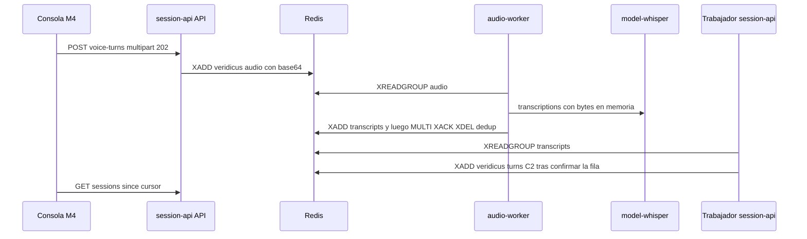

# Diseño de rendimiento — U9 voice

**Insumos.** `nfr-requirements/performance-requirements.md` (performance-requirements),
`security-requirements.md` (security-requirements), `scalability-requirements.md`
(scalability-requirements), `reliability-requirements.md` (reliability-requirements),
`observability-requirements.md` (observability-requirements) y `tech-stack-decisions.md`
(tech-stack-decisions, D1–D12) de esta unidad; flujos F1–F4 de `functional-design/functional-spec.md`
(functional-spec); C1, C5, C13, C14 y C15 de `inception/contract-design/contract-summary.md`
(contract-summary); respuestas P1 = A y P2 = A de `nfr-design-questions.md`; diseño de U1 (catálogo de
límites), U3 (`authorize`) y U4 (plazos, colas y sondeo); prácticas de `team.md`.

Todas las metas se diseñan para el **perfil CPU** (NFR2.2). El perfil GPU solo puede acortar tiempos.

## 1. Camino crítico de un turno de voz (NFR3.1, NFR3.2, NFR3.3)



<!-- Texto alternativo: la consola envía el audio y recibe 202; la API lo publica en base64 en la cola de audio. audio-worker lo lee, lo manda a Whisper desde memoria, publica la transcripción y en una transacción de Redis confirma, borra el audio y fija la clave de deduplicación. El trabajador de session-api ingiere la transcripción, guarda el texto y publica el turno en la cola de evaluación de U4. La consola lo ve en su siguiente sondeo. -->

| Tramo (clip de 30 s) | Presupuesto de diseño | Técnica |
|---|---|---|
| Recepción y `XADD` | ≤ 0,5 s | Lectura en *streaming* a memoria (§2), validación de cabecera sin decodificar (D7), una transacción corta |
| Espera en la cola de audio | 0 s con la cola vacía | Un audio a la vez (NFR8.5) |
| Lectura del *stream* | ≤ 0,5 s | `XREADGROUP BLOCK 5000 COUNT 1`; el mensaje de 8 MB cabe en el *timeout* de socket de 2 s |
| Whisper `base` int8 | ≤ 10 s | Voraz (`beam_size = 1`), VAD, `condition_on_previous_text = false`, `cpu_threads = 4`, idioma fijo `es` (D1) |
| Publicar, ingerir y guardar | ≤ 1 s | `XADD` del texto, `MULTI` de confirmación, ingesta en una transacción del trabajador de U4 |
| Evaluación (U4) | p95 ≤ 60 s | Sin cambios: el texto entra a C2 con el plazo de U4 (NFR3.6) |
| Llegar a la consola | ≤ 3 s | Sondeo de 2 s con turnos en curso (NFR3.11) |

Para 120 s el único tramo que crece es Whisper (≈ 4 × el de 30 s), así que la meta de NFR3.2
(p95 ≤ 40 s) y la de NFR3.3 (≤ 100 s) salen de la misma tabla. Lo confirma la **corrida de voz**: su
reporte JSON trae p50, p95 y máximo por tramo de duración, con las marcas de hora que guarda el sistema
(`submitted_at`, hora de ingesta, `evaluated_at`) y `veridicus_transcription_seconds`.

**Calentamiento de Whisper.** Al arrancar, `audio-worker` transcribe un clip sintético de 1 s
empaquetado en la imagen (generado con la voz Piper y registrado en `evaluation/voice/manifest.json`, NFR12.1) y solo entonces `/readyz` responde `200`; así el primer turno real no paga la
carga del modelo en memoria.

## 2. Recepción de la subida en `session-api` (NFR3.4, NFR8.4; P1 = A)

La ruta `POST /sessions/{id}/voice-turns` **no** declara parámetros `UploadFile` ni `Form`: el
analizador por defecto de Starlette pasa a disco toda parte de más de 1 MB. En su lugar:

1. `authorize` de U3 (rol, dueño y anti-CSRF) y la comprobación de sesión `open` corren antes de leer
   el cuerpo.
2. Si `Content-Length` supera `limits.get("voice_audio_max_bytes")` + 64 KiB de margen de *multipart*,
   responde `422` sin leer nada.
3. `request.stream()` alimenta por trozos un `MultipartParser` en *streaming* de `python-multipart`.
   Sus *callbacks* acumulan la parte `audio` en un `bytearray` y la parte `client_request_id` (≤ 36
   bytes); cualquier otra parte, una tercera parte o pasar el máximo corta la lectura con `422`.
4. La validación de cabecera y duración trabaja sobre `io.BytesIO` (`wave` o `mutagen`, D7).
5. Se codifica a base64, se publica con `XADD` y se sueltan las referencias (`del`) antes de responder.

```python
async def read_voice_upload(request, max_bytes):
    audio, fields = bytearray(), {}
    parser = make_streaming_parser(request.headers, audio, fields, max_bytes)
    async for chunk in request.stream():
        parser.write(chunk)          # lanza AudioTooLarge al pasar max_bytes
    parser.finalize()
    if set(fields) != {"client_request_id"} or not audio:
        raise InvalidVoiceUpload("partes")
    return bytes(audio), fields["client_request_id"]
```

Memoria pico por subida de 6 MB: ≈ 6 MB del `bytearray` + 6 MB de la copia `bytes` + 8 MB de base64
≈ 20 MB, bajo los 32 MiB de NFR8.4; ninguna de las tres copias sobrevive a la petición. Verificación:
prueba `perf` de nivel 1 (`pytest -m perf -k voice`) con `tracemalloc` y RSS en 20 subidas seguidas
(diferencia ≤ 32 MiB entre la 1.ª y la 20.ª) y p95 del `202` ≤ 500 ms con un WAV de 3,84 MB y el
Whisper *fake* bloqueado.

## 3. Plazos y *timeouts* (NFR3.5–NFR3.8, NFR3.13)

| Elemento | Diseño | Verificación |
|---|---|---|
| Plazo del audio (NFR3.5) | Al encolar, en la misma transacción que numera el turno: `deadline_at = enqueued_at + base × (1 + m)`, `m` = turnos de voz `queued` o `processing` en `transcribing` de todo el sistema (un `COUNT` con índice parcial sobre `processing_stage = 'transcribing'`), tope `VERIDICUS_AUDIO_DEADLINE_MAX_SECONDS` | Nivel 0 con `m` = 0, 2 y 10 → 300, 900 y 1 800 s |
| Plazo de evaluación (NFR3.6) | La ingesta de `transcribed` recalcula `deadline_at` con la fórmula de U4 en la misma transacción que guarda el texto y antes de publicar C2 | Nivel 1 |
| Revisión de plazos (NFR3.7) | El `DeadlineSweeper` de U4 (cada 15 s) amplía su condición a `processing_stage = 'transcribing'`; un `TranscriptResult` posterior se descarta por intento | Nivel 1 con reloj controlado: error ≤ 30 s tras `deadline_at` |
| *Timeout* de Whisper (NFR3.8) | `min(VERIDICUS_WHISPER_TIMEOUT_SECONDS, deadline_at − ahora)`; si es ≤ 0, no hay llamada y el resultado es `turn.error.timeout` | Nivel 0 con reloj y Whisper *fake* |
| *Timeouts* de la síntesis (NFR3.13) | `audio-worker` → `model-tts` 10 s; `session-api` → `audio-worker` 12 s; conexión 2 s; la validación al arrancar exige 12 > 10 | Nivel 0 |

## 4. Consola (NFR3.9, NFR3.10, NFR3.11)

- **Codificación fuera del hilo principal.** Al detener, el hilo principal hace `decodeAudioData` y
  `OfflineAudioContext` a 16 kHz mono (nativo del navegador, fuera del hilo de JS) y transfiere el
  `Float32Array` al Web Worker `wavEncoder.worker.ts` como `Transferable` (sin copia); el *worker*
  devuelve el `ArrayBuffer` del WAV PCM 16 bits también transferido. Meta: ≤ 1,5 s para 120 s y 0
  tareas largas de más de 200 ms en el hilo principal (Playwright de nivel 3 con `PerformanceObserver`
  de `longtask`).
- **Envío no bloqueante.** El envío es una mutación de TanStack Query independiente del formulario de
  texto y de la grabación siguiente; el turno aparece con «Procesando audio…» desde el `202`. Meta:
  < 1 s por interacción con un turno de voz en curso (Playwright de nivel 3 con Whisper *fake* de 12 s
  y Vitest con temporizadores falsos).
- **Visibilidad del texto.** Usa el sondeo por `change_seq` de U4 (2 s con turnos en curso): la
  ingesta incrementa `change_seq` de la sesión al guardar el texto, así que el texto llega en el
  siguiente sondeo. Meta: ≤ 3 s (nivel 3).

## 5. Síntesis de la pregunta (NFR3.12)

- Camino D4: ConsoleApi (`authorize` + `is_question_approved`) → `POST /internal/v1/speech` de
  `audio-worker` con un cliente `httpx` persistente (conexión reutilizada, sin TLS dentro del clúster
  porque la red la cierra la `NetworkPolicy`) → `ModelGateway.synthesize` → `model-tts`.
- Piper con 2 hilos y la voz cargada al arrancar `model-tts`; `audio-worker` hace una síntesis de
  calentamiento de una palabra antes de `/readyz`.
- La respuesta (≤ 2 MB) se lee completa en memoria y se devuelve con `Content-Length`; no se guarda en
  ningún sitio.
- Metas: p95 ≤ 5 s para 300 caracteres con Piper real (corrida de voz, 20 preguntas); p95 ≤ 300 ms de
  sobrecarga de la ruta con el TTS *fake* (prueba `perf` de nivel 1).

## 6. Humo y E2E de voz (NFR3.14)

`scripts/smoke.sh` no cambia sus casos ni su *N* = 120 s; solo añade `audio-worker` a la lista de
`/readyz` (C16). El recorrido de voz vive en `frontend/e2e/voice.spec.ts` (nivel 3, antes de etiquetar
una entrega) con `--use-file-for-fake-audio-capture` y un clip sintético de 20 s: turno evaluado en
≤ 75 s.

## 7. Recursos (NFR8.1–NFR8.4)

| Pod | Tope medido | Cómo se respeta en el diseño |
|---|---|---|
| `model-whisper` | ≤ 1 GiB con 120 s | Modelo `base` int8; una transcripción a la vez; `/tmp` en memoria con `sizeLimit` de 64 Mi |
| `audio-worker` | ≤ 256 MiB | Un mensaje a la vez; el base64 se decodifica y se suelta antes de llamar a Whisper; síntesis con concurrencia 1 |
| `model-tts` | ≤ 512 MiB | Una voz `medium`, 2 hilos, 300 caracteres como máximo |
| API de `session-api` | ≤ 32 MiB por subida, sin acumulación | §2 |

El pico de RSS de cada pod sale de la corrida de voz; Infrastructure Design fija `limits.memory` con
≥ 20 % sobre el pico. Un pico sobre su tope es un hallazgo que se corrige por PR, no un tope que sube.
