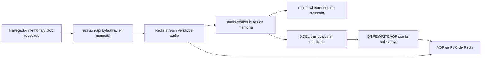

# Diseño de seguridad — U9 voice

**Insumos.** `nfr-requirements/performance-requirements.md` (performance-requirements),
`security-requirements.md` (security-requirements, amenazas T1–T16), `scalability-requirements.md`
(scalability-requirements), `reliability-requirements.md` (reliability-requirements),
`observability-requirements.md` (observability-requirements) y `tech-stack-decisions.md`
(tech-stack-decisions, D1–D12) de esta unidad; flujos F1–F4 y cambios X1–X5 de
`functional-design/functional-spec.md` (functional-spec); C1, C5, C13, C14 y C16 de
`inception/contract-design/contract-summary.md` (contract-summary); respuestas P1 = A y P2 = A de
`nfr-design-questions.md`; diseño de U1 (catálogo de límites, Problem Details), U2 (`NetworkPolicy`,
Redis, `models.lock`), U3 (`authorize`, formateador de logs) y U4 (colas y validador de URL);
prácticas de `team.md` y `project.md`.

## 1. Frontera de la unidad (AUTONOMIA-04; NFR1.1, NFR1.2, NFR1.3)

| Componente | Dónde corre | Qué datos cruzan su frontera | Destinos permitidos |
|---|---|---|---|
| AnalystConsole (grabación, «Escuchar audio») | Navegador del analista | Audio crudo hacia `session-api` (HTTPS, mismo origen); WAV de la pregunta de vuelta | Solo ConsoleApi |
| ConsoleApi e InterviewSession | API de `session-api`, dentro del clúster | Audio en memoria hacia Redis; texto de la pregunta hacia `audio-worker` | Redis, PostgreSQL, `audio-worker` (puerto interno) |
| Ingesta de C5 | Trabajador de `session-api`, dentro | Texto transcrito hacia PostgreSQL y C2 | Redis, PostgreSQL |
| Redis (`veridicus:audio`, `veridicus:transcripts`) | Dentro (PVC) | Audio en base64 hasta `XDEL` y hasta la siguiente reescritura del AOF (§2) | — |
| SpeechProcessing | `audio-worker`, dentro; etiqueta de datos sin anonimizar | Audio hacia `model-whisper`; texto hacia `model-tts` | Redis 6379, `model-whisper` 8080, `model-tts` 8080, DNS |
| `model-whisper`, `model-tts` | Dentro, pods de U2 sin salida | Reciben audio o texto; `/tmp` en memoria | Ninguno |
| ModelGateway (`transcribe`, `synthesize`) | `libs/`, en `audio-worker` | Solo URL internas | Validador de URL de U4 |

Ningún componente de U9 llama fuera del clúster, así que no aplica el anonimizador (U10).

| Control | Dónde se aplica | Verificación y umbral |
|---|---|---|
| Salida denegada de `audio-worker` (NFR1.1) | Chart de U2: etiqueta `veridicus.io/data: unanonymized` en el pod; `NetworkPolicy` de negar todo más las reglas de salida de la tabla; entrada solo desde `session-api` (puerto de síntesis) y Prometheus (`/metrics`) | Kyverno CLI en nivel 0 con controles negativos (pod sin etiqueta, salida a `0.0.0.0/0`) que deben fallar; manual: `kubectl -n veridicus exec deploy/veridicus-audio-worker -- curl -m 5 https://example.org` termina con código ≠ 0 |
| URL internas (NFR1.2) | El validador de U4 en `libs/model_gateway` se aplica a `VERIDICUS_WHISPER_URL`, `VERIDICUS_TTS_URL` y `VERIDICUS_SPEECH_URL` al construir la configuración | Nivel 0: una prueba por forma rechazada (IP pública, dominio externo, `localhost`) y su control positivo |
| Sin voz de terceros en la consola (NFR1.3) | ESLint `no-restricted-globals` y `no-restricted-properties` sobre `speechSynthesis`, `SpeechSynthesisUtterance`, `SpeechRecognition`, `webkitSpeechRecognition`; el cliente solo usa la ruta relativa | Nivel 0: un archivo de control negativo hace fallar el *lint* |

## 2. Ciclo de vida del audio crudo (NFR10.2–NFR10.5; P1 = A, P2 = A)



<!-- Texto alternativo: el audio vive en memoria del navegador con su URL blob revocada al enviar, pasa a un bytearray en memoria de session-api, a la cola de Redis y a la memoria de audio-worker, que lo manda a Whisper, cuyo tmp está en memoria. La única copia en disco es el AOF del PVC de Redis. Tras cualquier resultado, audio-worker borra el mensaje con XDEL y, con la cola vacía, pide BGREWRITEAOF, que deja el AOF sin el audio. -->

| Lugar | Cuánto vive el audio | Control | Verificación |
|---|---|---|---|
| Navegador | Hasta enviar o descartar | Solo en memoria; `URL.revokeObjectURL` al enviar o descartar; `MediaStreamTrack.stop()` al detener, a los 120 s y al salir; ningún almacenamiento persistente (NFR10.5) | Vitest de `stop()` y `revokeObjectURL`; Playwright de nivel 3: almacenamientos sin audio, `indexedDB.databases()` sin bases nuevas y 0 pistas activas |
| API de `session-api` | La duración de la petición | Lectura en *streaming* a un `bytearray` sin `UploadFile` (performance-design §2, P1 = A); `readOnlyRootFilesystem: true` y `/tmp` como `emptyDir` con `medium: Memory` como red de seguridad (NFR10.2) | Nivel 1: con `tempfile.*` y la apertura de archivos en escritura parcheados para fallar, una subida de 5 MB responde `202`; nivel 0: prueba de rutas que falla si una ruta de U9 declara `UploadFile` o `Form` |
| `audio-worker` | Un procesamiento | Sin volúmenes escribibles; raíz de solo lectura; envía `bytes` a `httpx` (multipart en memoria) | Política Kyverno de nivel 0 con control negativo (un `emptyDir` en disco) |
| `model-whisper`, `model-tts` | Una petición | `/tmp` como `emptyDir` `medium: Memory` con `sizeLimit` | Política de nivel 0 sobre el render del chart |
| *Streams* de Redis | Hasta el `XDEL` | `XACK` + `XDEL` con **cualquier** resultado (reliability-design §2); `<stream>:failed` solo con `message_id`, `turn_id`, `attempt`, `code` y `MAXLEN ~ 1000` (NFR10.3) | Nivel 1 por resultado: `XLEN` de ambos *streams* = 0 y los fallidos sin la cadena centinela |
| AOF de Redis | Hasta la siguiente reescritura | `save ""`; `auto-aof-rewrite-min-size 16mb` como respaldo; **`AofRewriteRequester`** (P2 = A, abajo) | Nivel 1 (NFR10.4, abajo) |

**`AofRewriteRequester` (P2 = A).** Componente de `audio-worker`, llamado tras cada `XDEL` de audio y en
cada vuelta del bucle consumidor:

- Marca «sucio» al borrar un audio. Si la cola está vacía (`XLEN veridicus:audio` = 0 y 0 pendientes en
  el grupo) y pasaron ≥ 60 s desde la última petición, envía `BGREWRITEAOF`; si no, la petición queda
  para cuando se cumplan las dos condiciones (como mucho 60 s más tarde, salvo que siga llegando audio).
- Respuestas: `Background append only file rewriting started` o `scheduled` → registrado; error «ya hay
  una reescritura en curso» → no es error, sigue sucio y reintenta en la siguiente ventana; cualquier
  otro error → log `WARNING` con `code` y reintento en la siguiente ventana. Nunca bloquea la
  transcripción.
- Al arrancar o reconectar con Redis queda sucio, así que un reinicio de `audio-worker` o de Redis
  también termina en una reescritura.
- Cota resultante: un audio ya procesado no sigue en el AOF más de ≈ 2 minutos después de su `XDEL`
  cuando la cola queda vacía; con tráfico continuo, el umbral de 16 MB sigue actuando.

```python
def after_delete_or_tick(self, now):
    if not self.dirty or now - self.last_request < 60 or not self.queue_empty():
        return
    try:
        self.redis.bgrewriteaof()
        self.dirty, self.last_request = False, now
    except ResponseError as exc:
        self.last_request = now
        log_rewrite_failure(exc)   # «en curso» = INFO; otro = WARNING
```

Verificación (NFR10.4): prueba de nivel 1 con Redis real configurado como U2 (`appendonly yes`,
`appendfsync everysec`, `save ""`): tras procesar un audio con un patrón centinela de 64 bytes, el
patrón **aparece** en `appendonlydir` (documenta el riesgo) y, **sin** que la prueba llame a
`BGREWRITEAOF`, deja de aparecer en ≤ 120 s. Prueba de nivel 0 del componente con reloj y Redis *fake*:
ventana de 60 s, cola no vacía, «en curso» y reconexión.

## 3. Validación de la subida (NFR10.1)

Orden fijo, sin filas ni `XADD` si algo falla:

1. `authorize` de U3: rol `analista`, dueño de la sesión y `X-CSRF-Token` (NFR10.7).
2. Sesión `open` (`409` `session.not_open` o `session.finalized`).
3. Tamaño: `Content-Length` y corte en *streaming* contra `limits.get("voice_audio_max_bytes")` del
   catálogo de U1; `VERIDICUS_VOICE_MAX_BYTES` solo puede bajarlo.
4. Formato declarado `wav` o `mp3` y cabecera real: `RIFF`/`WAVE` con `fmt` PCM, o trama MPEG / `ID3`;
   `Content-Type` no cuenta.
5. Duración ≤ 120 s leída de la cabecera (`wave` o `mutagen` sobre `io.BytesIO`), sin decodificar.
6. `client_request_id` UUID y deduplicación (BR2.4).

Cualquier fallo → `422` `validation.invalid_request` con el motivo (enum `size`, `format`, `header`,
`duration`) en el `detail` en español y en el log, nunca un eco del contenido. Verificación de nivel 1:
10 MB, MP3 con extensión WAV, WAV de 121 s, PNG renombrado y cuerpo vacío → `422`, 0 filas, `XLEN
veridicus:audio` sin cambio y crecimiento de memoria ≤ 20 MiB con el archivo de 10 MB (el corte del
paso 3 impide leerlo entero).

## 4. Autorización y ruta interna (NFR10.7, NFR10.8, NFR10.9)

| Ruta | Control | Verificación |
|---|---|---|
| `POST /sessions/{id}/voice-turns` | `authorize` con `x-veridicus-roles: [analista]`, `x-veridicus-owner-only: true` y anti-CSRF; el dueño lo aporta InterviewSession | Nivel 1: otro analista, `admin`, identidad de servicio y POST sin anti-CSRF → `403` `auth.forbidden`, 0 filas, 0 `XADD` |
| `GET /questions/{id}/audio` | `authorize` con los mismos rol y dueño (dueño de la sesión de la pregunta, X4); después `is_question_approved` de U8; `proposed` o `discarded` → `409` `question.not_approved` **antes** de llamar a `audio-worker`; respuesta con `Cache-Control: no-store` | Nivel 1: mismos `403` y `409` con 0 llamadas al TTS *fake*; nivel 0: el ciclo de vida completo de una pregunta en la consola sin pulsar «Escuchar» deja 0 llamadas; el botón está deshabilitado salvo con `approved` y durante una petición en curso |
| `POST /internal/v1/speech` en `audio-worker` | Puerto interno distinto del de métricas; `Authorization: Bearer` comparado con `hmac.compare_digest` contra `VERIDICUS_SPEECH_TOKEN` (Secret por referencia) → si no, `401` sin llamar al TTS; cuerpo Pydantic estricto `{ "text": string }` de 1 a 300 caracteres → si no, `422`; respuesta `audio/wav` ≤ 2 MB; entrada de red solo desde `session-api` | Nivel 1: sin token, token erróneo y 301 caracteres; nivel 0: política de `NetworkPolicy` |

AUTONOMIA-03: ninguna pregunta llega al compareciente sin la decisión humana registrada por U8, y el
TTS solo se invoca por una acción explícita del dueño.

## 5. Modelos fijados e integridad (NFR10.10, NFR10.11, NFR11.1)

- `deploy/models.lock` (U2) lleva Whisper `base` CTranslate2 int8 (`model.bin`, `config.json`,
  `tokenizer.json`, `vocabulary.*`) y la voz Piper `es_*` (`.onnx`, `.onnx.json`) con revisión y
  `sha256`; el `initContainer` de U2 los verifica al arrancar. Prueba de nivel 0 sobre el *lock*: sin
  `.pt`, `.pkl` ni `.bin` de PyTorch y voz con prefijo `es_`.
- `audio-worker` pone en cada `TranscriptResult` con texto `model_digest =
  VERIDICUS_WHISPER_MODEL_SHA256`; la ingesta lo guarda en `Turn.transcription_model_digest` (nivel 1).
- No existe ruta que cambie `Turn.text` (prueba de contrato sobre el OpenAPI); el rol de la aplicación
  no tiene `UPDATE` sobre esa columna una vez escrita (prueba común de U3); las transiciones del turno
  de voz entran en el historial de U4 con actor y hora (nivel 1).
- Todo turno `origin: voice` muestra «Turno por voz (transcripción automática)» (Vitest y nivel 3), y
  `POST /turns/{n}/retry` de un turno que falló en `transcribing` responde `409`
  `turn.audio_unavailable` (nivel 1).

## 6. Logs, métricas y errores sin datos sensibles (NFR10.6, NFR10.12)

- El formateador con lista blanca de `libs/` (U3) amplía su lista con `question_id`, `byte_size`,
  `audio_seconds` y `audio_format`; nunca bytes, base64, texto transcrito ni texto de la pregunta. Las
  excepciones de `httpx`, Redis, `wave` y `mutagen` se registran solo con tipo y `code`.
- El manejador único de Problem Details de `libs/` nunca devuelve el `input` de la validación de
  Pydantic ni el mensaje de una excepción de terceros. `code` de U9: `validation.invalid_request`,
  `auth.forbidden`, `session.finalized`, `session.not_open`, `question.not_approved`,
  `turn.audio_unavailable` y `speech.unavailable`, con `detail` en español del catálogo de U1.
- Verificación de nivel 1 con tres centinelas (patrón de bytes en el audio *fake*, cadena en la
  transcripción del Whisper *fake* y otra en el texto de la pregunta): 0 apariciones en los logs de
  `session-api` y `audio-worker` y en el cuerpo de cada 4xx/5xx; una prueba por `code`. Manual antes de
  la sustentación: los logs de `model-whisper` y `model-tts` tras la corrida E2E en el clúster no
  contienen la frase centinela.

## 7. Inyección dictada y datos sintéticos (NFR5.1, NFR12.1)

- El texto transcrito entra a C2 exactamente como un turno escrito: la cadena de defensa de U4
  (guardia del umbral, *prompt* con datos JSON, validación de salida y escáner C8) se aplica sin
  cambios. La corrida de voz incluye un clip con la inyección del Escenario A y compara sus alertas con
  las del mismo texto enviado como turno escrito: mismo conjunto por afirmación y pasaje citado.
- Todos los clips se generan con la voz Piper fijada a partir de textos sintéticos del catálogo de U1
  (`evaluation/voice/generate.py`); `scripts/check-synthetic-audio.sh` falla (nivel 0) si un `.wav` o
  `.mp3` del repositorio no figura en `evaluation/voice/manifest.json` con su `sha256` y texto de
  origen.

## 8. Amenazas y controles

| Amenaza | Controles de este diseño |
|---|---|
| T1 Salida a internet | §1 (`NetworkPolicy`, validador de URL) |
| T2 Voz de terceros en el navegador | §1 (ESLint) |
| T3 Audio en disco o en el navegador | §2 (lectura en *streaming*, raíz de solo lectura, `/tmp` en memoria, almacenamientos vacíos) |
| T4 Audio en los *streams* | §2 (`XDEL` con cualquier resultado, fallidos sin contenido) |
| T5 Audio en el AOF | §2 (`AofRewriteRequester`, cota de ≈ 2 minutos) |
| T6 Datos en logs o errores | §6 |
| T7 Sesión ajena o `admin` | §4 |
| T8 Pregunta no aprobada | §4 |
| T9 Ruta interna suplantada | §4 (Bearer en tiempo constante y `NetworkPolicy`) |
| T10 Archivo enorme o disfrazado | §3 |
| T11 Modelo alterado | §5 |
| T12 Texto corregido | §5 |
| T13 Alucinación | reliability-design §8 (VAD, NFR4.2) y rótulo de §5 |
| T14 Inyección dictada | §7 |
| T15 Modelo desconocido | §5 (`model_digest`) |
| T16 Inundar la cola | Riesgo aceptado; `veridicus_audio_queue_depth` y `maxmemory` (scalability-design §3) |

## 9. Precisiones a artefactos ya aprobados

No edité ningún artefacto aprobado; decides en la aprobación si se actualizan.

| Artefacto | Qué precisa | Origen |
|---|---|---|
| `voice/nfr-requirements/tech-stack-decisions.md` (D7 y §4) | La lectura de `POST /voice-turns` usa `python-multipart` en *streaming* desde `request.stream()` y no `UploadFile`; `services/session-api` declara `python-multipart` explícitamente | P1 = A |
| Chart de U2 (`session-api`) y `platform/nfr-design/security-design.md` | Los pods de la API y del trabajador de `session-api` llevan `readOnlyRootFilesystem: true` y `/tmp` como `emptyDir` con `medium: Memory`; política Kyverno con control negativo | P1 = A, NFR10.2 |
| `voice/nfr-requirements/security-requirements.md` (NFR10.4) y §5 (T5) | El rastro en el AOF queda acotado en el tiempo: `audio-worker` pide `BGREWRITEAOF` con la cola vacía, como mucho una vez cada 60 s, y la prueba exige 0 apariciones en ≤ 120 s sin llamar a la reescritura desde la prueba | P2 = A |
| `platform/nfr-design/security-design.md` §7 (Redis) | `BGREWRITEAOF` no debe renombrarse ni deshabilitarse; la lista de comandos renombrados a vacío sigue siendo `FLUSHALL`, `FLUSHDB`, `CONFIG` y `DEBUG` | P2 = A |
| `voice/nfr-requirements/tech-stack-decisions.md` (§2) | Nuevo ajuste `VERIDICUS_AOF_REWRITE_MIN_INTERVAL_SECONDS` (60, entero 10–600) en `audio-worker` | P2 = A |
| `identity-access/nfr-design/observability-design.md` (lista blanca) | El formateador de `libs/` añade `question_id`, `byte_size`, `audio_seconds` y `audio_format` | NFR15.2 |
| `contract-design/contract-summary.md` (C1) | `GET /questions/{id}/audio` responde con `Cache-Control: no-store` | NFR10.5, NFR10.8 |
