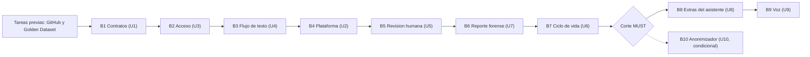

# Plan de Bolts — Veridicus (MVP)

**Insumos.** Unidades de `inception/units-generation/unit-of-work.md` (unit-of-work), grafo de
`unit-of-work-dependency.md` (unit-of-work-dependency) y mapa de historias de
`unit-of-work-story-map.md` (unit-of-work-story-map); requisitos de
`inception/requirements-analysis/requirements.md` (requirements); historias de
`inception/user-stories/stories.md` (stories); pantallas de `inception/refined-mockups/mockups.md`
(mockups); componentes de `inception/domain-design/components.md` (components); contratos de
`inception/contract-design/contract-summary.md` (contract-summary); prácticas de
`inception/practices-discovery/team-practices.md` (team-practices); respuestas P1–P9 de
`delivery-planning-questions.md`.

## Qué es un Bolt aquí

Un **Bolt** es una pasada de construcción sobre una o varias unidades de trabajo que termina en algo
que funciona y se puede demostrar. Cada Bolt tiene una definición de terminado, una **hipótesis de
confianza** (lo que su entrega demuestra o refuta) y una demo esperada.

- **Entrada a `main` (P9).** Un Bolt es **una unidad** y entra a `main` como **un PR con squash-merge**,
  es decir, un commit nombrado por el slug del Bolt, en una rama `<tipo>/<slug-del-bolt>`, con la salida
  de sus comandos de verificación como evidencia (team-practices; `org.md`). Los cambios posteriores a
  un contrato ya fusionado entran cada uno por su propio PR (U1).
- **Sin esqueleto andante.** El scope `classic` no ejecuta esa ceremonia (`skeleton: off`). Los tres
  primeros Bolts (contratos, acceso y flujo de texto) forman la primera rebanada de punta a punta que
  exige team-practices; se verifica con la definición de terminado de B3, no con un punto de control
  especial.
- **Este trabajo no escribe código.** Construction se detiene en el plan de tareas (Parte 1 de Code
  Generation) de cada unidad. Este plan ordena esos planes de tareas y la construcción que hará el
  autor después.
- **El plan es la intención económica, no la ruta del flujo.** Construction recorre las unidades
  **etapa por etapa** (P8) en el orden del grafo aprobado; este documento no cambia ese grafo. El orden
  aquí propuesto es un orden topológico válido del grafo (ver `risk-and-sequencing-rationale.md`).

## Resumen

| Bolt | Nombre | Unidad | Prioridad | Módulo del curso | Depende de |
|---|---|---|---|---|---|
| — | Tareas previas | — (GitHub y Golden Dataset) | MUST | Antes del módulo 6 | — |
| B1 | Contratos | U1 contracts | MUST | 6 | Tareas previas |
| B2 | Acceso | U3 identity-access | MUST | 6 | B1 |
| B3 | Flujo de texto | U4 text-flow | MUST | 6 | B1, B2 |
| B4 | Plataforma en el clúster | U2 platform | MUST (+ SHOULD/COULD al final) | 6–7 (partes SHOULD/COULD: 8) | B1 |
| B5 | Revisión humana | U5 human-review | MUST | 7 | B3 |
| B6 | Reporte forense | U7 forensic-report | MUST | 7 | B5 |
| B7 | Ciclo de vida de la sesión | U6 session-lifecycle | MUST (+ SHOULD/COULD) | 8 | B3 |
| **Corte** | Ningún Bolt de abajo empieza hasta que B1–B7 cumplen su definición de terminado | | | | |
| B8 | Extras del asistente | U8 assistant-extras | SHOULD / COULD | Tras el corte | B3 |
| B9 | Voz | U9 voice | SHOULD | Tras el corte | B3, B8 |
| (B10) | Anonimizador — condicional, fuera del plan | U10 anonymizer | COULD | Solo si se decide usar un modelo externo | B3 |

<!-- Text fallback: Tareas previas, luego B1 Contratos, B2 Acceso, B3 Flujo de texto, B4 Plataforma, B5 Revisión humana, B6 Reporte forense, B7 Ciclo de vida; después la línea de corte de las MUST; luego B8 Extras del asistente y B9 Voz; B10 Anonimizador es condicional y sale de la línea de corte con flecha punteada. -->

---

## Tareas previas (no son Bolts)

No pertenecen a ninguna unidad del grafo, pero bloquean el primer Bolt (P0.1) y el cierre de B3 (P0.2).

| Tarea | Qué entrega | Verificación | Origen |
|---|---|---|---|
| P0.1 Configuración de GitHub (autor + agente) | Protección de `main` también frente al administrador, comprobaciones de CI obligatorias, GHCR privado, *deploy key* de solo lectura, permisos de Actions y Dependabot | Un PR de prueba que la CI bloquea y un *push* directo a `main` que se rechaza; se adjuntan ambas salidas | team-practices (Way of Working) |
| P0.2 Golden Dataset | Un escenario de control sintético, 10 transcripciones (4 alineadas y 6 con discrepancias sembradas: 2 de fecha, 2 de lugar, 2 de rol) y el caso de Hecho No Documentado, en `evaluation/` con versión. Los genera el autor con un modelo comercial de **otra familia** que el juez local, solo con datos sintéticos, y los revisa a mano (P6); debe existir antes de cerrar B3 | Un *script* de validación del dataset termina con código 0 (estructura, 6 discrepancias etiquetadas, 1 caso de Hecho No Documentado) y un escaneo confirma que no hay datos reales (NFR12); el manifiesto del dataset declara la familia del generador (NFR5, Escenario B) | `docs/coherencia-insumos.md` H18; PRD S11; P6 |

---

## B1 — Contratos

- **Unidad:** U1 contracts (spec).
- **Historias:** ninguna propia; respalda AC2.2.3, US3.2, AC5.5.3, AC5.5.4 y AC8.3.1.
- **Orden interno:** mensajes de cola C2–C4 → esquemas C6 (juez) y C7 (alerta) → vocabulario prohibido
  C8 → OpenAPI de C1 → métricas C15 y formato de fecha (`contract-summary.md`).
- **Esqueleto andante:** no.
- **Definición de terminado:**
  1. Cada contrato en `contracts/` con versión semántica y *fixtures* válidos e inválidos; la suite de
     validación de nivel 0 en verde en CI.
  2. C6 y C7 con `additionalProperties: false`, enum de tres calificaciones y sin campos de veracidad:
     un *fixture* con un campo de veracidad se rechaza (AUTONOMIA-03).
  3. C7 rechaza una alerta a la que le falte cualquiera de sus 4 campos obligatorios (AUTONOMIA-05).
  4. Ningún contrato permite escribir el umbral (AC8.3.1).
- **Hipótesis de confianza:** los contratos bastan para que productor y consumidores se construyan por
  separado sin renegociar formas de datos.
- **Demo esperada:** la suite de contratos en CI rechaza los *fixtures* negativos (alerta incompleta,
  campo de veracidad, versión mayor desconocida) y acepta los positivos.

## B2 — Acceso

- **Unidad:** U3 identity-access (service).
- **Historias:** US8.1 → US8.2 → US8.4 → US8.3.
- **Pantallas:** M0 inicio de sesión y M6 usuarios (`mockups.md`).
- **Esqueleto andante:** no.
- **Definición de terminado:**
  1. Inicio de sesión con cookie de sesión `HttpOnly`, `Secure`, `SameSite=Strict` y cabecera anti-CSRF
     (C1); mismo cuerpo de error para usuario inexistente y contraseña errónea.
  2. Matriz de roles de FR1.2 aplicada en ConsoleApi; ninguna ruta escribe el umbral (AC8.3.1,
     AC8.3.2).
  3. Convención común de auditoría (ADR-003) y su prueba de nivel 1 (sin `UPDATE`/`DELETE` en
     historiales) en verde (NFR11).
  4. Niveles 0 y 1 en verde con cobertura ≥ 80 % de líneas (NFR13); suite `axe` sin violaciones en M0
     y M6.
- **Hipótesis de confianza:** la base de autenticación, roles y auditoría alcanza para que las demás
  unidades solo añadan la autorización por dueño en sus rutas.
- **Demo esperada:** el `admin` crea un analista; el analista inicia sesión; un intento de modificar
  una fila de historial falla.

## B3 — Flujo de texto

- **Unidad:** U4 text-flow (sin tipo). Es la unidad más grande del plan (XL) y entra como un solo PR,
  aunque supere los 2 días de rama (P9 = B).
- **Historias:** US1.1, US1.3, US2.1, US2.2, US4.3, US3.3, US4.1, US3.1, US3.2, US4.2, US5.5, US5.6 (en
  el orden de `unit-of-work-story-map.md`).
- **Pantallas:** M2 escenarios, M3 nueva sesión y M4 sesión con la tarjeta de sugerencia y el Paquete
  de Contexto de Traspaso (`mockups.md`).
- **Esqueleto andante:** no (sin ceremonia, `skeleton: off`); con B1 y B2 completa la primera rebanada
  de punta a punta de team-practices.
- **Definición de terminado:**
  1. Niveles 0 y 1 en verde en CI para `libs/`, `session-api`, `semantic-agent` y `frontend` con
     cobertura ≥ 80 % de líneas y 100 % de ramas en los módulos guardia de U4 (decisión de umbral del
     Silencio Fáctico y validación de la alerta) (NFR13).
  2. Pruebas AUTONOMIA citadas por ID: 03 (escaneo de vocabulario prohibido en salida e interfaz) y 05
     (umbral leído de configuración; por debajo del umbral, ninguna alerta ni pregunta y sí el Paquete de
     Contexto de Traspaso).
  3. Evaluación de nivel 2 sobre el Golden Dataset en CPU, con temperatura 0 y semilla fija, que
     cumple NFR4 (≥ 5 de 6 discrepancias, ≤ 1 alerta en las 4 alineadas, 100 % de trazabilidad
     factual, 0 % de error de formato JSON, caso de Hecho No Documentado con 0 alertas, 0 preguntas y
     1 paquete) y NFR5 Escenario A (la inyección no cambia las alertas); su reporte JSON va adjunto al
     PR. La permutación (US10.5) no se exige aquí: es de B8.
  4. Suite `axe` de la consola sin violaciones en las pantallas del Bolt (US5.6).
  5. Un escenario de 1 MB queda indexado en < 3 minutos en la máquina CPU (NFR9).
- **Hipótesis de confianza:** un juez cuantizado de ≤ 8B parámetros en CPU, detrás de la guardia del
  umbral, encuentra las discrepancias sembradas sin inventar alertas y sin bloquear la consola. Si no
  alcanza NFR4 en CPU, lo sabremos antes de construir revisión, reporte y voz encima.
- **Demo esperada:** el analista inicia sesión, carga el escenario de control, crea una sesión,
  escribe los turnos de una transcripción con discrepancia sembrada y ve aparecer la sugerencia de
  revisión con fragmento, cita, ID del documento y CoT desplegable mientras la consola sigue
  respondiendo; luego escribe la afirmación del caso de Hecho No Documentado y ve el Paquete de
  Contexto de Traspaso sin alerta. Todo con PostgreSQL + `pgvector` y Redis en contenedores.

## B4 — Plataforma en el clúster

- **Unidades:** U2 platform (packaging).
- **Historias:** US9.4 → US9.3 → US9.1 → US9.5 → US9.2 (MUST); al final, US10.7, US10.6 (SHOULD) y
  US11.4 (COULD).
- **Esqueleto andante:** no.
- **Definición de terminado (parte MUST):**
  1. Chart y manifiestos en `deploy/` pasan `helm template` → `kubeconform` → Kyverno CLI en nivel 0,
     cada política con su control negativo.
  2. Comprobación estática de que ningún *workflow* ni *script* aplica cambios al clúster
     (AUTONOMIA-01) en verde.
  3. Política estática de `NetworkPolicy` de salida denegada para los pods con datos sin anonimizar
     (AUTONOMIA-04) en verde.
  4. El humano aplica a mano los artefactos ya fusionados (antes del módulo 8 no hay Argo CD) y
     `scripts/smoke.sh <url-base>` termina con código 0 en la máquina CPU: salud 200 de cada servicio y
     el *spec* `frontend/e2e/smoke.spec.ts` (alerta con sus 4 campos en ≤ *N* s y paquete de traspaso
     sin alerta; *N* lo fija NFR Requirements).
  5. Verificación manual de la `NetworkPolicy` en el clúster registrada como evidencia.
- **Definición de terminado (partes SHOULD/COULD, módulo 8):** `Application` de Argo CD con *deploy
  key* de solo lectura y *prune* desactivado sobre CloudNativePG y sus PVC; regla y panel AIR en
  Prometheus/Grafana leyendo la métrica de C15; KEDA sobre la longitud de la cola. Ninguna bloquea el
  corte de las MUST.
- **Hipótesis de confianza:** el flujo de texto de B3 corre igual en el clúster local que en los
  contenedores de prueba, dentro de sus `requests`/`limits`, sin salida a internet y sin que ninguna
  pieza de la CI toque el clúster.
- **Demo esperada:** la misma demo de B3, ahora en el clúster local, con `scripts/smoke.sh` en verde y
  un intento de salida a internet desde el pod de `semantic-agent` bloqueado por la `NetworkPolicy`.

## B5 — Revisión humana

- **Unidades:** U5 human-review (service).
- **Historias:** US5.1 → US5.3 → US5.2 → US5.4.
- **Pantallas:** tarjeta de sugerencia de revisión en M4 (aceptar, editar, descartar) (`mockups.md`
  §6.4).
- **Esqueleto andante:** no.
- **Definición de terminado:**
  1. Máquina de estados de la sugerencia (pendiente / aceptada / editada / descartada) con actor y hora
     y 100 % de ramas (AUTONOMIA-03, NFR13).
  2. Aceptar exige haber consultado la CoT; editar exige reformulación propia; descartar exige nota.
  3. Solo el dueño de la sesión cambia sus alertas; los demás ven en solo lectura (pruebas de nivel 1).
  4. Decisiones de solo inserción verificadas por la prueba común de auditoría.
  5. Métricas de C15 expuestas en `/metrics`.
  6. Suite `axe` sin violaciones en la tarjeta.
- **Hipótesis de confianza:** el analista puede decidir sobre cada sugerencia sin que el sistema
  emita nunca un juicio de veracidad, y la ruta de «aceptar» obliga a leer la CoT (riesgo 2 del PRD
  S12, sesgo de automatización).
- **Demo esperada:** sobre la sesión de B3, el analista abre la CoT y acepta una sugerencia, edita
  otra con su propia redacción y descarta una tercera con nota; un segundo usuario ve la sesión solo en
  lectura.

## B6 — Reporte forense

- **Unidades:** U7 forensic-report (service).
- **Historias:** US2.4 → US6.1 → US6.2 → US6.3.
- **Pantallas:** finalizar sesión y barra de consolidación en M4 (`mockups.md` §6.7, §6.8) y M5
  reporte consolidado.
- **Esqueleto andante:** no.
- **Definición de terminado:**
  1. Consolidación con sus precondiciones (ninguna sugerencia pendiente), escaneo de vocabulario
     prohibido y SHA-256, con 100 % de ramas (AUTONOMIA-03).
  2. Dos consolidaciones simultáneas: una sola gana (AC6.1.6), probado en nivel 1.
  3. Descarga del reporte Markdown con verificación de integridad y corrección con versión nueva.
  4. Las marcas de hora de «Finalizar sesión» y «Finalizar y Consolidar» permiten calcular el MTTV
     (NFR7).
- **Hipótesis de confianza:** el reporte final solo existe por una acción explícita del analista que
  queda registrada con quién y cuándo, y su integridad se puede comprobar después de descargarlo.
- **Demo esperada:** el analista finaliza la sesión, revisa la última sugerencia pendiente, consolida y
  descarga el reporte; la verificación de integridad pasa, y una corrección produce la versión 2 sin
  borrar la 1. Con B6 queda completo el flujo de la sustentación (PRD S13, pasos 1–5).

## B7 — Ciclo de vida de la sesión

- **Unidades:** U6 session-lifecycle (service).
- **Historias:** US1.2 → US2.3 → US2.5 → US7.1 (MUST); US10.1 (SHOULD) y US11.2 (COULD) al final.
- **Pantallas:** M1 lista de sesiones, pegar transcripción en M4 (`mockups.md` §6.6) y versiones de
  escenario en M2.
- **Esqueleto andante:** no.
- **Definición de terminado:**
  1. La reanudación tras falta de latido no duplica turnos, alertas ni filas de historial (AC7.1.3),
     probado en nivel 1 con PostgreSQL y Redis reales.
  2. Una versión nueva de escenario no cambia las sesiones ya ligadas a la versión anterior.
  3. Pegar una transcripción completa produce los mismos turnos que escribirlos uno a uno.
  4. NFR8: al menos 50 sesiones de texto del Golden Dataset en tandas de 3 concurrentes terminan sin
     `OOMKilled` ni *timeout* en ≥ 98 % de los casos en la máquina CPU.
- **Hipótesis de confianza:** una sesión interrumpida se recupera sin perder ni duplicar trabajo, y la
  máquina CPU sostiene la carga de NFR8.
- **Demo esperada:** el analista pega una transcripción completa, cierra el navegador a mitad de la
  evaluación, vuelve desde la lista de sesiones y la encuentra reanudada sin duplicados.

## Corte de las MUST

Ningún Bolt SHOULD/COULD empieza hasta que B1–B7 cumplen su definición de terminado (P5). Las partes
SHOULD/COULD que viven dentro de U2 y U6 (Argo CD, AIR, KEDA, progreso, historial lateral) son las
últimas tareas de esos Bolts y tampoco bloquean el corte.

## B8 — Extras del asistente

- **Unidades:** U8 assistant-extras (service).
- **Historias:** US10.3 → US10.5 (SHOULD) → US11.1 (COULD).
- **Esqueleto andante:** no.
- **Definición de terminado:**
  1. Ninguna pregunta sugerida en un turno con afirmación «no documentada» (AUTONOMIA-05, nivel 1 y 2).
  2. La pregunta sugerida solo se usa tras la aprobación del analista.
  3. Permutación del orden de lectura en el 100 % de las consultas *offline* y consistencia > 65 % al
     invertir el orden (NFR4), con la medición del costo extra de CPU frente a NFR3 y NFR8.
  4. Toda salida nueva (pregunta, indicio afectivo) pasa por el escaneo de vocabulario prohibido.
- **Hipótesis de confianza:** duplicar las inferencias por alerta candidata para la permutación cabe en
  la máquina CPU sin romper la latencia por turno ni NFR8.
- **Demo esperada:** en un turno con discrepancia, el analista ve una pregunta sugerida, la aprueba y
  la usa; en el caso de Hecho No Documentado no aparece ninguna.

## B9 — Voz

- **Unidades:** U9 voice (service).
- **Historias:** US10.2 → US10.4.
- **Esqueleto andante:** no.
- **Definición de terminado:**
  1. Un turno grabado se transcribe con Whisper en CPU en 8–12 s y sigue el mismo camino que un turno
     de texto (NFR3).
  2. El audio crudo no sale del clúster: `audio-worker` entra en la `NetworkPolicy` de salida denegada
     y el audio se borra del *stream* tras confirmarlo (C5).
  3. La pregunta aprobada se escucha bajo demanda (TTS).
- **Hipótesis de confianza:** la voz se agrega sin cambiar el flujo de texto que ya funciona
  (team-practices).
- **Demo esperada:** el analista graba un turno, ve la transcripción y la sugerencia de revisión como
  en un turno escrito, y reproduce la pregunta aprobada.

## B10 — Anonimizador (condicional, fuera del plan)

U10 solo se construye si se decide usar un modelo externo (PRD S6 P3); hoy no hay tal decisión y
ninguna unidad MUST depende de él. Si se decide: entra como último Bolt, con 100 % de ramas, la prueba
del *payload* saliente (AUTONOMIA-04) y una `NetworkPolicy` que solo le da salida a él; antes se revisa
el diseño de U2 (Infrastructure Design) y se registra la decisión como ADR.
