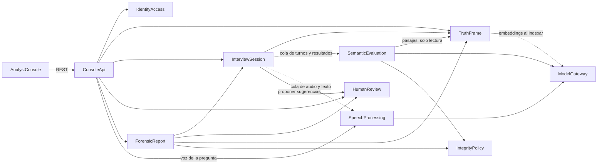

# Componentes del dominio — Veridicus (MVP)

**Insumos.** Requisitos de `inception/requirements-analysis/requirements.md` (requirements: FR1–FR12,
NFR1–NFR15), historias de `inception/user-stories/stories.md` (stories: US1.1–US11.4), prácticas de
`inception/practices-discovery/team-practices.md` (team-practices), pantallas de
`inception/refined-mockups/` y respuestas P1–P5 de `domain-design-questions.md`. Proyecto greenfield:
no hay arquitectura previa.

**Alcance.** Bloques lógicos de software que se escriben (componentes), qué entidad es dueña de cada
dato y cómo se llaman entre ellos. La agrupación en servicios desplegables la decide Units Generation;
los tipos de dato, validaciones y cardinalidades, Functional Design; los patrones de NFR, NFR Design.
Bases de datos, colas y modelos son dependencias externas, no componentes.

## Catálogo (fuente de verdad)

```yaml
components:
  - name: AnalystConsole
    summary: Consola web del analista y del administrador (React + TypeScript).
    behaviour: >
      Presenta las pantallas M0–M6 de refined-mockups. No contiene reglas de negocio: deshabilita
      acciones con su motivo visible, pero toda regla la vuelve a aplicar ConsoleApi. Envía el latido
      de la sesión abierta. Formatea fechas en hora de Colombia. Sus textos salen del catálogo de
      mensajes que pasa el escaneo de vocabulario prohibido.
    responsibilities:
      - Pantallas, estados visuales y accesibilidad WCAG 2.1 AA (US5.6)
      - Latido de la sesión abierta para detectar interrupciones (US7.1)
      - Catálogo de mensajes en español
    depends_on:
      - component: ConsoleApi
        interaction: Todas las lecturas y acciones de la consola
        style: sync
    dependents: []
    external_dependencies: []
    entities: []

  - name: ConsoleApi
    summary: Fachada HTTP única de la consola; autentica, autoriza y traduce errores.
    behaviour: >
      Único punto de entrada desde el navegador (ADR-004). Exige token en toda ruta salvo inicio de
      sesión y salud (AC8.1.4). Aplica la matriz de roles de FR1.2 y la propiedad de la sesión antes
      de delegar (ADR-009): solo el dueño cambia alertas, consolida o corrige; `admin` nunca. Traduce
      la jerarquía única de excepciones a Problem Details (RFC 9457) con `code` estable y `detail` en
      español. No expone ninguna ruta que escriba el umbral (AC8.3.1).
    responsibilities:
      - Autenticación por token y autorización por rol y por dueño de sesión
      - Traducción de errores a Problem Details
      - Composición de vistas para la consola (sesión con turnos, sugerencias y paquetes)
    depends_on:
      - component: IdentityAccess
        interaction: Validar credenciales y token; gestionar usuarios
        style: sync
      - component: TruthFrame
        interaction: Cargar escenarios y versiones; consultar el catálogo
        style: sync
      - component: InterviewSession
        interaction: Crear y finalizar sesiones, enviar turnos, latido, reanudar, reintentar
        style: sync
      - component: HumanReview
        interaction: Registrar «CoT consultada» y decisiones sobre sugerencias
        style: sync
      - component: ForensicReport
        interaction: Consolidar, descargar, corregir reporte
        style: sync
      - component: SpeechProcessing
        interaction: Sintetizar en voz una pregunta aprobada (SHOULD)
        style: sync
    dependents:
      - component: AnalystConsole
        interaction: Todas las lecturas y acciones de la consola
    external_dependencies: []
    entities: []

  - name: IdentityAccess
    summary: Usuarios locales, roles y credenciales.
    behaviour: >
      Guarda contraseñas solo como hash de un algoritmo adaptativo con sal (FR1.1). Mismo estado y
      cuerpo para usuario inexistente y contraseña errónea (AC8.1.2). Un usuario desactivado recibe 401
      aunque tenga token vigente (AC8.2.3). Exactamente dos roles: analista y admin.
    responsibilities:
      - Alta, desactivación y rol de usuarios
      - Verificación de credenciales y emisión y validación de tokens
      - Historial de cambios de usuario de solo inserción
    depends_on: []
    dependents:
      - component: ConsoleApi
        interaction: Validar credenciales y token; gestionar usuarios
    external_dependencies:
      - name: PostgreSQL
        kind: database
        purpose: Usuarios e historial de cambios
    entities:
      - name: User
        identifier: user_id
        attributes: [username, role, password_hash, active, created_by, created_at]
      - name: UserChange
        identifier: change_id
        attributes: [user_id, change, actor_user_id, at]
        references:
          - entity: User
            owned_by: IdentityAccess
            relationship: cada cambio pertenece a un usuario y lo hace otro usuario

  - name: TruthFrame
    summary: Escenarios de control versionados e inmutables y sus pasajes indexados.
    behaviour: >
      Acepta Markdown o texto UTF-8 de hasta 1 MB (FR2.1). Cada carga crea una versión nueva con su
      SHA-256; rechaza un SHA-256 repetido (AC1.2.3). Indexa de forma asíncrona: segmenta, calcula
      embeddings y guarda pasajes; si falla un pasaje, la versión queda en Error sin pasajes (AC1.1.4).
      Una versión indexada nunca cambia: no existe operación de actualización ni borrado (FR2.4).
      Expone una lectura de solo consulta de pasajes para la recuperación semántica.
    responsibilities:
      - Carga, validación y versionado de escenarios
      - Indexación (segmentación y embeddings) y estado de cada versión
      - Catálogo de escenarios y versiones
      - Recuperación de pasajes por similitud, de solo lectura
    depends_on:
      - component: ModelGateway
        interaction: Calcular embeddings de los pasajes al indexar
        style: async
    dependents:
      - component: ConsoleApi
        interaction: Cargar escenarios y versiones; consultar el catálogo
      - component: InterviewSession
        interaction: Verificar que la versión esté lista y obtener su SHA-256
      - component: SemanticEvaluation
        interaction: Recuperar los pasajes más similares (solo lectura)
      - component: ForensicReport
        interaction: Datos de la versión para el reporte
    external_dependencies:
      - name: PostgreSQL + pgvector
        kind: database
        purpose: Versiones, pasajes y vectores
      - name: Redis
        kind: queue
        purpose: Trabajos de indexación asíncronos
    entities:
      - name: Scenario
        identifier: scenario_id
        attributes: [name, created_by, created_at]
        references:
          - entity: User
            owned_by: IdentityAccess
            relationship: cada escenario lo crea un usuario
      - name: ScenarioVersion
        identifier: version_id
        attributes: [scenario_id, version_number, source_sha256, status, error_code, uploaded_by, uploaded_at, ready_at]
        references:
          - entity: User
            owned_by: IdentityAccess
            relationship: cada versión la carga un usuario
      - name: Passage
        identifier: passage_id
        attributes: [version_id, document_id, position, text, embedding]

  - name: InterviewSession
    summary: Sesión de entrevista, sus turnos, su estado y los resultados de evaluación de cada turno.
    behaviour: >
      Una sesión queda ligada a una versión lista de escenario, a su SHA-256 y al umbral vigente al
      crearla (AC2.1.1, AC2.1.2). Numera los turnos en orden sin huecos ni duplicados, también con
      envíos concurrentes (AC2.2.1). Encola cada turno con la instantánea del umbral y del escenario
      y nunca bloquea al analista. Consume el mensaje de resultado de forma idempotente por ID de turno
      (ADR-002), guarda la evaluación y el Paquete de Contexto de Traspaso, y entrega las alertas
      candidatas a HumanReview. Rechaza turnos en una sesión finalizada (409). Pasa la sesión a
      Suspendida cuando falta el latido y conserva todo lo procesado (FR8). Reintenta un turno en
      Error con el mismo número.
    responsibilities:
      - Ciclo de vida de la sesión (Abierta, Suspendida, Finalizada) e inicio de MTTV
      - Turnos, su numeración, estado y reintento
      - División de una transcripción pegada en turnos (regla fija en Functional Design)
      - Ingesta idempotente de resultados de evaluación y de transcripción
      - Registro de evaluación por afirmación y Paquetes de Contexto de Traspaso
      - Preguntas sugeridas y su decisión (SHOULD)
    depends_on:
      - component: TruthFrame
        interaction: Verificar que la versión esté lista y obtener su SHA-256
        style: sync
      - component: SemanticEvaluation
        interaction: Pedir la evaluación de un turno; el resultado vuelve por la cola de resultados
        style: async
      - component: SpeechProcessing
        interaction: Pedir la transcripción de un turno de voz; el texto vuelve por la cola (SHOULD)
        style: async
      - component: HumanReview
        interaction: Proponer las sugerencias de revisión de un turno evaluado
        style: sync
    dependents:
      - component: ConsoleApi
        interaction: Crear y finalizar sesiones, enviar turnos, latido, reanudar, reintentar
      - component: ForensicReport
        interaction: Leer transcripción, paquetes, turnos en Error y estado de la sesión
    external_dependencies:
      - name: PostgreSQL
        kind: database
        purpose: Sesiones, turnos, evaluaciones, paquetes e historial de estado
      - name: Redis
        kind: queue
        purpose: Colas de turnos a evaluar y de resultados
    entities:
      - name: InterviewSessionRecord
        identifier: session_id
        attributes: [owner_user_id, scenario_version_id, scenario_sha256, similarity_threshold, status, created_at, finalized_at, last_heartbeat_at]
        references:
          - entity: User
            owned_by: IdentityAccess
            relationship: cada sesión tiene un analista dueño
          - entity: ScenarioVersion
            owned_by: TruthFrame
            relationship: cada sesión se contrasta contra una sola versión de escenario
      - name: SessionStatusChange
        identifier: change_id
        attributes: [session_id, from_status, to_status, actor, at]
      - name: Turn
        identifier: turn_id
        attributes: [session_id, number, text, origin, status, processing_stage, error_code, attempt, submitted_at, evaluated_at]
      - name: TurnEvaluation
        identifier: evaluation_id
        attributes: [turn_id, claims, max_similarity, nearest_passage_ids, grades, threshold_used, model_digest, prompt_sha256, evaluated_at]
        references:
          - entity: Passage
            owned_by: TruthFrame
            relationship: cada evaluación cita los pasajes recuperados para cada afirmación
      - name: HandoffPackage
        identifier: package_id
        attributes: [turn_id, fragment, previous_turn_ids, nearest_passage_ids, max_similarity, threshold_used, interrupted_cot, affective_note]
        references:
          - entity: Passage
            owned_by: TruthFrame
            relationship: cada paquete trae hasta 3 pasajes cercanos
      - name: SuggestedQuestion
        identifier: question_id
        attributes: [turn_id, text, status, decided_by, decided_at]

  - name: SemanticEvaluation
    summary: Evaluación de un turno contra el marco de verdad; sin estado propio.
    behaviour: >
      Divide el turno en afirmaciones con una regla determinista (AC3.1.5). Por afirmación recupera
      pasajes y aplica primero la guardia del umbral de la sesión (ADR-006): por debajo, «no
      documentada» sin llamar al juez y con CoT interrumpida determinista; en o sobre el umbral, el juez
      (temperatura 0, semilla fija) califica solo «congruente», «incongruente» o «no documentada».
      «no documentada» del juez se trata como por debajo del umbral. Valida la salida contra su
      esquema, que cada referencia de la CoT esté entre los pasajes recuperados y que no haya
      vocabulario prohibido; si algo falla, el turno entero queda en Error sin alertas parciales
      (FR4.2). El testimonio va solo en el bloque delimitado de datos del prompt y el prompt del sistema
      se lee de un archivo montado de solo lectura con SHA-256 verificado (FR4.6). Con alguna afirmación
      «no documentada» no hay pregunta sugerida. Publica el resultado completo en la cola de resultados.
    responsibilities:
      - Guardia del umbral (AUTONOMIA-05) y CoT interrumpida determinista
      - Orquestación del juez y validación estricta de su salida
      - Permutación del orden de lectura (SHOULD) y pregunta sugerida (SHOULD)
      - Indicio afectivo en el paquete (COULD)
      - Cargador de configuración del umbral que impide arrancar sin un valor válido (AC4.3.1)
    depends_on:
      - component: TruthFrame
        interaction: Recuperar los pasajes más similares (solo lectura)
        style: sync
      - component: ModelGateway
        interaction: Embeddings de las afirmaciones y llamadas al juez
        style: sync
      - component: IntegrityPolicy
        interaction: Esquema de la salida y escaneo de vocabulario prohibido
        style: sync
    dependents:
      - component: InterviewSession
        interaction: Pedir la evaluación de un turno; el resultado vuelve por la cola de resultados
    external_dependencies:
      - name: Redis
        kind: queue
        purpose: Consumir turnos y publicar resultados
      - name: PostgreSQL + pgvector
        kind: database
        purpose: Consulta de similitud con un usuario de solo lectura sobre el marco de verdad
    entities: []

  - name: HumanReview
    summary: Sugerencias de revisión y las decisiones humanas sobre ellas.
    behaviour: >
      Rechaza guardar una sugerencia sin fragmento, cita, ID de documento o CoT, o con un documento que
      no pertenece a la versión de la sesión (AC3.1.2). Toda sugerencia nace pendiente. Las decisiones
      pertenecen a una ronda de revisión (ADR-007): la ronda 1 es la revisión inicial y cada corrección
      del reporte abre otra. Aceptar o editar exige el evento «CoT consultada» del mismo usuario
      (AC5.1.2); descartar exige nota; editar nunca toca fragmento, cita, documento ni CoT (AC5.2.2).
      Dentro de una ronda abierta se puede cambiar entre aceptada, editada y descartada, nunca volver a
      pendiente. Una ronda consolidada no admite cambios (409). Cada decisión es una fila nueva con actor
      y hora (solo inserción).
    responsibilities:
      - Sugerencias de revisión y su validación de los cuatro campos (AUTONOMIA-05)
      - Máquina de estados de la decisión (AUTONOMIA-03), módulo guardia con 100 % de ramas
      - Rondas de revisión, su bloqueo y la apertura de una ronda de corrección
      - Registro de «CoT consultada»
    depends_on: []
    dependents:
      - component: ConsoleApi
        interaction: Registrar «CoT consultada» y decisiones sobre sugerencias
      - component: InterviewSession
        interaction: Proponer las sugerencias de revisión de un turno evaluado
      - component: ForensicReport
        interaction: Leer decisiones, bloquear una ronda y abrir una ronda de corrección
    external_dependencies:
      - name: PostgreSQL
        kind: database
        purpose: Sugerencias, rondas, decisiones y consultas de CoT (solo inserción)
    entities:
      - name: ReviewSuggestion
        identifier: suggestion_id
        attributes: [session_id, turn_id, fragment, quote, document_id, passage_id, cot, created_at]
        references:
          - entity: InterviewSessionRecord
            owned_by: InterviewSession
            relationship: cada sugerencia pertenece a una sesión
          - entity: Turn
            owned_by: InterviewSession
            relationship: cada sugerencia sale de un turno
          - entity: Passage
            owned_by: TruthFrame
            relationship: cada sugerencia cita un pasaje de la versión de la sesión
      - name: ReviewRound
        identifier: round_id
        attributes: [session_id, number, status, based_on_report_version_id, opened_by, opened_at, closed_at]
        references:
          - entity: ReportVersion
            owned_by: ForensicReport
            relationship: una ronda de corrección parte de una versión del reporte
      - name: ReviewDecision
        identifier: decision_id
        attributes: [round_id, suggestion_id, previous_state, state, note, reformulation, actor_user_id, at]
        references:
          - entity: User
            owned_by: IdentityAccess
            relationship: cada decisión la toma un analista
      - name: CotView
        identifier: view_id
        attributes: [suggestion_id, user_id, viewed_at]
        references:
          - entity: User
            owned_by: IdentityAccess
            relationship: cada consulta la hace un usuario

  - name: ForensicReport
    summary: Consolidación del reporte, sus versiones inmutables y su descarga.
    behaviour: >
      Consolida solo si la sesión está finalizada, no hay turnos en cola ni procesando y la ronda no
      tiene sugerencias pendientes (AC6.1.1); los turnos en Error no bloquean y se rotulan «turno no
      evaluado». Genera el Markdown, lo escanea con el vocabulario prohibido (excluye citas literales y
      texto del analista), calcula y registra su SHA-256 y bloquea la ronda, todo en una transacción:
      de dos consolidaciones simultáneas solo una gana (AC6.1.6). «Corregir reporte» abre (o retoma) la
      única ronda de corrección de la sesión; consolidarla crea una versión nueva que referencia a la
      anterior, que se conserva intacta (FR7.5).
    responsibilities:
      - Precondiciones y ejecución de la consolidación (AUTONOMIA-03), módulo guardia con 100 % de ramas
      - Generación del reporte, su SHA-256 y su almacenamiento en el volumen persistente
      - Versiones del reporte, corrección y descarga
    depends_on:
      - component: InterviewSession
        interaction: Leer transcripción, paquetes, turnos en Error y estado de la sesión
        style: sync
      - component: HumanReview
        interaction: Leer decisiones, bloquear una ronda y abrir una ronda de corrección
        style: sync
      - component: TruthFrame
        interaction: Datos de la versión para el reporte
        style: sync
      - component: IntegrityPolicy
        interaction: Escaneo de vocabulario prohibido del reporte generado
        style: sync
    dependents:
      - component: ConsoleApi
        interaction: Consolidar, descargar, corregir reporte
    external_dependencies:
      - name: PostgreSQL
        kind: database
        purpose: Versiones del reporte (solo inserción)
      - name: Volumen persistente
        kind: object-store
        purpose: Archivos Markdown de los reportes consolidados
    entities:
      - name: ReportVersion
        identifier: report_version_id
        attributes: [session_id, round_id, version_number, sha256, storage_path, consolidated_by, consolidated_at, supersedes_version_id]
        references:
          - entity: InterviewSessionRecord
            owned_by: InterviewSession
            relationship: cada versión pertenece a una sesión
          - entity: ReviewRound
            owned_by: HumanReview
            relationship: cada versión consolida exactamente una ronda
          - entity: User
            owned_by: IdentityAccess
            relationship: cada versión la consolida un analista

  - name: SpeechProcessing
    summary: Transcripción de turnos de voz y síntesis de la pregunta aprobada (SHOULD).
    behaviour: >
      Transcribe con Whisper en CPU dentro del clúster y publica el texto en la cola; el audio crudo no
      sale del clúster ni se conserva tras transcribirlo. Sintetiza en voz una pregunta solo cuando el
      analista pulsa «Escuchar audio» (AC10.4.1).
    responsibilities:
      - Transcripción asíncrona de un turno de voz
      - Síntesis de voz por demanda
    depends_on:
      - component: ModelGateway
        interaction: Llamadas a Whisper y al TTS locales
        style: sync
    dependents:
      - component: ConsoleApi
        interaction: Sintetizar en voz una pregunta aprobada (SHOULD)
      - component: InterviewSession
        interaction: Pedir la transcripción de un turno de voz; el texto vuelve por la cola (SHOULD)
    external_dependencies:
      - name: Redis
        kind: queue
        purpose: Consumir audios y publicar transcripciones
    entities: []

  - name: ModelGateway
    summary: Puerto único hacia los modelos (juez, embeddings, Whisper, TTS).
    behaviour: >
      Todas las llamadas a modelos pasan por este puerto (ADR-005). Hoy sus adaptadores apuntan solo a
      servidores internos del clúster; si la configuración trae una URL que no es interna, el servicio no
      arranca (AC9.1.4). El anonimizador (COULD) se añade como otro adaptador que enmascara nombres,
      lugares y números de expediente y falla cerrado (AC11.3.1). Toda llamada lleva timeout explícito.
    responsibilities:
      - Contrato estable de llamada a modelos y sus timeouts
      - Verificación de que el destino es interno del clúster
      - Punto de inserción del anonimizador (AUTONOMIA-04)
    depends_on: []
    dependents:
      - component: TruthFrame
        interaction: Calcular embeddings de los pasajes al indexar
      - component: SemanticEvaluation
        interaction: Embeddings de las afirmaciones y llamadas al juez
      - component: SpeechProcessing
        interaction: Llamadas a Whisper y al TTS locales
    external_dependencies:
      - name: Servidor local del juez LLM (≤ 8B, cuantizado)
        kind: other
        purpose: Calificar afirmaciones
      - name: Servidor local de embeddings multilingües
        kind: other
        purpose: Vectores de pasajes y afirmaciones
      - name: Whisper ligero y TTS locales
        kind: other
        purpose: Voz a texto y texto a voz (SHOULD)
    entities: []

  - name: IntegrityPolicy
    summary: Reglas de integridad compartidas, puras y sin estado.
    behaviour: >
      Lee la lista versionada de vocabulario prohibido de contracts/ y escanea por palabra completa,
      sin distinguir mayúsculas ni tildes, excluyendo citas literales y texto del analista (AC5.5.1).
      Publica los esquemas de la salida del juez y de la alerta con additionalProperties false y sin
      campos de veracidad (AC5.5.3); el enum de calificación es exactamente «congruente»,
      «incongruente», «no documentada» (AC5.5.4). Cada regla tiene su control negativo.
    responsibilities:
      - Escaneo de vocabulario prohibido (AUTONOMIA-03)
      - Esquemas compartidos de la salida del juez y de la alerta
    depends_on: []
    dependents:
      - component: SemanticEvaluation
        interaction: Esquema de la salida y escaneo de vocabulario prohibido
      - component: ForensicReport
        interaction: Escaneo de vocabulario prohibido del reporte generado
    external_dependencies: []
    entities: []
```

## Diagrama de componentes



Texto equivalente: la consola solo habla con ConsoleApi, que delega en IdentityAccess, TruthFrame,
InterviewSession, HumanReview, ForensicReport y SpeechProcessing. InterviewSession pide evaluaciones a
SemanticEvaluation y transcripciones a SpeechProcessing por colas (líneas punteadas) y entrega las
sugerencias a HumanReview. SemanticEvaluation lee pasajes de TruthFrame y usa ModelGateway e
IntegrityPolicy. ForensicReport lee de InterviewSession, HumanReview y TruthFrame y usa
IntegrityPolicy. El grafo no tiene ciclos: el resultado de una evaluación viaja por la cola de
resultados como respuesta de la misma interacción, no como una llamada de vuelta (ADR-002).

## Resumen de componentes

| Componente | Propósito | Depende de | Dependientes | Entidades propias |
|---|---|---|---|---|
| AnalystConsole | Consola web | ConsoleApi | — | — |
| ConsoleApi | Fachada única, autenticación, autorización, errores | IdentityAccess, TruthFrame, InterviewSession, HumanReview, ForensicReport, SpeechProcessing | AnalystConsole | — |
| IdentityAccess | Usuarios, roles, credenciales | — | ConsoleApi | User, UserChange |
| TruthFrame | Escenarios versionados e indexados | ModelGateway | ConsoleApi, InterviewSession, SemanticEvaluation, ForensicReport | Scenario, ScenarioVersion, Passage |
| InterviewSession | Sesión, turnos y resultados por turno | TruthFrame, SemanticEvaluation, SpeechProcessing, HumanReview | ConsoleApi, ForensicReport | InterviewSessionRecord, SessionStatusChange, Turn, TurnEvaluation, HandoffPackage, SuggestedQuestion |
| SemanticEvaluation | Guardia del umbral y juez | TruthFrame, ModelGateway, IntegrityPolicy | InterviewSession | — |
| HumanReview | Sugerencias y decisiones humanas | — | ConsoleApi, InterviewSession, ForensicReport | ReviewSuggestion, ReviewRound, ReviewDecision, CotView |
| ForensicReport | Consolidación y versiones del reporte | InterviewSession, HumanReview, TruthFrame, IntegrityPolicy | ConsoleApi | ReportVersion |
| SpeechProcessing | Voz a texto y texto a voz (SHOULD) | ModelGateway | ConsoleApi, InterviewSession | — |
| ModelGateway | Puerto único hacia los modelos | — | TruthFrame, SemanticEvaluation, SpeechProcessing | — |
| IntegrityPolicy | Vocabulario prohibido y esquemas | — | SemanticEvaluation, ForensicReport | — |

## Propiedad de las entidades

| Entidad | Componente dueño | Identificador | Atributos | Referencias |
|---|---|---|---|---|
| User | IdentityAccess | user_id | username, role, password_hash, active, created_by, created_at | — |
| UserChange | IdentityAccess | change_id | user_id, change, actor_user_id, at | User |
| Scenario | TruthFrame | scenario_id | name, created_by, created_at | User |
| ScenarioVersion | TruthFrame | version_id | scenario_id, version_number, source_sha256, status, error_code, uploaded_by, uploaded_at, ready_at | User |
| Passage | TruthFrame | passage_id | version_id, document_id, position, text, embedding | — |
| InterviewSessionRecord | InterviewSession | session_id | owner_user_id, scenario_version_id, scenario_sha256, similarity_threshold, status, created_at, finalized_at, last_heartbeat_at | User, ScenarioVersion |
| SessionStatusChange | InterviewSession | change_id | session_id, from_status, to_status, actor, at | — |
| Turn | InterviewSession | turn_id | session_id, number, text, origin, status, processing_stage, error_code, attempt, submitted_at, evaluated_at | — |
| TurnEvaluation | InterviewSession | evaluation_id | turn_id, claims, max_similarity, nearest_passage_ids, grades, threshold_used, model_digest, prompt_sha256, evaluated_at | Passage |
| HandoffPackage | InterviewSession | package_id | turn_id, fragment, previous_turn_ids, nearest_passage_ids, max_similarity, threshold_used, interrupted_cot, affective_note | Passage |
| SuggestedQuestion | InterviewSession | question_id | turn_id, text, status, decided_by, decided_at | — |
| ReviewSuggestion | HumanReview | suggestion_id | session_id, turn_id, fragment, quote, document_id, passage_id, cot, created_at | InterviewSessionRecord, Turn, Passage |
| ReviewRound | HumanReview | round_id | session_id, number, status, based_on_report_version_id, opened_by, opened_at, closed_at | ReportVersion |
| ReviewDecision | HumanReview | decision_id | round_id, suggestion_id, previous_state, state, note, reformulation, actor_user_id, at | User |
| CotView | HumanReview | view_id | suggestion_id, user_id, viewed_at | User |
| ReportVersion | ForensicReport | report_version_id | session_id, round_id, version_number, sha256, storage_path, consolidated_by, consolidated_at, supersedes_version_id | InterviewSessionRecord, ReviewRound, User |

Las entidades de historial (UserChange, SessionStatusChange, ReviewDecision, CotView, ReportVersion)
son de solo inserción y siguen la convención común de ADR-003: actor y hora no nulos y sin `UPDATE` ni
`DELETE` para el usuario de la aplicación (AC8.4.1, AC8.4.2). El cambio de umbral no tiene entidad: vive
en la configuración del despliegue y su rastro es el historial de git del PR (AC8.3.3); cada sesión
guarda el valor con que se creó.

## Dependencias externas

| Componente | Dependencia | Tipo | Propósito |
|---|---|---|---|
| IdentityAccess | PostgreSQL | database | Usuarios e historial |
| TruthFrame | PostgreSQL + pgvector | database | Versiones, pasajes y vectores |
| TruthFrame | Redis | queue | Trabajos de indexación |
| InterviewSession | PostgreSQL | database | Sesiones, turnos, evaluaciones, paquetes |
| InterviewSession | Redis | queue | Colas de turnos y de resultados |
| SemanticEvaluation | Redis | queue | Consumir turnos y publicar resultados |
| SemanticEvaluation | PostgreSQL + pgvector | database | Similitud con usuario de solo lectura |
| HumanReview | PostgreSQL | database | Sugerencias, rondas, decisiones |
| ForensicReport | PostgreSQL | database | Versiones del reporte |
| ForensicReport | Volumen persistente | object-store | Archivos de reporte |
| SpeechProcessing | Redis | queue | Audios y transcripciones |
| ModelGateway | Juez LLM, embeddings, Whisper, TTS locales | other | Inferencia dentro del clúster |

## Frontera del clúster (AUTONOMIA-04)

Todos los componentes corren **dentro** del clúster local; ninguno llama a un servicio externo en el
MVP. La tabla declara qué datos sensibles maneja cada uno, para que Infrastructure Design aplique la
`NetworkPolicy` de salida denegada (US9.1) y la etiqueta de clasificación de datos.

| Componente | Dónde corre | Datos sin anonimizar que maneja | ¿Cruza la frontera? |
|---|---|---|---|
| AnalystConsole | Navegador del analista, servido desde el clúster | Testimonio, alertas, reportes (en pantalla) | No: solo habla con ConsoleApi dentro del clúster |
| ConsoleApi | Clúster | Testimonio, alertas, reportes | No |
| IdentityAccess | Clúster | Usuarios (sin datos del proceso) | No |
| TruthFrame | Clúster | Escenarios sintéticos | No |
| InterviewSession | Clúster | Testimonio, evaluaciones, paquetes | No |
| SemanticEvaluation | Clúster | Testimonio, pasajes | No |
| HumanReview | Clúster | Fragmentos, citas, CoT | No |
| ForensicReport | Clúster | Reporte completo | No |
| SpeechProcessing | Clúster | Audio crudo y su transcripción | No |
| ModelGateway | Clúster | Todo lo que se envía a un modelo | No en el MVP; si algún día hay un destino externo, solo a través del adaptador anonimizador (ADR-005) |
| IntegrityPolicy | Biblioteca dentro de cada componente que la usa | Textos que escanea | No |

## Justificación

| Componente | Por qué es un bloque aparte |
|---|---|
| AnalystConsole | Otra tecnología (TypeScript) y otro ritmo de cambio (pantallas). |
| ConsoleApi | Concentra autenticación, autorización y traducción de errores en un solo lugar (ADR-004, ADR-009). |
| IdentityAccess | Datos propios (usuarios y credenciales) con reglas de seguridad que no comparten las demás. |
| TruthFrame | Ciclo de vida propio (carga, indexación, inmutabilidad) y el único dueño de los vectores. |
| InterviewSession | Ritmo alto de cambio (turnos, colas, reanudación) y dueño de lo que produce cada turno. |
| SemanticEvaluation | Lógica de IA sin estado, con permisos mínimos de base de datos (AC3.3.2) y su propio perfil de recursos. |
| HumanReview | Máquina de estados guardia de AUTONOMIA-03, que cambia por razones distintas a la sesión (ADR-001). |
| ForensicReport | Consolidación guardia e inmutabilidad del reporte, con su propio almacenamiento (ADR-001). |
| SpeechProcessing | Funciones SHOULD con modelos pesados propios; se añade solo cuando el flujo de texto funciona. |
| ModelGateway | Un solo punto de control para lo que sale hacia un modelo (ADR-005). |
| IntegrityPolicy | Reglas compartidas que no deben duplicarse ni divergir entre componentes (ADR-008). |

**Alternativas rechazadas en la partición del núcleo (P1).** Dos componentes (`InterviewSession` y un
`Review` con consolidación) mezclaban dos módulos guardia distintos en un solo bloque; un único
componente `Session` concentraba todos los cambios y todas las reglas. Detalle en ADR-001.
