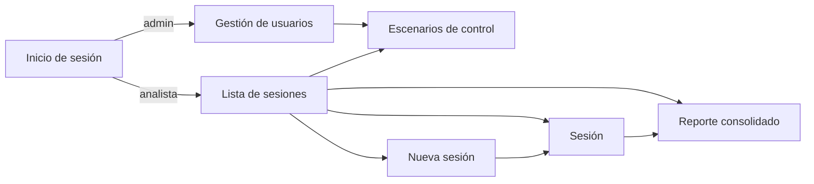

# Maquetas refinadas — Veridicus (consola del analista, MVP)

**Insumos.** Historias de `inception/user-stories/stories.md` (stories) y personas de `personas.md`;
requisitos de `inception/requirements-analysis/requirements.md` (requirements); prácticas de
`inception/practices-discovery/team-practices.md` (team-practices); respuestas de
`refined-mockups-questions.md` (P1–P5). No hay bocetos de Ideation: el scope `classic` omite esa fase,
así que `wireframes` y `user-flow` no existen y estas maquetas se diseñan directamente desde las historias
y los requisitos, sin inventar el contenido de esos artefactos ausentes.

**Fidelidad.** Media-alta: estructura, jerarquía, textos visibles reales y todos los estados de cada
pantalla. El aspecto visual final (tipografía, espaciado exacto) lo fijan los *tokens* de
`design-system-mapping.md`. Los textos entre «» son la redacción visible propuesta por las historias y
viven en el catálogo de mensajes en español.

**Decisiones de esta etapa (P1–P5).**

| Pregunta | Decisión |
|---|---|
| P1 Componentes | Primitivas accesibles sin estilo (Radix UI) + capa propia de componentes con *tokens* CSS; sin tema de terceros. |
| P2 Pantalla de sesión | Dos columnas: transcripción a la izquierda, sugerencias de revisión a la derecha (CoT plegable en cada tarjeta); el Paquete de Contexto de Traspaso se abre como panel lateral sobre la columna derecha sin tapar la transcripción; la entrada de turnos queda fija abajo a la izquierda. |
| P3 Tamaños | Escritorio: diseño principal ≥ 1280 px; usable sin pérdida de funciones hasta 1024 px (las dos columnas pasan a pestañas); sin diseño para teléfono ni tableta. |
| P4 Colores de estado | Colores del PRD: ámbar para sugerencias de revisión, rojo para el Hecho No Documentado, siempre con icono y texto; errores del sistema con borde gris oscuro, icono de advertencia y texto. **Los colores de estado son parámetros configurables** (*tokens* en un solo archivo) por si no resultan adecuados al verlos; ver `design-system-mapping.md` §3. |
| P5 Fechas | Hora de Colombia (`America/Bogota`), `DD/MM/AAAA HH:mm` de 24 h en interfaz y reporte; el reporte añade la hora UTC en las marcas de consolidación. |

---

## 1. Mapa de pantallas y navegación

Navegación de concentrador (*hub-and-spoke*): la lista de sesiones es el inicio del `analista`; la gestión
de usuarios es el inicio del `admin` (AC8.1.1). Toda pantalla se alcanza en ≤ 2 clics desde el inicio.



Texto equivalente: Inicio de sesión → (analista) Lista de sesiones → Escenarios de control, Nueva sesión,
Sesión, Reporte consolidado. Inicio de sesión → (admin) Gestión de usuarios → Escenarios de control.
El `admin` no ve «Nueva sesión» (AC2.1.3).

| ID | Pantalla | Historias | Rol |
|---|---|---|---|
| M0 | Inicio de sesión | US8.1 | ambos |
| M1 | Lista de sesiones (+ aviso de reanudación) | US2.5, US7.1, US11.2 | analista |
| M2 | Escenarios de control (catálogo y carga) | US1.1, US1.2, US1.3 | ambos |
| M3 | Nueva sesión | US2.1 | analista |
| M4 | Sesión (dos columnas) | US2.2–US2.4, US3.1, US3.2, US4.2, US5.1–US5.6, US10.1–US10.4, US11.1 | analista (dueño); lectura para los demás |
| M5 | Reporte consolidado y versiones | US6.1–US6.3 | analista (dueño); lectura para los demás |
| M6 | Gestión de usuarios | US8.2 | admin |

**Cabecera global** (todas las pantallas autenticadas): nombre del producto (enlace al inicio), enlaces
«Sesiones» y «Escenarios» (analista) o «Usuarios» y «Escenarios» (admin), usuario y rol, «Cerrar sesión».
Primer elemento enfocable: «Saltar al contenido».

---

## 2. M0 — Inicio de sesión (US8.1)

```
┌──────────────────────────────────────────────┐
│                 VERIDICUS                    │
│  Consola de contraste de testimonios         │
│                                              │
│  Usuario      [______________________]       │
│  Contraseña   [______________________]       │
│                                              │
│  [ Iniciar sesión ]                          │
│                                              │
│  ⚠ Usuario o contraseña incorrectos.         │  ← estado de error (mismo texto para
│                                              │    usuario inexistente y contraseña errónea)
└──────────────────────────────────────────────┘
```

| Estado | Qué se ve |
|---|---|
| Inicial | Formulario vacío; «Iniciar sesión» habilitado. |
| Cargando | Botón con «Entrando…» y deshabilitado. |
| Error de credenciales | Mensaje único «Usuario o contraseña incorrectos.» bajo el formulario, con icono; el foco va al mensaje (AC8.1.2). |
| Error del sistema | Tratamiento de error del sistema (borde gris oscuro + icono + texto): «No se pudo conectar con el servidor. Intenta de nuevo.» |
| Sesión web expirada | Al volver a entrar, se regresa a la sesión de entrevista abierta (AC8.1.5). |

---

## 3. M1 — Lista de sesiones (US2.5, US7.1)

```
┌ Cabecera ─────────────────────────────────────────────────────────────────────┐
│ Sesiones                                        [ + Nueva sesión ]            │
│ Filtro: (•) Todas  ( ) Solo las mías     Estado: [Todos ▾]                    │
├───────────────────────────────────────────────────────────────────────────────┤
│ Escenario / versión     Dueño        Fecha (hora de Colombia)  Estado          │
│ Masacre-X  v2           yo           02/10/2026 14:05          ◐ Abierta       │
│ Masacre-X  v2           yo           01/10/2026 09:40          ⏸ Suspendida    │
│ Despojo-Y  v1           a.perez      30/09/2026 16:12          ■ Finalizada    │
│ Despojo-Y  v1           yo           29/09/2026 11:00          🔒 Consolidada  │
└───────────────────────────────────────────────────────────────────────────────┘
```

- Cada fila es un enlace a M4 (o a M5 si está consolidada). Las sesiones de otros abren en solo lectura.
- El estado siempre lleva icono + texto (AC2.5.3, AC5.6.3); el icono se oculta al lector de pantalla y el
  texto se lee.
- La tabla es nativa (`<table>`), ordenada por fecha descendente.

| Estado | Qué se ve |
|---|---|
| Cargando | Esqueleto de 5 filas. |
| Vacío | «Aún no hay sesiones» y la acción «Nueva sesión» (AC2.5.2). |
| Filtro sin resultados | «No hay sesiones con este filtro» y «Quitar filtros». |
| Error | Error del sistema: «No se pudo cargar la lista de sesiones.» + «Reintentar». |
| Poblado | Tabla; con > 25 filas, paginación «Mostrando 1–25 de N». |

**Aviso de reanudación (US7.1, AC7.1.2).** Si el analista tiene una sesión «Suspendida», al entrar
aparece un diálogo modal (crítico, requiere respuesta):

```
┌ Sesión interrumpida ───────────────────────────────────────────┐
│ Se detectó una interrupción inesperada en la sesión.           │
│ ¿Desea reanudar desde el último turno registrado?              │
│ Masacre-X v2 · 01/10/2026 09:40 · 7 turnos registrados         │
│                                   [ Más tarde ]  [ Reanudar ]   │
└────────────────────────────────────────────────────────────────┘
```

«Más tarde» cierra el diálogo y la sesión sigue «Suspendida» en la lista, desde donde se puede abrir y
reanudar. «Reanudar» abre M4 en el último turno.

**Historial lateral (US11.2, COULD).** En M4, un botón «Mis sesiones» abre un panel lateral izquierdo
con las sesiones del analista ordenadas por fecha, con su estado; no sustituye a M1.

---

## 4. M2 — Escenarios de control (US1.1–US1.3)

```
┌ Cabecera ─────────────────────────────────────────────────────────────────────┐
│ Escenarios de control                         [ ⬆ Cargar escenario de control ]│
├───────────────────────────────────────────────────────────────────────────────┤
│ ▾ Masacre-X                                                                    │
│     v2  ✓ Listo para contrastación   SHA-256 3f9a…c21  02/10/2026 10:15        │
│     v1  ✓ Listo · versión anterior   SHA-256 77b0…0e4  28/09/2026 08:02        │
│ ▾ Despojo-Y                                                                    │
│     v1  ⟳ Indexando…                 SHA-256 a1c2…9de  02/10/2026 14:20        │
│ ▾ Desaparición-Z                                                               │
│     v1  ⚠ Error · No se pudieron calcular los embeddings del pasaje 12        │
│                                         [ Cargar nueva versión ]               │
└───────────────────────────────────────────────────────────────────────────────┘
```

**Carga (diálogo).** Campo de archivo (`.md`, `.txt`), opción «Escenario nuevo» o «Nueva versión de
<escenario>», nota de formato visible antes de elegir: «Markdown o texto plano, UTF-8, hasta 1 MB».
«Cargar» deshabilitado hasta elegir archivo.

| Estado | Qué se ve |
|---|---|
| Vacío | «No hay escenarios de control listos» + «Cargar escenario de control» (AC1.3.3). |
| Indexando | Fila con «Indexando…», icono animado (respeta movimiento reducido) y anuncio `aria-live`; el resto de la consola sigue usable (AC1.1.5). |
| Listo | «Listo para contrastación» con icono ✓. |
| Error de indexación | Error del sistema con la causa en español; la versión no se puede elegir (AC1.1.4). |
| Rechazo de carga | Mensaje junto al campo de archivo: «El archivo supera 1 MB. Divide el escenario o reduce su tamaño», «Solo se admiten archivos Markdown o de texto plano», «El archivo debe estar codificado en UTF-8», «El archivo está vacío» (AC1.1.2). |
| Duplicado | «Este documento ya está cargado como <escenario> versión <n>» (AC1.2.3). |

Las versiones no tienen acciones de edición ni borrado (AC1.2.2); el SHA-256 abreviado tiene acción
«Copiar SHA-256 completo» y una descripción accesible con el valor completo.

---

## 5. M3 — Nueva sesión (US2.1)

```
┌ Nueva sesión ──────────────────────────────────────────────────┐
│ Escenario de control                                            │
│  (•) Masacre-X   v2 · Listo (más reciente)          [preselec.] │
│  ( ) Masacre-X   v1 · versión anterior                          │
│  ( ) Despojo-Y   v1 · Indexando…   (no disponible)              │
│                                                                 │
│ Umbral de similitud vigente: 0,72 (se fija al crear la sesión)  │
│                                     [ Cancelar ] [ Crear sesión ]│
└─────────────────────────────────────────────────────────────────┘
```

- Grupo de opciones (radio) por versión; las versiones «Indexando…» o «Error» aparecen deshabilitadas con
  su motivo (AC1.3.2). La versión «Listo» más reciente viene preseleccionada (AC1.3.1).
- El umbral se muestra en solo lectura; no hay control para cambiarlo (AC8.3.1).
- Al crear, se abre M4.

---

## 6. M4 — Sesión (pantalla principal)

### 6.1 Distribución a ≥ 1280 px

```
┌ Cabecera global ──────────────────────────────────────────────────────────────────────────────┐
├ Cabecera de sesión ───────────────────────────────────────────────────────────────────────────┤
│ Masacre-X v2 · SHA-256 3f9a…c21 · Umbral 0,72 · ◐ Abierta · Inicio 02/10/2026 14:05            │
│ [ Mis sesiones ]   [ Pegar transcripción ]   [ Finalizar sesión ]   [ Finalizar y Consolidar ] │
├───────────────────────── 58 % ───────────────────────┬──────────────── 42 % ───────────────────┤
│ TRANSCRIPCIÓN                                         │ SUGERENCIAS DE REVISIÓN · 2 pendientes  │
│                                                       │ (región aria-live con el contador)      │
│ Turno 1 · ✓ Evaluado · sin sugerencias de revisión    │ ┌───────────────────────────────────┐   │
│  «Llegamos al caserío al amanecer…»                   │ │ ◆ Sugerencia de revisión ·        │   │
│                                                       │ │   Incongruencia semántica         │   │
│ Turno 2 · ✓ Evaluado                                  │ │ Turno 2 · Pendiente               │   │
│  «…eran como [veinte hombres] armados…»  ← resaltado  │ │ Fragmento: «eran como veinte      │   │
│                                                       │ │  hombres armados»                 │   │
│ Turno 3 · ● Hecho No Documentado                      │ │ Cita: «el informe registra un     │   │
│  «…después nos llevaron al río…»                      │ │  grupo de seis personas» (DOC-14) │   │
│  ┌─────────────────────────────────────────────────┐ │ │ ▸ Ver justificación (CoT)         │   │
│  │ ● La IA no puede validar este fragmento de forma │ │ │ [Aceptar] [Editar] [Descartar]    │   │
│  │   autónoma. Control manual requerido   [ Ver ▸ ] │ │ │ (Aceptar y Editar deshabilitados: │   │
│  └─────────────────────────────────────────────────┘ │ │  «Despliega y lee la justificación│   │
│                                                       │ │  (CoT) para habilitar esta acción»│   │
│ Turno 4 · ⟳ Procesando · Consultando marco de         │ │ ⓘ La IA es un asistente de        │   │
│   verdad… 00:14                                       │ │   soporte. Su criterio como       │   │
│                                                       │ │   analista prevalece.             │   │
│ Turno 5 · ⚠ Error                                     │ └───────────────────────────────────┘   │
│  No se pudo evaluar este turno: la respuesta de la IA │ ┌───────────────────────────────────┐   │
│  no tenía el formato esperado. Puedes reintentar.     │ │ … siguiente tarjeta …             │   │
│  Código: judge_invalid_output  [ Reintentar evaluación ]│ └───────────────────────────────────┘   │
│                                                       │                                         │
├───────────────────────────────────────────────────────┤ Pregunta sugerida · requiere tu         │
│ Turno 6                                               │ aprobación (US10.3, SHOULD)             │
│ [ Escribe el turno…                              ]    │ «¿Cuántas personas recuerda…?»          │
│ [🎙 Grabar] (SHOULD)                [ Enviar turno ]   │ [Aprobar] [Descartar] [🔊 Escuchar audio]│
└───────────────────────────────────────────────────────┴─────────────────────────────────────────┘
```

- **Columna izquierda.** Lista de turnos en orden (lista ordenada `<ol>`), cada uno con su número, estado
  (icono + texto) y texto literal. La entrada de turnos queda fija abajo; «Enviar turno» deshabilitado
  con texto vacío (AC2.2.5). Enviar no bloquea: el turno aparece «En cola» y el campo queda libre para
  el siguiente (AC2.2.2).
- **Columna derecha.** Tarjetas de sugerencia de revisión en orden de turno; un filtro «Pendientes /
  Todas». La pregunta sugerida (SHOULD) aparece al pie solo en turnos sin afirmaciones «no documentada»
  (AC10.3.1, AC10.3.2).
- **Selección.** Seleccionar una tarjeta resalta su fragmento en el turno (AC3.1.8) y desplaza la
  transcripción hasta él sin mover el foco del teclado fuera de la tarjeta.
- **Alerta nueva.** Se añade al final de la columna derecha sin ventana modal, sin sonido y sin mover el
  foco; el contador «N pendientes» se actualiza y se anuncia en `aria-live="polite"` (AC3.1.7).

### 6.2 Distribución entre 1024 y 1279 px

Las dos columnas pasan a pestañas «Transcripción» y «Sugerencias (N pendientes)»; la entrada de turnos
sigue fija abajo en la pestaña «Transcripción». Seleccionar una sugerencia ofrece «Ver en la
transcripción», que cambia de pestaña y resalta el fragmento. Por debajo de 1024 px se muestra un aviso:
«Veridicus está diseñado para pantallas de escritorio (1024 px o más)», sin bloquear el contenido.

### 6.3 Estados del turno (US2.2, US3.1, US3.2, US10.1)

| Estado | Icono + texto | Detalle |
|---|---|---|
| En cola | ◷ «En cola» | Gris neutro. |
| Procesando | ⟳ «Procesando» + etapa («Procesando audio…», «Consultando marco de verdad…») + cronómetro | Cambios de etapa anunciados en `aria-live="polite"` (AC10.1.1). |
| Evaluado sin sugerencias | ✓ «Evaluado · sin sugerencias de revisión» | Distinto de «Procesando» y del Hecho No Documentado (AC3.1.3). |
| Evaluado con sugerencias | ✓ «Evaluado» + enlace «N sugerencias» a la columna derecha | |
| Hecho No Documentado | ● «Hecho No Documentado» + aviso destacado | Color de estado del Hecho No Documentado; no usa el tratamiento de error del sistema (AC4.2.2). |
| Error | ⚠ «Error» + causa sin jerga + `code` secundario + «Reintentar evaluación» | Tratamiento de error del sistema; disponible también en sesión finalizada (AC3.2.2, AC3.2.3). |

### 6.4 Tarjeta de sugerencia de revisión (US3.1, US5.1–US5.3)

```
┌──────────────────────────────────────────────────────────────┐
│ ◆ Sugerencia de revisión · Incongruencia semántica           │
│ Turno 2 · ◷ Pendiente                                        │
│ Fragmento del testimonio                                      │
│   «eran como veinte hombres armados»                          │
│ Cita del marco de verdad · DOC-14 (Masacre-X v2)              │
│   «el informe registra un grupo de seis personas»             │
│ ▾ Ocultar justificación (CoT)                                 │
│   1. El fragmento afirma un grupo de unas veinte personas.    │
│   2. El pasaje DOC-14 §3 registra seis personas. [ver pasaje] │
│   3. Las cifras no coinciden; se sugiere revisar.             │
│ [ Aceptar ]  [ Editar ]  [ Descartar ]                        │
│ ⓘ La IA es un asistente de soporte. Su criterio como          │
│   analista prevalece.                                         │
└──────────────────────────────────────────────────────────────┘
```

| Estado de la alerta | Rótulo | Acciones |
|---|---|---|
| Pendiente, CoT plegada | ◷ «Pendiente» | «Aceptar» y «Editar» deshabilitados con el texto visible «Despliega y lee la justificación (CoT) para habilitar esta acción»; «Descartar» habilitado (AC5.1.1). |
| Pendiente, CoT desplegada | ◷ «Pendiente» | Las tres acciones habilitadas; desplegar registra «CoT consultada» (AC5.1.2). |
| Aceptada | ✓ «Aceptada» o «Aceptada · con nota» + la nota visible | «Cambiar decisión» (antes de consolidar) (AC5.1.3, AC5.1.4). |
| Editada | ✎ «Editada» + reformulación del analista, quién y cuándo; el hallazgo original sigue visible | «Cambiar decisión». |
| Descartada | ✕ «Descartada» + nota, quién y cuándo | «Cambiar decisión». |
| Bloqueada (consolidada) | 🔒 + estado final | Sin acciones (AC6.1.5). |
| Solo lectura (sesión ajena) | Estado | Sin acciones; banner «Sesión de <usuario>. Solo lectura» (AC5.4.2). |

**Aceptar.** Abre en línea un campo «Nota (opcional)» y «Confirmar aceptación» / «Cancelar».

**Editar (US5.2).** Abre un editor en línea a dos columnas dentro de la tarjeta: a la izquierda el
hallazgo original de la IA en solo lectura (fragmento, cita, ID de documento, CoT); a la derecha «Tu
reformulación» (obligatoria) y «Nota (opcional)». «Guardar» deshabilitado con texto vacío o solo espacios
y el motivo visible «Escribe tu reformulación para guardar» (AC5.2.1, AC5.2.3).

**Descartar (US5.3).** Abre en línea «¿Por qué descartas esta sugerencia?» (obligatorio). Si se intenta
confirmar vacío: «Escribe por qué descartas esta sugerencia» junto al campo (AC5.3.1).

### 6.5 Paquete de Contexto de Traspaso (US4.2, US11.1)

Panel lateral que se abre sobre la columna derecha (no tapa la transcripción), desde «Ver ▸» del aviso
del turno. Se cierra con Escape o «Cerrar» y devuelve el foco al aviso (AC4.2.3).

```
                                       ┌ Paquete de Contexto de Traspaso · Turno 3 ── [ Cerrar ✕ ] ┐
                                       │ ● La IA no puede validar este fragmento de forma autónoma.│
                                       │   Control manual requerido                                │
                                       │ Fragmento actual                                          │
                                       │   «…después nos llevaron al río…»                         │
                                       │ Turnos previos disponibles: 2 de 3                        │
                                       │   Turno 1 «…»   Turno 2 «…»                               │
                                       │ Pasajes más cercanos                                      │
                                       │   1. DOC-08 · coeficiente 0,61 «…»                        │
                                       │   2. DOC-03 · coeficiente 0,58 «…»                        │
                                       │   3. DOC-21 · coeficiente 0,55 «…»                        │
                                       │ Justificación interrumpida                                │
                                       │   Similitud máxima 0,61 < umbral 0,72. No se consultó     │
                                       │   el juez.                                                │
                                       │ (COULD) Fluctuación afectiva por posible estrés/trauma en │
                                       │   este fragmento. Se recomienda moderar el ritmo          │
                                       └───────────────────────────────────────────────────────────┘
```

- El aviso usa el texto exacto «La IA no puede validar este fragmento de forma autónoma. Control manual
  requerido» (AC4.2.2), con icono propio y el color de estado del Hecho No Documentado; no cuenta como
  sugerencia pendiente.
- No hay pregunta sugerida en ese turno (AC4.1.2, AC10.3.2).

### 6.6 Pegar transcripción (US2.3)

Diálogo con área de texto «Pega la transcripción completa». «Continuar» muestra la vista previa: «Se
detectaron N turnos» y la lista de turnos (número + primeras líneas). Acciones «Volver a editar»,
«Cancelar» (no crea turnos) y «Crear N turnos» (AC2.3.1).

### 6.7 Finalizar sesión (US2.4)

Diálogo de confirmación: «Después de finalizar no podrás agregar turnos», «Hay N turnos en proceso; sus
resultados se guardarán en la sesión», con «Cancelar» y «Finalizar» (AC2.4.1). Tras finalizar, la
entrada de turnos se reemplaza por «Sesión finalizada · quedan N sugerencias pendientes» con enlace
«Ir a la primera» (AC2.4.4).

### 6.8 Barra de consolidación (US6.1)

«Finalizar y Consolidar» está en la cabecera de sesión. Deshabilitado, muestra su motivo visible junto
al botón: «Finaliza la sesión para consolidar», «Quedan N sugerencias pendientes» (con enlace a la
primera) o «Hay turnos en proceso» (AC6.1.1). Habilitado, abre el diálogo de consolidación:

```
┌ Consolidar el reporte ────────────────────────────────────────────┐
│ Sugerencias de revisión: 3 aceptadas · 1 editada · 2 descartadas   │
│ Hechos No Documentados: 1                                          │
│ Turnos no evaluados (Error): turno 5                               │
│                                                                    │
│ Después de consolidar, la sesión queda bloqueada; una corrección   │
│ creará una versión nueva.                                          │
│                                        [ Cancelar ] [ Consolidar ] │
└────────────────────────────────────────────────────────────────────┘
```

### 6.9 Grabación por voz (US10.2, SHOULD)

Botón «Grabar» junto a la entrada de turnos. Grabando: indicador visible «● Grabando 00:07» anunciado y
«Detener y enviar». Sin permiso de micrófono: «No hay acceso al micrófono. Puedes seguir escribiendo el
turno»; la entrada de texto sigue disponible (AC10.2.3).

---

## 7. M5 — Reporte consolidado (US6.1–US6.3)

```
┌ Reporte · Masacre-X v2 · Sesión del 02/10/2026 ───────────────────────────────┐
│ 🔒 Consolidado por jreyes el 02/10/2026 15:31 (20:31 UTC)                     │
│ SHA-256 3f9ac0…e21c (completo)            [ Copiar SHA-256 ] [ Descargar reporte ]│
│ [ Corregir reporte ]                                                          │
├───────────────────────────────────────────────────────────────────────────────┤
│ Versiones del reporte                                                         │
│  v2 · vigente · SHA-256 3f9a…e21c · jreyes · 02/10/2026 15:31                 │
│  v1           · SHA-256 91d0…7a3b · jreyes · 02/10/2026 15:02                 │
├───────────────────────────────────────────────────────────────────────────────┤
│ Vista previa del reporte (Markdown renderizado, solo lectura)                 │
└───────────────────────────────────────────────────────────────────────────────┘
```

- Tras consolidar se ve quién y cuándo, el SHA-256 completo con «Copiar» y «Descargar reporte»
  (AC6.1.4). Sin consolidar, no se ofrece la descarga (AC6.2.2).
- **Corregir reporte (US6.3).** Abre M4 en modo «copia de trabajo» con el banner «Copia de trabajo de la
  versión N. Solo puedes cambiar estados y notas» y la acción «Descartar copia». Transcripción y salida
  de la IA se ven en solo lectura (AC6.3.1). Pulsar otra vez «Corregir reporte» vuelve a la misma copia
  (AC6.3.2).
- La lista de versiones marca la vigente con texto «vigente», no solo con estilo (AC6.3.4).
- Las marcas de consolidación muestran hora de Colombia y, entre paréntesis, la hora UTC (P5).

---

## 8. M6 — Gestión de usuarios (US8.2)

```
┌ Usuarios ──────────────────────────────────────────── [ + Crear usuario ] ┐
│ Usuario     Rol        Estado        Acciones                              │
│ jreyes      analista   ✓ Activo      [ Desactivar ]                        │
│ a.perez     analista   ✕ Desactivado —                                     │
│ admin1      admin      ✓ Activo      [ Desactivar ]                        │
└────────────────────────────────────────────────────────────────────────────┘
```

- «Crear usuario» abre un diálogo: usuario, rol (`analista` / `admin`), contraseña inicial.
- «Desactivar» pide confirmación: «El usuario no podrá entrar; sus acciones pasadas conservan su autoría»
  (AC8.2.3).
- No hay ningún control de umbral en la consola (AC8.3.1).

---

## 9. Cobertura de historias con interfaz

| Historia | Pantalla / componente |
|---|---|
| US1.1, US1.2, US1.3 | M2, diálogo de carga; M3 |
| US2.1 | M3, cabecera de sesión M4 |
| US2.2 | M4 columna izquierda, entrada de turnos |
| US2.3 | M4 §6.6 |
| US2.4 | M4 §6.7 |
| US2.5 | M1 |
| US3.1 | M4 §6.4, resaltado §6.1 |
| US3.2 | M4 §6.3 estado Error |
| US3.3 | Sin interfaz (integridad del *prompt*) |
| US4.1 | Sin interfaz propia; su resultado se ve en §6.3 y §6.5 |
| US4.2 | M4 §6.5 |
| US4.3 | Sin interfaz (arranque del servicio) |
| US5.1–US5.3 | M4 §6.4 |
| US5.4 | Banner y modo solo lectura en M4 y M5 |
| US5.5 | Catálogo de mensajes y rótulos de resultado; ver `accessibility-checklist.md` §4 |
| US5.6 | `accessibility-checklist.md` |
| US6.1, US6.2, US6.3 | M4 §6.8, M5 |
| US7.1 | M1, diálogo de reanudación |
| US8.1, US8.2 | M0, M6 |
| US8.3 | Ausencia de control de umbral en M3, M4 y M6 |
| US8.4, US9.x | Sin interfaz (plataforma y auditoría) |
| US10.1–US10.4 | M4 §6.3, §6.9, pregunta sugerida en §6.1 |
| US10.5–US10.7 | Sin interfaz propia |
| US11.1, US11.2 | M4 §6.5, historial lateral en M1 |
| US11.3, US11.4 | Sin interfaz |
