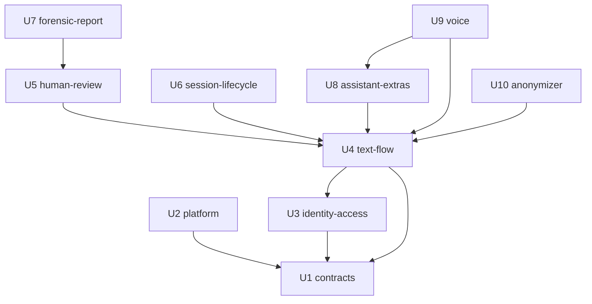

# Dependencias entre unidades — Veridicus

**Insumos.** `unit-of-work.md` de esta etapa; dependencias entre componentes de
`inception/domain-design/components.md` (components); historias de `inception/user-stories/stories.md`
(stories); requisitos de `inception/requirements-analysis/requirements.md` (requirements).

Este documento describe la **topología**: qué unidad necesita a cuál. No fija un orden de entrega ni
una ruta crítica; eso lo decide Delivery Planning.

## Grafo de dependencias (fuente de verdad)

```yaml
units:
  - name: contracts
    kind: spec
    depends_on: []
  - name: platform
    kind: packaging
    depends_on: [contracts]
  - name: identity-access
    kind: service
    depends_on: [contracts]
  - name: text-flow
    depends_on: [contracts, identity-access]
  - name: human-review
    kind: service
    depends_on: [text-flow]
  - name: session-lifecycle
    kind: service
    depends_on: [text-flow]
  - name: forensic-report
    kind: service
    depends_on: [human-review]
  - name: assistant-extras
    kind: service
    depends_on: [text-flow]
  - name: voice
    kind: service
    depends_on: [text-flow, assistant-extras]
  - name: anonymizer
    kind: service
    depends_on: [text-flow]
```



Texto equivalente: las flechas van de la unidad que depende a la unidad de la que depende.
`platform` e `identity-access` dependen de `contracts`; `text-flow` depende de `contracts` e
`identity-access`; `human-review`, `session-lifecycle`, `assistant-extras` y `anonymizer` dependen de
`text-flow`; `forensic-report` depende de `human-review`; `voice` depende de `text-flow` y
`assistant-extras`. El grafo no tiene ciclos.

## Por qué existe cada arista

| Unidad | Depende de | Motivo |
|---|---|---|
| platform | contracts | La regla AIR (US10.6) y las etiquetas de clasificación leen nombres fijados en contratos. |
| identity-access | contracts | Catálogo de `code` de Problem Details y OpenAPI. |
| text-flow | contracts | Mensajes de turno y resultado, esquemas del juez y de la alerta, vocabulario prohibido. |
| text-flow | identity-access | Toda ruta exige token y rol (AC8.1.4); el actor de cada fila viene de aquí. |
| human-review | text-flow | Decide sobre sugerencias que crea text-flow. |
| session-lifecycle | text-flow | Extiende sesiones, turnos y escenarios que crea text-flow. |
| forensic-report | human-review | Consolida rondas y decisiones; necesita que no queden pendientes. |
| assistant-extras | text-flow | Extiende la evaluación de SemanticEvaluation. |
| voice | text-flow | El turno transcrito sigue el camino del turno de texto. |
| voice | assistant-extras | El audio es de la pregunta sugerida (US10.4 depende de US10.3). |
| anonymizer | text-flow | Es un adaptador del puerto ModelGateway que crea text-flow. |

`platform` no depende de ninguna unidad de aplicación: las pruebas de niveles 0 y 1 usan PostgreSQL y
Redis en contenedor (team-practices), así que las unidades de aplicación se construyen sin el clúster;
el despliegue y la prueba de humo sí necesitan `platform`, y eso lo ordena Delivery Planning.

## Puntos de integración

| Entre | Mecanismo | Contrato |
|---|---|---|
| frontend ↔ session-api (todas las unidades con pantalla) | REST síncrono, token | OpenAPI de ConsoleApi (U1) |
| session-api → semantic-agent (U4, U8) | Cola Redis de turnos | Mensaje de turno versionado (U1) |
| semantic-agent → session-api (U4, U8) | Cola Redis de resultados, consumo idempotente por turno | Mensaje de resultado versionado (U1) |
| semantic-agent → PostgreSQL + `pgvector` (U4) | Lectura con usuario de solo lectura | Esquema de pasajes de TruthFrame |
| session-api → audio-worker → session-api (U9) | Colas Redis de audio y de transcripción | Mensajes de audio y texto (U1) |
| Cualquier proceso → modelos (U4, U9, U10) | Puerto ModelGateway en `libs/` | Contrato del puerto; destino interno verificado al arrancar |
| HumanReview ↔ ForensicReport (U5, U7) | Llamada en proceso dentro de session-api | Interfaz de módulo vigilada por import-linter |
| Prometheus → métrica AIR (U2, U5) | Métrica expuesta por session-api | Nombre de métrica (U1) |

## Oportunidades de desarrollo en paralelo

Con el grafo anterior hay varios órdenes topológicos válidos. Grupos de unidades sin dependencia entre
sí:

- `platform` e `identity-access` (ambas solo dependen de `contracts`).
- `platform` y `text-flow`.
- `human-review`, `session-lifecycle`, `assistant-extras` y `anonymizer` (todas solo dependen de
  `text-flow`).
- `forensic-report` con `session-lifecycle`, `assistant-extras`, `voice` y `anonymizer`.

Equipo de una persona con agentes (team-practices): el paralelismo aquí es una propiedad del grafo, no
una recomendación de trabajar en varias unidades a la vez.

## Nota sobre la primera unidad del plan

team-practices fija que la primera unidad del plan de Bolts es el flujo de texto (`text-flow`). Como
`text-flow` depende de `contracts` e `identity-access`, Delivery Planning tendrá que agrupar esas tres
en el primer Bolt o ponerlas antes. No hay ceremonia de esqueleto andante (`skeleton: off`).
