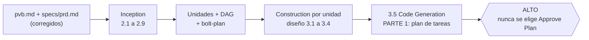

# Plan AI-DLC — de PVB/PRD a unidades y tareas

**Veridicus · Módulo 5 · AI-DLC de AWS v2.10.0 (perfil `classic`)**

Adaptación propia de la guía del curso
(`topicos-especiales/modulo5/proyecto-final-de-prd-a-unidades-y-tareas.md`). Mantiene sus
ideas centrales: el agente propone y yo apruebo, las preguntas van en archivos, hay una
compuerta por etapa y el trabajo **para justo antes de escribir código**. Usa la línea v2 de
AI-DLC con sus propios artefactos, en vez de la v1.0.1 de la guía.

> Se ejecuta **dentro del contenedor** `tai-aidlc` (`docker\aidlc.bat`), no en el host.

---

## 1. Meta y punto de parada



Texto alternativo: los insumos corregidos alimentan Inception, que produce unidades, su grafo
de dependencias y el plan de Bolts. Construction diseña cada unidad y genera su plan de tareas.
El flujo se detiene ahí, antes de la Parte 2, que escribe el código.

> **Ojo:** en AI-DLC v2 no hay una aprobación aparte para la Parte 2. La Parte 1 termina con la
> pregunta *Plan Approval* (`Approve Plan` / `Request Changes`), y elegir `Approve Plan` es lo que
> lanza la Parte 2. Por eso **nunca se elige `Approve Plan`**: el plan se revisa, se itera con
> `Request Changes` y la pregunta se deja sin responder.

**Terminado cuando:** todas las unidades tienen aprobado su diseño (3.1 a 3.4 que apliquen); la
primera unidad del `bolt-plan.md` tiene un `code-generation-plan.md` revisado por mí; las demás
tienen su plan de tareas (generado por AI-DLC si el motor lo permite, o derivado a mano con el
formato del Paso 5, ver §8); y ninguna unidad ha entrado a la Parte 2.

## 2. Qué cambia frente a la guía de clase

| Tema | Guía (v1.0.1) | Este plan (v2.10.0) |
|---|---|---|
| Instalación | Markdown copiado + overlay optimizado | Binario `aidlc` + `aidlc config --harness claude` (lo hace el contenedor) |
| Disparador | `Using AI-DLC, …` | `/aidlc …` |
| Artefactos | `aidlc-docs/…` | `aidlc/spaces/default/intents/<intent>/<fase>/<etapa>/` |
| Estado y bitácora | `aidlc-state.md`, `audit.md` | Igual de nombre, dentro del intent (auditoría en shards por clon) |
| Contexto del proyecto | 3 líneas en el despachador | `aidlc/spaces/default/memory/project.md` |
| Regla de autonomía | Extensión bloqueante en `.aidlc-rule-details/` | `memory/team.md` (desde `docs/limite-autonomia.md`) |
| Application Design | Una etapa | Se reparte en Domain Design (2.6) y Contract Design (2.8) |
| Plan de ejecución | Workflow Planning (podía omitir unidades) | Scope `classic`: Units Generation y Delivery Planning son **obligatorias** |
| Contexto saturado | Overlay de despacho por fase | Lo resuelve el motor (entrega reglas por etapa con hooks) |
| Revisión | Solo humana | Más revisores adversariales (asesores en `classic`) y sensores de trazabilidad |
| Proveedor | Ninguno | El de mi sesión de Claude (sin Bedrock) |

## 3. Insumos (fuente única, sin copias)

| Insumo | Ruta | Lo consume |
|---|---|---|
| PRD | `specs/prd.md` | Todas las etapas de Inception |
| PVB | `pvb.md` (idéntico a `docs/pvb.md`) | Requirements Analysis |
| Mercado, ICP, crítica | `docs/mercado.md`, `docs/icp.md`, `docs/critica.md` | Requirements, User Stories, Delivery Planning (riesgos) |
| Panorama del dominio | `docs/overview.md`, `docs/iteracion1.md` | Requirements Analysis, Domain Design |
| Límite de autonomía | `docs/limite-autonomia.md` | `memory/team.md` (Paso 0) |
| Fuentes | `research/` | Citas cuando un artefacto afirme algo del dominio |

**Regla:** no creo `entradas/`. Si una etapa revela un defecto del PRD o del PVB, la corrección
va al **original**, en un commit propio (`fix(prd): …`), y se le avisa al flujo que el insumo
cambió. Esto evita el problema de la v1, donde las copias divergían de los originales.

## 4. Mapa PRD → etapas (qué vigilar en cada compuerta)

| Etapa v2 | Segmentos del PRD | Antes de aprobar, verificar |
|---|---|---|
| 0.1–0.3 Initialization | — | Que detecte *greenfield* y registre mi petición literal |
| 2.1 Reverse Engineering | — | Debe omitirse (no hay código) |
| 2.2 Practices Discovery | 13 | Prácticas reales del curso: GitOps, PR con evidencia, K8s local, sin GPU |
| 2.3 Requirements Analysis | 1, 2, 4, 8, 10, 11 | Alcance = MoSCoW del PRD sin añadidos; los `[VERIFICAR]` siguen marcados; NFR enunciados |
| 2.4 User Stories | 3, 5, 7 | Criterios de aceptación verificables; están los *journeys* 3 (interrupción) y 4 (escala al humano) |
| 2.5 Refined Mockups | 5, 7 | Condicional; aceptable omitirla salvo para la vista del analista |
| 2.6 Domain Design | 9 | Frontera dentro/fuera del clúster en cada componente; persistencia decidida; ADR con alternativas descartadas |
| 2.7 Units Generation | 8, 9 | DAG **acíclico verificado con script**; ninguna historia huérfana; ≥2 unidades independientes; ninguna unidad es «el backend»; cada una se prueba sola |
| 2.8 Contract Design | 9 | Contratos entre unidades explícitos (API, esquema de alerta con CoT, paquete de traspaso) |
| 2.9 Delivery Planning | 12, 13 | Orden de Bolts acorde a los módulos 6–8; riesgos de `critica.md` reflejados |
| 3.1–3.4 Diseño por unidad | 6, 10, 11 | NFR del Principio 2 (CPU, sin GPU); AUTONOMIA-03/04/05 materializadas en el diseño |
| 3.5 Code Generation, **Parte 1** | — | Ver §7 |

## 5. Pasos

### Paso 0 — Preparación (una sesión, sin `/aidlc`)

1. `docker\aidlc.bat` → completar git (`freyes@javeriana.edu.co`), `gh auth login` y `/login`.
2. Aprobar los hooks de AI-DLC cuando Claude Code los pida (o con `/hooks`), **reiniciar Claude
   Code** y correr `/aidlc --doctor` hasta que salga limpio.
3. Commit de la configuración generada (`.claude/`, `aidlc/`, `.gitignore`):
   `chore: configurar AI-DLC 2.10.0 para Claude Code`.
4. Escribir la memoria del espacio:
   - `aidlc/spaces/default/memory/project.md`: contexto en 3 líneas (QUÉ / POR QUÉ / CÓMO),
     apuntando a `specs/prd.md`, sin copiarlo.
   - `aidlc/spaces/default/memory/team.md`: las reglas AUTONOMIA-01..05 de
     `docs/limite-autonomia.md`, más tres reglas de proceso: una aprobación humana por etapa,
     nunca autonomía en Construction y **no escribir código de aplicación en este trabajo**.
     Van **solo** bajo `## Mandated` y `## Forbidden`: Practices Discovery (2.2) reemplaza
     las secciones Way of Working, Walking Skeleton, Testing Posture, Deployment y Code Style,
     y lo que se escriba ahí se pierde.
5. Commit: `docs(aidlc): contexto del proyecto y límite de autonomía`.

### Paso 1 — Auditoría de coherencia de los insumos (antes de Inception)

Pedirle al Claude del contenedor, **sin `/aidlc`**, que cruce `pvb.md`, `specs/prd.md` y
`docs/*.md`, y que escriba `docs/coherencia-insumos.md` con:

- contradicciones entre documentos (cifras, alcance MoSCoW, actores, stack, métricas como MTTV);
- afirmaciones sin fuente o con `[VERIFICAR]` pendiente;
- huecos que una etapa de AI-DLC va a necesitar (por ejemplo, un umbral sin valor);
- por cada hallazgo, una pregunta de opción múltiple con `[Answer]:`.

Yo respondo en el archivo. El agente aplica las correcciones aprobadas a los originales y
hace un commit por documento. Sale de aquí un PRD que no se contradice.

### Paso 2 — Arranque del flujo

```text
/aidlc --scope classic --guard-policy strict Especifica Veridicus a partir de specs/prd.md y pvb.md (contexto: docs/mercado.md, docs/icp.md, docs/critica.md, docs/overview.md; fuentes en research/). Respeta aidlc/spaces/default/memory/team.md. No escribas código: este trabajo se detiene en la Parte 1 (plan de tareas) de Code Generation de cada unidad.
```

`strict` hace que un insumo modificado después de aprobado obligue a reaprobar, en lugar de
solo anunciarse. Encaja con la regla de aprobación por etapa. Además mantiene activa la compuerta
de Plan Approval de Code Generation: con `relaxed` (el valor por defecto de `classic`) esa
compuerta puede ceder en trabajo no dirigido, y es justo la que detiene el flujo antes del código.
`--guard-policy strict` solo se puede pasar al crear el intent; no lo omitas.

### Paso 3 — Inception, una etapa por sesión

- Responder las preguntas **en los archivos** `*-questions.md`, nunca en el chat.
- «Depende» o «una mezcla de A y B» no son respuestas válidas: obligan a repreguntar.
- **Request Changes** es la opción normal. Leo el artefacto antes de aprobar.
- Si una etapa revela un defecto del PRD: lo corrijo en el original (§3) y sigo.
- Al cerrar cada etapa: commit + push (`aidlc(<etapa>): …`) y `/clear` o una sesión nueva.
- Tras Units Generation, verificar el DAG con un script (ciclos e historias huérfanas), no a ojo.

### Paso 4 — Construction hasta el plan de tareas

- Al llegar a Construction, AI-DLC ofrece **una sola vez** continuar en modo autónomo.
  Respuesta: **«Review each checkpoint»** (compuerta en cada etapa). Si se elige «Continue
  automatically», salta compuertas y escribe código.
- Orden de iteración: pedir **stage-major** (`aidlc engine state set-construction-iteration
  stage-major`, con mi confirmación explícita), para que todas las unidades pasen por el diseño
  3.1 a 3.4 antes de que alguna llegue a 3.5. Con unit-major, la primera unidad llegaría a Code
  Generation y bloquearía el diseño de las demás. *(Ya registrado en Delivery Planning, P8.)*
- **Nota (Delivery Planning, 2026-10-02):** el `bolt-plan.md` quedó con **un Bolt por unidad**
  (un commit por Bolt, según `org.md`). La primera unidad del plan es **contratos (U1)**, no el
  flujo de texto: B1 contratos → B2 acceso (U3) → B3 flujo de texto (U4). Por tanto, el primer
  `code-generation-plan.md` de 3.5 es el de U1.
- Se aprueban las etapas de diseño 3.1 a 3.4 que apliquen, para todas las unidades. Luego 3.5
  produce el `code-generation-plan.md` de la primera unidad del `bolt-plan.md`.
- Recordatorio en cada unidad: «Detente al terminar la Parte 1 de Code Generation. No ejecutes
  la Parte 2. No escribas código de aplicación.»
- Revisar el plan (§7) e iterar con **Request Changes**. **Nunca elegir `Approve Plan`**: esa
  respuesta es la que lanza la Parte 2 (ver §1). Cuando el plan esté bien, dejar la pregunta sin
  responder, hacer commit + push y cerrar la sesión.
- Siguientes unidades: el flujo principal queda detenido en la Plan Approval de la primera.
  Probar `/aidlc --stage code-generation --single` para generar el plan de otra unidad sin mover
  el flujo principal (aplica la misma regla: nunca `Approve Plan`). Si el motor no deja elegir
  la unidad, derivar los planes restantes a mano (§8).

### Paso 5 — Consolidación

`unidades-y-tareas.md` en la raíz, una sección por unidad con la responsabilidad (qué hace y
qué no), las dependencias, las historias que implementa, la condición de terminado y una tabla
`| # | Tarea | Criterio (comando) | Historia |`. Es la entrada del loop
orquestador-codificador-revisor de los módulos 6 y 7.

## 6. Higiene de contexto y de cuota

La statusline del contenedor muestra la etapa de AI-DLC, el % de contexto y las cuotas de 5 h
y 7 d (son de la cuenta, compartidas con todas mis sesiones de Claude):

| Señal | Acción |
|---|---|
| Contexto ≥ 60 % | Cerrar la etapa en curso y abrir una sesión nueva (`/aidlc` retoma desde el estado) |
| 5 h ≥ 80 % | No arrancar una etapa nueva; pausar las otras instancias |
| 7 d ≥ 70 % antes de mitad de semana | Bajar `aidlc config models` a `balanced` para los agentes de apoyo |
| El agente se salta una compuerta | «Detente, no apruebes nada, vuelve a la etapa anterior» y `/aidlc --status` |

## 7. Lista de verificación del plan de tareas (por unidad)

- [ ] Tareas numeradas con casilla.
- [ ] Cada tarea traza a una historia del `unit-of-work-story-map.md`.
- [ ] Cada tarea tiene un criterio de aceptación **ejecutable** (AUTONOMIA-02).
- [ ] Ninguna tarea aplica cambios a infraestructura sin aprobación humana previa (AUTONOMIA-01).
- [ ] Existen las pruebas exigidas por AUTONOMIA-03, 04 y 05 donde aplican.
- [ ] Están los pasos de prueba de cada capa.
- [ ] Las rutas de código apuntan a la raíz del proyecto, nunca a `aidlc/`.

## 8. Ruta corta (cuota agotada o unidades sin plan generado)

Detenerse al aprobar 2.9 Delivery Planning, o en la Plan Approval de la primera unidad, y derivar
las tareas a mano desde `unit-of-work.md`, `unit-of-work-story-map.md`, `bolt-plan.md` y los
diseños 3.1 a 3.4 de cada unidad, con el formato del Paso 5. El `code-generation-plan.md` de la
primera unidad sirve de modelo.
